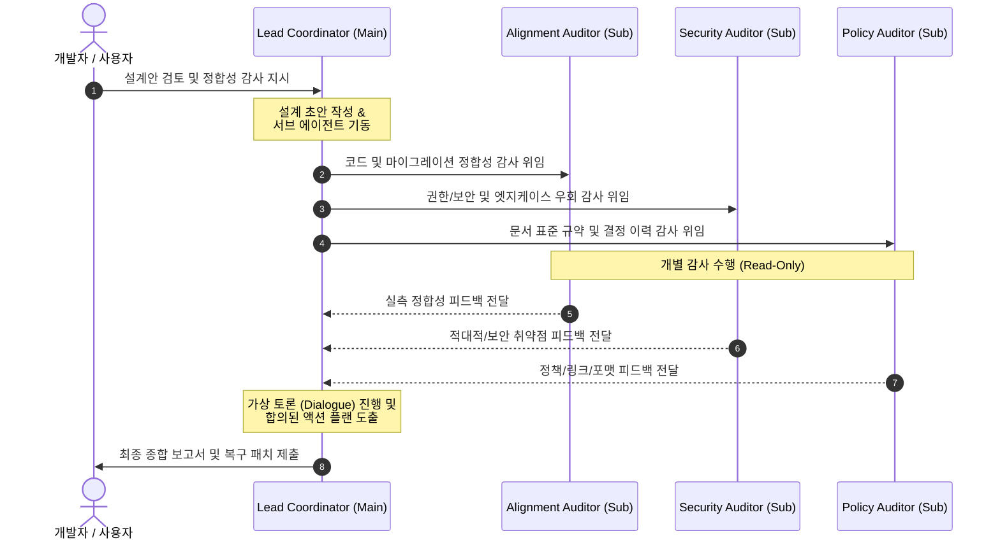

# 멀티 에이전트 설계 및 문서 정합성 검토 지침 (Multi-Agent Design Reviewer Skill)

이 스킬은 프로젝트에 신규 기능을 도입하거나 기존 설계를 개정할 때, 다수의 전문화된 서브 에이전트(Auditor)들이 변경 로그, 로드맵, 그리고 실제 코드베이스를 다각도로 감사하고 토론하여 **초기 설계 결함 및 문서 정합성 드리프트(Drift)를 사전에 걸러내는 협업 검토 지침**입니다.

---

## 1. 에이전트 역할군 정의 (Review Team Roles)

스킬이 실행되면 메인 에이전트는 역할을 분배하여 다음과 같은 다중 에이전트 검토 체계를 구성해야 합니다.

1.  **Lead Coordinator (주 설계자 / 메인 에이전트)**:
    *   **역할**: 요구사항 분석 및 초기 설계 초안(`draft_architecture.md` 등) 작성을 주도하고, 서브 에이전트 팀을 기동 및 조율합니다. 검토 완료 후 최종 토론 요약본([`agent_discussion_report.md`](file:///Users/yarang/.gemini/antigravity-cli/brain/f5da3816-dd83-4ad0-8b67-a72156404885/agent_discussion_report.md))과 변경사항을 통합 인제스트합니다.
2.  **Codebase Alignment Auditor (실측 검토 전문가 - Subagent)**:
    *   **역할**: 제안된 설계(데이터 모델, 스키마, 호출 명세)가 실제 Rust 소스 코드(`crates/`), SQL 마이그레이션 파일, 그리고 호스트 설정 파일과 정확히 일치하는지 Fact-Checking을 수행합니다.
    *   **검토 기준**: 실제 함수 시그니처 정합성, DB Foreign Key 전방 참조 오류 감지, 미구현 코드의 인플레이스 플레이스홀더 차단.
3.  **Security & Edge-Case Auditor (적대적 검토 전문가 - Subagent)**:
    *   **역할**: 설계의 허점, 권한 우회 경로(Security Bypasses), 경쟁 상태(Race Conditions), 예외 처리(Error Path) 누락, 그리고 리소스 병목을 적대적으로 감사(Adversarial Audit)합니다.
    *   **검토 기준**: RBAC 권한 게이트 충돌(예: Operator가 Admin 없이 에이전트를 자동 생성할 수 있는 우회로 탐지), 동적 프로세스 생존 주기 오류(tmux pane_dead 감지 실패 등), 타임아웃 정체 감지.
4.  **Log & Policy Auditor (규약 검토 전문가 - Subagent)**:
    *   **역할**: 신규 설계가 기존 아키텍처 결정 기록(Decision Logs)과 충돌하는지 감시하고, 문서화 지침([`documentation-policy.md`](file:///Users/yarang/working/tools/grok-fleet-orchestrator/docs/engineering-patterns/documentation-policy.md)) 준수 여부를 검사합니다.
    *   **검토 기준**: 정본-사본 지위 선언 준수 여부, YAML 프론트매터 누락, ASCII-art 다이어그램 규약 위반, 고아/미임베딩 이미지, 깨진 상대 경로 링크 및 구세대 파일 표기 잔재.

---

## 2. 4단계 검토 및 조율 프로토콜 (Execution Protocol)

사용자가 신규 기능에 대한 설계를 검토하거나 정합성 점검을 지시하면, 주 에이전트는 다음 4단계 프로세스를 무조건 이행하여 품질 게이트를 가동합니다.



### 📍 1단계: 설계 초안 준비 및 컨텍스트 확보
*   최종 설계 목표를 바탕으로 `draft_architecture.md` 또는 관련 설계 패키지를 로컬 스크래치패드에 구성합니다.
*   최신 개발 로드맵([`roadmap.md`](file:///Users/yarang/working/tools/grok-fleet-orchestrator/docs/roadmap/roadmap.md))과 변경 로그([`log.md`](file:///Users/yarang/working/tools/grok-fleet-orchestrator/docs/log.md))를 탐색하여 변경 맥락을 수집합니다.

### 📍 2단계: 서브 에이전트 소환 및 병렬 감사 (Parallel Auditing)
*   `define_subagent` 및 `invoke_subagent` 도구를 사용해 `roadmap_analyzer`, `log_analyzer`, `doc_inspector` 형태의 전담 Auditor 군을 기동합니다.
*   각 에이전트는 독립된 컨텍스트에서 전담 파일들을 정독(Read-Only)하고 구체적인 지표 기반 피드백 보고서를 작성한 뒤, 주 에이전트에게 메일을 보냅니다.

### 📍 3단계: 가상 토론 및 합의안 도출 (Simulated Dialogue & Consensus)
*   주 에이전트는 수집된 서브 에이전트들의 발견 사항을 대조하여 상충 관계(Trade-off)나 복합 취약점(예: RBAC 권한과 자동 프로비저닝의 복합 우회로)을 분석합니다.
*   역할에 기반한 **가상 토론(Simulated Dialogue)**을 시뮬레이션하여 논리적 격차를 완전히 해소하고, 우선순위가 정의된 **통합 조치 계획(Action Items)**을 최종 확정합니다.

### 📍 4단계: 최종 반영 및 부기 동기화 (Ingest & Bookkeeping)
*   도출된 조치 사항을 실제 코드/문서에 패치합니다.
*   패치 완료 후 **지속 가능성 워크플로우 모델**에 의거하여:
    1.  생성/수정된 모든 canonical 문서 최상단에 **YAML 프론트매터** 백필.
    2.  중앙 카탈로그([`docs/index.md`](file:///Users/yarang/working/tools/grok-fleet-orchestrator/docs/index.md))에 최종 개정일 및 상태(🟢/🔵) 반영.
    3.  변경 로그([`docs/log.md`](file:///Users/yarang/working/tools/grok-fleet-orchestrator/docs/log.md)) 맨 아래에 append-only 이력 누적 기록.

---

## 3. 부록: 검토 보고서 아티팩트 표준 작성 형식

스킬 수행 결과로 사용자에게 제공되는 검토 보고서([`agent_discussion_report.md`](file:///Users/yarang/.gemini/antigravity-cli/brain/f5da3816-dd83-4ad0-8b67-a72156404885/agent_discussion_report.md))는 항상 다음 형식을 충족해야 합니다.

1.  **YAML 헤더**:
    ```yaml
    ---
    type: wiki
    status: canonical
    source: "brain/<conversation-id>/agent_discussion_report.md"
    last_verified: "YYYY-MM-DD"
    ---
    ```
2.  **분석 요약 테이블**: 각 에이전트가 찾아낸 핵심 팩트와 경고 수준 요약.
3.  **가상 토론 스크립트**: 에이전트간 반박 및 대안 제시 과정이 드러나는 회의록 스타일의 대화록.
4.  **최종 액션 플랜 테이블**: 우선순위(P0~P2), 조치 내용, 상태(대기/완료)가 정리된 표.
5.  **다이어그램**: Mermaid 기반의 검토 및 동기화 흐름 비주얼화.
