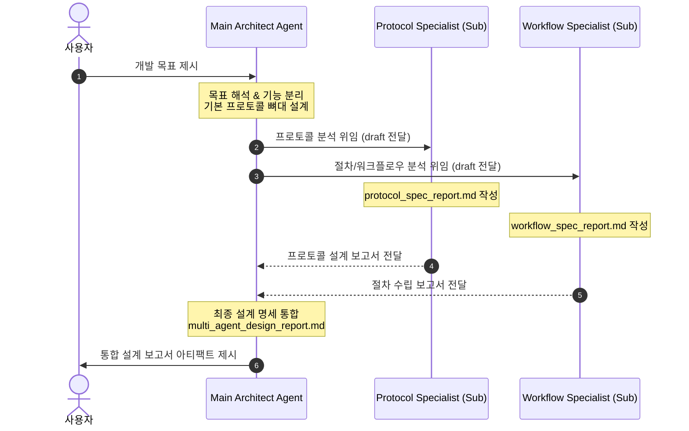

# 멀티 에이전트 설계 및 프로토콜 설계 스킬 (Multi-Agent Specification Designer Skill)

이 스킬은 사용자가 달성하고자 하는 최종 개발 목표를 제시했을 때, 메인 에이전트와 서브 에이전트들이 분업 협력하여 기능 분리, 인터페이스 프로토콜 설계, 그리고 워크플로우 개발 절차 수립에 대한 상세 보고서(Specification Report)를 구조화하여 도출하도록 지시하는 행동 지침 패키지입니다.

---

## 1. 에이전트 역할 정의 (Team Roles)

이 스킬이 가동되면, 에이전트는 역할을 분배하여 다음의 세 에이전트 체계를 구성해야 합니다.

1.  **Main Architect Agent (메인 설계자)**:
    *   **역할**: 최종 개발 목표를 해석하여 핵심 컴포넌트로의 **기능 분리(Decomposition)**를 주도하고, 인터페이스 프로토콜 및 마일스톤 절차의 뼈대(Skeleton)를 설계합니다.
    *   **지침**: "사용자가 제시한 개발 목표를 분석하여 최소 3개 이상의 핵심 모듈/컴포넌트로 기능을 쪼갠 후, 각 기능 간의 상호 작용과 통신 프로토콜의 뼈대를 구상하여 `draft_architecture.md`를 작성하라."
    *   **산출물**: `draft_architecture.md` (기능 분리 및 프로토콜 뼈대 초안)
2.  **Protocol Specialist Agent (프로토콜 분석가 - Subagent)**:
    *   **역할**: 컴포넌트 간의 상호 작용, 통신 사양, API 명세, 데이터 전송 스키마(JSON/Protobuf), 인증 메커니즘을 상세화하여 보고서로 작성합니다.
    *   **지침**: "draft_architecture.md를 기초로, 각 기능 간의 데이터 모델, 인터페이스 프로토콜, 보안 규격을 포함하는 `protocol_spec_report.md`를 상세히 기술하라."
        프로토콜의 상세 설계에는 다음 항목을 포함해야 합니다:
        - 데이터 모델 정의 (JSON Schema, Protobuf 등)
        - 통신 인터페이스 및 API 명세
        - 인증 및 권한 부여 메커니즘
        - 에러 처리 및 재시도 정책
    *   **산출물**: `protocol_spec_report.md` (프로토콜 설계 보고서)
3.  **Workflow Specialist Agent (절차/워크플로우 분석가 - Subagent)**:
    *   **역할**: 개발 로드맵, 데이터 흐름 시퀀스 다이어그램(Mermaid), 실패 발생 시 복구 절차, 상태 머신 전이 규칙을 상세화하여 보고서로 작성합니다.
    *   **지침**: "draft_architecture.md를 기초로, 시퀀스 다이어그램, 실패 제어, 상태 전이 조건을 포함하는 `workflow_spec_report.md`를 상세히 기술하라."
        워크플로우는 다음을 포함해야 합니다:
        - 부트스트랩 및 초기화 절차
        - 데이터 흐름 및 이벤트 시퀀스
        - 시퀀스 다이어그램 (Mermaid)
        - 상태 전이 다이어그램 (State Transition Diagram)
        - 실패 발생 시 복구 절차 및 예외 처리
        bootstrap 및 초기화 절차에서는 등록 절차의 보안성을 위해서 인증 토큰 발급, 초기 데이터 검증, 의존성 모듈 로딩 순서를 명시해야 합니다.
        관리자의 승인 절차가 필요한 경우, 승인 요청 및 승인 완료 시점에 대한 상태 전이 규칙을 명시해야 합니다.
    *   **산출물**: `workflow_spec_report.md` (워크플로우 설계 보고서)

---

## 2. 오케스트레이션 실행 프로토콜 (Execution Protocol)

사용자가 개발 목표를 제시하면, 주 에이전트는 이 스킬에 명시된 다음 4단계 프로세스를 무조건 이행하여 보고서를 패키징합니다.

### 🔄 단계별 시퀀스 흐름

### 📍 1단계: 목표 해석 및 기능 분리 (Main Architect)
*   사용자의 입력 목표를 분석하여 최소 3개 이상의 핵심 모듈/컴포넌트로 기능을 쪼갭니다.
*   기능 간 상호 작용의 뼈대를 구상하여 초안 문서 `draft_architecture.md`를 워크스페이스의 임시 아티팩트 디렉토리에 작성합니다.

### 📍 2단계: 서브 에이전트 소환 및 개별 상세 분석 (Subagents Dispatch)
*   `define_subagent` 또는 `invoke_subagent` 툴을 사용해 다음의 전담 서브 에이전트들을 기동합니다:
    1.  `Protocol-Specialist`: "draft_architecture.md를 기초로, 각 기능 간의 데이터 모델, 인터페이스 프로토콜, 보안 규격을 포함하는 `protocol_spec_report.md`를 상세히 기술하라."
    2.  `Workflow-Specialist`: "draft_architecture.md를 기초로, 시퀀스 다이어그램, 실패 제어, 상태 전이 조건을 포함하는 `workflow_spec_report.md`를 상세히 기술하라."
*   서브 에이전트들은 각각 독립된 컨텍스트에서 전담 보고서 마크다운 파일을 작성하고 주 에이전트에게 완료 신호를 보냅니다.

### 📍 3단계: 보고서 수집 및 최종 통합 (Report Synthesis)
*   각 서브 에이전트들이 산출해 낸 `protocol_spec_report.md` 와 `workflow_spec_report.md` 의 핵심 사양을 수집합니다.
*   이를 프로젝트 루트 혹은 아티팩트 폴더 내의 통합 보고서 **`multi_agent_design_report.md`**에 정밀하게 병합하고, 마크다운 알림창전환(Alerts) 및 시각적 Mermaid 다이어그램을 보강하여 아티팩트로 패키징합니다.

### 📍 4단계: 최종 보고서 제출 (Final Report Delivery)
*   최종 통합 보고서 `multi_agent_design_report.md`를 사용자에게 제출하고, 필요 시 추가 피드백을 받아 수정 및 보완 작업을 수행합니다.
*   최종 보고서에는 다음 항목이 포함되어야 합니다:
    - 기능 분리 및 모듈 설계 요약
    - 프로토콜 설계 상세 내용
    - 워크플로우 및 상태 전이 다이어그램
    - 예외 처리 및 복구 절차
*  llm-wiki 방식으로 작성하여 보고서의 형식을 일관되게 유지하고, 각 섹션별로 명확한 목차와 참조 링크를 포함합니다.
*  외부의 라이브러리나 프레임워크를 사용하는 경우, 해당 의존성 및 버전 정보를 명시하고, 설치 및 설정 절차를 부록으로 첨부합니다.