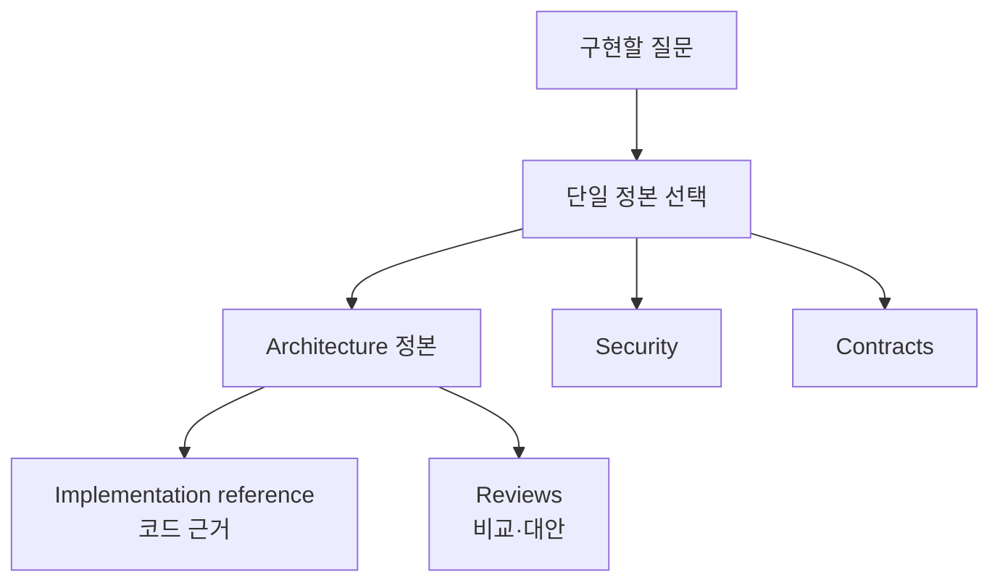

# Architecture

시스템 내부 설계 결정과 구현 참조의 진입점이다. 외부 호출 표면은
[Contracts](../contracts/README.md), 운영 절차는 [Deployment](../deployment/README.md), 보안 정책은
[Security model](../security/control-plane-security-model.md)이 각각 소유한다.

## 읽기 순서

| 순서 | 문서 | 책임 |
|---:|---|---|
| 1 | 이 문서의 정본 선택표 | 질문별 단일 정본 선택 |
| 2 | [시스템 개요](overview.md) | 시스템 경계와 현재 구현의 빠른 탐색 |
| 3 | [구현 참조](implementation-reference.md) | Rust 구성요소와 현재 제약 |
| 4 | 해당 정본 | control plane, Task, Project, lifecycle, routing, Agent 플랫폼의 결정 |

## 정본 선택

설계 결정을 바꾸거나 구현하기 전 이 표에서 하나의 정본을 선택한다. 정본은 현재 결정과
완료 조건만 담고, 코드 근거는 Derived, 비교·논의는 Reviews에 둔다.

| 주제 | 단일 정본 | 답하는 질문 |
|---|---|---|
| 운영 기관 | [Control Plane 권한과 장애 전환](control-plane-authority-and-failover.md) | dispatch 권한과 Cold Standby 승격은 어떻게 제한하는가? |
| 신원·권한·시크릿 | [Security model](../security/control-plane-security-model.md) | principal, capability, Worker identity, secret 경계는 무엇인가? |
| 외부 계약 | [Contracts](../contracts/README.md) | HTTP, MCP, Dashboard, Worker enrollment의 호출 표면은 무엇인가? |
| 실행 의미론 | [Task 실행 정본](tasks/README.md) | Task 실행, cancel, idempotency, side effect의 규칙은 무엇인가? |
| Worker liveness | [Worker liveness policy](worker-liveness-policy.md) | heartbeat와 on-demand probe를 언제 쓰는가? |
| 관측·장애 복구 | [관측성·재조정·장애 복구](observability-and-reconciliation.md) | desired/observed 차이와 자동·수동 복구 경계는 무엇인가? |
| Project 관리 | [Project model](project-feature-design.md) | Project 정책·권한·host/Worker 배정 제약은 무엇인가? |
| 배치·맥락 보존 | [Entity placement & context](entity-placement-and-context.md) | Host·Worker·Agent process·Task의 배치와 WarmIdle/Hibernated는 어떻게 구분하는가? |
| Task 관리 | [Task 정본](tasks/README.md) | Task 제출·의존성·취소·결과·감사는 어떻게 관리하는가? |
| 교차 lifecycle | [Project · Task · Agent lifecycle](project-task-agent-lifecycle.md) | Project·Task·Agent 전이는 어떻게 맞물리는가? |
| Agent 실행 | [Agent domain](agents/README.md) | 격리, provisioning, runtime, harness, tool, memory, terminal은 어떻게 분리되는가? |
| LLM gateway | [LLM Gateway 아키텍처](llm-gateway.md) | Worker의 LLM 설정을 gateway 경유(경로 A)와 per-model credential(경로 B) 중 무엇으로 둘 것이며, 경로 A의 gateway는 어떤 dialect 계약을 만족해야 하는가? |
| Task routing | [Task 정본](tasks/README.md) | 논리 profile과 Worker 선택 정책은 무엇인가? |
| Task 예산 | [Task 정본](tasks/README.md) | usage budget과 telemetry 제한은 어떻게 적용하는가? |

## Derived와 기록

[system-entities-mapping.md](system-entities-mapping.md)는 엔티티 관계를 빠르게 보는 Derived
지도다. 비교·대안·feasibility 검토는 [Reviews](../reviews/README.md)에, 의미 있는 문서 변경은
[Docs log](../log.md)에 둔다. 세부 변경 이력은 Git을 따른다. 이 문서들은 정본을 바꾸지 않는다.

정본과 코드가 다르면 정본의 `implementation`과 `verification`을 낮추고 현재 차이를 명시한다.
Derived와 review는 정본을 재정의하지 않는다.
