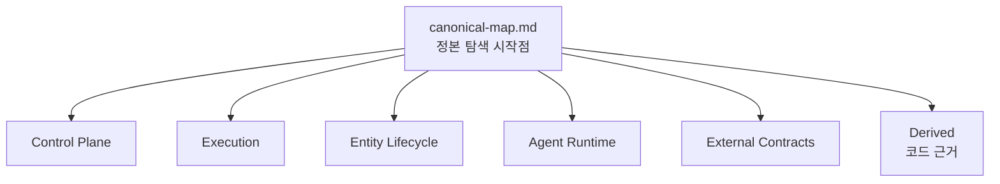
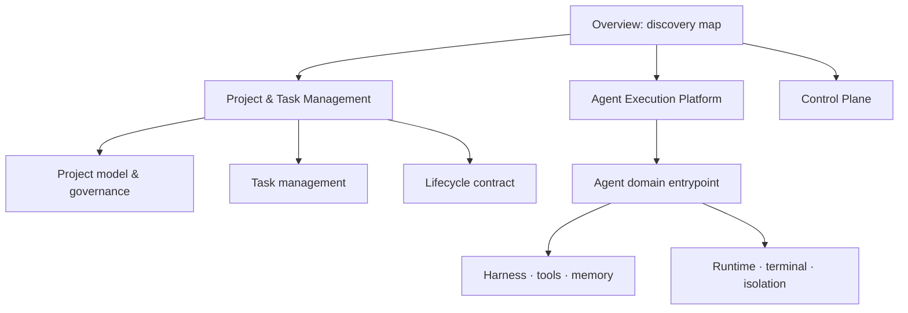

# 아키텍처 정본 지도

## 목적

이 문서는 설계의 진실 원천을 찾는 첫 진입점이다. 정본은 **현재 결정, 불변식,
상태 전이, 구현 완료 기준**만 담는다. 코드 구조와 검증 근거는 Derived에 두고,
조사 과정·대안 비교·회의 기록은 `docs/reviews/`에 부기한다. 폐기 문서는 삭제한다.

## 정본

### 계층과 의존 방향

Lifecycle은 상위 구현 계층이 아니라 Project/Task/Attempt/Agent를 가로지르는 계약이다.
Provisioning은 Harness·Runtime·Terminal·Isolation을 조합하지만 각각의 내부 규칙을
소유하지 않는다.

| 주제 | 단일 정본 | 정본이 답하는 질문 |
|---|---|---|
| 운영 기관 | [Control-plane availability](control-plane-availability.md) | 누가 dispatch 권한을 갖고, Cold Standby는 어떻게 승격하는가? |
| 신원·권한·시크릿 | [Control-plane security model](../security/control-plane-security-model.md) | principal, capability, worker identity, secret 경계는 무엇인가? |
| 실행 의미론 | [Task execution consistency](task-execution-consistency.md) | TaskAttempt, retry, cancel, idempotency, side effect는 어떻게 일관성을 지키는가? |
| Worker liveness | [Worker liveness policy](worker-liveness-policy.md) | periodic heartbeat와 on-demand probe는 언제 쓰는가? |
| 개발 lifecycle | [Project · Agent · Task lifecycle](project-task-agent-lifecycle.md) | 장기 개발과 terminal Task/Attempt는 어떻게 분리되는가? |
| Project 관리 | [Project model & governance](project-feature-design.md) | Project 정책·권한·격리와 host/worker 배정 제약은 무엇인가? |
| Task 관리 | [Task management](task-management-design.md) | Task 제출·Project 귀속·의존성·취소·결과·감사는 어떻게 관리하는가? |
| Agent 실행 플랫폼 | [Agent domain entrypoint](agents/README.md) | 격리, 생성·회수, runtime, harness, tool, memory, terminal 접근은 어떻게 분리되는가? |
| 모델 라우팅 | [Intelligent task routing](intelligent-task-routing-and-budget-control-design.md) | 현재 구현 범위와 향후 routing/budget 정책은 무엇인가? |
| 외부 계약 | [Contracts README](../contracts/README.md) | HTTP, MCP, Dashboard, Worker enrollment의 현재 계약은 무엇인가? |

## 정본이 아닌 보존 문서

| 문서 | 지위 | 보존 이유 |
|---|---|---|
| `overview.md` | Derived discovery map | 시스템 경계·현재 구현 요약·정본 탐색의 안정 진입점 |
| `implementation-reference.md` | Derived implementation reference | 코드 구조·구현 단계·과거 제약의 상세 근거 |
| `system-entities-mapping.md` | Derived relationship reference | 엔티티 관계를 빠르게 조망하는 지도 |
| `system-entities-critique.md` | Derived review | 위험·대안·검토 근거 |
| `entity-lifecycle-consistency-review.md` | Review migration candidate | lifecycle 정본을 만들기 전 발견 사항과 판단 근거 |
| `feature-feasibility-testing.md` | Derived verification plan | 구현 전 feasibility와 시험 시나리오 |
| `host-integrity-and-security-monitoring-design.md` | Derived proposal | 미구현 모니터링 제안과 위험 분석 |
| `log.md` | Historical append-only log | 결정의 시간순 변경 이력 |

## 작성 규칙

1. 새로운 설계 규칙은 먼저 위 표의 기존 정본에 넣는다. 새 정본은 기존 주제가
   감당할 수 없을 때만 만든다.
2. 구현 근거와 긴 코드 인용은 Derived에 둔다. 대안 비교와 검토 대화는 `docs/reviews/`에 둔다.
3. 정본과 코드가 다르면 정본의 `implementation`·`verification`을 낮추고, 차이를
   명시한다. 구현되지 않은 바람을 현재 동작처럼 쓰지 않는다.
4. Derived와 review는 정본을 바꾸지 않는다. 충돌하면 이 문서의 표에 있는 정본이 우선한다.
