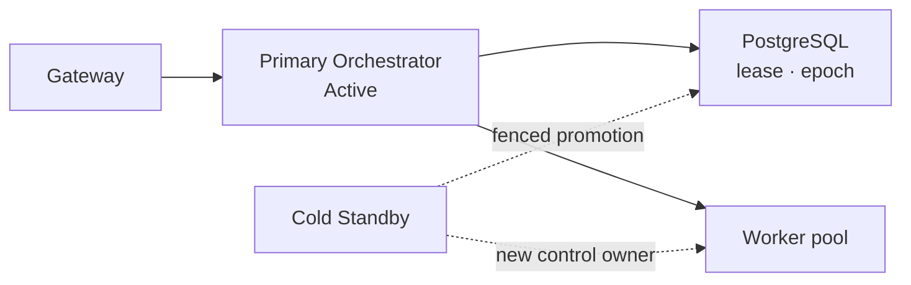
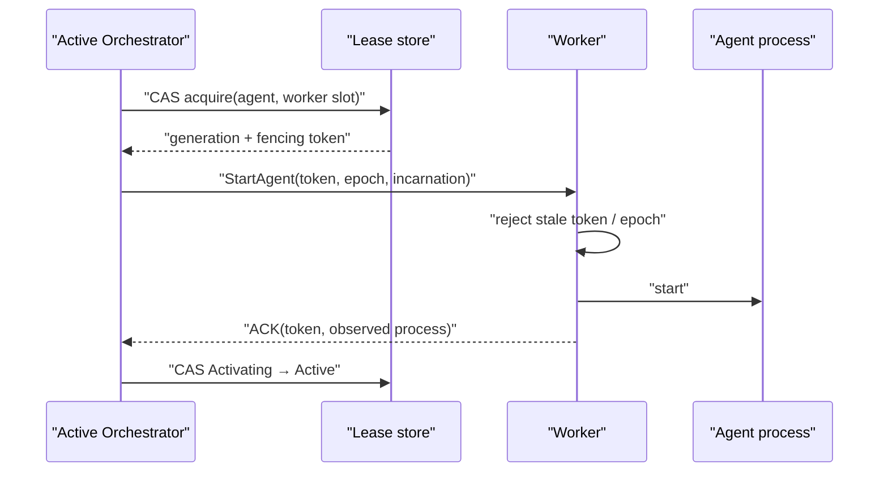
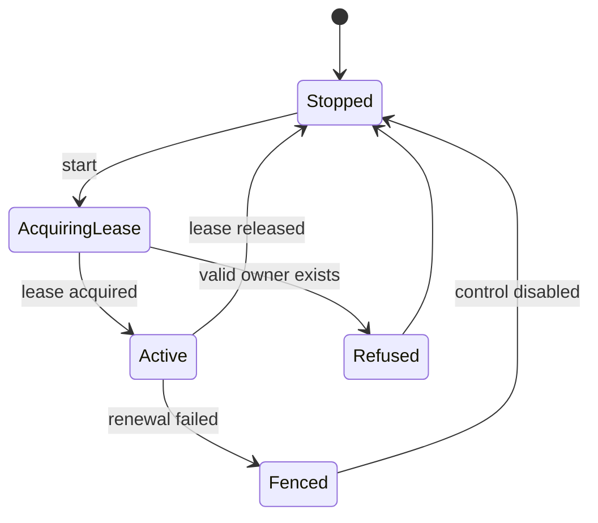

# Control Plane 권한과 장애 전환 계약

## 범위

이 문서는 dispatch와 Agent 제어 권한의 단일 소유, lease·epoch·fencing 계약을 정의한다.
운영자의 수동 승격·복구·설정 동기화 절차는 [일상 운영 Runbook](../deployment/operations.md)이
소유한다.

## 결정

Fleet는 하나의 논리적 제어 기관만 허용한다. 운영 중 하나의 Primary Orchestrator만 Active이고,
두 번째 인스턴스는 Cold Standby다. 여러 Worker가 동시에 Task를 처리하는 것은 Worker pool
concurrency이며 Active-Active Orchestrator가 아니다.



## 불변식

1. 유효한 dispatch lease를 가진 Orchestrator는 최대 하나다.
2. lease가 없는 인스턴스는 조회를 제공할 수 있어도 dispatch, cancel, Agent command, breaker 변경을 수행하지 않는다.
3. Standby는 기존 Primary의 종료 또는 네트워크 fencing을 확인하기 전 제어 권한을 얻지 않는다.
4. 모든 dispatch 시도와 control command에는 승격마다 증가하는 epoch를 남긴다.
5. 이전 epoch의 늦은 이벤트는 상태를 변경하지 못한다.

## Agent execution lease와 fencing

Orchestrator lease만으로는 Worker 안의 이전 Agent process를 막지 못한다. 따라서 Agent activation은
별도의 `worker_execution_lease`를 획득한 뒤에만 가능하다. 이 레코드는 `agent_id`, `worker_id`,
`task_id`, `worker_incarnation`, `lease_generation`, 단조 증가 `fencing_token`, `control_epoch`,
`state`, `acquired_at`, `renewed_at`, `expires_at`를 가진다. `task_id`는 WarmIdle process가 아직
Task를 들고 있지 않은 동안 NULL이다.



- Agent당 `Activating|Active|Releasing` lease는 하나뿐이고, Worker slot도 하나의 활성 lease만 가진다.
- lease 획득·갱신·release는 DB 시간 기준 조건부 갱신이다. slot 수는 Worker의 보고값이 아니라
  lease row를 기준으로 산정한다.
- Worker는 마지막으로 수락한 `fencing_token`보다 작은 start/stop/renew, 다른
  `worker_incarnation`, 더 오래된 control epoch를 거절한다.
- Worker는 control plane 연결 또는 lease 갱신을 잃으면 새 Task를 시작하지 않고 grace 뒤 해당
  process를 self-fence/drain한다. 이 동작은 heartbeat 옵션과 독립인 control channel lease다.
- Start/stop ACK가 유실되면 `OutcomeUnknown`으로 남겨 Worker의 process inventory와 token을
  관측할 때까지 새 lease·중복 start를 금지한다.
- Worker 재기동은 새 incarnation을 발급한다. 재기동 뒤 남은 process는 최신 token lease와 일치하지
  않으면 cleanup하며, 이전 incarnation의 늦은 ACK는 감사만 남기고 상태를 바꾸지 않는다.

### 2026-09-01 범위 정정 — `worker_execution_lease` 테이블을 만들지 않는다

위 절이 그린 11필드 레코드는 **구현하지 않는다**. 구현 게이트 ①-B는 그 자리에
`agents` 컬럼 하나(`command_control_epoch`)와 명령 발행 쓰기의 epoch 술어로
대신한다. 이 절의 나머지 규칙(Worker의 stale 거절, self-fence/drain,
`OutcomeUnknown`, 재기동 incarnation)은 그대로 유효하다.

근거는 이 문서가 그린 필드 대부분이 **오늘 채울 주체가 없다**는 것이다. 같은
판단을 마이그레이션 028이 이미 이 절에 대해 한 번 내렸다 — 이 절의
`worker_incarnation`은 heartbeat가 실어 오는 카운터로 그려져 있지만, 028은
"판정의 입력이 다시 피통제자의 자기 신고가 된다"는 이유로 그것을 거절하고
관측에서 유도되는 `workers.incarnation_started_at TIMESTAMPTZ`로 만들었다.

| 이 문서의 필드 | 처분 | 이유 |
| --- | --- | --- |
| `agent_id`, `worker_id` | 만들지 않음 | `agents` 행이 이미 그 진실이다. 레코드로 복제하면 둘이 갈릴 때 어느 쪽이 정본인지 정해지지 않는다. |
| `task_id` | 만들지 않음 | `tasks.agent_id`(034)로 역질의된다. |
| `lease_generation`, `fencing_token` | `agents.command_generation`으로 충족 | 031이 이미 DB가 발행하는 Agent별 단조 증가 값을 만들었다. 이름만 다르고 역할이 같다. |
| `control_epoch` | **새로 만든다** (`agents.command_control_epoch`) | 유일하게 오늘 채울 주체가 있고, 사후 복원이 불가능하다. 026이 `tasks`에 대해 내린 판단과 같다. |
| `worker_incarnation` | 이미 있음 (`workers.incarnation_started_at`, 028) | 형태가 이 문서와 다르다. 위 문단 참조. |
| `state`(`Activating|Active|Releasing`) | 만들지 않음 | `Releasing`을 쓸 주체가 없다. 배정 회수 경로를 의도적으로 만들지 않았고(원장이 `status <> 'stopped'`로 걸러 슬롯이 스스로 풀린다), 나머지 둘은 `(status, desired_status)`의 파생이다. |
| `acquired_at`, `renewed_at`, `expires_at` | 만들지 않음 | 갱신 주체가 없다. 031이 적었듯 heartbeat 응답이 **매번 명령 전부를 다시 싣기** 때문에 만료라는 개념이 필요한 창이 열리지 않는다. (**2026-09-01 범위 한정**: 이 근거는 **beat가 도착하는 동안에만** 성립한다. beat가 끊긴 구간에서는 "매번 다시 싣는다"가 아무것도 말하지 않으며, 그 구간이 정확히 게이트 6/②가 다루는 창이다. 그렇더라도 **이 칸의 처분은 바뀌지 않는다** — 그 창을 만료 필드가 닫지 못하는 것은 여전하고(갱신 주체가 없다는 사실은 beat와 무관하다), 무엇이 닫는지는 아직 정해지지 않았다. 조사 경과는 아래 유예 표의 `Agent self-fencing` 칸에 있다.) |

**031의 유예 문구는 이 정정이 대체한다.** `031_agent_desired_state.sql`은
`fencing_token`을 미룬 이유로 "`worker_execution_lease` 테이블 자체가 없다 —
구현 게이트 ①"이라고 적었는데, 그것은 게이트 ①이 그 테이블을 가져온다는 전제
아래의 유예 기록이었다. 그 전제가 여기서 철회된다. 031은 적용된 마이그레이션이라
고치지 않으며, 정정은 이 절과 035의 주석에 둔다.

**epoch를 관측이 아니라 쓰기 술어로 건다.** 이것이 이 게이트의 실질이다.
`lease_allows_control()`처럼 먼저 읽고 분기하면 관측과 쓰기 사이에 창이 남아,
분단된 이전 보유자가 그 창에서 `agents` 행을 실제로 바꿀 수 있다. 그러면 Worker가
그 명령을 나중에 거절해도 **행은 이미 바뀐 뒤**이고, 새 보유자의 reconciler가 그
행을 읽어 자기 epoch로 다시 보낸다 — 봉투 검사만으로는 닫히지 않는 누수다.
`#62` 3단계가 `tasks`에 대해 쓴 것과 같은 형태를 쓴다.

**저장하는 것은 epoch뿐이고 `cluster_id`는 컬럼으로 두지 않는다.** 026이 같은
선택을 했다. `cluster_id`는 "어느 lease 행에 물어볼 것인가"를 정하므로 술어의
바인딩으로 충분하고, 행에 적히는 값은 "이 명령이 어느 세대의 것인가"라는 다른
질문의 답이다.

**시간 기반 펜싱으로 대신하지 않는다**는 아래 규칙은 이 정정으로 약해지지 않는다.

## Lease와 상태 전이

영속 lease는 최소 `cluster_id`, `active_instance_id`, `epoch`, `acquired_at`, `expires_at`,
`last_renewed_at`를 가진다. DB 시간 기준 조건부 갱신으로 획득·갱신하며, lease 갱신에 실패한
인스턴스는 즉시 신규 제어 동작을 멈춘다.



## 지원하지 않는 모델

- 공유 PostgreSQL만으로 보장되는 Active-Active dispatch
- in-flight ACP session을 이어받는 Cold Standby
- Primary fencing 없는 자동 failover (아래 "구현 상태와 유예"의 알려진 간극 참고 —
  오늘 코드는 이 모델을 **물리적으로 막지 않는다**)
- migration과 binary rollback만으로 보장되는 무중단 배포

## 구현 게이트

1. 동시에 둘이 lease를 획득하지 못하는 통합 테스트
2. lease 상실 인스턴스의 신규 dispatch fail-closed 테스트
3. 이전 epoch completion이 최신 상태를 덮지 못하는 테스트
4. Primary 종료 뒤 수동 승격, Worker 재연결, pending reconciliation E2E 테스트
5. schema 또는 binary compatibility가 맞지 않는 Standby 기동 거부 테스트
6. partition 중 Worker self-fencing과 회복 뒤 stale process cleanup E2E 테스트
7. 동시 slot claim, ACK 유실, Worker reincarnation에서 Agent 중복 process가 생기지 않는 테스트

## 구현 상태와 유예

> 2026-08-27 기준. 이 절은 계약(위)과 오늘 저장소에 실제로 있는 코드 사이의 거리를
> 남긴다. 계약 문장을 약화하지 않는다 — 어디까지 강제되고 어디부터는 강제되지 않는지를
> 밝혀, 강제되지 않는 구간이 "이미 지켜지는 것"으로 오해되지 않게 하는 것이 목적이다.

### 인수인계 경로는 둘이고, 증거의 성격이 다르다

`PgStore::acquire_control_lease`의 CAS 술어는 **하나**다
(`crates/fleet-store/src/postgres.rs`, `ON CONFLICT ... DO UPDATE ... WHERE
control_plane_lease.expires_at < NOW()`). 이 술어는 lease가 **왜** 만료됐는지를 구분하지
못하므로, 실제 인수인계는 성격이 다른 두 경로로 갈린다.

| 경로 | 만료 원인 | Standby가 가진 증거 | 불변식 3 만족 |
| --- | --- | --- | --- |
| 정상 종료 (graceful release) | 전 Primary가 `release_control_lease`로 `expires_at`을 과거로 밀었다 | **전 소유자가 스스로 권한을 놓았다는 명시적 기록** | 만족 — 종료가 확인됐다 |
| 비정상 종료 (TTL 만료) | 전 Primary가 갱신을 못 한 채 TTL이 흘렀다 | **시계뿐** | **위반** — 종료도 fencing도 확인하지 않았다 |

두 번째 행이 "지원하지 않는 모델"의 *Primary fencing 없는 자동 failover*에 정확히 해당한다.
계약은 여전히 이 모델을 지원 대상으로 선언하지 않는다 — 즉 이 경로로 승격된 Standby의
상태 정합성을 계약이 보장하지 않는다. 다만 **코드가 이 경로를 막지 않는다**는 사실이
중요하다. TTL이 지나면 Standby는 운영자의 개입 없이 자동으로 lease를 얻는다. GC 정지나
네트워크 분단으로 "죽지 않았는데 갱신만 못 한" Primary가 있으면 두 인스턴스가 동시에
자기가 Primary라고 믿는 창이 열리고, 그 창을 닫아야 할 epoch 강제(불변식 4·5)는 아직 없다.
운영 절차가 이 간극을 메운다 — [운영 Runbook](../deployment/operations.md)의 수동 Primary
승격은 TTL 만료를 승격의 근거로 인정하지 않고 별도의 fencing 증거를 요구한다.

그 증거는 오래 남지 않는다. `control_plane_lease`는 `cluster_id`당 **한 행**이고, 획득의
`ON CONFLICT DO UPDATE`가 `active_instance_id`·`acquired_at`·`expires_at`·`last_renewed_at`을
모두 덮어쓴다. 즉 이 테이블은 소유권의 **현재 상태**이지 이력이 아니며, 승격은 자신이 어느
경로로 일어났는지 판정할 근거를 그 자리에서 지운다. 이미 기동해 polling 중인 Standby가 있으면
전 소유자의 종료 흔적이 남아 있는 창은 `LeaseManagerConfig::poll_interval`(기본 3초) 수준이다.
사후에 종료 유형을 확실히 알려면 lease 인수인계 이력을 별도로 남겨야 하는데, 그 저장소는 아직
없다 — 그래서 Runbook의 진단 SQL은 "그 행이 아직 죽은 Primary의 것이고 만료돼 있을 때만"이라는
전제를 달고 있고, 그 전제가 깨지면 1단계에서 독립적으로 확보한 fencing 증거가 유일한 입력이다.

### 구현 게이트별 상태

| 게이트 | 상태 | 근거 |
| --- | --- | --- |
| 1. 동시에 둘이 lease를 획득하지 못함 | **닫힘** | `crates/fleet-scheduler/src/lease.rs`의 lease 테스트 + 2026-08-26 라이브 2-프로세스 실행(아래) |
| 2. lease 상실 인스턴스의 신규 dispatch fail-closed | **부분** | `FleetState::lease_allows_control()`이 bool로 거절한다. 갱신 실패를 **관측한 뒤**의 제어 동작만 막으며, 관측 직전 이미 DB로 떠난 쓰기는 막지 못한다 |
| 3. 이전 epoch completion이 최신 상태를 덮지 못함 | **부분** | **Task 단위는 닫혔다** — 쓰기 절반은 `516f85e`(`#62` 3단계), 이벤트 절반은 `#67` 1단계(2026-08-27)가 닫았다. 아래 "epoch 강제" 참고. **Agent process 단위는 열려 있다** — `worker_execution_lease`가 없어 워커 안에서 실행 중인 프로세스에는 세대를 물릴 수 없다. [실행 일관성](tasks/execution-consistency.md#구현-상태와-유예)의 "이전 control epoch 이벤트 거부" 게이트와 같은 항목이며, 양쪽 상태를 함께 갱신한다 |
| 4. Primary 종료 뒤 수동 승격 · Worker 재연결 · pending reconciliation E2E | **미착수** | 라이브 실행은 lease 인수인계만 관찰했다. 수동 승격 절차, Worker 재연결, reconciliation은 어느 것도 실행하지 않았다 |
| 5. schema/binary 비호환 Standby 기동 거부 | **부분** | **schema 절반은 닫혔다** — 아래 "기동 호환성 게이트" 참고. **binary 버전 검사는 미착수** — 버전을 DB에 쓰는 생산자가 없다 |
| 6. partition 중 Worker self-fencing과 stale process cleanup E2E | **미착수** | Worker self-fencing 미구현 — heartbeat이 실패해도 워커는 `warn!("heartbeat failed — will retry next interval")`만 찍고 Agent 프로세스를 무기한 유지한다(`crates/fleet-worker/src/registration.rs`). **다만 오늘의 노출 경로는 운영자뿐이다**(2026-09-01 실측): 오프라인 워커의 Agent를 자동으로 재배정하는 경로가 없어 — `assign_agent_worker`의 호출자는 Dashboard와 MCP 핸들러 둘뿐이고 `reconcile.rs`에는 Agent 처리가 아예 없다 — 중복 프로세스 창은 사람이 재배정을 실행할 때만 열린다. 이 게이트를 시간 기반 펜싱으로 대신 닫지 않는 이유는 아래 유예 표의 `Agent self-fencing` 칸에 있다. **2026-09-01 추가 실측**: 그 칸이 기록하듯 닫는 자리는 재배정 쓰기의 술어이고, 술어가 볼 사실은 4c-B의 인벤토리가 이미 저장하고 있다(`agents.observed_status`, 032). 남는 창은 프로세스 기동과 그것을 보고하는 다음 beat 사이의 한 주기다 |
| 7. 동시 slot claim · ACK 유실 · Worker reincarnation에서 Agent 중복 process 없음 | **부분** | **slot claim은 Store의 두 진입점 모두에서 닫혔다** — `#67` 4a 후속(①-A-2)이 `workers` 행을 `FOR UPDATE`로 잠근 아래에서 다시 세고 조건부로 배정한다(`PgStore::create_agent`·`assign_agent_worker`, [Agent 프로비저닝](agents/provisioning.md)의 §"배정 슬롯 상한"). 잠금이 두 자리에 따로 걸려 있으므로 증명도 둘이다 — `fleet-store`의 `concurrent_creates_cannot_exceed_the_cap`과 `concurrent_placements_cannot_exceed_the_cap`이 각각 8-way 경합으로 증명하며, `FOR UPDATE`를 한 자리씩 지운 트리에서 각 3회 전부 붉어지는 것을 먼저 관찰했다. **API 표면이 저장된 사실을 따르는지는 별도로 닫았다** — Dashboard·MCP의 생성 핸들러가 선점 실패 시 응답(과 Dashboard의 경우 감사 로그)에서 배정을 거두는지를 `MemStore::dropping_placements()` 주입으로 결정적으로 증명한다(각 표면 GREEN 3/3, 되맞춤을 한 표면씩만 지우면 RED 3/3). 경합으로는 그 분기에 닿지 못한다 — MemStore에는 `.await` 양보점이 없어 2-way·8-way 각 12회 모두 0건이었다. 두 증명의 합성은 실검증에서 닫았다 — 살아 있는 서버에 8-way로 던져 배정 1건·되맞춤 2건·후보 없음 5건으로 갈렸고, 8건 전부 응답·감사 로그·저장된 행이 일치했다. **나머지 절반은 열려 있다** — `worker_execution_lease`가 없다. Agent 엔티티는 `#49` 1단계(2026-08-28)로 생겼으므로 이 칸의 "Agent 엔티티가 없다"는 더 이상 이유가 아니다. **reincarnation의 관측 절반은 `#67` 2단계(2026-08-29)가 닫았다** — `workers.incarnation_started_at`이 워커 재시작을 오케스트레이터 관측으로 기록하고 reconciler가 그보다 앞선 dispatch를 고아로 회수한다. 그러나 그것은 **Task 회수**이지 Agent process 중복 방지가 아니다 — 워커 안에서 살아남은 프로세스를 죽일 수단은 여전히 없다 |

### epoch 강제(불변식 4·5)를 미룬 이유와 귀속

lease 테이블에는 `epoch` 컬럼이 있고 승격마다 증가한다. 그 창을 닫으려면 두 가지가 함께
필요하다. ① Task 상태 쓰기가 epoch 술어를 포함한 compare-and-set이어야 하고, ② Worker
이벤트가 자신이 **어느 epoch에서 dispatch됐는지**를 싣고 돌아와야 한다.

**①은 `516f85e`(`#62` 3단계)로 닫혔다.** `PgStore::transition_task_status`는 fence가 주어지면
`AND EXISTS (SELECT 1 FROM control_plane_lease WHERE cluster_id = $4 AND epoch = $5)`를
`UPDATE`와 **같은 문장 안에** 넣는다. lease를 먼저 SELECT해서 분기하는 방식과의 차이가
전부다 — 후자는 SELECT와 UPDATE 사이에 fenced되어도 이미 떠난 쓰기가 그대로 도착한다.
(이전 판의 "epoch를 읽어서 쓰기를 거르는 코드는 저장소에 하나도 없다"는 문장과 그 근거로
든 `crates/fleet-api/src/state.rs` 경로는 둘 다 낡았다. 후자는 존재하지 않는 파일이다.)

**②는 `#67` 1단계(2026-08-27)로 Task 단위에서 닫혔고, Agent process 단위에서는 열려 있다.**

이전 판은 ②를 통째로 미루면서 그 근거로 "바인딩할 대상이 없다"를 들었다. 그 근거는
지금 **절반만** 참이다 — `#62` 4단계가 `tasks.dispatch_control_epoch`(migration 026)를
만들면서 dispatch 시점의 epoch를 싣고 다니는 **Task 단위의 대상은 생겼기 때문이다.**
그래서 `#67` 1단계는 그 컬럼 위에서 ②를 Task 단위로 닫았고, 원래 근거는
`worker_execution_lease`가 필요한 Agent process 단위에만 남는다.

아래 "`#67` 1단계"가 무엇을 어떻게 닫았고 무엇이 남았는지를 적는다.

### `#67` 1단계 — dispatch 세대 술어 (2026-08-27)

**닫은 창.** 한 프로세스가 리스를 잃었다 되찾는 동안, 잃기 **전에** 보낸 dispatch의 결과가
되찾은 **뒤에** 도착할 수 있다. epoch 5로 디스패치 → 6이 다른 곳에서 올라가며 그 작업을
재디스패치할 수 있고 → 같은 프로세스가 7로 재획득. 이때 epoch 5의 결과가 도착하면 위상은
`Dispatched`로 맞고, `516f85e`가 넣은 lease 술어(`EXISTS(control_plane_lease WHERE
cluster_id = $4 AND epoch = $5)`)도 **성립한다** — 지금 이 인스턴스가 진짜 제어 기관이기
때문이다. 술어가 하나뿐이면 epoch 5의 낡은 결과가 epoch 6의 진행을 덮어쓴다.

두 술어가 묻는 질문이 다르다는 것이 요점이다. lease 술어는 *"지금 내가 제어 기관인가"*를,
새 술어는 *"이 결과가 내 세대의 것인가"*를 묻는다. 앞이 참이어도 뒤가 거짓일 수 있고,
정확히 그 조합이 닫으려는 창이다.

```sql
AND (dispatch_control_epoch IS NULL OR dispatch_control_epoch = $5)
```

**술어의 발동 조건은 목표 상태가 아니라 전이의 출처다.** `TransitionOrigin`
(`WorkerOutcome` | `ControlDecision`)을 호출자가 선언하고, 술어는 `WorkerOutcome`에만
걸린다. 목표 상태(`Completed`/`Failed`)로 유도하려는 설계는 검토 중 무너졌다 — `Failed`는
워커가 보고한 실패이기도 하지만 reconciler가 고아를 회수하며 **현재 보유자가 지금 내리는
결정**이기도 하다. 후자까지 술어에 걸면 epoch 5에 디스패치된 고아를 epoch 7 보유자가
영원히 회수하지 못하는 라이브락이 된다. 저장소는 이 출처를 상태로부터 유도할 수 없으므로
호출자가 선언한다. 6개 `mark_failed` 호출 중 `WorkerEvent::Failed` 핸들러 **하나**만
`WorkerOutcome`이고, reconciler 스윕 3건과 dispatch 실패 확정 2건은 `ControlDecision`이다.

**거절은 `StaleDispatchEpoch { dispatched_under }`라는 별도 결과로 보고한다.** 기존
`Fenced`에 접으면 운영자는 "나는 더 이상 제어 기관이 아니다 — 이후 모든 쓰기도 실패한다"로
읽는데, 실제는 정반대다(제어 기관이 맞고 다음 쓰기는 성공한다). `Rejected { current }`에
접으면 `current: Dispatched`를 보고하게 되는데 위상은 실제로 **맞았으므로**, 없는 경합을
조사하러 보내는 거짓 신호다. 변형을 새로 만든 덕분에 컴파일러가 영향받는 4개 match 지점을
전부 지목했다 — 접었다면 조용히 흡수됐을 자리다.

**NULL을 통과시키는 것은 migration 026이 규정한 의미를 따른 것이다.** NULL은 "값을 못
구했다"가 아니라 "제어 세대라는 개념이 없는 배포"다(단일 인스턴스, 또는 026 이전 행).
거절하면 HA를 나중에 켠 배포에서 전환 이전에 디스패치된 작업이 전부 종료 불가가 된다.

**남은 창과 그것을 지금 막고 있는 것.** 같은 epoch 안에서의 재디스패치는 이 술어로 구분할
수 없다 — 구분하려면 세대가 아니라 **시도(attempt) 단위의 신원**이 필요한데 그 개념이
저장소에 없다. 지금 그 창이 닫혀 있는 이유는 술어가 아니라 정책이다: `#62` 4단계의 무재시도
결정으로 Task당 시도는 최대 하나다. **재시도 정책이 바뀌면 이 창이 다시 열린다.**

**의도적으로 만들지 않은 것.** "채울 방법이 없는 것은 미리 만들지 않는다"에 따라, 생산자가
없는 구조는 이번에 만들지 않았다.

**2026-08-30 귀속 정정.** 아래 표는 명령 봉투·ACK·self-fencing을 `#89`로 귀속시켰으나 오표기였다.
`#67`의 항목명 자체가 "Worker execution lease·**Agent command ACK**"이고 9-필드 봉투를 정의하는
[Agent provisioning](agents/provisioning.md) §"상태와 명령"이 `#67`의 설계 정본이다. `#89`("Agent
보고 경로와 폭주 방지")는 완료 게이트가 전부 Issue 전용이며 **선행이 `#67`**이다 — 즉 스트림의
소비자다. 오표기 상태에서는 `#67`이 스트림을 `#89`로 미루고 `#89`가 `#67`을 기다리는 순환이
성립해, 두 항목 모두 영원히 착수 불가로 읽혔다.

| 미룬 것 | 만들지 않은 이유 | 귀속 |
| --- | --- | --- |
| `fencing_token`을 실은 `worker_execution_lease` **레코드** (게이트 ①-B) | **"lease의 주체가 없다"는 만료됐다** — `#67` 4단계(4a 배정, 4c 프로세스 매니저)가 실행 중인 Agent process를 만들었으므로 fencing할 대상이 생겼다. 이 칸의 원래 문장은 두 근거("dispatch가 Agent를 고르지 않고", "프로세스를 띄울 채널이 없다")로 **하나의 결론**("실행 중 프로세스가 없다")을 받치고 있었고, 4단계가 *다른* 경로로 그 결론을 뒤집었다. 남은 차단은 근거가 아니라 **레코드의 필드**다: 위 §에서 이 레코드는 `task_id`를 싣는데, `dispatch`가 Agent를 고르지 않으므로(`#49` 2단계) 그 컬럼은 항상 NULL이 된다 — 아래 WarmIdle 칸과 같은 형태다 | `#49` 2단계 |
| ~~슬롯 상한의 CAS 선점~~ (게이트 ①-A) | **분리해 먼저 구현한다.** 이 절반은 lease 테이블을 필요로 하지 않는다 — 세어야 할 것이 lease 행이 아니라 배정된 `agents` 행이고, 상한의 생산자(Worker config의 `max_agent_processes`)와 집행자(`#67` 4c의 프로세스 매니저)와 사후 보고(`observed_reason='cap_reached'`)가 모두 존재한다. 두 실패 모드가 한 칸에 묶여 있었을 뿐이며, ①-B와 달리 항상-NULL이 되는 필드가 없다. 메커니즘은 [Agent provisioning](agents/provisioning.md)의 §"배정 슬롯 상한"이 정본이며, 거기서 다시 ①-A-1(상한이 도착해 후보를 필터한다)과 ①-A-2(`workers` 행 잠금 아래의 조건부 배정)로 나뉜다. 불변식이 서는 것은 ①-A-2부터다 | — |
| ~~`worker_incarnation`~~ (Agent command ACK는 유지) | **`worker_incarnation`은 `#67` 2단계(2026-08-29)가 만들었다.** 이 칸의 원래 판단은 "제어 스트림이 없으니 세대를 실어 나를 수 없다"였는데, 그 전제는 **워커가 자기 세대를 보고한다**는 설계(하트비트의 `process_incarnation`)에 묶여 있었다. register가 프로세스 기동 1회 이벤트라는 사실을 쓰면 오케스트레이터가 **관측만으로** 같은 신호를 만들 수 있고, 그쪽이 워커 시계도 워커가 고른 값도 술어에 들이지 않으므로 더 강하다. Agent command ACK는 그대로 남는다 — `WorkerTransport`의 오케스트레이터→워커 표면은 `dispatch`/`cancel`이 전부라 ACK를 실어 보낼 채널이 없다 | ACK는 `#67` 4단계 |
| Agent self-fencing | **"워커가 자기 세대를 확인할 입력이 없다"는 절반만 만료됐다** (2026-09-01 재조사). `#67` 4단계(4b 명령 전달, 4c 프로세스 매니저)가 heartbeat 응답에 `AgentCommand`를 실었으므로 워커는 이제 **입력 자체는** 받는다. 그러나 그 봉투는 `agent_id`·`desired_status`·`generation` 셋뿐이고, `generation`의 출처는 `agents.command_generation` — `desired_status`가 바뀔 때 오르는 **Agent별 명령 시퀀스**이지 제어면 신원이 아니다. self-fencing이 확인해야 할 세대는 `control_epoch`·`worker_incarnation`·`fencing_token`이고 셋 다 봉투에 없다. 즉 남은 차단은 게이트 ①-B와 **같은 필드**이며, 귀속을 4단계에서 옮긴다. (**2026-09-01 재정정**: 앞 문장의 "같은 필드"는 **틀렸다**. 게이트 ①-B는 `control_epoch`을 봉투에 넣지 **않고** 닫혔다 — 명령을 발행하는 **쓰기 자리**에 술어를 걸었다. 그리고 봉투에 epoch을 넣는 설계는 이 게이트를 닫지도 못한다: heartbeat이 싣는 목록은 `list_agent_commands`가 **매 beat 공유 Postgres를 다시 읽은** 값이고, `fleet-api`에는 그 목록을 담아 두는 캐시·스냅샷·읽기 복제본이 없다(`crates/fleet-api/src/handlers.rs`의 단 한 곳에서 호출하며, `PgStore` 구현은 트랜잭션 없는 `fetch_all(&self.pool)`이다). 리스를 잃은 인스턴스가 서빙해도 **내용은 신선하고**, DB에 닿지 못하면 `Err → None`이라 `reconcile`이 아무것도 건드리지 않는다. 따라서 목록 epoch은 옳은 목록을 거부할 뿐 틀린 목록을 하나도 잡지 못한다. **펜싱이 필요한 조건은 쓰는 쪽이 낡았을 수 있다가 아니라 읽은 값이 낡았을 수 있다인데, 여기서 서버는 상태를 쥐지 않는 순수 릴레이다.** 남은 실제 노출은 위 게이트 6 행이 적은 대로 **운영자 재배정**뿐이다. 닫는 방법은 **아직 정하지 않았다** — 다만 가장 그럴듯한 후보 하나는 같은 날 반증됐다. `assign_agent_worker`에 "이전 배치가 확실히 멈췄을 때만 옮긴다"는 쓰기 술어를 거는 안은 **실행 가능한 경로가 없다**: 그 술어가 요구하는 `status = 'stopped'`를 두 호출자가 이미 400으로 거부하고 있어(`fleet-dashboard/src/handlers.rs`, `fleet-mcp/src/handlers.rs` — 회수된 Agent는 원장이 세지 않으므로 배정해도 아무도 읽지 않는다는 이유), 정지하지 않은 Agent는 새 술어가 막고 정지한 Agent는 기존 가드가 막는다. 교집합은 `worker_id IS NULL`, 즉 재배정이 아니라 최초 배치뿐이다. **술어를 걸 자리는 `status`가 아니라 `observed_status`다.** 032가 만든 `agents.observed_status`/`observed_at`/`observed_reason`이 바로 4c-B의 **권위 있는 인벤토리**가 쓰이는 자리다 — 워커가 매 beat 자기가 실제로 돌리는 집합을 통째로 보고하고, `apply_agent_observations`가 그 목록에 없는 것의 관측을 **지운다**. 032가 두 축을 나눈 이유가 여기서 그대로 값을 한다: `status`는 운영자의 회수가, `observed_status`는 워커의 관측이 쓰므로 `Stopped` 가드와 새 술어가 **서로 다른 컬럼을 본다**. 어휘는 `running`·`failed`·NULL이고, `failed`의 세 이유(`cap_reached`·`no_free_port`·`spawn_failed`)는 모두 **프로세스가 생기지 않았다**는 뜻이므로 NULL과 함께 "없음"에 속한다. 즉 재배정 술어는 `observed_status IS NULL OR observed_status = 'failed'`이며, 이것은 흉내가 아니라 실제 관측이다.

**단절 구간에서 정확히 옳은 쪽으로 실패한다.** beat가 끊기면 마지막 관측 `running`이 지워지지 않은 채 남아 이동을 **거부한다**. 그리고 워커의 프로세스 집합은 단절 중에 **줄어들 수만 있다** — 새 프로세스는 heartbeat *응답*의 명령 목록에서만 생기는데 단절 중에는 그 응답이 오지 않기 때문이다. 그래서 낡은 NULL이 "사실은 돌고 있음"으로 바뀌는 경로가 없다.

**남는 창은 한 beat이다**(정직하게 적는다): 워커가 프로세스를 띄운 순간부터 그것을 보고하는 다음 beat까지 `observed_status`는 아직 NULL이므로 그 사이의 재배정은 통과한다. 무한정 열려 있던 창이 heartbeat 한 주기로 줄어드는 것이지 닫히는 것이 아니다.

**함께 드러난 비용.** `#78`이 워커의 정상 종료에서 deregister를 의도적으로 제거했으므로(재기동 한 번에 `worker_operational_credentials`와 `worker_credentials`가 CASCADE로 사라져 register가 영구 401이 되던 결함, `crates/fleet-worker/src/runner.rs`) 오늘 `agents.worker_id`를 NULL로 만드는 경로는 관리자의 `DELETE /v1/workers/{id}` 하나다. 그런데 030의 `ON DELETE SET NULL`은 `worker_id`만 지우고 `observed_status`는 남기므로, 단절된 Worker를 지운 뒤에도 그 Agent들은 `running` 관측을 이고 있어 새 술어에 막힌다. 이것은 결함이 아니라 이 술어가 선택한 **안전 쪽 실패**이며, 그 대가로 운영자는 단절된 Worker의 Agent를 되찾지 못한다. 막을 것인가 / 강제 경로를 줄 것인가는 안전과 회수 가능성 사이의 선택이므로 설계 결정으로 남긴다.) **시간 기반 펜싱으로 대신하지 않는다** — "N회 연속 heartbeat 실패"는 "나는 낡았음을 증명할 수 있다"가 아니라 "나는 아무에게도 닿지 못한다"라서 술어가 다르고, 경쟁자가 없는 단절에서도 멀쩡한 프로세스를 죽인다. 4c-B가 `None`(권위 있는 목록 없음)과 `Some(vec![])`(비우라는 명령)을 구분한 판단을 정면으로 뒤집는 셈이기도 하다 | `#49` 2단계 |
| `agent_id`를 실은 dispatch | Agent/AgentTemplate 엔티티 미존재 | `#49` |
| WarmIdle(=`task_id` NULL) lease 행 | 그런 행을 만드는 코드 경로가 없다 — 만들면 영원히 비는 상태 | 생산자 생김과 동시에 |
| `OutcomeUnknown` **상태**(비terminal) | 설계는 [실행 일관성](tasks/execution-consistency.md)에 이미 그려져 있다 — 막는 것은 설계가 아니라 **해소기**다. 그 상태의 출구는 전부 "워커 inventory 조회와 effect ledger로 증명"인데 두 판독기가 없다. 지금 만들면 나갈 수 없는 상태가 되고, `docs/log.md`가 기록한 위험(비terminal이 Project archive를 정지시킨다)이 그대로 발생한다. **관측 사실 자체는 아래 인접 결함 1 해소로 terminal `FailureKind::ResultLost`에 기록된다 — 그것은 이 상태가 아니다** | inventory·effect ledger 판독기 (`#67` 4단계 후속) |

**이번에 손대지 않은 인접 결함 2건**(발견했으나 이 단계의 범위 밖이라 기록만 남긴다).

1. ~~`WorkerEvent::Failed`가 **워커가 보고한 실패**(확정)와 **관측을 잃은 것**을 한 종류로
   뭉친다.~~ **2026-08-29에 해소했다.** `WorkerEvent::Failed`가 `FailureObservation`
   (`Reported`/`NotDelivered`/`ResultLost`)을 함께 싣고, `dispatcher.rs`가 그것을 각각
   `WorkerError`/`WorkerUnavailable`/`ResultLost`로 옮긴다. 예전에는 여섯 생성 지점 전부가
   `FailureKind::WorkerError`로 확정됐는데, 그 이름의 doc은 "워커에서 **실행 중** 발생한
   에러"라고 주장하므로 운영자가 있지도 않은 실행 실패 로그를 뒤지게 만드는 오분류였다.
   **다만 원래 기록의 목록은 과포함이었다**: `session/new` 타임아웃은 세션이 열리지 않아
   프롬프트가 **전달되지 않았으므로** 결과가 불확실한 것이 아니라 "실행이 시작되지 않았다"가
   확정이다(`fail_all()`이 훑는 세션 맵에는 `session/new`를 통과한 태스크만 들어간다는 것이
   그 불변식이다). 그래서 그 자리는 `ResultLost`가 아니라 `WorkerUnavailable`로 갈랐다.
   관측을 잃은 것은 연결 상실 시의 `fail_all()`과 `session/prompt` 타임아웃 **둘**이다.
2. ~~prompt 타임아웃 경로가 `cancel`을 보내지 않은 채 transport의 용량 permit(`_permit`)만
   놓는다.~~ **2026-08-29에 해소했다.** 타임아웃 arm이 떠나기 전에
   `CancelNotification`(`session/cancel`)을 그 세션에 보낸다. 기록해 둔 설계 질문("답을 못
   들은 실행을 끊는 것이 옳은가")의 답은 **끊는다**이다 — 대안은 워커가 아무도 기다리지
   않는 답을 위해 계속 토큰을 태우고, 그동안 permit은 실제로 비지 않은 용량을 비었다고
   말하는 것이다. 반대편에 놓인 비용은 ack 없는 notification 한 건뿐이고, 워커가 그것을
   무시해도 잃는 것이 없다.

   **고칠 자리가 그 arm 안이어야 하는 이유는 구조적이다.** `cancel()`은 `sessions` 맵을
   `s.task_id == task_id`로 훑어 세션을 찾는데, 타임아웃 경로는 그 arm에 **도달하기 전에**
   해당 엔트리를 이미 제거한다(중복 emit 방지 목적). 그래서 나중에 외부에서
   `cancel(task_id)`를 불러도 찾을 것이 없어 조용히 `Ok(())`를 반환하며, 그때 남기는 debug
   로그 "task already terminal?"은 이 경로에 대해 **거짓**이다 — 워커 쪽 실행은 살아 있고
   라우팅 엔트리만 사라진 것이다. `connection`과 `session_id`가 스코프에 남아 있는 그
   arm이 워커에 닿을 수 있는 마지막 지점이다.

   **permit은 여전히 그 자리에서 놓는다.** `session/cancel`에는 ack이 없어 워커가 실제로
   멈췄는지 확인할 방법이 없고, 확인될 때까지 슬롯을 붙들면 영영 돌아오지 않는 permit이
   된다 — 바로 위 표에서 `OutcomeUnknown`을 거절한 것과 같은 판단이다. 따라서 **초과 점유
   창은 닫히는 것이 아니라 좁아진다**. 관측 분류도 `ResultLost` 그대로다: cancel을 보냈다는
   것과 결과를 알게 됐다는 것은 다르다.

   **실측이 드러낸 정정**: 예전 경로가 워커에 아무것도 보내지 않았던 것은 아니다.
   `tokio::time::timeout`이 만료되면 요청 future가 drop되고 SDK가 `$/cancel_request`를
   보낸다(수정 전 목이 받은 메서드: `initialize`, `session/new`, `session/prompt`,
   `$/cancel_request`). 그러나 그것은 SDK 스스로 "hop-scoped"라고 부르는 **JSON-RPC 요청
   단위 취소**이며, 턴을 멈추라고 ACP가 정의한 것은 `session/cancel`이다. 즉 결함은 "아무
   것도 보내지 않았다"가 아니라 **"보낸 것이 실행을 멈추는 신호가 아니었다"**였다.

**검증 한계.** 위 시나리오는 `crates/fleet-store/tests/task_cas.rs`의 5건이 **두 백엔드
모두에서** 커버하지만, 전부 **단일 프로세스가 순차로 리스를 뺏고 되찾는 방식**의 재구성이다.
실제로 두 오케스트레이터 프로세스가 동시에 떠 있는 상태에서 늦은 결과가 도착하는 라이브
실행은 하지 않았다. 즉 **술어의 정확성은 검증됐고, 이 창이 프로덕션에서 실제로 열린다는
관측은 아직 없다** — 창의 존재는 코드 대조로만 확인했다.

### 기동 호환성 게이트(게이트 5)

기동 시 호환성 검사는 **여러 방향**으로 나뉘고, 방향마다 상태가 다르다.

| 방향 | 상태 | 강제하는 주체 |
| --- | --- | --- |
| DB에 적용된 마이그레이션이 바이너리에 없음 (DB가 앞섬) | **닫힘** | sqlx — `Migrator::run_direct`의 `validate_applied_migrations`가 `VersionMissing`으로 거절 |
| 적용된 버전의 체크섬이 다름 | **닫힘** | sqlx — `VersionMismatch` |
| 바이너리에만 있는 마이그레이션 (바이너리가 앞섬) | **닫힘** (2026-08-26) | `PgStore::guard_migration_against_live_lease` |
| binary 버전 비호환 | **미착수** | 생산자가 없다 — 아래 |

앞의 두 줄은 이 프로젝트가 `set_ignore_missing`을 호출하지 않아 sqlx 기본값
(`ignore_missing: false`)이 그대로 걸리기 때문에 **이미 성립하고 있었다.** 이전 판의
"기동 시 호환성 검사 자체가 없다"는 근거문은 이 절반에 대해 틀렸다. 다만 그 보장을
확인하는 테스트가 없어서, `ignore_missing`이 언젠가 켜지면 조용히 사라질 상태였다 —
`crates/fleet-store/tests/migration_lease_guard.rs`의
`db_ahead_of_binary_is_refused_by_sqlx_itself`가 이제 그것을 고정한다.

세 번째 줄이 실제로 뚫려 있던 곳이다. sqlx는 바이너리에만 있는 마이그레이션을
`run_direct`의 `None => conn.apply(...)` 가지에서 **말없이 적용한다.** Cold Standby는
Primary와 DB 하나를 공유하므로, 더 새 바이너리를 든 Standby가 기동하는 것만으로 살아
있는 Primary 밑에서 스키마가 갈린다. sqlx 자신의 advisory lock은 이것을 덮지 못한다 —
그것은 동시 마이그레이터끼리를 직렬화할 뿐이고, 여기서 위험한 쪽은 경쟁하는
마이그레이터가 아니라 **이미 돌고 있는 옛 바이너리**다.

**게이트의 술어와 그 이유.** `PgStore::migrate`는 적용할 마이그레이션이 있고 **동시에**
아직 만료되지 않은 control plane lease가 있을 때만 거절한다. 두 조건을 모두 요구하는 것이
설계의 핵심이다.

- **적용할 것이 없으면 통과.** 같은 버전의 재기동과 동일 버전 Standby 기동은 스키마를
  바꾸지 않으므로 막을 이유가 없다. 여기서 막으면 평범한 롤링 재기동이 통째로 거절되는
  운영 함정이 된다.
- **정상 종료한 Primary는 즉시 길을 비킨다.** `release_control_lease`가 행을 지우지 않고
  `expires_at = NOW()`로 만들기 때문에, 계획된 업그레이드는 TTL을 기다리지 않는다. 게이트가
  실제로 사람을 막는 창은 **크래시 뒤 최대 TTL(기본 15초)** 뿐이고, 에러 메시지가 남은 초와
  멈춰야 할 인스턴스 이름을 함께 명시한다.

**binary 버전 검사를 넣지 않은 이유.** 저장소 어디에도 바이너리 버전을 DB에 쓰는 코드가
없고, `control_plane_lease`에 버전 컬럼도 없다. 생산자가 없는 상태에서 술어만 넣으면 항상
참인 죽은 검사가 된다 — epoch 강제 ②를 `#67`에 귀속시킨 것과 같은 판단이다. 이 절반은
**미착수로 남기고**, 생산자(승격 시 자신의 버전을 lease 행에 기록하는 쓰기)가 생기는
시점에 함께 넣는다.

**라이브 관측 (2026-08-26).** 임시 DB를 마지막 마이그레이션 직전까지만 올리고
`control_plane_lease`에 `expires_at = NOW() + 120s`인 행을 넣은 뒤 실제 바이너리로 관찰했다.

| 명령 | 결과 |
| --- | --- |
| `fleet migrate` | 거절, exit code 1, `_sqlx_migrations` 최대 버전 불변 |
| `fleet serve` | 거절, exit code 1 — MCP 서버를 열기 **전에** 종료 |
| lease를 `expires_at = NOW()`로 반납한 뒤 `fleet migrate` | 즉시 성공, 마지막 마이그레이션 적용 확인 |

**검증 한계**(정직하게 남긴다):

- **검사와 적용 사이는 원자적이지 않다.** 검사 직후 다른 인스턴스가 lease를 획득하면
  스키마는 여전히 바뀔 수 있다. 이 게이트는 배포 실수(더 새 바이너리를 살아 있는
  클러스터에 붙이는 것)를 막는 것이지 분산 합의가 아니다. 원자적으로 만들려면
  마이그레이션 자체를 lease 아래로 넣어야 하는데, `control_plane_lease` 테이블을 만드는
  것이 021 마이그레이션이라 순환이 생긴다.
- 게이트는 `PgStore::migrate` 안에 있으므로 `fleet serve`·`fleet migrate`·`fleet users`·
  `fleet doctor` 네 호출 지점이 **구조적으로** 모두 덮인다. 위 표는 앞의 두 경로만 실제
  바이너리로 확인했고, 나머지 둘은 같은 함수를 호출한다는 사실로만 덮여 있다.
- 라이브 관측은 `control_plane_lease` 행을 직접 INSERT해 "살아 있는 Primary"를 재현했다.
  두 번째 `fleet` 프로세스를 실제로 띄워 lease를 쥐게 한 상태에서 확인하지는 않았다.
- 이 게이트는 **Standby가 더 새 바이너리일 때**를 막는다. 운영자가 Primary를 세우지 않은
  채 `fleet migrate`를 돌리는 경우도 같은 술어로 막히지만, Primary가 크래시해 lease가
  이미 만료된 뒤라면 막지 못한다 — TTL 이후에는 "살아 있는 Primary"와 "죽은 Primary"를
  DB만 보고 구분할 수 없기 때문이다(불변식 3의 한계와 같은 뿌리다).

effect ledger 관련 유예(`#62` 검증 게이트 5~10)는 이 문서의 범위가 아니다 — 사유와 판단은
[실행 일관성](tasks/execution-consistency.md)과 [로드맵](../roadmap/roadmap.md)의 `#62`
항목이 소유한다.

### 라이브 검증 기록 (2026-08-26)

실제 PostgreSQL과 `fleet serve` 프로세스 **둘**로 관찰했다. Standby는 이미 기동해
polling 중인 **warm** 상태였다(`poll_interval` 기본값 3초). 계약이 기술하는 Cold Standby —
운영자가 승격 시점에 기동하는 모델 — 는 이 실행이 다루지 않았다.

| 시각 (UTC) | 인스턴스 | 관측 |
| --- | --- | --- |
| 01:38:59.017 | A | lease acquired epoch=1 (ttl=15s) |
| 01:39:01.079 | B | lease manager 기동 — **획득하지 못함** (게이트 1) |
| 01:39:04.028 | A | renewed epoch=1, expires_at=01:39:19.024 |
| 01:39:05.169 | A | `SIGTERM` 수신 |
| 01:39:05.171 | A | **lease released** (신호로부터 1.7ms) |
| 01:39:05.171 | A | lease manager stopped — 프로세스 실제 종료 |
| 01:39:07.094 | B | **lease acquired epoch=2** |

B의 승격은 `SIGTERM`으로부터 **1.93초**, 그 시점에 TTL이 **13.85초 남아 있었다** — 승격이
TTL 만료로는 설명되지 않으므로 명시적 반납이 실제로 인수인계를 앞당겼다는 증거다. 1.93초는
`poll_interval`(3초) 안의 값이며 warm standby의 수치다.

**검증 한계**(정직하게 남긴다):

- 위 표는 **정상 종료 경로만** 관찰했다. TTL 만료 인수인계는 이 실행에서 확인하지 않았다.
- `fleet-cli`의 신호 처리(`SIGTERM`/`SIGINT` → 정리 → `std::process::exit(0)`)를 덮는
  **테스트가 없다**. 이 경로 전체를 지워도 모든 게이트가 초록으로 남는다. 단위 테스트는
  프로세스를 새로 띄우지 않으므로 원리적으로 이 결함을 잡지 못한다 — 실제로 이 라이브
  검증이 아니었다면, `tokio::io::stdin()`의 blocking 스레드 때문에 "lease는 반납했는데
  프로세스는 살아남는" 상태가 그대로 배포됐을 것이다.
- `LeaseManagerHandle::shutdown()`의 `shutdown_grace` 초과 분기(DB 무응답 시 abort)도
  테스트가 없다. DB 무응답을 재현할 하네스가 없다.
