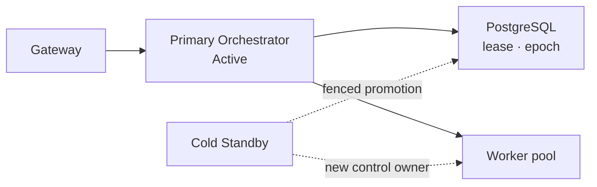
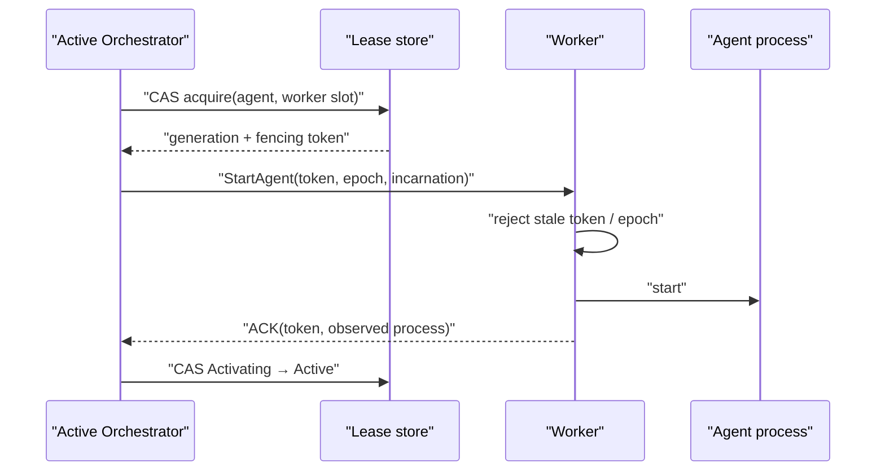
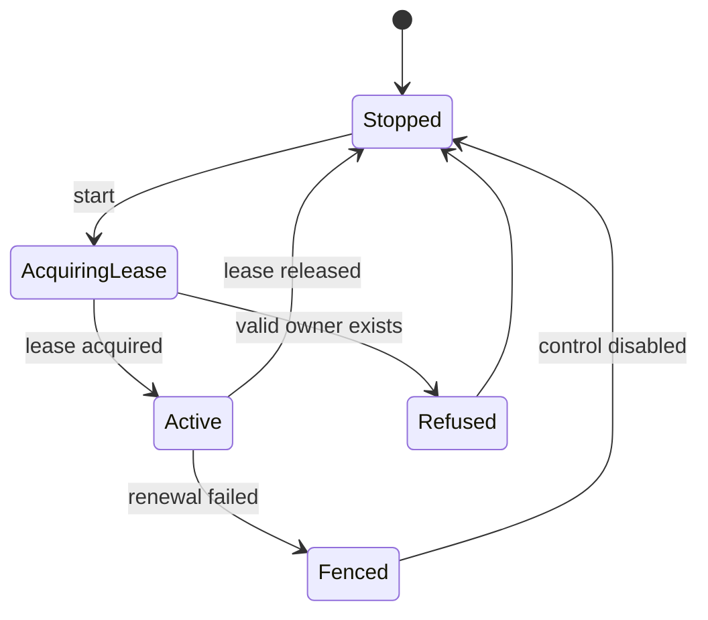

# Control Plane 권한과 장애 전환 계약

## 범위

이 문서는 dispatch와 Agent 제어 권한의 단일 소유, lease·epoch·fencing 계약을 정의한다.
운영자의 수동 승격·복구·설정 동기화 절차는 [일상 운영 Runbook](../deployment/operations.md)이
소유한다.

## 결정

Fleet는 하나의 논리적 제어 기관만 허용한다. 운영 중 하나의 Primary Orchestrator만 Active이고,
두 번째 인스턴스는 Cold Standby다. 여러 Worker가 동시에 Task를 처리하는 것은 Worker pool
concurrency이며 Active-Active Orchestrator가 아니다.

## 불변식

1. 유효한 dispatch lease를 가진 Orchestrator는 최대 하나다.
2. lease가 없는 인스턴스는 조회를 제공할 수 있어도 dispatch, cancel, Agent command, breaker 변경을 수행하지 않는다.
3. Standby는 기존 Primary의 종료 또는 네트워크 fencing을 확인하기 전 제어 권한을 얻지 않는다.
4. 모든 dispatch attempt와 control command에는 승격마다 증가하는 epoch를 남긴다.
5. 이전 epoch의 늦은 이벤트는 상태를 변경하지 못한다.

## Agent execution lease와 fencing

Orchestrator lease만으로는 Worker 안의 이전 Agent process를 막지 못한다. 따라서 Agent activation은
별도의 `worker_execution_lease`를 획득한 뒤에만 가능하다. 이 레코드는 `agent_id`, `worker_id`,
`attempt_id`, `worker_incarnation`, `lease_generation`, 단조 증가 `fencing_token`, `control_epoch`,
`state`, `acquired_at`, `renewed_at`, `expires_at`를 가진다.

- Agent당 `Activating|Active|Releasing` lease는 하나뿐이고, Worker slot도 하나의 활성 lease만 가진다.
- lease 획득·갱신·release는 DB 시간 기준 조건부 갱신이다. slot 수는 Worker의 보고값이 아니라
  lease row를 기준으로 산정한다.
- Worker는 마지막으로 수락한 `fencing_token`보다 작은 start/stop/renew, 다른
  `worker_incarnation`, 더 오래된 control epoch를 거절한다.
- Worker는 control plane 연결 또는 lease 갱신을 잃으면 새 Task를 시작하지 않고 grace 뒤 해당
  process를 self-fence/drain한다. 이 동작은 heartbeat 옵션과 독립인 control channel lease다.
- Start/stop ACK가 유실되면 `OutcomeUnknown`으로 남겨 Worker의 process inventory와 token을
  관측할 때까지 새 lease·중복 start를 금지한다.
- Worker 재기동은 새 incarnation을 발급한다. 재기동 뒤 남은 process는 최신 token lease와 일치하지
  않으면 cleanup하며, 이전 incarnation의 늦은 ACK는 감사만 남기고 상태를 바꾸지 않는다.

## Lease와 상태 전이

영속 lease는 최소 `cluster_id`, `active_instance_id`, `epoch`, `acquired_at`, `expires_at`,
`last_renewed_at`를 가진다. DB 시간 기준 조건부 갱신으로 획득·갱신하며, lease 갱신에 실패한
인스턴스는 즉시 신규 제어 동작을 멈춘다.

## 지원하지 않는 모델

- 공유 PostgreSQL만으로 보장되는 Active-Active dispatch
- in-flight ACP session을 이어받는 Cold Standby
- Primary fencing 없는 자동 failover
- migration과 binary rollback만으로 보장되는 무중단 배포

## 구현 게이트

1. 동시에 둘이 lease를 획득하지 못하는 통합 테스트
2. lease 상실 인스턴스의 신규 dispatch fail-closed 테스트
3. 이전 epoch completion이 최신 상태를 덮지 못하는 테스트
4. Primary 종료 뒤 수동 승격, Worker 재연결, pending reconciliation E2E 테스트
5. schema 또는 binary compatibility가 맞지 않는 Standby 기동 거부 테스트
6. partition 중 Worker self-fencing과 회복 뒤 stale process cleanup E2E 테스트
7. 동시 slot claim, ACK 유실, Worker reincarnation에서 Agent 중복 process가 생기지 않는 테스트
