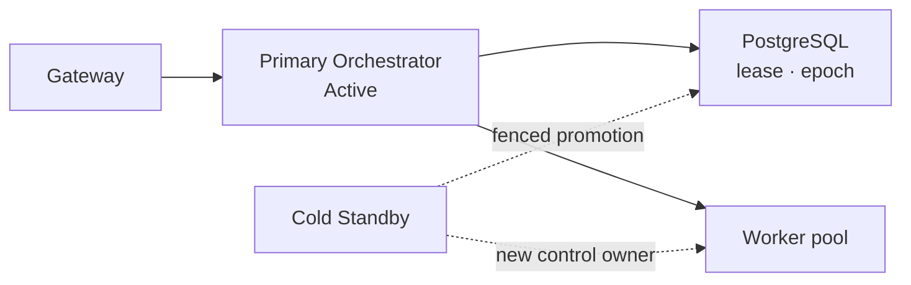
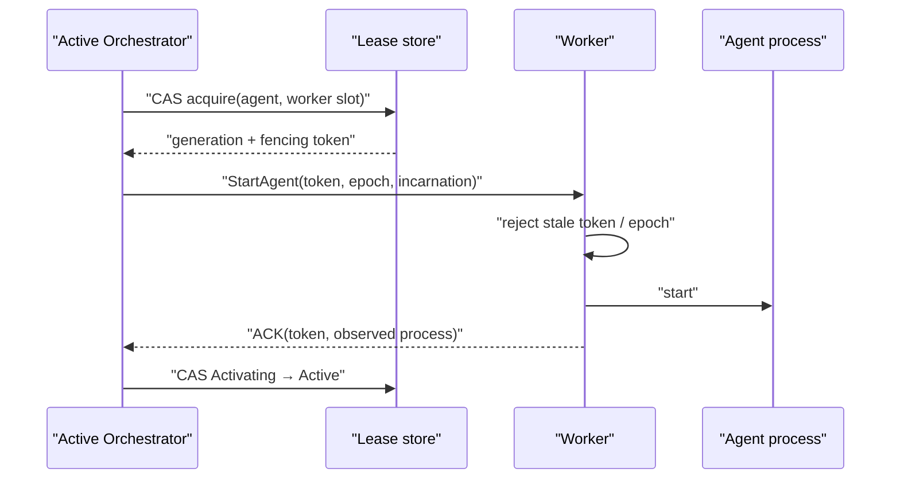
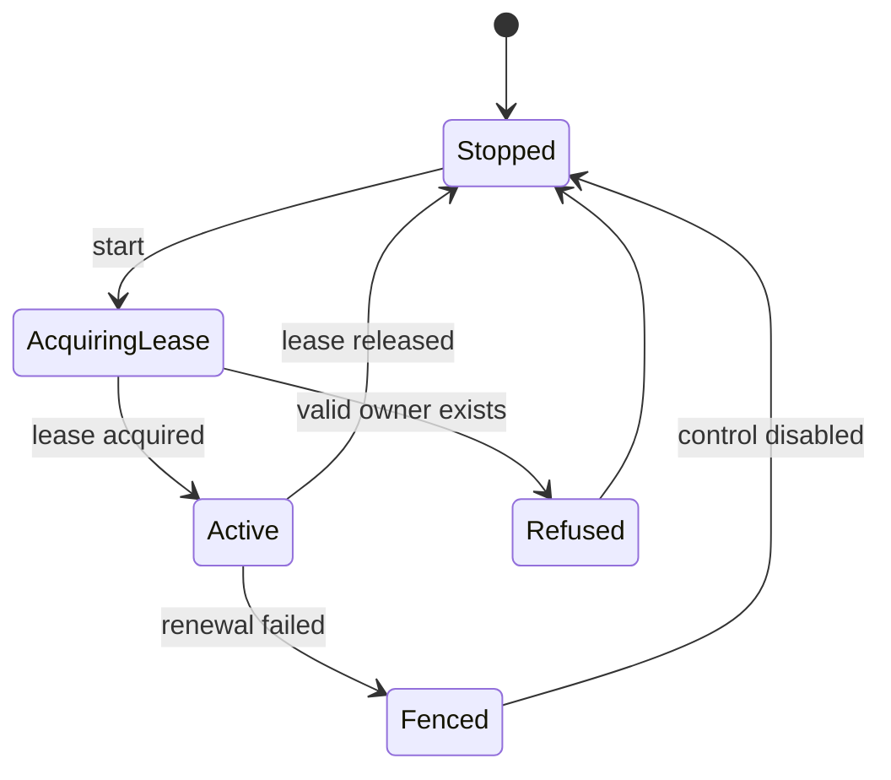

# Control Plane 권한과 장애 전환 계약

## 범위

이 문서는 dispatch와 Agent 제어 권한의 단일 소유, lease·epoch·fencing 계약을 정의한다.
운영자의 수동 승격·복구·설정 동기화 절차는 [일상 운영 Runbook](../deployment/operations.md)이
소유한다.

## 결정

Fleet는 하나의 논리적 제어 기관만 허용한다. 운영 중 하나의 Primary Orchestrator만 Active이고,
두 번째 인스턴스는 Cold Standby다. 여러 Worker가 동시에 Task를 처리하는 것은 Worker pool
concurrency이며 Active-Active Orchestrator가 아니다.

## 불변식

1. 유효한 dispatch lease를 가진 Orchestrator는 최대 하나다.
2. lease가 없는 인스턴스는 조회를 제공할 수 있어도 dispatch, cancel, Agent command, breaker 변경을 수행하지 않는다.
3. Standby는 기존 Primary의 종료 또는 네트워크 fencing을 확인하기 전 제어 권한을 얻지 않는다.
4. 모든 dispatch attempt와 control command에는 승격마다 증가하는 epoch를 남긴다.
5. 이전 epoch의 늦은 이벤트는 상태를 변경하지 못한다.

## Agent execution lease와 fencing

Orchestrator lease만으로는 Worker 안의 이전 Agent process를 막지 못한다. 따라서 Agent activation은
별도의 `worker_execution_lease`를 획득한 뒤에만 가능하다. 이 레코드는 `agent_id`, `worker_id`,
`attempt_id`, `worker_incarnation`, `lease_generation`, 단조 증가 `fencing_token`, `control_epoch`,
`state`, `acquired_at`, `renewed_at`, `expires_at`를 가진다.

- Agent당 `Activating|Active|Releasing` lease는 하나뿐이고, Worker slot도 하나의 활성 lease만 가진다.
- lease 획득·갱신·release는 DB 시간 기준 조건부 갱신이다. slot 수는 Worker의 보고값이 아니라
  lease row를 기준으로 산정한다.
- Worker는 마지막으로 수락한 `fencing_token`보다 작은 start/stop/renew, 다른
  `worker_incarnation`, 더 오래된 control epoch를 거절한다.
- Worker는 control plane 연결 또는 lease 갱신을 잃으면 새 Task를 시작하지 않고 grace 뒤 해당
  process를 self-fence/drain한다. 이 동작은 heartbeat 옵션과 독립인 control channel lease다.
- Start/stop ACK가 유실되면 `OutcomeUnknown`으로 남겨 Worker의 process inventory와 token을
  관측할 때까지 새 lease·중복 start를 금지한다.
- Worker 재기동은 새 incarnation을 발급한다. 재기동 뒤 남은 process는 최신 token lease와 일치하지
  않으면 cleanup하며, 이전 incarnation의 늦은 ACK는 감사만 남기고 상태를 바꾸지 않는다.

## Lease와 상태 전이

영속 lease는 최소 `cluster_id`, `active_instance_id`, `epoch`, `acquired_at`, `expires_at`,
`last_renewed_at`를 가진다. DB 시간 기준 조건부 갱신으로 획득·갱신하며, lease 갱신에 실패한
인스턴스는 즉시 신규 제어 동작을 멈춘다.

## 지원하지 않는 모델

- 공유 PostgreSQL만으로 보장되는 Active-Active dispatch
- in-flight ACP session을 이어받는 Cold Standby
- Primary fencing 없는 자동 failover (아래 "구현 상태와 유예"의 알려진 간극 참고 —
  오늘 코드는 이 모델을 **물리적으로 막지 않는다**)
- migration과 binary rollback만으로 보장되는 무중단 배포

## 구현 게이트

1. 동시에 둘이 lease를 획득하지 못하는 통합 테스트
2. lease 상실 인스턴스의 신규 dispatch fail-closed 테스트
3. 이전 epoch completion이 최신 상태를 덮지 못하는 테스트
4. Primary 종료 뒤 수동 승격, Worker 재연결, pending reconciliation E2E 테스트
5. schema 또는 binary compatibility가 맞지 않는 Standby 기동 거부 테스트
6. partition 중 Worker self-fencing과 회복 뒤 stale process cleanup E2E 테스트
7. 동시 slot claim, ACK 유실, Worker reincarnation에서 Agent 중복 process가 생기지 않는 테스트

## 구현 상태와 유예

> 2026-08-26 기준. 이 절은 계약(위)과 오늘 저장소에 실제로 있는 코드 사이의 거리를
> 남긴다. 계약 문장을 약화하지 않는다 — 어디까지 강제되고 어디부터는 강제되지 않는지를
> 밝혀, 강제되지 않는 구간이 "이미 지켜지는 것"으로 오해되지 않게 하는 것이 목적이다.

### 인수인계 경로는 둘이고, 증거의 성격이 다르다

`PgStore::acquire_control_lease`의 CAS 술어는 **하나**다
(`crates/fleet-store/src/postgres.rs`, `ON CONFLICT ... DO UPDATE ... WHERE
control_plane_lease.expires_at < NOW()`). 이 술어는 lease가 **왜** 만료됐는지를 구분하지
못하므로, 실제 인수인계는 성격이 다른 두 경로로 갈린다.

| 경로 | 만료 원인 | Standby가 가진 증거 | 불변식 3 만족 |
| --- | --- | --- | --- |
| 정상 종료 (graceful release) | 전 Primary가 `release_control_lease`로 `expires_at`을 과거로 밀었다 | **전 소유자가 스스로 권한을 놓았다는 명시적 기록** | 만족 — 종료가 확인됐다 |
| 비정상 종료 (TTL 만료) | 전 Primary가 갱신을 못 한 채 TTL이 흘렀다 | **시계뿐** | **위반** — 종료도 fencing도 확인하지 않았다 |

두 번째 행이 "지원하지 않는 모델"의 *Primary fencing 없는 자동 failover*에 정확히 해당한다.
계약은 여전히 이 모델을 지원 대상으로 선언하지 않는다 — 즉 이 경로로 승격된 Standby의
상태 정합성을 계약이 보장하지 않는다. 다만 **코드가 이 경로를 막지 않는다**는 사실이
중요하다. TTL이 지나면 Standby는 운영자의 개입 없이 자동으로 lease를 얻는다. GC 정지나
네트워크 분단으로 "죽지 않았는데 갱신만 못 한" Primary가 있으면 두 인스턴스가 동시에
자기가 Primary라고 믿는 창이 열리고, 그 창을 닫아야 할 epoch 강제(불변식 4·5)는 아직 없다.
운영 절차가 이 간극을 메운다 — [운영 Runbook](../deployment/operations.md)의 수동 Primary
승격은 TTL 만료를 승격의 근거로 인정하지 않고 별도의 fencing 증거를 요구한다.

그 증거는 오래 남지 않는다. `control_plane_lease`는 `cluster_id`당 **한 행**이고, 획득의
`ON CONFLICT DO UPDATE`가 `active_instance_id`·`acquired_at`·`expires_at`·`last_renewed_at`을
모두 덮어쓴다. 즉 이 테이블은 소유권의 **현재 상태**이지 이력이 아니며, 승격은 자신이 어느
경로로 일어났는지 판정할 근거를 그 자리에서 지운다. 이미 기동해 polling 중인 Standby가 있으면
전 소유자의 종료 흔적이 남아 있는 창은 `LeaseManagerConfig::poll_interval`(기본 3초) 수준이다.
사후에 종료 유형을 확실히 알려면 lease 인수인계 이력을 별도로 남겨야 하는데, 그 저장소는 아직
없다 — 그래서 Runbook의 진단 SQL은 "그 행이 아직 죽은 Primary의 것이고 만료돼 있을 때만"이라는
전제를 달고 있고, 그 전제가 깨지면 1단계에서 독립적으로 확보한 fencing 증거가 유일한 입력이다.

### 구현 게이트별 상태

| 게이트 | 상태 | 근거 |
| --- | --- | --- |
| 1. 동시에 둘이 lease를 획득하지 못함 | **닫힘** | `crates/fleet-scheduler/src/lease.rs`의 lease 테스트 + 2026-08-26 라이브 2-프로세스 실행(아래) |
| 2. lease 상실 인스턴스의 신규 dispatch fail-closed | **부분** | `FleetState::lease_allows_control()`이 bool로 거절한다. 갱신 실패를 **관측한 뒤**의 제어 동작만 막으며, 관측 직전 이미 DB로 떠난 쓰기는 막지 못한다 |
| 3. 이전 epoch completion이 최신 상태를 덮지 못함 | **부분** | **쓰기 절반은 닫혔다** — `PgStore::transition_task_status`가 epoch 술어를 `UPDATE`와 같은 문장에 넣는다(커밋 `516f85e`). **이벤트 절반은 열려 있다** — 아래 "epoch 강제" 참고. `#62` 검증 게이트 4("이전 control epoch 이벤트가 거부되는 테스트")와 같은 항목이다 |
| 4. Primary 종료 뒤 수동 승격 · Worker 재연결 · pending reconciliation E2E | **미착수** | 라이브 실행은 lease 인수인계만 관찰했다. 수동 승격 절차, Worker 재연결, reconciliation은 어느 것도 실행하지 않았다 |
| 5. schema/binary 비호환 Standby 기동 거부 | **부분** | **schema 절반은 닫혔다** — 아래 "기동 호환성 게이트" 참고. **binary 버전 검사는 미착수** — 버전을 DB에 쓰는 생산자가 없다 |
| 6. partition 중 Worker self-fencing과 stale process cleanup E2E | **미착수** | Worker self-fencing 미구현 |
| 7. 동시 slot claim · ACK 유실 · Worker reincarnation에서 Agent 중복 process 없음 | **미착수** | Agent 엔티티와 `worker_execution_lease`가 아직 없다 |

### epoch 강제(불변식 4·5)를 미룬 이유와 귀속

lease 테이블에는 `epoch` 컬럼이 있고 승격마다 증가한다. 그 창을 닫으려면 두 가지가 함께
필요하다. ① Task 상태 쓰기가 epoch 술어를 포함한 compare-and-set이어야 하고, ② Worker
이벤트가 자신이 **어느 epoch에서 dispatch됐는지**를 싣고 돌아와야 한다.

**①은 `516f85e`(`#62` 3단계)로 닫혔다.** `PgStore::transition_task_status`는 fence가 주어지면
`AND EXISTS (SELECT 1 FROM control_plane_lease WHERE cluster_id = $4 AND epoch = $5)`를
`UPDATE`와 **같은 문장 안에** 넣는다. lease를 먼저 SELECT해서 분기하는 방식과의 차이가
전부다 — 후자는 SELECT와 UPDATE 사이에 fenced되어도 이미 떠난 쓰기가 그대로 도착한다.
(이전 판의 "epoch를 읽어서 쓰기를 거르는 코드는 저장소에 하나도 없다"는 문장과 그 근거로
든 `crates/fleet-api/src/state.rs` 경로는 둘 다 낡았다. 후자는 존재하지 않는 파일이다.)

**②는 여전히 열려 있다.** ②는 dispatch 시점의 epoch를 실행 단위에 바인딩하는 것이므로
`worker_execution_lease`의 `fencing_token`(위 "Agent execution lease와 fencing" 절)과 같은
구조를 요구한다. 그 엔티티는 로드맵 `#67`의 범위이고 아직 없다. 바인딩할 대상이 없는
상태에서 epoch 술어만 먼저 넣으면 항상 참인 술어가 되어 게이트를 통과한 것처럼 보이는
죽은 검사가 된다. 그래서 **epoch 강제 전체를 `#67`에 귀속시키고 여기서는 착수하지
않았다.**

### 기동 호환성 게이트(게이트 5)

기동 시 호환성 검사는 **여러 방향**으로 나뉘고, 방향마다 상태가 다르다.

| 방향 | 상태 | 강제하는 주체 |
| --- | --- | --- |
| DB에 적용된 마이그레이션이 바이너리에 없음 (DB가 앞섬) | **닫힘** | sqlx — `Migrator::run_direct`의 `validate_applied_migrations`가 `VersionMissing`으로 거절 |
| 적용된 버전의 체크섬이 다름 | **닫힘** | sqlx — `VersionMismatch` |
| 바이너리에만 있는 마이그레이션 (바이너리가 앞섬) | **닫힘** (2026-08-26) | `PgStore::guard_migration_against_live_lease` |
| binary 버전 비호환 | **미착수** | 생산자가 없다 — 아래 |

앞의 두 줄은 이 프로젝트가 `set_ignore_missing`을 호출하지 않아 sqlx 기본값
(`ignore_missing: false`)이 그대로 걸리기 때문에 **이미 성립하고 있었다.** 이전 판의
"기동 시 호환성 검사 자체가 없다"는 근거문은 이 절반에 대해 틀렸다. 다만 그 보장을
확인하는 테스트가 없어서, `ignore_missing`이 언젠가 켜지면 조용히 사라질 상태였다 —
`crates/fleet-store/tests/migration_lease_guard.rs`의
`db_ahead_of_binary_is_refused_by_sqlx_itself`가 이제 그것을 고정한다.

세 번째 줄이 실제로 뚫려 있던 곳이다. sqlx는 바이너리에만 있는 마이그레이션을
`run_direct`의 `None => conn.apply(...)` 가지에서 **말없이 적용한다.** Cold Standby는
Primary와 DB 하나를 공유하므로, 더 새 바이너리를 든 Standby가 기동하는 것만으로 살아
있는 Primary 밑에서 스키마가 갈린다. sqlx 자신의 advisory lock은 이것을 덮지 못한다 —
그것은 동시 마이그레이터끼리를 직렬화할 뿐이고, 여기서 위험한 쪽은 경쟁하는
마이그레이터가 아니라 **이미 돌고 있는 옛 바이너리**다.

**게이트의 술어와 그 이유.** `PgStore::migrate`는 적용할 마이그레이션이 있고 **동시에**
아직 만료되지 않은 control plane lease가 있을 때만 거절한다. 두 조건을 모두 요구하는 것이
설계의 핵심이다.

- **적용할 것이 없으면 통과.** 같은 버전의 재기동과 동일 버전 Standby 기동은 스키마를
  바꾸지 않으므로 막을 이유가 없다. 여기서 막으면 평범한 롤링 재기동이 통째로 거절되는
  운영 함정이 된다.
- **정상 종료한 Primary는 즉시 길을 비킨다.** `release_control_lease`가 행을 지우지 않고
  `expires_at = NOW()`로 만들기 때문에, 계획된 업그레이드는 TTL을 기다리지 않는다. 게이트가
  실제로 사람을 막는 창은 **크래시 뒤 최대 TTL(기본 15초)** 뿐이고, 에러 메시지가 남은 초와
  멈춰야 할 인스턴스 이름을 함께 명시한다.

**binary 버전 검사를 넣지 않은 이유.** 저장소 어디에도 바이너리 버전을 DB에 쓰는 코드가
없고, `control_plane_lease`에 버전 컬럼도 없다. 생산자가 없는 상태에서 술어만 넣으면 항상
참인 죽은 검사가 된다 — epoch 강제 ②를 `#67`에 귀속시킨 것과 같은 판단이다. 이 절반은
**미착수로 남기고**, 생산자(승격 시 자신의 버전을 lease 행에 기록하는 쓰기)가 생기는
시점에 함께 넣는다.

**라이브 관측 (2026-08-26).** 임시 DB를 마지막 마이그레이션 직전까지만 올리고
`control_plane_lease`에 `expires_at = NOW() + 120s`인 행을 넣은 뒤 실제 바이너리로 관찰했다.

| 명령 | 결과 |
| --- | --- |
| `fleet migrate` | 거절, exit code 1, `_sqlx_migrations` 최대 버전 불변 |
| `fleet serve` | 거절, exit code 1 — MCP 서버를 열기 **전에** 종료 |
| lease를 `expires_at = NOW()`로 반납한 뒤 `fleet migrate` | 즉시 성공, 마지막 마이그레이션 적용 확인 |

**검증 한계**(정직하게 남긴다):

- **검사와 적용 사이는 원자적이지 않다.** 검사 직후 다른 인스턴스가 lease를 획득하면
  스키마는 여전히 바뀔 수 있다. 이 게이트는 배포 실수(더 새 바이너리를 살아 있는
  클러스터에 붙이는 것)를 막는 것이지 분산 합의가 아니다. 원자적으로 만들려면
  마이그레이션 자체를 lease 아래로 넣어야 하는데, `control_plane_lease` 테이블을 만드는
  것이 021 마이그레이션이라 순환이 생긴다.
- 게이트는 `PgStore::migrate` 안에 있으므로 `fleet serve`·`fleet migrate`·`fleet users`·
  `fleet doctor` 네 호출 지점이 **구조적으로** 모두 덮인다. 위 표는 앞의 두 경로만 실제
  바이너리로 확인했고, 나머지 둘은 같은 함수를 호출한다는 사실로만 덮여 있다.
- 라이브 관측은 `control_plane_lease` 행을 직접 INSERT해 "살아 있는 Primary"를 재현했다.
  두 번째 `fleet` 프로세스를 실제로 띄워 lease를 쥐게 한 상태에서 확인하지는 않았다.
- 이 게이트는 **Standby가 더 새 바이너리일 때**를 막는다. 운영자가 Primary를 세우지 않은
  채 `fleet migrate`를 돌리는 경우도 같은 술어로 막히지만, Primary가 크래시해 lease가
  이미 만료된 뒤라면 막지 못한다 — TTL 이후에는 "살아 있는 Primary"와 "죽은 Primary"를
  DB만 보고 구분할 수 없기 때문이다(불변식 3의 한계와 같은 뿌리다).

effect ledger 관련 유예(`#62` 검증 게이트 5~10)는 이 문서의 범위가 아니다 — 사유와 판단은
[실행 일관성](tasks/execution-consistency.md)과 [로드맵](../roadmap/roadmap.md)의 `#62`
항목이 소유한다.

### 라이브 검증 기록 (2026-08-26)

실제 PostgreSQL과 `fleet serve` 프로세스 **둘**로 관찰했다. Standby는 이미 기동해
polling 중인 **warm** 상태였다(`poll_interval` 기본값 3초). 계약이 기술하는 Cold Standby —
운영자가 승격 시점에 기동하는 모델 — 는 이 실행이 다루지 않았다.

| 시각 (UTC) | 인스턴스 | 관측 |
| --- | --- | --- |
| 01:38:59.017 | A | lease acquired epoch=1 (ttl=15s) |
| 01:39:01.079 | B | lease manager 기동 — **획득하지 못함** (게이트 1) |
| 01:39:04.028 | A | renewed epoch=1, expires_at=01:39:19.024 |
| 01:39:05.169 | A | `SIGTERM` 수신 |
| 01:39:05.171 | A | **lease released** (신호로부터 1.7ms) |
| 01:39:05.171 | A | lease manager stopped — 프로세스 실제 종료 |
| 01:39:07.094 | B | **lease acquired epoch=2** |

B의 승격은 `SIGTERM`으로부터 **1.93초**, 그 시점에 TTL이 **13.85초 남아 있었다** — 승격이
TTL 만료로는 설명되지 않으므로 명시적 반납이 실제로 인수인계를 앞당겼다는 증거다. 1.93초는
`poll_interval`(3초) 안의 값이며 warm standby의 수치다.

**검증 한계**(정직하게 남긴다):

- 위 표는 **정상 종료 경로만** 관찰했다. TTL 만료 인수인계는 이 실행에서 확인하지 않았다.
- `fleet-cli`의 신호 처리(`SIGTERM`/`SIGINT` → 정리 → `std::process::exit(0)`)를 덮는
  **테스트가 없다**. 이 경로 전체를 지워도 모든 게이트가 초록으로 남는다. 단위 테스트는
  프로세스를 새로 띄우지 않으므로 원리적으로 이 결함을 잡지 못한다 — 실제로 이 라이브
  검증이 아니었다면, `tokio::io::stdin()`의 blocking 스레드 때문에 "lease는 반납했는데
  프로세스는 살아남는" 상태가 그대로 배포됐을 것이다.
- `LeaseManagerHandle::shutdown()`의 `shutdown_grace` 초과 분기(DB 무응답 시 abort)도
  테스트가 없다. DB 무응답을 재현할 하네스가 없다.
