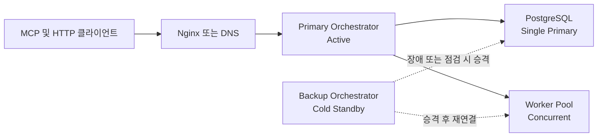
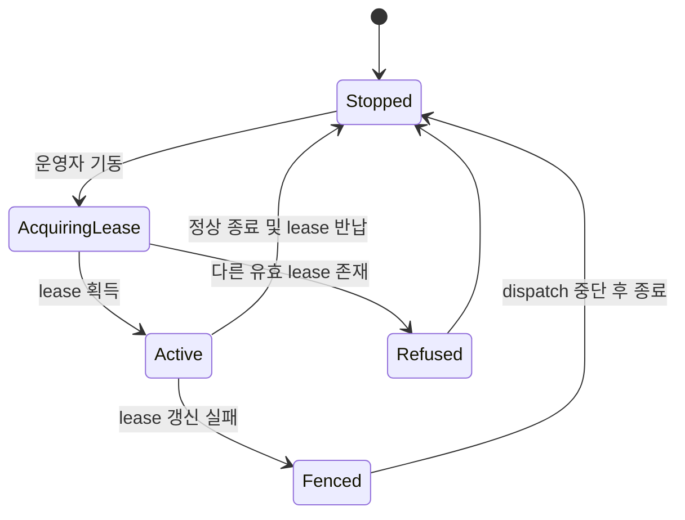
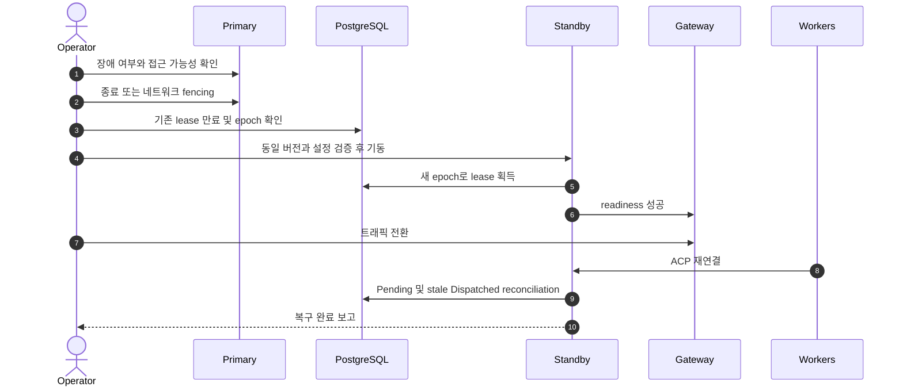

# Control Plane 가용성 및 Cold Standby 운영 모델

## 결정

Fleet는 하나의 논리적 제어 기관만 허용한다. 운영 중에는 Primary Orchestrator
하나만 Active이고, 두 번째 인스턴스는 평상시 중지된 Cold Standby로 유지한다.
Active-Active dispatch는 지원 운영 모델이 아니다.



이 결정에서 Active/Standby의 주체는 PostgreSQL이나 Worker가 아니라 태스크 배정과
Agent 제어 권한을 가진 **Orchestrator control plane**이다. 여러 Worker가 동시에
태스크를 처리하는 것은 Worker Pool concurrency이며 Active-Active Orchestrator와
다르다.

## 불변식

1. 유효한 dispatch lease를 가진 Orchestrator는 최대 하나다.
2. lease가 없는 인스턴스는 HTTP 조회를 제공하더라도 dispatch, cancel, Agent command,
   breaker 변경 같은 제어 동작을 수행하지 않는다.
3. Standby 승격 전 기존 Primary의 프로세스 종료 또는 네트워크 fencing을 확인한다.
4. 모든 dispatch attempt와 control command에는 승격 때마다 증가하는 epoch를 기록한다.
5. 이전 epoch에서 늦게 도착한 이벤트는 상태를 변경하지 못한다.

## Lease와 fencing



권장 영속 모델은 다음과 같다.

```text
orchestrator_lease
- cluster_id
- active_instance_id
- epoch
- acquired_at
- expires_at
- last_renewed_at
```

DB 시간 기준의 조건부 갱신으로 lease를 획득하고 갱신한다. lease 갱신 실패 시 해당
인스턴스는 즉시 신규 dispatch와 제어 명령을 중단한다. 단순 hostname 파일이나 운영자
관례만으로 단일 Active를 보장하지 않는다.

## 장애 전환 절차



자동 failover는 fencing이 자동화되기 전에는 지원하지 않는다. 운영자가 승인하는 수동
승격을 기본으로 한다.

## Standby 동기화 대상

- 동일한 Fleet 바이너리와 schema compatibility 정보
- `/etc/fleet/fleet.env`
- `/etc/fleet/master.key`
- mTLS CA, client certificate와 private key
- Nginx, LiteLLM, OTEL, SMTP 설정 중 해당 인스턴스가 소비하는 항목
- 동일 PostgreSQL 접근 경로
- skill, routing policy, configuration revision
- SSH `known_hosts`

ACP 연결과 프로세스 메모리는 복제 대상이 아니다. 승격 후 Worker 재연결과 task
reconciliation을 수행한다.

## 지원하지 않는 주장

- PostgreSQL을 공유한다는 이유만으로 Active-Active가 된다는 주장
- Cold Standby가 in-flight ACP session을 그대로 이어받는다는 주장
- Primary fencing 없이 Standby를 기동하는 자동 전환
- startup migration과 binary rollback만으로 무중단 배포가 보장된다는 주장

## 검증 게이트

- 동시에 두 인스턴스가 lease를 획득하지 못하는 통합 테스트
- lease 상실 인스턴스의 신규 dispatch fail-closed 테스트
- 이전 epoch completion이 최신 attempt를 덮지 못하는 테스트
- Primary 강제 종료 후 Standby 승격, Worker 재연결, Pending 회수 E2E 테스트
- 잘못된 버전 또는 schema 조합의 Standby 기동 거부 테스트
