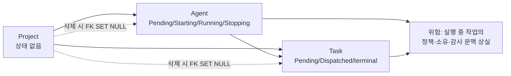
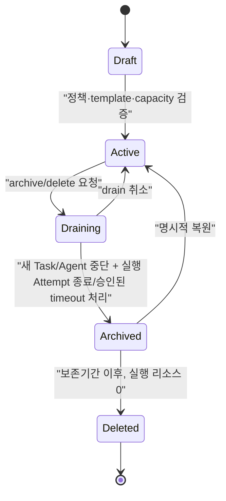

# Project · Task · Agent Lifecycle 정합성 검토 (Historical)

> **지위: Historical review.** 이 검토에서 도출한 현재 lifecycle은
> [Project·Agent·Task 연속 개발 Lifecycle](project-task-agent-lifecycle.md)에 정리됐다.
> 본문은 발견 근거와 당시의 미결정 사항을 보존한다.

## 결론

Task와 Agent에는 각각 상태 다이어그램이 있으나, **Project에는 배정 흐름만 있고
운영 lifecycle이 없다.** 따라서 project 재배정·삭제가 실행 중 Agent와 Task에 미치는
영향을 일관되게 결정할 수 없다. 또한 Task의 현재 구현 상태와 목표 `TaskAttempt`
상태 모델은 서로 다른 수준인데, 두 문서가 그 경계를 명시하지 않아 혼동 위험이 있다.

| 엔티티 | 현 정본 | 평가 | 조치 |
|---|---|---|---|
| Project | `project-feature-design.md`의 생성·배정·삭제 흐름 | 상태/Drain/Delete 계약 없음 | 사용자 결정 후 lifecycle 정본 추가 필요 |
| Task | `overview.md`의 현재 5상태 + `task-execution-consistency.md`의 목표 Attempt | 현재와 목표가 분리돼 있으나 연결 규칙 부족 | legacy Task와 target TaskAttempt 계층을 명시 |
| Agent | `agent-provisioning-design.md`의 상세 상태 머신 | heartbeat polling 의존성, project drain/delete 전이 누락 | control polling 제약 및 project lifecycle 연계 필요 |

## 발견한 정합성 공백

1. **Project 삭제가 실행 중 리소스와 분리된다.** 현재 설계의 `ON DELETE SET NULL`은
   과거 기록 보존에는 유리하지만, Running Agent와 Pending/Dispatched Task의 project
   문맥도 제거할 수 있다. 작업이 계속 완료된다는 재배정 정책과 결합하면, 삭제 직후
   어떤 헌법·격리·예산·권한 snapshot을 적용하는지 정의되지 않는다.
2. **Project에 Draining 상태가 없다.** 현재는 host/worker를 다른 project로 즉시
   재배정할 수 있다. 새 제출 중단, Agent 자동 생성 중단, existing task 완료 대기,
   timeout/escalation 순서가 없어 운영자가 안전하게 폐기할 경로가 없다.
3. **Agent는 heartbeat를 control poll로 사용한다.** 기존 Agent 시작/정지 command는
   "다음 heartbeat"에 전달된다. 따라서 `on_demand` liveness에서 idle traffic을 0으로
   만들면 Pending Agent가 영구히 Starting으로 전이하지 않을 수 있다.
4. **Task 상태 두 계층이 혼재한다.** 현재 구현의 Task는
   `Pending/Dispatched/Completed/Failed/Cancelled`이고, 목표 설계의 TaskAttempt는
   `Claimed/Running/OutcomeUnknown/DeadLettered` 등을 추가한다. 하나가 다른 하나를
   대체하는 시점·호환 API를 문서가 정하지 않았다.
5. **격리 snapshot의 소유자가 불명확하다.** project 재배정 시 Agent의 `project_id`를
   갱신하는 현재 설계와, TaskAttempt에 isolation/skill/policy revision을 고정한다는
   설계가 만난다. 실행 중 Attempt는 project의 최신값이 아니라 제출 시점 snapshot을
   계속 사용해야 한다.

## 제안하는 통합 lifecycle (결정 필요)

권장 정책은 다음과 같다.

- `Draft`: 새 Task dispatch와 Agent 자동 생성 불가.
- `Active`: 정상 생성·배정·dispatch.
- `Draining`: 새 Task, 새 Agent, host/worker 재배정을 중단한다. 이미 실행 중인
  Attempt는 제출 시점 policy snapshot으로 계속 실행한다.
- `Archived`: 실행 Agent와 비터미널 Attempt가 0일 때만 전이한다. 조회·감사는 가능하나
  새 실행은 불가.
- `Deleted`: 즉시 hard delete가 아니라 보존기간 이후의 관리 작업이다. Task/Attempt/Agent
  이력은 `project_id`를 NULL로 만들기 전에 immutable project snapshot을 보존해야 한다.

## 문서 분배 판단

현재 문서의 책임 분배는 대체로 적절하다.

- `project-feature-design.md`: Project 데이터 모델·배정·권한·API의 정본으로 유지
- `agent-provisioning-design.md`: Agent process/control 상태 머신의 정본으로 유지
- `task-execution-consistency.md`: TaskAttempt 실행 의미론의 정본으로 유지
- 새 lifecycle 정본(결정 후): 세 엔티티의 cross-entity 전이, drain/delete 순서,
  snapshot 보존만 소유. 개별 상태 머신을 복제하지 않는다.

다만 `system-entities-mapping.md`의 ASCII 프롬프트 다이어그램은 문서 정책의 Mermaid
기본 원칙과 맞지 않고, 선택 Skill을 inline 주입하는 오래된 서술을 담고 있다. 이는
`agent-harness-composition-design.md`의 확정된 required-inline/optional-fetch 계약으로
교체해야 한다.

## 즉시 적용한 안전 제약

`on_demand` liveness는 Agent command polling을 대체하지 않는다. control stream 또는
별도 bounded command poll을 구현하기 전에는 Agent를 호스팅하는 Worker에 적용할 수 없다.

## 사용자 결정이 필요한 항목

1. Project 폐기는 `Draining → Archived → 보존 후 Deleted`의 단계형 모델로 확정할지,
   아니면 즉시 삭제를 계속 허용할지
2. Draining 중 실행 Attempt의 기본 처리: 완료 대기, 정해진 deadline 후 취소 요청,
   또는 운영자별 승인
3. Archived Project의 Agent·Task·Skill/constitution snapshot 보존 기간
