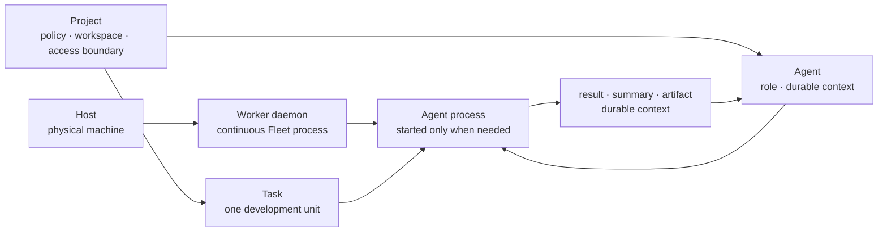
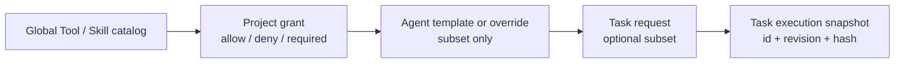

# Entity Placement와 Context Retention 계약

## 결정

Host에서 지속 실행되는 주체는 **Worker daemon**이다. Agent는 Project의 역할·정책·맥락을
가진 논리 엔티티이고, Agent process는 Task를 실행할 때만 Worker가 시작하는 일시적
자원이다. 맥락 보존은 상주 프로세스가 아니라 영속된 Project/Agent context와 workspace가
담당한다.



## 관계와 카디널리티

| 관계 | 계약 |
|---|---|
| Project → Task | Task는 `project_id`를 갖거나 일반 풀 Task로 명시된다. Project Task는 Project 정책 revision을 snapshot한다. |
| Project → Agent | Agent는 생성 시 하나의 immutable `project_id`를 가진다. Project를 바꾸는 것이 아니라 새 Agent를 만든다. |
| Host → Worker | Host는 물리 inventory, Worker는 Host에서 실행되는 daemon이다. 기본은 Host 1 : 1 Worker이며 Worker는 한 Host에만 placement된다. |
| Worker → Agent process | Worker는 여러 Agent process를 실행할 수 있으나, capability·slot·isolation 정책을 만족할 때만 실행한다. |
| Agent → Agent process | 논리 Agent는 0 또는 1개의 현재 process를 가진다. process 종료가 Agent 맥락 삭제를 뜻하지 않는다. |
| Task → Worker/Agent | 실행 중인 Task는 실제 `worker_id`를 항상 기록하고, Agent를 사용할 때 `agent_id`와 execution snapshot을 함께 기록한다. |

Host와 Worker daemon은 **공유 실행 풀**이다. Project가 Host 또는 Worker를 영구 소유하거나
예약하지 않는다. Agent가 활성화될 때만 Project 정책·Worker capability·격리 정책을 확인해
짧은-lived execution lease를 얻는다. 일반 풀 Task는 Project Agent의 맥락이나 workspace를
사용할 수 없다.

Host당 Worker daemon은 기본적으로 하나다. 그 Worker가 여러 Agent process를 slot·격리·cleanup
정책 아래 관리한다. Host당 다중 Worker는 `multi_worker_enabled` 운영 정책, Worker별 명시 capability
partition, 독립 workspace/container/port namespace, 별도 capacity accounting이 모두 있을 때만 예외로
허용한다. 다중 Worker는 Project 배정 수단이 아니며, 일반 운영 기능으로 자동 활성화하지 않는다.

기본 동시성 계약은 `Project.max_active_agents = 1`, `Project.max_warm_agents = 0`,
`Agent.max_concurrent_tasks = 1`이며, Worker의 `max_agent_processes`가 전역 실행 상한이다.
`max_active_agents`는 `Starting|Running` 수만, `max_warm_agents`는 `WarmIdle` 수만 센다. 둘 다
Worker process slot을 점유한다. Hibernated Agent는 slot을 점유하지 않는다. agent 수 상한은 보안
격리가 아니라 admission control이다.

lease는 단순 Worker 선택 기록이 아니다. `agent_id`당 하나의 활성 lease와 Worker slot당 하나의
활성 lease를 DB CAS로 보장하며, lease에는 `worker_incarnation`, control epoch, 단조 증가 fencing
token을 넣는다. Worker는 token이 오래되거나 control lease가 만료된 Agent process를 self-fence한다.
ACK 유실은 재시작 신호가 아니라 `OutcomeUnknown`이며 Worker inventory 관측 전 새 process를 만들지
않는다. 상세 제어 authority는 [Control Plane 권한과 장애 전환](control-plane-authority-and-failover.md)이
정본이다.

## Agent process와 맥락

기본 정책은 **ephemeral**이다. Task가 terminal이면 Agent process는 종료하고 Agent는
`Hibernated` 상태가 된다. 다음 Task는 durable context를 읽어 새 process를 시작한다.

`WarmIdle`은 명시적 최적화이며 기본값이 아니다. 기본 `max_warm_agents = 0`에서는 Task terminal 뒤
항상 Hibernated로 간다. WarmIdle은 Project가 허용하고 Worker의 process slot이 남을 때만, 제한된
`warm_idle_ttl` 안에서 process를 유지한다. WarmIdle process에는 실행 중 Task가 없고, terminal 때
모든 credential delivery grant와 attach grant를 먼저 회수한다. process memory는 재사용 최적화일
뿐 durable context의 정본이 아니다.

WarmIdle 재사용은 다음 Task의 runtime/image digest, isolation class, workspace identity, Tool/Skill
grant revision, egress profile, privileged allow-list가 현재 process와 모두 호환할 때만 허용한다.
하나라도 다르면 process를 종료하고 Hibernated에서 새 process를 시작한다. policy 변경·credential
회수·Project drain·control lease 상실은 TTL을 기다리지 않고 종료한다.

Worker slot이 부족하면 다음 순서로 축출한다: (1) 만료된 WarmIdle, (2) drain/revoked Project의
WarmIdle, (3) 가장 오래 idle인 WarmIdle, (4) 필요 시 새 Task를 Pending으로 남긴다. 실행 중인
Task를 WarmIdle보다 우선해 강제 종료하지 않으며, 다른 Project의 context를 재사용하지 않는다.

| 보존 대상 | process 종료 뒤 유지 여부 |
|---|---|
| Project workspace/Git branch | 유지 |
| Agent 역할, runtime, policy revision | 유지 |
| thread summary·승인된 long-term memory | 유지 |
| Tool/Skill/runtime/isolation execution snapshot | Task 감사 레코드로 유지 |
| process memory, tmux/container process | 유지하지 않음 |

## Tool·Skill binding

Tool과 Skill의 catalog 항목은 전역 식별자와 revision/digest를 가진다. 실행 가능 여부는
상위 정책에서 하위 선택으로만 좁혀진다.



- Project deny 또는 capability 부족은 Agent template, Task 요청, 사용자 입력으로 다시 허용할 수 없다.
- 필수 Tool/Skill은 Project grant와 Agent binding 모두에서 허용되어야 하며, 누락하면 실행을 시작하지 않는다.
- 선택 Tool/Skill은 Task가 명시 요청한 허용 항목만 snapshot에 넣는다.
- catalog·grant·binding을 수정해도 이미 실행 중인 Task의 snapshot은 변하지 않는다.
- Tool catalog에는 secret 원문을 저장하지 않고, Skill의 원문은 revision/hash와 함께 승인된 저장소에서만 읽는다.

## lifecycle

```mermaid
stateDiagram-v2
    [*] --> Ready: "Agent created"
    Ready --> Starting: "task assigned"
    Starting --> Running: "Worker start ACK"
    Running --> WarmIdle: "task terminal; warm lease granted"
    Running --> Hibernated: "task terminal; default"
    WarmIdle --> Running: "next compatible task"
    WarmIdle --> Hibernated: "TTL / eviction / policy change / drain"
    Hibernated --> Starting: "context restore"
    Ready --> Draining: "Project drain"
    Running --> Draining: "Project drain / explicit stop"
    WarmIdle --> Draining: "Project drain"
    Hibernated --> Draining: "Project drain"
    Draining --> Stopped: "cleanup ACK"
    Starting --> Failed
    Running --> Failed
    Failed --> [*]
    Stopped --> [*]
```

`Ready`, `WarmIdle`, `Hibernated`는 Agent의 논리 상태다. `Starting`, `Running`, `WarmIdle`에는
process가 존재할 수 있다. `Stopped`는 cleanup 증거가 있을 때만 허용하며, 실패한 cleanup은 `Failed` 또는
별도 복구 대기 상태로 남긴다.

## Project 완료와 Worker 처리

Project가 `Draining`으로 전이하면 새 Task, Agent activation, warm lease 연장을
허용하지 않는다. 실행 중 Task는 완료 또는 명시 cancel deadline까지 관찰한다. 모든 Agent
process가 cleanup ACK를 반환하면 Agent는 `Stopped`로 전이하고 Project는 `Archived`가 될 수 있다.

Project archive가 Worker daemon 종료를 뜻하지는 않는다.

- 일반 풀 Worker는 Available로 남아 다른 Project를 실행할 수 있다.
- Worker는 Project 완료 후에도 이전 Project의 workspace, context, attach grant를 재사용하지 않는다.

## 구현 게이트

1. Agent process 종료 뒤 durable context로 같은 Agent가 다음 Task를 시작하는 E2E 시험
2. WarmIdle TTL·slot 상한·Project drain이 process를 종료하는 시험
3. 다른 Project Task가 Agent context/workspace/Tool grant를 읽지 못하는 시험
4. Project·Worker의 agent slot 상한과 lease 회수가 서로 다른 Project 실행을 막지 않으면서 초과 실행을 막는 시험
5. Project archive가 모든 Agent process 정리를 확인하되 일반 풀 Worker는 종료하지 않는 시험
6. WarmIdle의 credential/attach grant 회수, TTL·LRU 축출, 정책 비호환 재사용 거절 시험
