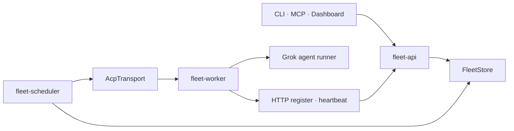

# 현재 구현 참조

이 문서는 현재 Rust 코드의 구조와 제약을 설명하는 Derived 참조다. 설계 결정은
[Architecture](README.md)의 정본 선택표, 외부 호출 표면은 [Contracts](../contracts/README.md), 설치와
운영 절차는 [Deployment](../deployment/README.md)가 소유한다.

## 현재 구성

| 구성요소 | 코드 근거 | 현재 역할과 제약 |
|---|---|---|
| Core | `fleet-core/task.rs`, `worker.rs` | `Task`, `Worker`, heartbeat의 공유 타입을 제공한다. Project·Agent 모델은 목표 계약이다. |
| Store | `crates/fleet-store/src/` | memory와 PostgreSQL 구현을 제공한다. Store 이벤트는 곧바로 보안 감사 정책이 아니다. |
| API | `fleet-api/app.rs`, `handlers.rs` | `/v1` task·Worker·등록 표면을 제공한다. 인증과 join 제한은 security/enrollment 정본을 따른다. |
| Scheduler | `fleet-scheduler/dispatcher.rs`, `selector.rs`, `breaker.rs` | ready task를 선택 가능한 Worker로 dispatch한다. Task 실행 CAS와 side-effect fencing은 아직 목표 계약이다. |
| Transport | `fleet-transport/acp_transport.rs` | Worker별 ACP WebSocket, 재연결 backoff, 연결 손실 시 pending request 실패 처리를 제공한다. |
| Worker | `fleet-worker/registration.rs`, `runner.rs` | HTTP register/heartbeat와 하나의 Grok runner를 관리한다. Agent command/ACK catalog는 없다. |

## 현재 동작과 설계 경계

Worker 선택은 hint, label, model, 현재 부하를 조합한다. 재시도, OutcomeUnknown, 멱등성,
부작용 차단은 [실행 의미론](tasks/execution-consistency.md)의 목표 계약이므로 현재 dispatcher
동작으로 추정하지 않는다.

`AcpTransport`는 연결 단절에서 대기 요청을 실패시키고 재연결한다. Worker daemon은 HTTP로
등록·heartbeat를 보낸다. mTLS proxy는 설정 시 기동할 수 있지만 Worker identity와 production
fail-closed 인증은 완성된 보안 모델이 아니다.

API는 기본 no-auth로 시작할 수 있다. bearer와 Cloudflare Access가 함께 설정되면 middleware가
누적 적용된다. join은 bootstrap token을 처리하지만 Worker-scoped credential으로 전환하지 않는다.
원문 token·endpoint secret·worker 설정의 현재 위험은
[Worker enrollment 계약](../contracts/worker-enrollment.md)을 따른다.

현재 Worker는 단일 Grok runner 중심이다. Agent 엔티티, command ACK, runtime catalog, terminal
attach, 장기 메모리는 구현되지 않았다. 해당 목표 계약은 [Agent 실행 플랫폼](agents/README.md)에 둔다.

## 검증 기준

1. `cargo test --workspace`
2. 해당 API·Worker·transport 통합 테스트
3. 현재 구현과 목표 계약의 상태 표 대조
4. 외부 표면은 Contracts 문서와 OpenAPI 대조

과거 구현 이력, 제거된 자기치유 제안, 이전 명령 예제는 현재 참조에 보존하지 않는다. 비교 근거는
[Reviews](../reviews/README.md) 또는 Git 이력에 둔다.
