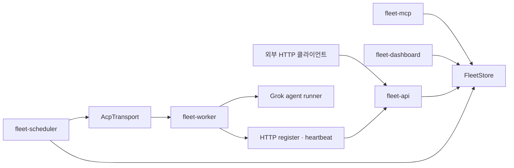

# 현재 구현 참조

이 문서는 현재 Rust 코드의 구조와 제약을 설명하는 Derived 참조다. 설계 결정은
[Architecture](README.md)의 정본 선택표, 외부 호출 표면은 [Contracts](../contracts/README.md), 설치와
운영 절차는 [Deployment](../deployment/README.md)가 소유한다.

## 현재 구성

`fleet-mcp`와 `fleet-dashboard`는 `fleet-api`를 **거치지 않는다** — 둘 다 `fleet-api`에 의존하지
않고 `FleetStore`를 직접 잡는다(`Cargo.toml`의 의존성으로 확인 가능하다). `fleet serve`
(`fleet-cli/src/runtime.rs`의 `run_serve`)는 MCP stdio 서버를 그 프로세스에서 직접 돌리고,
`--http-bind`·`--dashboard-bind`가 주어졌을 때만 `fleet-api`와 `fleet-dashboard`를 같은 프로세스의
태스크로 덧붙인다 — 셋이 항상 함께 뜨는 것은 아니다. 이 구조는 그림의 문제가 아니라
**인가의 문제**다: HTTP 표면 하나를 막아도 나머지 두 표면은 각자 권한을 검사하며,
`#73`의 capability 행렬이 `fleet-api`만 덮고 Dashboard의 산재한 `PermissionKind` 검사가
`#92`로 따로 넘어간 것이 그 결과다.

| 구성요소 | 코드 근거 | 현재 역할과 제약 |
|---|---|---|
| Core | `fleet-core/task.rs`, `worker.rs`, `project.rs`, `agent.rs` | `Task`, `Worker`, heartbeat에 더해 `Project`(`#48`)와 `Agent`(`#49` 1단계) 모델을 제공한다. 두 모델 모두 목표 계약보다 **좁다** — `ProjectStatus`는 3-상태, `AgentStatus`는 `Ready`/`Stopped` 2-상태다. |
| Store | `crates/fleet-store/src/` | memory와 PostgreSQL 구현을 제공한다. Store 이벤트는 곧바로 보안 감사 정책이 아니다. |
| API | `fleet-api/app.rs`, `handlers.rs` | `/v1` task·Worker·등록 표면을 제공한다. 인증과 join 제한은 security/enrollment 정본을 따른다. |
| Scheduler | `fleet-scheduler/dispatcher.rs`, `selector.rs`, `breaker.rs` | ready task를 선택 가능한 Worker로 dispatch한다. Task 실행 CAS는 구현됐다(`tasks.dispatch_control_epoch`, `fleet-store/tests/task_cas.rs`) — 낡은 dispatch 세대의 워커 결과를 거절한다. Agent 명령 발행 CAS도 구현됐다(`agents.command_control_epoch`, `#67` 게이트 ①-B) — `worker_execution_leases` 테이블은 만들지 않는다. 남은 목표 계약은 tool effect 단위의 fencing이며, 그쪽은 effect ledger가 없어 미착수다. |
| Transport | `fleet-transport/acp_transport.rs` | Worker별 ACP WebSocket, 재연결 backoff, 연결 손실 시 pending request 실패 처리를 제공한다. |
| Worker | `fleet-worker/registration.rs`, `runner.rs` | HTTP register/heartbeat와 하나의 Grok runner를 관리한다. Agent command/ACK catalog는 없다. |
| 표면 | `fleet-mcp/`, `fleet-dashboard/` | MCP tool과 웹 대시보드를 제공하며 `FleetStore`를 직접 잡는다. 인가를 각자 구현하므로 `fleet-api`의 capability 행렬이 이 둘을 덮지 않는다. |

## 현재 동작과 설계 경계

Worker 선택은 hint, label, model, 현재 부하를 조합한다. 재시도, OutcomeUnknown, 멱등성,
부작용 차단은 [실행 의미론](tasks/execution-consistency.md)의 목표 계약이므로 현재 dispatcher
동작으로 추정하지 않는다.

`AcpTransport`는 연결 단절에서 대기 요청을 실패시키고 재연결한다. Worker daemon은 HTTP로
등록·heartbeat를 보낸다. mTLS proxy는 설정 시 기동할 수 있지만 Worker identity와 production
fail-closed 인증은 완성된 보안 모델이 아니다.

API는 기본 no-auth로 시작할 수 있다(`AppState::allow_no_auth`의 기본값이 `true`다). bearer와
Cloudflare Access가 함께 설정되면 middleware가 누적 적용된다. join은 bootstrap token으로 승인한
뒤 **Worker-scoped operational credential을 실제로 발급한다** — `join_worker`가 `fwo_` 접두사
토큰을 만들고 `enroll_worker`가 토큰 소비·Worker 생성·credential 저장을 한 단위로 실행하며,
저장소에는 원문이 아니라 digest만 남는다. 원문 token·endpoint secret·worker 설정의 현재
위험은 [Worker enrollment 계약](../contracts/worker-enrollment.md)을 따른다.

현재 Worker는 단일 Grok runner 중심이다. Agent **엔티티**는 `#49` 1단계로 구현됐지만
(`agents` 테이블, MCP·Dashboard 표면, `agent:read`/`agent:manage`) 그 뒤에 실행 프로세스가 없다 —
command ACK, runtime catalog, terminal attach, 장기 메모리는 구현되지 않았다. 즉 Agent 행은
"Project 안에서 이름을 가진 등록물"까지이며 아직 아무것도 실행하지 않는다. 구현된 범위와
유예 목록의 정본은 [프로비저닝](agents/provisioning.md)의 "구현 상태" 절이고, 나머지 목표
계약은 [Agent 실행 플랫폼](agents/README.md)에 둔다.

## 검증 기준

1. 빌드·테스트 게이트는 [`agent.md`](../../agent.md)의 §3.2와 §4.3이 정본이다 — 피처 세트
   두 벌, `DATABASE_URL` 주입, `--test-threads=1`, `fleet-cli` 선행 빌드가 모두 포함된다.
   여기에 축약본을 두지 않는다: 축약본이 정본보다 약하면 그 자체로 재발 원인이 된다.
2. 이 문서가 적는 "현재 사실"에는 코드 경로나 테스트 파일을 함께 적는다. 근거 없는 현재
   서술은 다음 랜딩에서 조용히 거짓이 된다 — 이 문서가 2026-08-29에 정정된 다섯 건이
   전부 그 형태였다.
3. 현재 구현과 목표 계약의 상태 표 대조
4. 외부 표면은 Contracts 문서와 OpenAPI 대조

과거 구현 이력, 제거된 자기치유 제안, 이전 명령 예제는 현재 참조에 보존하지 않는다. 비교 근거는
[Reviews](../reviews/README.md) 또는 Git 이력에 둔다.
