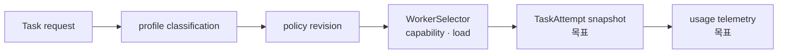

# 지능형 Task Routing과 예산 제어

## 범위

이 문서는 논리적 작업 요구를 Worker 선택으로 연결하는 routing 정책과 토큰 예산 제어의 목표
계약을 다룬다. Worker의 현재 선택 알고리즘은 이 문서의 목표 기능 전체를 구현하지 않았다.
외부 request schema는 [HTTP 계약](../contracts/http-api.md), 실행 재시도는
[실행 의미론](task-execution-consistency.md)이 소유한다.

## 현재 사실과 목표

| 주제 | 현재 구현 | 목표 계약 |
|---|---|---|
| Worker 선택 | `WorkerSelector`가 hint, label, model, load를 필터링하고 least-loaded를 선택 | 논리 profile과 정책 revision을 snapshot으로 고정 |
| 작업 분류 | 휴리스틱 분류와 관련 저장 필드가 일부 존재 | profile별 허용 model·capability·budget을 정책으로 관리 |
| 예산 | UCB1, soft landing, Compact feedback loop는 구현 검증 전 | usage 기반 warning·tool 제한·종료를 명시적 상태 전이로 강제 |
| telemetry | 기본 task/HTTP 관측은 존재 | routing 결과와 비용·품질 feedback은 cardinality 제한과 함께 기록 |

## 결정

1. client가 물리 모델을 강제하지 않는 경우 policy가 logical profile을 model/Worker capability로 해석한다.
2. profile, policy revision, 선택 이유, budget은 TaskAttempt snapshot에 고정한다.
3. budget 초과는 부작용·retry 의미론을 우회하지 않는다. terminal 결과와 OutcomeUnknown 처리는
   실행 의미론 정본을 따른다.
4. telemetry는 요청 원문이나 secret을 label로 만들지 않는다.

## 구현 게이트

1. profile과 policy revision을 포함한 TaskAttempt snapshot migration
2. 선택 이유·override·불일치 capability의 감사 시험
3. warning, tool 제한, terminal 처리의 예산 상태 전이 시험
4. telemetry label cardinality와 민감 정보 비노출 시험
