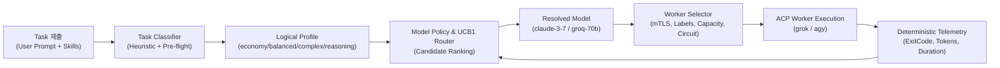

# 지능형 태스크 라우팅, 실시간 예산 통제 및 텔레메트리 아키텍처 설계서
**작성일**: 2026-08-16  
**상태**: 🟢 정본 (Canonical)  
**대상**: Fleet Orchestrator 아키텍처팀, 스케줄러팀 및 협업 에이전트

---

## 1. 배경 및 설계 목표

Grok Fleet Orchestrator의 기존 라우팅 방식은 `task.model`과 워커의 `labels["model"]`을 단순 문자열로 1:1 매칭하는 정적 필터 구조였습니다.  
이 구조는 단순하고 예측 가능하지만 다음과 같은 한계가 있었습니다:

1. **물리 모델명 노출 및 경직성**: `claude-3-7-sonnet`, `gemini-2.5-flash` 등 물리 모델명이 API와 클라이언트에 직접 노출되어 신규 모델 등장 시 전체 시스템 수정 필요.
2. **토큰 예산 통제 부재**: 에이전트가 무한 루프나 탐색적 과도 툴 호출에 빠질 경우 토큰 폭증을 방지하지 못함. 반면 단순 Hard Cut-off는 90% 완료된 작업을 파기하여 지연과 재시도 비용을 2배로 증가시키는 딜레마 유발.
3. **컨텍스트 인플레이션**: 장기 세션 진행 시 이전 턴의 대용량 툴 출력이 매 턴마다 반복 전송되어 토큰 소비가 지수적으로 증가.

본 설계서는 **FreeRouter의 분류·정책 개념을 Rust 네이티브로 흡수**하고, **3단계 소프트 랜딩 예산 제어**, **컨텍스트 Compact 엔진**, **무비용 결정론적 텔레메트리**, **MAB UCB1 탐색 공평성**, **멀티 CLI(grok, agy) 하이브리드 매핑**을 결합한 통합 아키텍처를 정의합니다.

---

## 2. 2단계 지능형 라우팅 아키텍처 (TaskRouter)

전체 라우팅을 **1단계 논리적 요구 능력 분류**와 **2단계 물리 모델 및 워커 매핑**으로 분리합니다.



### 2.1 논리적 프로파일 (Logical Profiles)
* `economy`: 단순 파일 조회, 포맷팅, 작은 오탈자 수정 (초저비용/무료 모델 우선)
* `balanced`: 일반적인 버그 수정, 단위 테스트 추가, 단일 컴포넌트 구현
* `complex`: 다중 파일 리팩토링, 아키텍처 분석, 복잡한 디버깅
* `reasoning`: 보안 감사, 동시성/데드락 해결, DB 마이그레이션

### 2.2 사용자 Override 지원
* CLI/API/MCP에서 명시적 지정 가능: `--profile reasoning` 또는 프롬프트 접두사 `/max`, `/simple`.

---

## 3. 3단계 소프트 랜딩(Soft-Landing) 토큰 예산 제어

오케스트레이터의 Rust 카운터가 매 턴 응답의 `usage` 메타데이터를 **$O(1)$ 무비용 정수 누적**하여 실시간 감시합니다.

```
[태스크 실행: 예산 50,000 토큰]
      │
      ▼
 ┌───▶ [Turn N LLM 응답 수신] ──▶ { usage: { input, output } }
 │           │
 │           ▼
 │     [고정 알고리즘 즉시 누적 (비용 $0, 0ms)]
 │       누적 토큰 = 41,800 tokens (83.6%)
 │           │
 │           ▼
 │     [3단계 임계치 분기 판정]
 │       ├─ < 80%   : [정상 진행] ➔ 워커가 도구(Tool) 실행
 │       ├─ 80%~100%: [Phase 1: 경보 & Compact] ➔ 프롬프트에 마무리 유도 주입 + 히스토리 압축
 │       ├─ 100%~120%: [Phase 2: Grace Wrap-up] ➔ 추가 도구 차단 + 현재 결과/diff 요약 강제
 │       └─ > 120%  : [Phase 3: Hard Stop] ➔ ACP 세션 즉시 취소 & 워크스페이스 중간 diff 보존
 │           │
 └───────────┘
```

1. **Phase 1 (80% Warning & Compact)**:
   - 시스템 프롬프트에 `[SYSTEM: Budget at 80%. Prepare conclusion and avoid exploratory tools]` 자동 주입.
   - 백그라운드 L1/L2 Compact 자동 발동.
2. **Phase 2 (100% Grace Wrap-up Turn)**:
   - 추가 도구 실행 거부. 에이전트에게 1턴의 마무리 기회를 부여하여 현재까지 완성된 작업 요약 및 diff 제출 강제.
3. **Phase 3 (120% Hard Abort & Partial Save)**:
   - 프로세스 강제 종료. 단, 워크스페이스의 중간 `git diff`를 `TaskResult.partial_output`에 영속화하여 후속 태스크가 이어받을 수 있도록 보존.

---

## 4. 컨텍스트 압축 (Compact Engine)

장기 실행 세션의 토큰 낭비를 차단하기 위해 3계층 압축 파이프라인을 운영합니다.

```
[턴 1] ─── [턴 2] ─── [턴 3] ─── [턴 4] ─── ... ─── [턴 15]
  │          │          │          │                    │
  ▼          ▼          ▼          ▼                    ▼
[L1: Tool Truncation]  [L2: Middle-Turn Summarization]  [L3: State Snapshot]
(도구 출력 > 2KB 시    (직전 2턴을 제외한 과거 대화를      (모든 히스토리를 버리고
 Head/Tail 20줄만 보존)  구조화된 요약 1개로 압축 치환)     git diff와 할일만 보존)
```

* **경량 모델 보조 배치**: L2 대화 요약 압축에는 초저비용/무료 모델(Groq Llama-3.1-8B, Gemini Flash)을 1회성 보조 작업자로 투입하여 비용을 최소화(본체 작업 모델 대비 1/50 비용).

---

## 5. 무비용 결정론적 텔레메트리 & MAB (UCB1) 공평성 탐색

### 5.1 토큰 비용 $0의 결정론적 텔레메트리
별도의 무거운 평가 LLM(LLM-as-a-Judge)을 실시간 호출하지 않고, 실행 결과 메타데이터로 1차 품질을 100% 판정합니다:
* `exit_code == 0` (컴파일 및 테스트 성공 여부)
* `tool_error_count` (JSON 스키마 오류나 도구 실패 횟수)
* `duration_secs`, `total_tokens`, `estimated_cost_usd`
* `has_user_retry` (사용자의 후속 수정/취소 여부)

### 5.2 MAB UCB1 & 베이지안 평균 (Cold Start 및 편중 방지)
신규 모델/프롬프트 조합이 "데이터가 없다"는 이유로 영원히 배제되는 기아(Starvation) 현상을 방지합니다.

$$\text{Selection Score} = \text{베이지안 성공률} + c \times \sqrt{\frac{\ln(\text{전체 태스크 수 } N)}{\text{해당 조합 호출 수 } n_i}}$$

* **불확실성 보너스 (UCB1)**: 호출 수($n_i$)가 적은 신규 조합은 보너스 점수가 높아져 초반에 공평한 호출 기회를 보장받음.
* **낙관적 초기값 (0.90)**: 미검증 모델도 높은 초기 점수로 시작하여 실측 결과에 따라 자연스럽게 순위 수렴.
* **웜업 쿼터 (30회)**: 신규 등록 조합은 30회 표본이 쌓일 때까지 저위험 태스크 우선 배정.

---

## 6. 5대 엔티티 하이브리드 매핑 & 멀티 CLI 병행

```
┌─────────────────────────────────────────────────────────────┐
│ 1. 정적 계층 (Static Layer) — [Host ↔ CLI Runtime]          │
│    - Host(arm1, arm2)에 fleet-worker(grok, agy) 상시 대기   │
│    - 준비 시간 0초 (Zero Cold-Start)                        │
├─────────────────────────────────────────────────────────────┤
│ 2. 동적 계층 (Dynamic Layer) — [Model + Custom Prompt]       │
│    - TaskRouter가 태스크 복잡도에 따라 Model을 동적 배정   │
│    - 태스크 요구사항에 따라 Skill/헌법(Prompt)을 동적 주입    │
└─────────────────────────────────────────────────────────────┘
```

* **멀티 CLI 유연성 (`AgentRunner`)**:
  - `NetworkBindRunner` (`grok agent serve` — WebSocket 기반)
  - `StdioBridgeRunner` (`agy` / `gemini` — Stdio 브릿지 기반)
  - 섣불리 단일 CLI로 통일하지 않고, 태스크별로 자유롭게 돌아가며 사용하며 텔레메트리 DB를 통해 최적 궁합을 데이터로 도출.

---

## 7. 데이터 모델 및 DB 마이그레이션 (`018_task_routing_telemetry.sql`)

```sql
-- 1. tasks 테이블 확장
ALTER TABLE tasks
    ADD COLUMN requested_profile TEXT,
    ADD COLUMN resolved_model TEXT,
    ADD COLUMN token_budget BIGINT,
    ADD COLUMN partial_output TEXT;

-- 2. task_telemetry 테이블 신설
CREATE TABLE task_telemetry (
    id UUID PRIMARY KEY DEFAULT gen_random_uuid(),
    task_id UUID NOT NULL REFERENCES tasks(id) ON DELETE CASCADE,
    routing_profile TEXT NOT NULL,
    resolved_model TEXT NOT NULL,
    runtime_vendor TEXT NOT NULL, -- 'grok' | 'agy' | 'gemini'
    
    -- 결정론적 지표
    exit_code INT,
    tool_error_count INT DEFAULT 0,
    duration_secs DOUBLE PRECISION NOT NULL,
    input_tokens BIGINT DEFAULT 0,
    output_tokens BIGINT DEFAULT 0,
    total_tokens BIGINT DEFAULT 0,
    estimated_cost_usd NUMERIC(10, 6) DEFAULT 0,
    
    -- 압축 및 제어 통계
    compact_count INT DEFAULT 0,
    tokens_saved_by_compact BIGINT DEFAULT 0,
    budget_exhausted_pct NUMERIC(5, 2),
    is_grace_wrapped BOOLEAN DEFAULT FALSE,
    has_user_retry BOOLEAN DEFAULT FALSE,
    
    created_at TIMESTAMPTZ NOT NULL DEFAULT now()
);

CREATE INDEX idx_task_telemetry_profile_model ON task_telemetry(routing_profile, resolved_model);
```

---

## 8. 단계별 구현 및 검증 로드맵

| 단계 | 주요 작업 내용 | 담당 크레이트 / 파일 |
|---|---|---|
| **Phase 1** | 데이터 모델 확장 및 DB 마이그레이션 | `fleet-core/task.rs`, `fleet-store/migrations/018_...` |
| **Phase 2** | `TaskRouter` 트레잇 및 FreeRouter 휴리스틱 분류기 구현 | `fleet-scheduler/src/router.rs` |
| **Phase 3** | 3단계 소프트 예산 감시 카운터 및 Grace Wrap-up 로직 통합 | `fleet-transport/src/acp_transport.rs` |
| **Phase 4** | L1/L2 컨텍스트 Compact 엔진 구현 | `fleet-worker/src/compact.rs` or `fleet-transport` |
| **Phase 5** | CLI 플래그 연동 (`--profile`, `--budget`) 및 E2E 검증 | `fleet-cli`, `fleet-dashboard` |

---

## 9. 결론

본 아키텍처는 FreeRouter의 실용적인 비용 절감과 분류 아이디어를 Fleet의 Rust 단일 바이너리와 ACP 장기 세션 구조에 최적화하여 흡수합니다.  
고정 알고리즘 기반의 소프트 예산 집행과 무비용 결정론적 텔레메트리를 통해, **오케스트레이터의 리소스 오버헤드와 평가 토큰 비용을 0으로 유지하면서도 모델 변화에 유연하게 자율 진화하는 엔터프라이즈급 AI 오케스트레이션**을 보장합니다.
