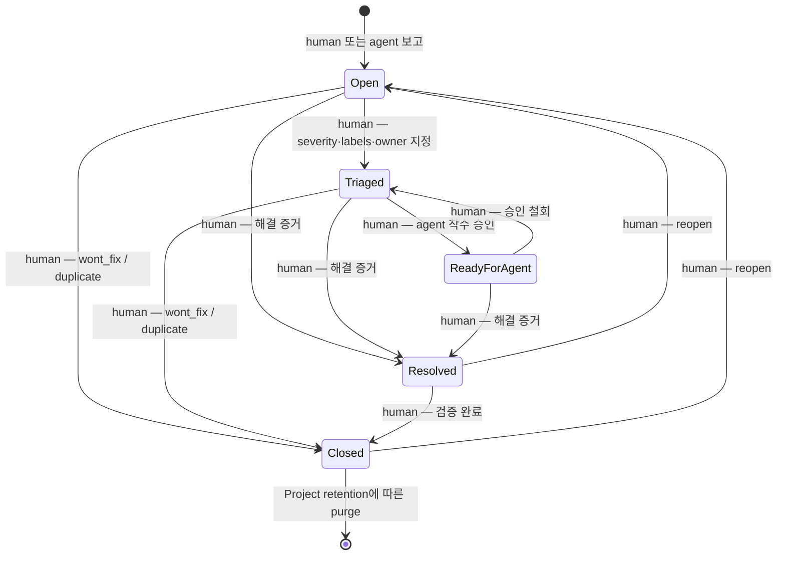
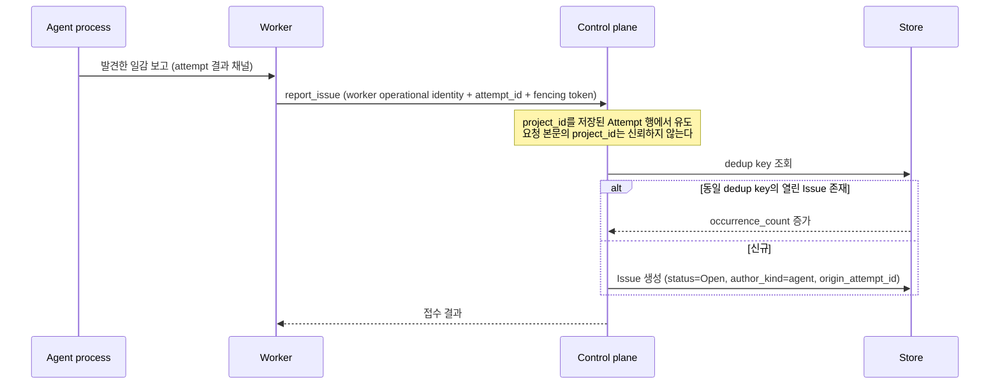

# Issue 추적 계약

## 범위

이 문서는 **프로젝트가 해결해야 할 일감을 관리하는 이슈 트래커**를 정의한다. orchestrator의
인프라 장애 추적이 아니다 — 워커 도달 불가, credential 미프로비저닝 같은 운영 사건은 alert이며
[관측성·재조정](observability-and-reconciliation.md)이 소유한다.

## 구현 상태 (2026-08-24)

**`#88` 완료 — 엔티티·상태 머신·연관까지.** `crates/fleet-core/src/issue.rs`(`Issue`,
`IssueStatus`, `CloseReason`, `IssueSeverity`, `IssueComment`, `IssueTaskLink`), migration
`023_issues.sql`(`issues`/`issue_comments`/`issue_task_links` — **`tasks`에 `issue_id` 컬럼은
추가하지 않았다**), `Store`의 Issue 메서드 10종(PgStore+MemStore), capability 9종.

아직인 것과 그 이유:

| 범위 | 로드맵 | 왜 아직인가 |
|---|---|---|
| Agent가 여는 Issue (dedup key, `occurrence_count`, `origin_attempt_id`, `author_kind`) | `#89` | Worker control stream 보고 경로와 Attempt 행이 필요하다(`#67` 선행). 지금 컬럼만 만들면 항상 `NULL`인 죽은 컬럼이 된다 |
| Agent backlog claim (claim lease, Project 예산, 계보 깊이 상한) | `#93` | Agent 자체가 없다 |
| ~~Issue의 MCP 표면~~ | `#92` | **완료 (2026-08-24)** — `fleet_list_issues`/`fleet_create_issue`/`fleet_transition_issue`/`fleet_comment_issue`. 전이별 요구 capability는 Dashboard와 같은 `fleet_core::required_capability_for_transition`을 쓴다 |
| AgentTemplate 표면 | `#86`, `#92` | AgentTemplate 엔티티 자체가 없다 |
| `issue:archive_hold_manage` capability | `#91` | 토글 대상인 `project_archive_holds` 테이블이 없다 |

구현 게이트 중 이번에 확인된 것은 2(교착 없음 3종 중 저장소 계층 2종), 3(`InProgress` 부재 —
enum·`ALL`·DB CHECK 세 겹), 10(MemStore/PgStore 공유 행동)이다. 나머지 게이트는 위 표의 후속
항목에 속한다.

### Dashboard HTTP 표면 (`#92`, 2026-08-24)

`GET/POST /api/issues`, `GET/PATCH /api/issues/{id}`, `POST /api/issues/{id}/transition`,
`GET/POST /api/issues/{id}/comments`, `GET/POST /api/issues/{id}/links`,
`DELETE /api/issues/{id}/links/{task_id}`.

**상태 전이가 `PATCH`와 분리된 endpoint인 이유**: 목표 상태마다 요구 capability가 다르다.
`fleet_dashboard::required_capability_for_transition`이 그 매핑의 단일 구현이며(MCP 표면이
생기면 재사용한다), 아래 두 결정이 계약 해석의 핵심이다.

- **승인 철회(`ReadyForAgent → Triaged`)는 `issue:approve_agent_work`를 요구하지 않는다.**
  이 문서가 그 capability를 `Triaged → ReadyForAgent` 한 방향으로만 정의했고, 권한을 회수하는
  쪽이 부여하는 쪽보다 어려우면 잘못된 승인을 되돌리기가 더 힘들어진다 — 안전한 방향으로
  실패해야 한다.
- **`→ Resolved`도 `issue:close`다.** `Resolved`는 텍스트 편집이 아니라 "이 문제가 처리됐다"는
  판정이며, close를 update에서 분리한 이유("오탈자 수정 권한이 문제 종결 권한을 함께 주면 안
  된다")가 그대로 적용된다.

`assignee` 변경만 `issue:assign`을 **추가로** 요구한다. `has_active_tasks`는 저장하지 않고 조회
시점에 계산해 응답에 싣는다(파생 배지). `Draining` Project의 Issue 쓰기는 허용한다 — 이 문서의
"`Draining` 중에도 Issue 쓰기는 허용하고 claim과 Issue→Task 생성만 막는다"를 따른다.

### MCP 표면 (`#92`, 2026-08-24)

`fleet_list_issues`, `fleet_create_issue`, `fleet_transition_issue`, `fleet_comment_issue`.
Dashboard와 **같은 규칙**을 쓴다 — 상태 기계는 `fleet_core::Issue::transition_to`, 전이별 요구
capability는 `fleet_core::required_capability_for_transition`이다. 규칙을 `fleet-core`에 둔 이유는
`IssueStatus`와 `PermissionKind` 둘 다 거기 있고 Store 조회가 필요 없는 순수 함수여서, 두 표면이
같은 구현을 참조하면 활성화 게이트의 "두 표면 동일 동작"이 구조적으로 보장되기 때문이다.

**인자 의존 인가**: `fleet_transition_issue`는 요구 capability가 목표 상태에 따라 달라, MCP
서버의 `required_permission` 도구-이름 행렬로는 판정할 수 없다. 두 단계로 나눴다 —
`permits_tool`은 "전이 권한을 하나라도 가졌는가"로 **도구 노출만** 결정하고(하나도 없으면 도구
자체가 `tools/list`에 나오지 않는다), **정확한 판정은 핸들러**가 `ToolContext.capabilities`로
한다. 그래서 `issue:update`만 가진 launcher는 triage는 할 수 있지만 agent 승인·종결은 거절되며,
거절 메시지가 어떤 capability가 없는지 명시한다.

`ToolContext.capabilities`의 기본값은 **빈 집합**이다(fail-closed) — 명시적으로 부여하지 않으면
인자 의존 도구는 전부 거절된다.

## 결정

**Issue는 지속되는 문제 진술이고, Task는 한 번의 실행이다.** 둘은 부모-자식이 아니라 **연관**이다.

Task는 이미 "검증 가능한 완료 조건을 가진 한 번의 작업"이며 반드시 터미널 상태가 된다
([Lifecycle](project-task-agent-lifecycle.md)). Issue를 Task의 상위 개념으로 두면 두 상태 머신이
경쟁한다. 따라서 `tasks`에 `issue_id` 컬럼을 **추가하지 않는다** — 넣는 순간 Task 상태 머신이
Issue를 읽어야 하는 압력이 생긴다. 연관은 join 테이블(`issue_task_links`)이 소유한다.

**Task 성공이 Issue를 닫지 않는다.** 한 Issue가 여러 Task를 낳을 수 있고, Task가 성공해도 문제가
남아 있을 수 있다. 닫는 것은 사람의 판정이다.

## 상태 모델

`Closed`는 `close_reason ∈ {fixed, wont_fix, duplicate, obsolete}`를 필수로 가진다.

**`InProgress` 상태를 두지 않는다.** 비터미널 연관 Task가 있으면 "진행 중"은 유도 가능한 사실이다.
상태로 승격하면 Task 상태를 복제하게 되고, 그것이 두 상태 머신 경쟁의 시작점이다. UI는 파생
배지로 표시하고 저장하지 않는다.

## 교착 없음 불변식

Task/Attempt 상태 머신은 **한 글자도 바뀌지 않는다.** 다음 두 불변식이 이를 강제한다.

- **I1**: 어떤 Task/Attempt 전이 조건도 `issue.status`를 읽지 않는다.
- **I2**: Issue의 close에는 Task 상태에 대한 선행 조건이 없다.

두 방향의 간선 집합이 모두 비어 있으므로 순환이 없다. "P0 Issue가 열려 있으면 dispatch를 막는다"
같은 규칙은 채택하지 않는다 — 그런 요구는 `Project → Draining`으로 표현한다.

## Agent 착수 (backlog claim)

Agent는 Issue를 **읽고 착수한다.** 이것이 이 기능의 핵심이며, 동시에 가장 큰 위험이다 — 자동
착수는 곧 자동 작업 생성이고, 통제 없이는 무한 생성·소비 루프와 무한 비용이 된다.

### 승인은 상태가 소유한다

**`ReadyForAgent` 상태 자체가 인가다.** Agent는 그 상태의 Issue만 claim할 수 있고, 전이는 사람만
할 수 있다(`issue:approve_agent_work` capability). 이 설계를 택한 이유:

- "누가 이 일을 승인했는가"가 Issue 이력에 명시적으로 남는다. Agent가 스스로 만든 Issue를 스스로
  착수하려면 사람의 승인 전이를 반드시 거친다.
- [Project 기능 설계](project-feature-design.md)가 "자동 provisioning이 `AgentCreate` 우회 경로가
  아님을 증명하기 전에는 구현하지 않는다"고 건 차단 조건과 같은 종류의 위험이므로, 같은 방식으로
  **명시적 승인 지점**을 둔다.
- Project 정책으로 특정 label을 자동 승인하고 싶다면 그것은 정책 revision 변경이며
  `project:policy_manage` 권한 아래 놓인다 — Agent가 얻을 수 없다.

### claim은 CAS다

동시에 두 Agent가 같은 Issue를 집는 것을 막아야 한다. claim은 `(issue_id, status=ReadyForAgent,
claim_generation)`을 조건으로 하는 compare-and-swap이며, 성공하면 만료 시각을 가진 **claim
lease**를 얻는다. lease가 만료되면 Issue는 `ReadyForAgent`로 돌아간다 —
[실행 일관성](tasks/execution-consistency.md)의 lease 관례를 그대로 쓰고 새 기구를 만들지 않는다.

claim은 Issue 상태를 바꾸지 않는다. `ReadyForAgent`에 claim lease가 붙어 있을 뿐이며, UI는 이를
파생 표시한다. 상태를 하나 더 만들면 `InProgress`를 금지한 이유와 같은 문제가 생긴다.

### 예산

Project는 **agent 자동 착수 예산**을 정책으로 갖는다(동시 claim 수, 시간당 claim 수). 예산이
없으면 무한 생성-소비 루프가 성립한다. 예산 소진은 실패가 아니라 대기이며, 소진 상태가 지속되면
alert 대상이다.

### 루프 차단

Agent가 연 Issue를 Agent가 착수해 또 Issue를 여는 순환을 다음이 막는다.

1. `ReadyForAgent` 전이는 사람만 한다 — 순환에 반드시 사람이 들어간다.
2. Issue에는 `origin_issue_id` 계보가 기록되고, 계보 깊이 상한을 넘으면 새 Issue 생성이 거절된다.
3. 아래 dedup·budget 기구가 Agent 보고에도 그대로 적용된다.

## Agent가 여는 Issue

Agent process는 control plane principal이 아니다
([Authorization 계약](../security/authorization-and-audit.md)의 Principal 표: AgentProcess는 `/v1`,
MCP, Dashboard의 일반 호출이 금지된다). 따라서 Agent가 API를 직접 호출하지 않는다.

Agent가 여는 Issue는 항상 `Open`으로 시작한다. **Agent는 `[*] → Open`과 append만 할 수 있다.**
Issue를 닫거나 `ReadyForAgent`로 올릴 수 있는 Agent는 자기 일을 스스로 승인하게 된다.

### 폭주 방지

1. **부분 유니크 인덱스** `(project_id, dedup_key) WHERE status NOT IN ('closed')` — 같은 발견을
   N회 보고해도 Issue 1건 + `occurrence_count`가 된다. 주 방어선이다.
2. Attempt당 신규 Issue 상한. 초과는 Attempt를 실패시키지 않고 refusal을 1회만 기록한다.
3. Project당 토큰 버킷. 소진 시 alert. **dedup 적중은 토큰을 소모하지 않는다.**
4. `origin_issue_id` 계보 깊이 상한.
5. 감사 기록에 실패하면 Issue 생성을 거절한다(`#66`의 export fail-closed 패턴).

metric label에 task/agent/worker UUID와 prompt를 노출하지 않는다.

## Project archive와의 관계

**열린 Issue는 archive를 막지 않는다.** 막게 하면 Agent가 생성한 Issue 하나로 Project archive를
무기한 교착시킬 수 있고, `issue:*`가 사실상 `project:archive` 거부권이 된다.

archive를 막는 것은 [`project_archive_holds`](project-feature-design.md)뿐이다. Issue를 hold로
승격하려면 `issue:update`가 아니라 **Project hold capability**가 필요하다.

`Draining` 중에도 Issue 쓰기는 허용하고, **claim과 Issue→Task 생성만 막는다.** archive 후 Issue는
read-only로 봉인되며, Project reopen이 Issue를 자동 reopen하지 않는다.

## Capability

| serde 이름 | 의미 |
|---|---|
| `issue:read` | Project 범위 조회 |
| `issue:create` | 사람이 여는 Issue |
| `issue:comment` | 코멘트 append |
| `issue:update` | title·body·labels·severity |
| `issue:assign` | assignee 변경 |
| `issue:approve_agent_work` | `Triaged → ReadyForAgent` 전이 — **Agent 자동 착수의 인가 지점** |
| `issue:close` | 종결 |
| `issue:reopen` | 재개 |
| `issue:link` | Task 연관 추가·해제 |
| `issue:archive_hold_manage` | `blocks_archive` 토글 |

`close`를 `update`에서 분리한다 — 오탈자 수정 권한이 문제 종결 권한을 함께 주면 안 된다.
`approve_agent_work`는 자동 작업 생성의 유일한 관문이므로 반드시 별도 capability다.
Agent와 Worker에게는 위 어느 것도 부여하지 않는다.

## FK 정책

`issue_comments`와 occurrence 기록만 `CASCADE`를 쓴다 — 폭발 반경이 정확히 한 스레드이고 mutation
사실 자체는 audit에 독립적으로 남는다. `issue_task_links.task_id`는 `SET NULL`과 `task_label`
보존을 함께 쓴다(기존 `011` 패턴). 그 외에는 `CASCADE`를 쓰지 않는다(`#78`의 교훈).

## 구현 게이트

1. 전이 권한 강제 — agent principal은 `[*] → Open`과 append만
2. 교착 없음 3종: 열린 Issue가 있어도 Task가 터미널까지 도달, 비터미널 Task가 있어도 Issue close
   성공, Attempt 전이 코드 경로가 issue 테이블을 참조하지 않음을 강제하는 구조 시험
3. `InProgress` 상태 부재
4. `project_id`를 요청 본문이 아니라 저장된 Attempt 행에서 유도(본문 위조가 무시되는 시험)
5. 동일 dedup key N회 보고가 Issue 1건 + `occurrence_count=N`
6. **`ReadyForAgent`가 아닌 Issue는 claim되지 않음**, 사람의 승인 전이 없이 Agent가 자기 Issue를
   착수할 수 없음
7. **claim CAS 경쟁에서 정확히 한 Agent만 성공**, lease 만료 시 `ReadyForAgent`로 복귀
8. Project claim 예산 소진이 실패가 아니라 대기이고, 계보 깊이 상한이 순환을 끊음
9. 열린 Issue만으로는 archive가 막히지 않고, `Draining` 중 claim이 거절됨
10. MemStore/PgStore 공유 행동 테스트

## 미결

**`docs/roadmap/roadmap.md`와의 소유권 관계**는 [비교 설계](../reviews/roadmap-vs-issue-tracker-2026-08-23.md)에서
다뤘다. 권고는 단계적 Model C — 트래커가 상태를 소유하고 roadmap.md를 생성물로 전환하되, 1단계는
분리 운영이다. **이 문서가 다루는 `#88`·`#93` 범위에서 트래커는 roadmap을 대체하지 않는다.**
실무 단위(버그, 개선, Agent가 발견한 선행 작업)만 다루며, 영구 ID 원장 이관은 트래커 스키마가
실사용으로 안정된 뒤 별도로 판단한다.

## 관련 문서

- [Lifecycle](project-task-agent-lifecycle.md) — Project/Task/Agent 터미널 규칙과 archive hold
- [실행 일관성](tasks/execution-consistency.md) — Attempt 상태와 lease 관례
- [Project 기능 설계](project-feature-design.md) — 정책 revision과 자동화 차단 조건
- [Authorization·Project Scope·감사](../security/authorization-and-audit.md) — principal과 capability
