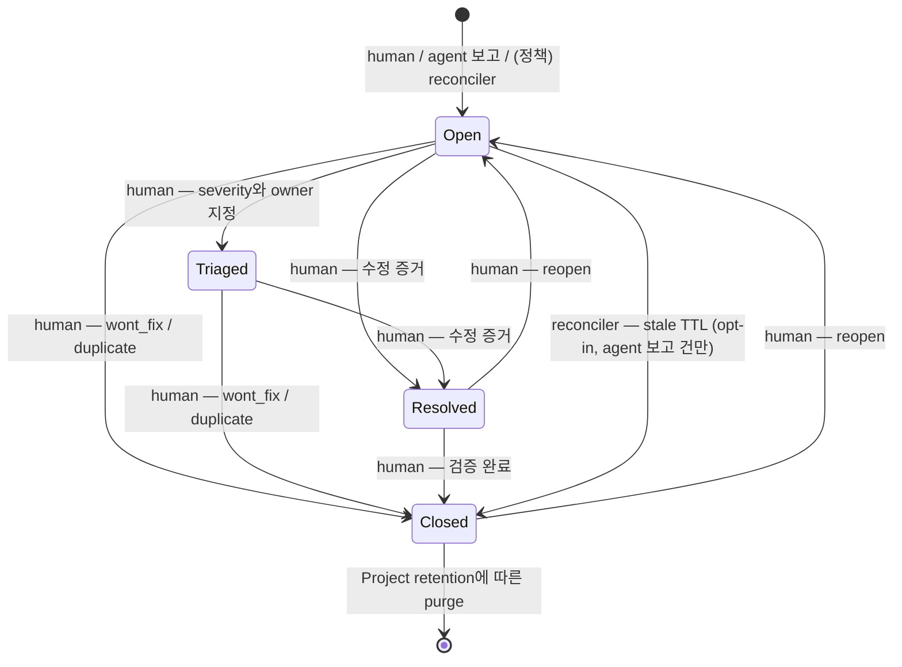
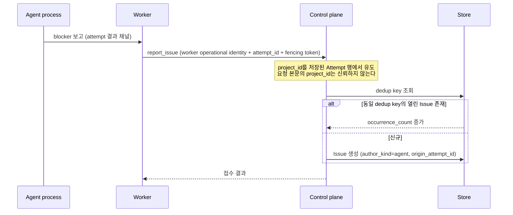

# Issue 추적 계약

## 결정

**Issue는 지속되는 문제 진술이고, Task는 한 번의 실행이다.** 둘은 부모-자식이 아니라 **연관**이다.

Task는 이미 "검증 가능한 완료 조건을 가진 한 번의 작업"이며 반드시 터미널 상태가 된다
([Lifecycle](project-task-agent-lifecycle.md)). Issue를 Task의 상위 개념으로 두면 두 상태 머신이
경쟁한다. 따라서 `tasks`에 `issue_id` 컬럼을 **추가하지 않는다** — 넣는 순간 Task 상태 머신이
Issue를 읽어야 하는 압력이 생긴다. 연관은 join 테이블(`issue_task_links`)이 소유한다.

**Task 성공이 Issue를 닫지 않는다.** Agent가 blocker를 우회해 Attempt가 `Succeeded`가 되어도
blocker는 그대로 존재한다. 그 경우를 잡는 것이 이 기능의 실질 가치다.

## 상태 모델

`Closed`는 `close_reason ∈ {fixed, wont_fix, duplicate, stale, obsolete}`를 필수로 가진다.

**`InProgress` 상태를 두지 않는다.** 비터미널 연관 Task가 있으면 "진행 중"은 유도 가능한 사실이다.
상태로 승격하면 Task 상태를 복제하게 되고, 그것이 두 상태 머신 경쟁의 시작점이다. UI는 파생
배지로 표시하고 저장하지 않는다.

## 교착 없음 불변식

Task/Attempt 상태 머신은 **한 글자도 바뀌지 않는다.** 다음 두 불변식이 이를 강제한다.

- **I1**: 어떤 Task/Attempt 전이 조건도 `issue.status`를 읽지 않는다.
- **I2**: Issue의 close에는 Task 상태에 대한 선행 조건이 없다.

두 방향의 간선 집합이 모두 비어 있으므로 순환이 없다. "P0 Issue가 열려 있으면 dispatch를 막는다"
같은 규칙은 **채택하지 않는다** — 그런 요구는 `Project → Draining`으로 표현한다.

## Agent가 여는 Issue

Agent process는 control plane principal이 아니다
([Authorization 계약](../security/authorization-and-audit.md)의 Principal 표: AgentProcess는 `/v1`,
MCP, Dashboard의 일반 호출이 금지된다). 따라서 Agent가 API를 직접 호출하지 않는다.

**Agent는 `[*] → Open`과 append만 할 수 있다.** Issue를 닫을 수 있는 Agent는 자기 실패를 은폐할
수 있고, 이 기능의 존재 이유가 "Agent가 조용히 실패하지 못하게 한다"이므로 그 권한을 주지 않는다.
Agent가 "이제 재현되지 않는다"를 알리려면 코멘트로 append한다.

### 폭주 방지

Agent 루프가 Issue를 무한 생성하는 것을 막는 기구는 다섯 층이다.

1. **부분 유니크 인덱스** `(project_id, dedup_key) WHERE status IN ('open','triaged')` — 같은
   blocker 10,000회 보고가 Issue 1건 + `occurrence_count`가 된다. 이것이 주 방어선이다.
2. Attempt당 신규 Issue 상한 (기본 3). 초과는 Attempt를 실패시키지 않고 refusal을 1회만 기록한다.
3. Project당 토큰 버킷 (기본 20/시간). 소진 시 `AgentIssueFloodSuspected` alert. **dedup 적중은
   토큰을 소모하지 않는다.**
4. 같은 dedup key가 연속 5회면 조기 dead-letter로 수렴한다.
5. 감사 기록에 실패하면 Issue 생성을 거절한다(`#66`의 export fail-closed 패턴).

metric label에 task/agent/worker UUID와 prompt를 노출하지 않는다.

## dead-letter → Issue

**원인별 집계로 자동 생성한다** — Task당 1건이 아니다. 이것이 "노이즈 대 유실"의 딜레마를 해소한다.

| `FailureKind` | 기본 |
|---|---|
| `CredentialMissing`, 인증 실패 | 즉시 ON (model당 1건으로 집계) |
| `WorkerUnavailable`, circuit open | 15분 hysteresis 후 ON |
| 일반 `WorkerError`, timeout | OFF |
| `Cancelled` | 어떤 정책에서도 생성하지 않음 |

자동 생성은 Task 상태를 바꾸지 않는다. reconciler 재시작 후 재sweep이 중복 생성하지 않는다(멱등).

## Project archive와의 관계

**열린 Issue는 archive를 막지 않는다.** 막게 하면 Agent가 생성한 Issue 하나로 Project archive를
무기한 교착시킬 수 있고, `issue:*`가 사실상 `project:archive` 거부권이 된다.

archive를 막는 것은 [`project_archive_holds`](project-feature-design.md)뿐이다. Issue를 hold로
승격하려면 `issue:update`가 아니라 **Project hold capability**가 필요하다. security/legal 라벨
Issue의 자동 승격은 기본 ON이며 Project가 override할 수 있다.

`Draining` 중에도 Issue 쓰기는 허용하고, Issue에서 새 Task를 만드는 것만 막는다. archive 후
Issue는 read-only로 봉인되며, Project reopen이 Issue를 자동 reopen하지 않는다.

## Capability

| serde 이름 | 의미 |
|---|---|
| `issue:read` | Project 범위 조회 |
| `issue:create` | 사람이 여는 Issue |
| `issue:comment` | 코멘트 append |
| `issue:update` | title·body·labels·severity |
| `issue:assign` | assignee 변경 |
| `issue:close` | 종결 |
| `issue:reopen` | 재개 |
| `issue:link` | Task 연관 추가·해제 |
| `issue:archive_hold_manage` | `blocks_archive` 토글 |

`close`를 `update`에서 분리한다 — 오탈자 수정 권한이 문제 종결 권한을 함께 주면 안 된다.
`blocks_archive` 토글은 Project lifecycle을 막는 힘이므로 별도 capability다.
Agent와 Worker에게는 위 어느 것도 부여하지 않는다.

## FK 정책

`issue_comments`와 occurrence 기록만 `CASCADE`를 쓴다 — 폭발 반경이 정확히 한 스레드이고 mutation
사실 자체는 audit에 독립적으로 남는다. `issue_task_links.task_id`는 `SET NULL`과 `task_label`
보존을 함께 쓴다(기존 `011` 패턴). 그 외에는 `CASCADE`를 쓰지 않는다.

## 구현 게이트

1. 전이 권한 강제 — agent principal은 `[*] → Open`과 append만
2. 교착 없음 3종: 열린 Issue가 있어도 Task가 dead-letter까지 도달, 비터미널 Task가 있어도 Issue
   close 성공, Attempt 전이 코드 경로가 issue 테이블을 참조하지 않음을 강제하는 구조 시험
3. `InProgress` 상태 부재
4. `project_id`를 요청 본문이 아니라 저장된 Attempt 행에서 유도(본문 위조가 무시되는 시험)
5. 동일 blocker N회 보고가 Issue 1건 + `occurrence_count=N`
6. Project 버킷 소진 시 alert이고 dedup 적중은 토큰 미소모
7. 열린 Issue만으로는 archive가 막히지 않고, `kind='issue'` hold만 `ArchiveBlocked`를 만듦
8. MemStore/PgStore 공유 행동 테스트

## 관련 문서

- [Lifecycle](project-task-agent-lifecycle.md) — Project/Task/Agent 터미널 규칙과 archive hold
- [실행 일관성](tasks/execution-consistency.md) — Attempt 상태와 dead-letter
- [관측성·재조정·장애 복구](observability-and-reconciliation.md) — reconciler 권한 경계
- [Authorization·Project Scope·감사](../security/authorization-and-audit.md) — principal과 capability
