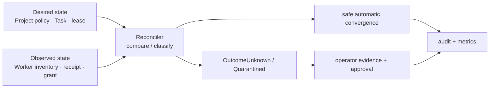

# 관측성·재조정·장애 복구 계약

## 목적

Fleet는 단순 health check가 아니라 **원하는 상태와 관측된 상태의 차이**를 운영자가 판별하고
안전하게 수렴시켜야 한다. 이 문서는 metric·audit 상관관계, reconciliation의 자동 범위, 운영자
개입 경계를 소유한다. Active/Cold Standby 권한은 [Control Plane 권한과 장애 전환](control-plane-authority-and-failover.md),
Task effect의 결과 판정은 [실행 일관성](tasks/execution-consistency.md)이 정본이다.

## 상태 분류

모든 제어 대상은 `Desired`, `Observed`, `ReconciliationResult`를 분리해 기록한다. health가
`green`이어도 lease, effect, credential 상태가 불명확하면 Fleet 전체를 정상으로 표시하지 않는다.

| 대상 | 최소 desired/observed 증거 | 불일치 결과 |
|---|---|---|
| Control plane | active instance, epoch, DB lease | `ControlPlaneFenced` |
| Worker | incarnation, liveness mode, control channel, process inventory 시각 | `WorkerUnreachable` 또는 `WorkerUnchecked` |
| Agent/lease | Agent generation, fencing token, expected container/process ID | `AgentOrphaned` 또는 `OutcomeUnknown` |
| Task 실행 | 상태, deadline, Worker ACK, checkpoint | `OutcomeUnknown` 또는 `CancelUnconfirmed` |
| Tool effect | ledger 상태, provider receipt/조회 결과 | `PartiallyApplied` |
| Credential delivery | grant ID, expiry, Worker/Task binding, revocation | `GrantLeakSuspected` 또는 `CredentialUnavailable` |
| Project archive | terminal Task, process/lease/grant cleanup, open holds | `ArchiveBlocked` |

`Unknown`, `Unchecked`, `CancelUnconfirmed`, `PartiallyApplied`, `ArchiveBlocked`, `Fenced`는 오류를 숨기는 중간 상태가
아니다. UI·API·alert는 원인, 마지막 관측 시각, 다음 자동 재평가 시각, 필요한 운영자 action을 함께
보여야 한다.

## Metric·event·audit 규칙

Prometheus metric은 집계와 alert용이고, audit/event log는 개별 원인 추적용이다. 둘을 서로 대신하지
않는다.

| 신호 | 필수 측정/기록 | 금지 |
|---|---|---|
| 제어 권한 | active epoch, lease renewal 실패, fencing 거절 수 | instance ID를 무제한 label로 사용 |
| Worker/Agent | mode별 관측 age, slot 사용량, warm eviction, orphan/unknown 수 | worker/agent/task UUID label |
| Task 실행 | queue age, dispatch/ACK latency, terminal/outcome-unknown 수 | prompt, repository URL, 사용자 입력 |
| effect | class별 `Started`/`Unknown`/compensation 실패 수 | provider 요청/응답 원문, idempotency key |
| Security | grant 발급/거절/만료, revoke 지연, helper 거절 | credential ID, secret fingerprint, token |
| Archive | drain age, open hold 수와 kind, blocked age | Project name/ID label |

모든 audit/event에는 가능한 범위에서 `request_id`, `project_id`, `task_id`, `agent_id`,
`worker_id`, `lease_generation`, `fencing_token`, `control_epoch`, actor를 상관관계 필드로 남긴다.
이 필드는 조회용 structured record에만 두며 metric label·로그 메시지 본문에 secret, prompt, credential
원문, raw provider payload를 넣지 않는다.

## Reconciler의 자동 권한

Reconciler는 Active Orchestrator epoch에서만 동작한다. 한 sweep은 스냅샷 기준으로 판단하고,
각 수정은 fencing token·generation·현재 상태를 조건으로 하는 CAS여야 한다.

| 상황 | 자동 동작 | 자동으로 하지 않는 일 |
|---|---|---|
| 만료된 delivery grant | grant revoke·WarmIdle drain | credential 재발급/다른 Project grant |
| token 불일치 orphan process | Worker self-fence/cleanup 요청, lease quarantine | 같은 Agent의 즉시 재시작 |
| Start/stop ACK 유실 | `OutcomeUnknown`, inventory 조회 | 중복 start/재실행 |
| Worker 미도달 | 신규 dispatch 차단, lease expiry 관찰 | 외부 effect 재시도/성공 추정 |
| terminal checkpoint 누락 | Task 성공 확정 차단, evidence 요청 | 임의 Git force push |
| effect `Started`/`Unknown` | provider 조회, `PartiallyApplied` 승격 | 자동 redrive/보상 추정 |
| `CancelUnconfirmed` Task | inventory·effect ledger 조회, `Cancelled`/`PartiallyApplied`/`OutcomeUnknown` 해소 | 증거 없는 `Cancelled` 확정 |
| archive cleanup 미완료 | `ArchiveBlocked` hold 생성 | context/Git/audit 삭제 |

자동 reconcile은 durable data 삭제, Project reopen, irreversible tool 실행, external effect redrive,
risk acceptance, security/legal hold 해제, master-key/credential rotation을 수행하지 않는다.

## 재시작·장애 복구 순서

Primary 재시작 또는 수동 승격 뒤에는 신규 dispatch보다 관측이 우선이다.

1. DB control lease와 epoch를 획득하고 이전 owner가 fenced됐음을 확인한다.
2. Worker의 incarnation·control channel·process inventory를 수집한다. `on_demand` Worker는
   `Unchecked`로 표시하고 probe 전 정상으로 간주하지 않는다.
3. 활성 Agent lease와 process inventory, delivery grant, Task fencing token을 대조한다.
4. 불일치는 `OutcomeUnknown` 또는 quarantine으로 보존하고, safe cleanup만 수행한다.
5. effect ledger의 `Started`/`Unknown`, archive hold, checkpoint 누락을 먼저 재평가한다.
6. 이 과정이 끝난 Project/Worker에 대해서만 Pending Task dispatch를 재개한다.

recovery snapshot은 control epoch, binary/schema compatibility, 정책 revision, lease/task/effect
요약, 마지막 관측 시각을 담되 secret 원문·prompt·provider payload는 포함하지 않는다.

## Alert와 운영자 action

임계값은 deployment 정책으로 설정하되 아래 조건은 alert를 피할 수 없다.

| 조건 | 기본 severity | 운영자 최초 action |
|---|---|---|
| control lease renewal 실패 또는 둘 이상의 owner 관측 | Critical | gateway 차단, fencing/epoch 증거 확인 |
| `OutcomeUnknown` Task 또는 orphan Agent | High | Worker inventory와 effect ledger 확인, 재시작 금지 |
| credential grant revoke 지연/누수 의심 | High | Worker isolate, grant revoke 증거 확인 |
| `PartiallyApplied` effect | High | provider receipt·보상·risk acceptance 결정 |
| `ArchiveBlocked` SLA 초과 | Medium | hold owner/evidence 확인 |
| WarmIdle slot 과점유/TTL 반복 초과 | Medium | eviction 정책·capacity 확인 |
| on-demand Worker probe 반복 실패 | Medium | Worker를 `Unchecked`/Unavailable로 유지 |

운영자는 recovery action마다 incident/request ID, 관측 근거, 선택한 조치, 승인자, 결과를 audit에
남긴다. 단일 alert 해제는 안전한 회복 증거가 아니며, 해당 reconciliation result가 `Converged`가 된
것을 확인해야 한다.

## 구현 게이트

1. metric에 고카디널리티 ID·prompt·secret이 노출되지 않는 시험
2. control failover 뒤 inventory-first recovery가 신규 dispatch보다 먼저 수행되는 E2E 시험
3. ACK 유실·orphan process·grant expiry가 자동 중복 실행 없이 quarantine/cleanup되는 시험
4. `Started` effect와 archive hold가 운영자 승인 없이 자동 redrive/archive되지 않는 시험
5. on-demand Worker가 `Unchecked`에서 probe 성공 전 dispatch되지 않는 시험
6. audit 상관관계 필드만으로 incident의 Project·Task·lease·effect 경로를 재구성하는 시험
7. `CancelUnconfirmed` Task가 증거 기반으로 해소되기 전까지 Project archive가 진행되지 않는 시험

## 구현 상태 (2026-08-28)

게이트별 현황이다. **닫힌 게이트는 두 개뿐이고, 나머지 다섯은 이 문서가 전제하는 하부 구조가
저장소에 존재하지 않아 시험을 작성할 수조차 없다.** 없는 것을 미리 만들지 않기 위해, 무엇이
막고 있는지를 여기에 명시한다.

| 게이트 | 상태 | 근거 / 막고 있는 것 |
| --- | --- | --- |
| 1. metric 노출 금지 | **닫힘** | `crates/fleet-api/src/metrics.rs`의 `metrics_body_never_exposes_ids_prompts_or_secrets`(fixture의 UUID·prompt·리포지터리 URL·`?server-key=` secret이 본문에 없음)와 `metrics_body_labels_stay_within_a_bounded_allow_list`(라벨 이름·값이 유한 허용 목록 안) |
| 2. inventory-first recovery E2E | 차단 | control epoch·fencing token을 갖는 Reconciler가 없다. `crates/fleet-scheduler/src/reconcile.rs`는 `#62`의 stale `Pending`/`Dispatched` sweeper이며 이 문서의 Reconciler가 아니다. 선행 `#63`·`#67` |
| 3. ACK 유실·orphan·grant expiry quarantine | 차단 | `worker_incarnation`·start/stop ACK·lease quarantine이 없다. 선행 `#67`(`worker_execution_lease`)·`#89` |
| 4. `Started` effect·archive hold 자동 redrive 금지 | 차단 | effect ledger가 코드에 존재하지 않는다(`EffectLedger`/`PartiallyApplied` grep 0건). archive hold 테이블은 `#91` |
| 5. on-demand Worker probe 전 dispatch 금지 | **부분** | 안전한 절반은 닫혔다 — `WorkerSelector::select`가 `on_demand` 워커를 후보에서 제외한다(`selector.rs` 1.5단계, 시험 4건). 나머지 절반인 **probe 성공 후 dispatch 허용**은 ACP probe가 없어 미구현(선행 `#67`). `Unchecked` 워커 상태는 만들지 않았다 — probe 없이는 빠져나올 수 없는 도달 불가 상태가 되기 때문 |
| 6. audit 상관관계 필드로 경로 재구성 | 차단 | `lease_generation`·`fencing_token`·`control_epoch`와 effect 경로가 필드로 존재하지 않는다. `crates/fleet-core/src/audit.rs`는 actor·outcome 계열만 갖는다 |
| 7. `CancelUnconfirmed` 전 archive 차단 | 차단 | `CancelUnconfirmed` 상태가 코드에 존재하지 않는다(grep 0건). 선행 `#67`·`#91` |

게이트 5의 판정 근거를 남긴다: 이 차단은 새로 도입한 제약이 아니라 **이미 문서가 요구하고 있었으나
집행되지 않던 것**이다. `fleet-api`의 `build_worker`는 `liveness_mode`와 무관하게
`WorkerStatus::Online`을 기록하고, `HealthChecker`는 heartbeat이 없는 `on_demand` 워커를 의도적으로
강등하지 않으며, `WorkerSelector`에는 liveness 조건이 없었다. 세 전제가 각각은 타당한데 합치면
"생존 여부를 확인할 수단이 없는 워커가 영구히 dispatch 대상"이 된다. `worker.rs`의
`WorkerLivenessMode::OnDemand` 문서와 `handlers.rs`가 렌더링하는 worker.toml의 경고가 이미 그
배정을 범위 밖이라고 적어 왔지만 강제하는 코드가 없었다.
