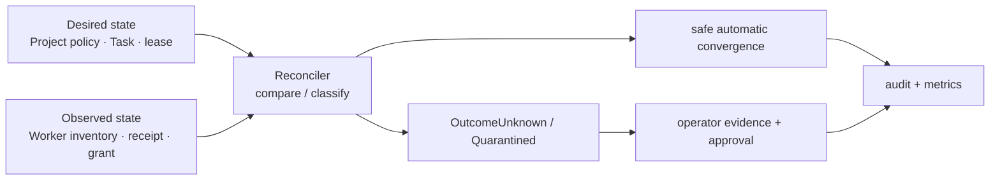

# 관측성·재조정·장애 복구 계약

## 목적

Fleet는 단순 health check가 아니라 **원하는 상태와 관측된 상태의 차이**를 운영자가 판별하고
안전하게 수렴시켜야 한다. 이 문서는 metric·audit 상관관계, reconciliation의 자동 범위, 운영자
개입 경계를 소유한다. Active/Cold Standby 권한은 [Control Plane 권한과 장애 전환](control-plane-authority-and-failover.md),
Task effect의 결과 판정은 [실행 일관성](tasks/execution-consistency.md)이 정본이다.

## 상태 분류

모든 제어 대상은 `Desired`, `Observed`, `ReconciliationResult`를 분리해 기록한다. health가
`green`이어도 lease, effect, credential 상태가 불명확하면 Fleet 전체를 정상으로 표시하지 않는다.

| 대상 | 최소 desired/observed 증거 | 불일치 결과 |
|---|---|---|
| Control plane | active instance, epoch, DB lease | `ControlPlaneFenced` |
| Worker | incarnation, liveness mode, control channel, process inventory 시각 | `WorkerUnreachable` 또는 `WorkerUnchecked` |
| Agent/lease | Agent generation, fencing token, expected container/process ID | `AgentOrphaned` 또는 `OutcomeUnknown` |
| Task 실행 | 상태, deadline, Worker ACK, checkpoint | `OutcomeUnknown` 또는 `CancelUnconfirmed` |
| Tool effect | ledger 상태, provider receipt/조회 결과 | `PartiallyApplied` |
| Credential delivery | grant ID, expiry, Worker/Task binding, revocation | `GrantLeakSuspected` 또는 `CredentialUnavailable` |
| Project archive | terminal Task, process/lease/grant cleanup, open holds | `ArchiveBlocked` |

`Unknown`, `Unchecked`, `CancelUnconfirmed`, `PartiallyApplied`, `ArchiveBlocked`, `Fenced`는 오류를 숨기는 중간 상태가
아니다. UI·API·alert는 원인, 마지막 관측 시각, 다음 자동 재평가 시각, 필요한 운영자 action을 함께
보여야 한다.

## Metric·event·audit 규칙

Prometheus metric은 집계와 alert용이고, audit/event log는 개별 원인 추적용이다. 둘을 서로 대신하지
않는다.

| 신호 | 필수 측정/기록 | 금지 |
|---|---|---|
| 제어 권한 | active epoch, lease renewal 실패, fencing 거절 수 | instance ID를 무제한 label로 사용 |
| Worker/Agent | mode별 관측 age, slot 사용량, warm eviction, orphan/unknown 수 | worker/agent/task UUID label |
| Task 실행 | queue age, dispatch/ACK latency, terminal/outcome-unknown 수 | prompt, repository URL, 사용자 입력 |
| effect | class별 `Started`/`Unknown`/compensation 실패 수 | provider 요청/응답 원문, idempotency key |
| Security | grant 발급/거절/만료, revoke 지연, helper 거절 | credential ID, secret fingerprint, token |
| Archive | drain age, open hold 수와 kind, blocked age | Project name/ID label |

모든 audit/event에는 가능한 범위에서 `request_id`, `project_id`, `task_id`, `agent_id`,
`worker_id`, `lease_generation`, `fencing_token`, `control_epoch`, actor를 상관관계 필드로 남긴다.
이 필드는 조회용 structured record에만 두며 metric label·로그 메시지 본문에 secret, prompt, credential
원문, raw provider payload를 넣지 않는다.

## Reconciler의 자동 권한

Reconciler는 Active Orchestrator epoch에서만 동작한다. 한 sweep은 스냅샷 기준으로 판단하고,
각 수정은 fencing token·generation·현재 상태를 조건으로 하는 CAS여야 한다.

| 상황 | 자동 동작 | 자동으로 하지 않는 일 |
|---|---|---|
| 만료된 delivery grant | grant revoke·WarmIdle drain | credential 재발급/다른 Project grant |
| token 불일치 orphan process | Worker self-fence/cleanup 요청, lease quarantine | 같은 Agent의 즉시 재시작 |
| Start/stop ACK 유실 | `OutcomeUnknown`, inventory 조회 | 중복 start/재실행 |
| Worker 미도달 | 신규 dispatch 차단, lease expiry 관찰 | 외부 effect 재시도/성공 추정 |
| terminal checkpoint 누락 | Task 성공 확정 차단, evidence 요청 | 임의 Git force push |
| effect `Started`/`Unknown` | provider 조회, `PartiallyApplied` 승격 | 자동 redrive/보상 추정 |
| `CancelUnconfirmed` Task | inventory·effect ledger 조회, `Cancelled`/`PartiallyApplied`/`OutcomeUnknown` 해소 | 증거 없는 `Cancelled` 확정 |
| archive cleanup 미완료 | `ArchiveBlocked` hold 생성 | context/Git/audit 삭제 |

자동 reconcile은 durable data 삭제, Project reopen, irreversible tool 실행, external effect redrive,
risk acceptance, security/legal hold 해제, master-key/credential rotation을 수행하지 않는다.

## 재시작·장애 복구 순서

Primary 재시작 또는 수동 승격 뒤에는 신규 dispatch보다 관측이 우선이다.

1. DB control lease와 epoch를 획득하고 이전 owner가 fenced됐음을 확인한다.
2. Worker의 incarnation·control channel·process inventory를 수집한다. `on_demand` Worker는
   `Unchecked`로 표시하고 probe 전 정상으로 간주하지 않는다.
3. 활성 Agent lease와 process inventory, delivery grant, Task fencing token을 대조한다.
4. 불일치는 `OutcomeUnknown` 또는 quarantine으로 보존하고, safe cleanup만 수행한다.
5. effect ledger의 `Started`/`Unknown`, archive hold, checkpoint 누락을 먼저 재평가한다.
6. 이 과정이 끝난 Project/Worker에 대해서만 Pending Task dispatch를 재개한다.

recovery snapshot은 control epoch, binary/schema compatibility, 정책 revision, lease/task/effect
요약, 마지막 관측 시각을 담되 secret 원문·prompt·provider payload는 포함하지 않는다.

## Alert와 운영자 action

임계값은 deployment 정책으로 설정하되 아래 조건은 alert를 피할 수 없다.

| 조건 | 기본 severity | 운영자 최초 action |
|---|---|---|
| control lease renewal 실패 또는 둘 이상의 owner 관측 | Critical | gateway 차단, fencing/epoch 증거 확인 |
| `OutcomeUnknown` Task 또는 orphan Agent | High | Worker inventory와 effect ledger 확인, 재시작 금지 |
| credential grant revoke 지연/누수 의심 | High | Worker isolate, grant revoke 증거 확인 |
| `PartiallyApplied` effect | High | provider receipt·보상·risk acceptance 결정 |
| `ArchiveBlocked` SLA 초과 | Medium | hold owner/evidence 확인 |
| WarmIdle slot 과점유/TTL 반복 초과 | Medium | eviction 정책·capacity 확인 |
| on-demand Worker probe 반복 실패 | Medium | Worker를 `Unchecked`/Unavailable로 유지 |

운영자는 recovery action마다 incident/request ID, 관측 근거, 선택한 조치, 승인자, 결과를 audit에
남긴다. 단일 alert 해제는 안전한 회복 증거가 아니며, 해당 reconciliation result가 `Converged`가 된
것을 확인해야 한다.

## 구현 게이트

1. metric에 고카디널리티 ID·prompt·secret이 노출되지 않는 시험
2. control failover 뒤 inventory-first recovery가 신규 dispatch보다 먼저 수행되는 E2E 시험
3. ACK 유실·orphan process·grant expiry가 자동 중복 실행 없이 quarantine/cleanup되는 시험
4. `Started` effect와 archive hold가 운영자 승인 없이 자동 redrive/archive되지 않는 시험
5. on-demand Worker가 `Unchecked`에서 probe 성공 전 dispatch되지 않는 시험
6. audit 상관관계 필드만으로 incident의 Project·Task·lease·effect 경로를 재구성하는 시험
7. `CancelUnconfirmed` Task가 증거 기반으로 해소되기 전까지 Project archive가 진행되지 않는 시험

## 구현 상태 (2026-09-06)

게이트별 현황이다. **닫힌 것은 1과 5 둘, 부분은 3 하나이며, 남은 넷은 2·4·6·7이다.** 다만 그
넷의 막힘이 전부 같은 종류는 아니다 — 게이트 4와 7은 하부 구조(effect ledger의 상태 기계,
`CancelUnconfirmed`)가 저장소에 **없어서** 시험을 작성할 수조차 없다. 게이트 2는 워커가 명령과
무관하게 들고 있는 것을 오케스트레이터가 **묻는** process inventory를 기다린다. 게이트 6은
그 둘과 또 달라서, 필드가 아니라 **제어면 결정의 감사 경로**가 선행인데 그 선행은
2026-09-06에 들어왔다(아래 행 참고).

**2026-09-12 정정 — 이 문단이 병합 직후 두 군데에서 표와 어긋나 있었다.** (1) "게이트 2와 3은
같은 하나를 기다린다"고 적었으나, 게이트 3이 기다리던 inventory 절반은 orphan 자기 보고로
채워졌다(3행 참고). 지금 process inventory를 기다리는 것은 **게이트 2뿐**이고, 3의 남은 절반은
ACK 유실과 grant expiry다. (2) 게이트 6에 "남은 것은 `lease_generation`·`fencing_token`이다"라고
적었으나 **그 둘은 만들 대상이 아니다** — [제어면 권한과 failover](control-plane-authority-and-failover.md)의
2026-09-01 처분표가 `agents.command_generation`으로 **충족 처리**했다(031이 이미 DB가 발행하는
Agent별 단조 증가 값을 만들었고, 이름만 다르고 역할이 같다). 즉 그 둘의 grep 0건은 차단 근거가
아니며, `da523a6`이 이미 한 번 걷어낸 폐기 사유가 되살아난 것이다. 게이트 6에 남은 것은
**effect 경로 하나**이고, 그 선행은 게이트 4다.

없는 것을 미리 만들지 않기 위해, 그리고 이미 들어온 것을 다시 만들지 않기 위해, 무엇이 어느
쪽인지를 여기에 명시한다.

**차단 사유는 매번 다시 확인한다.** 2026-09-06 하루에 셋(4·5·6)을 재판정했고 셋 다
부정확했는데 틀린 방향이 매번 달랐다 — 4는 순환이었고(뚫렸다), 5는 유효하되 함정이 숨어
있었으며, 6은 낡았지만 **유리한 방향이 아니었다**(없다던 필드가 있었고, 그럼에도 게이트는
열리지 않았다). 사유를 그대로 믿었다면 6에서 "필드만 더하면 된다"는 잘못된 걸음으로 갔을
것이다.

게이트 3이 2026-09-02에 차단에서 부분으로 옮겨졌고, **그 이동 자체가 기록할 값어치가 있다.**
그때까지의 판정은 "비교할 process inventory가 없어 orphan을 지목할 수 없다"였는데, 그 문장은
inventory를 **오케스트레이터가 들고 대조하는 목록**으로 읽고 있었다. 실제로 필요했던 것은
Worker 자신이 이미 쥐고 있던 두 근거였다 — 명령 목록에서의 부재와, 이전 incarnation이 디스크에
남긴 기록이다. 즉 막고 있던 것은 없는 하부 구조가 아니라 **어디를 보아야 하는지에 대한 오해**
였다. 차단으로 적힌 나머지 넷도 같은 종류의 오해를 품고 있을 수 있으므로, 선행이 도착하기를
기다리기 전에 그 판정의 근거를 한 번 더 읽는 편이 낫다.

| 게이트 | 상태 | 근거 / 막고 있는 것 |
| --- | --- | --- |
| 1. metric 노출 금지 | **닫힘** | `crates/fleet-api/src/metrics.rs`의 `metrics_body_never_exposes_ids_prompts_or_secrets`(fixture의 UUID·prompt·리포지터리 URL·`?server-key=` secret이 본문에 없음)와 `metrics_body_labels_stay_within_a_bounded_allow_list`(라벨 이름·값이 유한 허용 목록 안) |
| 2. inventory-first recovery E2E | 차단 | **Reconciler는 있고 fencing도 있다** — `crates/fleet-scheduler/src/reconcile.rs`의 `Reconciler`는 `lease_allows_control()`로 lease를 잃은 인스턴스의 sweep 전체를 건너뛴다(시험 `reconcile_once_skips_the_whole_sweep_when_control_plane_lease_is_fenced`). 선행으로 적혀 있던 `#63`의 lease/epoch primitive도 1~4단계로 들어왔다. 없는 것은 **inventory-first라는 순서**다: 이 Reconciler는 `#62`의 stale `Pending`/`Dispatched` sweeper라 **저장소가 기억하는 작업만** 훑고, failover 뒤 워커에게 "무엇을 들고 있는가"를 먼저 묻지 않는다. 그 물음의 답이 게이트 3이 지목하는 inventory와 같은 것이므로, 선행은 `#63`이 아니라 **게이트 3**이다. (**2026-09-12 정정 — 이 마지막 문장이 틀렸다.** 두 inventory는 **축이 다르다**: 게이트 3이 지목하는 것은 **Agent 프로세스 축**으로 `fleet-worker`가 자기가 띄운 것을 heartbeat의 `agent_orphans`로 보고하는 것이고, 게이트 2가 필요로 하는 것은 **task 실행 축**으로 오케스트레이터가 grok의 ACP 세션에 직접 붙어 묻는 것이다(오케스트레이터는 워커의 `endpoint`에 직접 연결하며 `fleet-worker` 프로세스는 task 세션을 보지 못한다). 상대도 채널도 다르므로 **게이트 3을 끝까지 닫아도 게이트 2는 열려 있다.** 게이트 2의 실제 선행은 **task 실행 신원의 내구화**다 — ACP `session_id`는 `fleet-transport`의 인메모리 맵에만 있고 `fleet-store`·`fleet-core`에 grep 0건이라, 재시작하면 "내가 띄운 세션"을 가리킬 이름 자체가 사라진다. `session/list` 왕복은 이미 `probe`가 하고 있으나 응답 본문을 버린다 — 인벤토리의 절반이 이미 도착하고 있는데 붙일 왼쪽이 없다.) |
| 3. ACK 유실·orphan·grant expiry quarantine | **부분** | start/stop ACK는 `#67` 4b에서 왔고 `worker_incarnation`은 `workers.incarnation_started_at`(028)으로 있다. `#67` 4c-B가 관측 채널까지 넣었지만 **그것으로 orphan을 지목할 수는 없다** — `crates/fleet-worker/src/agent_process.rs`의 재조정 루프는 관측을 `Vec::with_capacity(commands.len())`에 담고 `commands.iter().filter(desired_status == Running)`만 순회하므로, 오케스트레이터가 **이미 배치했다고 믿는** Agent를 확인·부인할 뿐 명령한 적 없는 프로세스를 실어 나를 형식이 없다. 같은 루프 2단계는 목록에서 사라진 프로세스를 **보고 없이** 종료하고, `procs`는 in-memory라 워커가 SIGKILL되면 워커 자신도 자기 자식을 잃는다. 남은 것은 워커가 **명령과 무관하게** 들고 있는 것을 여는 inventory 보고이며, 게이트 2도 같은 것을 기다린다. (**2026-09-12 갱신**: 이 문장이 지목한 inventory는 아래 orphan 자기 보고로 **절반이 채워졌다**. 남은 전수 조회는 이제 게이트 2 단독의 선행이고, 이 칸의 남은 절반은 문장 끝이 적듯 ACK 유실과 grant expiry다 — 한 칸이 서로 다른 두 절반을 지목하고 있었다.) lease quarantine은 요구에서 빠진다: `worker_execution_lease`를 만들지 않기로 확정했다(2026-09-01, `#67` 게이트 ①-B) **2026-09-06 — 이 행의 근거는 `claude/pam-phase2-task5` 병합 전 트리에서 재도출된 것이라, 아래 사실이 그 뒤에 들어왔다.** orphan 쪽은 닫혔다 — 워커가 배정받지 않은 Agent 프로세스를 종료한 사실을 heartbeat의 `agent_orphans`로 올리고 오케스트레이터가 `agent.orphan_terminated`로 감사한다. 근거가 둘이고 서로 다른 실패를 덮는다: 명령 목록에서의 부재(`unplaced`)와 이전 incarnation이 남긴 디스크 기록(`stale_incarnation`, `.fleet-agent.json` + 시작 시각 대조로 pid 재사용을 거른다). **위 문단이 "형식이 없다"고 적은 그 형식이 이것이다.** 다만 그것이 곧 process inventory는 아니다 — 이 보고는 워커가 **자기가 띄운 것**에 대해 말하는 것이고, 게이트 2가 기다리는 것은 워커가 명령과 무관하게 들고 있는 것 전부를 여는 조회다. 남은 절반은 ACK 유실과 grant expiry다 |
| 4. `Started` effect·archive hold 자동 redrive 금지 | 차단 | effect ledger가 코드에 존재하지 않는다(`EffectLedger`/`PartiallyApplied` grep 0건). archive hold 테이블은 `#91` **2026-09-06 — 이 행의 근거는 `claude/pam-phase2-task5` 병합 전 트리에서 재도출된 것이라, 아래 사실이 그 뒤에 들어왔다.** 원장은 여전히 없지만 **그것이 읽을 증거는 이제 남는다.** 차단 사유가 순환이었다는 것이 드러났고("원장이 없어서 원장을 못 만든다") 진짜 막힌 자리는 더 앞이었다 — 도구는 Worker의 grok 프로세스 안에서 돌고 오케스트레이터는 `session/prompt`만 보내는데, ACP가 `session/update`로 주는 `ToolCall`/`ToolCallUpdate`를 `acp_transport.rs`가 `_ => None`으로 전부 버리고 있었다. 그 알림을 `WorkerEvent::ToolCall` → `FleetEvent::TaskToolCall`로 올린다(`fleet_core::ToolInvocation`). 여덟 상태·idempotency key·external receipt는 **하나도** 만들지 않았으므로 게이트는 차단이다. 남기는 것은 `tool_call_id`·`name`·`kind`·`status` 넷뿐 — `title`·`raw_input`·`raw_output`·`content`·`locations`는 위 금지 목록에 걸려 버린다. `status = Completed`는 **effect 증거가 아니다**([실행 일관성](tasks/execution-consistency.md)이 적은 대로 모델의 "완료" 서술이지 provider receipt가 아니다) |
| 5. on-demand Worker probe 전 dispatch 금지 | **닫힘** | 안전한 절반(확인 없는 dispatch 금지)은 원래 `WorkerSelector::select` 1.5단계가 `on_demand` 워커를 후보에서 통째로 제외해 닫혀 있었고, **2026-09-06에 그 제외가 probe로 대체됐다** — 1.5단계는 이제 liveness를 거르지 않고(`selector.rs`의 "liveness는 여기서 **거르지 않는다**" 주석), 확인은 결승전인 8단계 `responds()`가 승자에게만 건다(probe는 왕복이라 후보를 좁히는 필터로 두면 뒤 필터에서 어차피 떨어질 워커까지 전부 왕복시킨다). `on_demand`·probe 시험 6건 (2026-09-12 정정: 이 문장은 병합 전 트리의 서술이라 "1.5단계가 제외한다"와 "시험 4건" 둘 다 지금 트리에서 거짓이었다). 나머지 절반인 **probe 성공 후 dispatch 허용**의 막힘은 수단이 아니라 배선이다: `WorkerTransport::ping(worker_id) -> Duration`이 이미 트레이트에 있고, 없는 것은 selector가 dispatch 직전에 그것을 부르고 결과를 후보 판정에 되먹이는 경로다. **소유는 이 게이트(`#70`)이지 `#67`이 아니다** — probe는 Agent 프로비저닝이 아니라 Worker liveness이고 수단인 `ping`도 `fleet-transport`에 있다(2026-09-06 귀속 정정: 이 표와 `selector.rs`·`health.rs` 주석은 `#67`을, `#67` 로드맵 행과 `placement.rs`는 `#70`을 지목해 **서로에게 미루고 있었다**). `Unchecked` 워커 상태는 만들지 않았다 — probe 없이는 빠져나올 수 없는 도달 불가 상태가 되기 때문 **2026-09-06 — 이 행의 근거는 `claude/pam-phase2-task5` 병합 전 트리에서 재도출된 것이라, 아래 사실이 그 뒤에 들어왔다.** **게이트를 닫았다.** `WorkerTransport::probe`가 `session/list`를 실제로 왕복시키고(부작용 없는 유일한 client→agent 요청이다), `WorkerSelector`가 고른 워커의 `liveness_mode`가 `on_demand`이면 dispatch 직전에 그것을 건다. **판정은 "답이 왔는가"이지 "성공했는가"가 아니다** — grok이 그 메서드를 몰라 `-32601`을 줘도 살아 있다는 증거로는 같다. 구현에서 가장 틀리기 쉬운 자리는 Agent의 거절과 연결의 죽음이 SDK에서 같은 `Err`로 온다는 것이고 실제로 첫 구현이 거기서 틀렸다(시험이 잡았다); 연결 상태(구조적)와 SDK의 문구 표식(텍스트)을 AND로 묶어 갈랐다. probe는 필터가 아니라 **결승전**에서 돈다 — 왕복이라, 값싼 필터가 좁힌 뒤 승자에게만 건다. 신선도는 어디에도 들지 않는다(저장하면 "얼마나 오래 유효한가"라는 두 번째 파라미터가 생긴다). `placement.rs`는 따라가지 않는다 — 그쪽 제외의 근거는 liveness가 아니라 `#61`의 모드 계약이다 |
| 6. audit 상관관계 필드로 경로 재구성 | 차단 | **일부는 들어왔다** — `project_id`는 `037`로 `audit_log`의 1급 컬럼이 되어 `AuditFilter` 술어와 인덱스를 갖고(`#95` 1단계), Agent 배정·회수의 `generation`은 `detail`에 실린다(`#67`, provisioning.md 「구현 게이트」 4). 없는 것은 **effect 경로**다: effect ledger가 없으므로(게이트 4) 감사는 "누가 언제 무엇을 시켰는가"까지만 말하고 "그 시킴이 어디까지 적용됐는가"를 말하지 못한다. `lease_generation`·`fencing_token`은 요구에서 빠진다 — `worker_execution_lease`를 만들지 않기로 확정했다(2026-09-01). `control_epoch`는 `026`·`035`로 이미 저장소에 있으나, 감사 필드로 승격할지는 effect 경로가 생긴 뒤에 판단한다 **2026-09-06 — 이 행의 근거는 `claude/pam-phase2-task5` 병합 전 트리에서 재도출된 것이라, 아래 사실이 그 뒤에 들어왔다.** **막힌 자리가 필드가 아니라는 것이 드러났고, 그 선행이 들어왔다.** 실측: 감사 emitter 35군데가 전부 `fleet-api`·`fleet-dashboard`·`fleet-core`이고 `fleet-scheduler`는 **0건**이라 dispatch·펜싱 같은 제어면 결정이 감사에 아무것도 남기지 않았다. 컬럼만 먼저 만들었다면 모든 emitter에서 항상 NULL이었을 것이다. `FleetState::audit_control`이 그 경로를 열어 셋을 남긴다: `control.dispatch_refused`(리스가 없어 스스로 물러섬), `control.write_fenced`(리스가 있다고 믿고 쓰러 갔다가 저장소가 세대 불일치로 막음 — **"둘 이상의 owner"의 직접 증거이며 `control_epoch`가 실제로 채워지는 유일한 경우다**), `control.outcome_abandoned`(리스를 잃어 워커 결과의 제어 처리를 건너뜀). 마이그레이션 040이 `audit_log.control_epoch`를 더한다; NULL이 두 가지 정상을 뜻하므로(운영자 행위, 세대를 갖지 못한 채 내린 거절) nullable이다. 행위자는 `cluster_id`가 아니라 `instance_id`다 — 같은 cluster의 두 인스턴스는 구분되지 않는다. **게이트는 여전히 차단이다 — 다만 남은 것은 필드가 아니라 `effect` 경로 하나다**. `lease_generation`·`fencing_token`의 grep 0건은 차단 근거가 **아니다**: [제어면 권한과 failover](control-plane-authority-and-failover.md)의 2026-09-01 처분표가 그 둘을 `agents.command_generation`으로 **충족 처리**했다(031이 이미 DB가 발행하는 Agent별 단조 증가 값을 만들었고 이름만 다르다). 이 칸이 요구하는 `Project·Task·lease·effect` 네 경로 중 Project(`037`)·Task·lease(`040`과 `control.*` 감사 셋)는 필드와 실제 Postgres 왕복 시험(`crates/fleet-store/tests/audit_integration.rs`의 `a_control_epoch_survives_the_round_trip`)까지 갖췄다. 없는 것은 effect ledger뿐이고, 따라서 이 칸의 선행은 이제 **게이트 4 단 하나**다 (2026-09-12 정정: 이 자리에 있던 `lease_generation`·`fencing_token` 사유는 `da523a6`이 이미 걷어낸 폐기 사유가 되살아난 것이었다) |
| 7. `CancelUnconfirmed` 전 archive 차단 | 차단 | `CancelUnconfirmed` 상태가 코드에 존재하지 않는다(grep 0건). 선행 `#67`·`#91` |

### 어느 게이트에도 귀속되지 않았던 archive의 제어 구멍 (2026-09-12, 닫음)

게이트 4·7이 archive를 다루지만, 둘 다 **무엇이 archive를 막아야 하는가**(effect, 미확인
cancel)에 관한 것이다. 그 아래에 **누가 archive할 수 있는가**가 비어 있었고 어느 행도 그것을
적지 않았다.

`PgStore::update_project_status`는 조건 없는 `UPDATE`였고, MCP(`fleet_delete_project`)와
Dashboard(`DELETE /api/projects/{id}`) 어느 핸들러도 `lease_allows_control()`을 부르지 않았다
(grep 0건). **즉 lease를 잃은 인스턴스가 Project를 archive할 수 있었다.** dispatch와 cancel은
`#62`·`#63`에서 fence로 막혔는데 archive만 남아 있었다 — 제어면 결정 중 유일하게 술어가 없는
쓰기였다.

닫는 방식은 이 저장소의 기존 fence와 같다: `update_project_status`가 `Option<&ControlFence>`를
받아 `AND EXISTS (SELECT 1 FROM control_plane_lease WHERE cluster_id = $3 AND epoch = $4)`를
**`UPDATE`와 같은 문장 안에** 넣는다. lease를 먼저 SELECT해서 분기하면 그 사이에 fenced되어도
이미 떠난 쓰기가 도착한다. `fence`가 `None`이면 술어를 걸지 않는다 — `lease_allows_control()`이
같은 경우에 `true`를 주는 것과 짝을 이루며, HA lease를 켜지 않은 단일 인스턴스 배포가 자기
자신에게 막히지 않게 한다.

`ArchiveProgress`에 `Fenced`를 더해 `Draining`과 **구분한다.** 뭉개면 호출부가 "아직 막는 것이
있다"로 읽고 재시도하는데, fenced 인스턴스의 재시도는 영원히 성공하지 않는다. 두 표면 모두
이 값을 blockers 목록이 아니라 오류로 돌려준다.

검증은 실제 Postgres다(`crates/fleet-store/tests/projects.rs`의
`a_fenced_instance_cannot_archive_a_project`, `archive_reports_fenced_separately_from_blocked`).
fence는 SQL 술어이므로 `MemStore`로 도는 시험은 이 `AND EXISTS`를 한 줄도 검증하지 않는다.
낡은 fence가 거절되는 것만 보면 "id가 없어서 0행"과 구분되지 않으므로, **같은 Project에 살아
있는 fence로 같은 전이가 통과하는 대조**를 함께 둔다.

**남은 것(이 수정의 범위 밖)**: `advance_project_archive`는 여전히 check-then-act다 — 두 blocker
SELECT와 최종 `UPDATE`가 별개 문장이고, 반대편 제출 경로(`ensure_project_accepts_new_tasks` →
`insert_task_row`)도 마찬가지라 **archive 확정 뒤에 Task가 들어오는 순서**가 남아 있다. fence는
"누가"를 닫았고 이 창은 "언제"에 속한다.

게이트 5의 판정 근거를 남긴다: 이 차단은 새로 도입한 제약이 아니라 **이미 문서가 요구하고 있었으나
집행되지 않던 것**이다. `fleet-api`의 `build_worker`는 `liveness_mode`와 무관하게
`WorkerStatus::Online`을 기록하고, `HealthChecker`는 heartbeat이 없는 `on_demand` 워커를 의도적으로
강등하지 않으며, `WorkerSelector`에는 liveness 조건이 없었다. 세 전제가 각각은 타당한데 합치면
"생존 여부를 확인할 수단이 없는 워커가 영구히 dispatch 대상"이 된다. `worker.rs`의
`WorkerLivenessMode::OnDemand` 문서와 `handlers.rs`가 렌더링하는 worker.toml의 경고가 이미 그
배정을 범위 밖이라고 적어 왔지만 강제하는 코드가 없었다.
