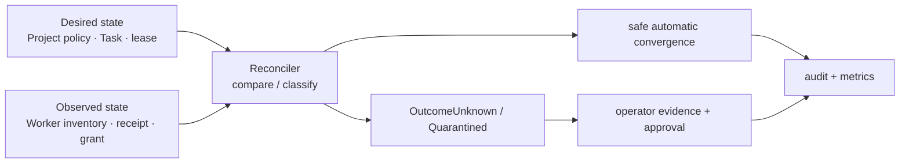

# 관측성·재조정·장애 복구 계약

## 목적

Fleet는 단순 health check가 아니라 **원하는 상태와 관측된 상태의 차이**를 운영자가 판별하고
안전하게 수렴시켜야 한다. 이 문서는 metric·audit 상관관계, reconciliation의 자동 범위, 운영자
개입 경계를 소유한다. Active/Cold Standby 권한은 [Control Plane 권한과 장애 전환](control-plane-authority-and-failover.md),
Task effect의 결과 판정은 [실행 일관성](tasks/execution-consistency.md)이 정본이다.

## 상태 분류

모든 제어 대상은 `Desired`, `Observed`, `ReconciliationResult`를 분리해 기록한다. health가
`green`이어도 lease, effect, credential 상태가 불명확하면 Fleet 전체를 정상으로 표시하지 않는다.

| 대상 | 최소 desired/observed 증거 | 불일치 결과 |
|---|---|---|
| Control plane | active instance, epoch, DB lease | `ControlPlaneFenced` |
| Worker | incarnation, liveness mode, control channel, process inventory 시각 | `WorkerUnreachable` 또는 `WorkerUnchecked` |
| Agent/lease | Agent generation, fencing token, expected container/process ID | `AgentOrphaned` 또는 `OutcomeUnknown` |
| Task 실행 | 상태, deadline, Worker ACK, checkpoint | `OutcomeUnknown` 또는 `CancelUnconfirmed` |
| Tool effect | ledger 상태, provider receipt/조회 결과 | `PartiallyApplied` |
| Credential delivery | grant ID, expiry, Worker/Task binding, revocation | `GrantLeakSuspected` 또는 `CredentialUnavailable` |
| Project archive | terminal Task, process/lease/grant cleanup, open holds | `ArchiveBlocked` |

`Unknown`, `Unchecked`, `CancelUnconfirmed`, `PartiallyApplied`, `ArchiveBlocked`, `Fenced`는 오류를 숨기는 중간 상태가
아니다. UI·API·alert는 원인, 마지막 관측 시각, 다음 자동 재평가 시각, 필요한 운영자 action을 함께
보여야 한다.

## Metric·event·audit 규칙

Prometheus metric은 집계와 alert용이고, audit/event log는 개별 원인 추적용이다. 둘을 서로 대신하지
않는다.

| 신호 | 필수 측정/기록 | 금지 |
|---|---|---|
| 제어 권한 | active epoch, lease renewal 실패, fencing 거절 수 | instance ID를 무제한 label로 사용 |
| Worker/Agent | mode별 관측 age, slot 사용량, warm eviction, orphan/unknown 수 | worker/agent/task UUID label |
| Task 실행 | queue age, dispatch/ACK latency, terminal/outcome-unknown 수 | prompt, repository URL, 사용자 입력 |
| effect | class별 `Started`/`Unknown`/compensation 실패 수 | provider 요청/응답 원문, idempotency key |
| Security | grant 발급/거절/만료, revoke 지연, helper 거절 | credential ID, secret fingerprint, token |
| Archive | drain age, open hold 수와 kind, blocked age | Project name/ID label |

모든 audit/event에는 가능한 범위에서 `request_id`, `project_id`, `task_id`, `agent_id`,
`worker_id`, `lease_generation`, `fencing_token`, `control_epoch`, actor를 상관관계 필드로 남긴다.
이 필드는 조회용 structured record에만 두며 metric label·로그 메시지 본문에 secret, prompt, credential
원문, raw provider payload를 넣지 않는다.

## Reconciler의 자동 권한

Reconciler는 Active Orchestrator epoch에서만 동작한다. 한 sweep은 스냅샷 기준으로 판단하고,
각 수정은 fencing token·generation·현재 상태를 조건으로 하는 CAS여야 한다.

| 상황 | 자동 동작 | 자동으로 하지 않는 일 |
|---|---|---|
| 만료된 delivery grant | grant revoke·WarmIdle drain | credential 재발급/다른 Project grant |
| token 불일치 orphan process | Worker self-fence/cleanup 요청, lease quarantine | 같은 Agent의 즉시 재시작 |
| Start/stop ACK 유실 | `OutcomeUnknown`, inventory 조회 | 중복 start/재실행 |
| Worker 미도달 | 신규 dispatch 차단, lease expiry 관찰 | 외부 effect 재시도/성공 추정 |
| terminal checkpoint 누락 | Task 성공 확정 차단, evidence 요청 | 임의 Git force push |
| effect `Started`/`Unknown` | provider 조회, `PartiallyApplied` 승격 | 자동 redrive/보상 추정 |
| `CancelUnconfirmed` Task | inventory·effect ledger 조회, `Cancelled`/`PartiallyApplied`/`OutcomeUnknown` 해소 | 증거 없는 `Cancelled` 확정 |
| archive cleanup 미완료 | `ArchiveBlocked` hold 생성 | context/Git/audit 삭제 |

자동 reconcile은 durable data 삭제, Project reopen, irreversible tool 실행, external effect redrive,
risk acceptance, security/legal hold 해제, master-key/credential rotation을 수행하지 않는다.

## 재시작·장애 복구 순서

Primary 재시작 또는 수동 승격 뒤에는 신규 dispatch보다 관측이 우선이다.

1. DB control lease와 epoch를 획득하고 이전 owner가 fenced됐음을 확인한다.
2. Worker의 incarnation·control channel·process inventory를 수집한다. `on_demand` Worker는
   `Unchecked`로 표시하고 probe 전 정상으로 간주하지 않는다.
3. 활성 Agent lease와 process inventory, delivery grant, Task fencing token을 대조한다.
4. 불일치는 `OutcomeUnknown` 또는 quarantine으로 보존하고, safe cleanup만 수행한다.
5. effect ledger의 `Started`/`Unknown`, archive hold, checkpoint 누락을 먼저 재평가한다.
6. 이 과정이 끝난 Project/Worker에 대해서만 Pending Task dispatch를 재개한다.

recovery snapshot은 control epoch, binary/schema compatibility, 정책 revision, lease/task/effect
요약, 마지막 관측 시각을 담되 secret 원문·prompt·provider payload는 포함하지 않는다.

## Alert와 운영자 action

임계값은 deployment 정책으로 설정하되 아래 조건은 alert를 피할 수 없다.

| 조건 | 기본 severity | 운영자 최초 action |
|---|---|---|
| control lease renewal 실패 또는 둘 이상의 owner 관측 | Critical | gateway 차단, fencing/epoch 증거 확인 |
| `OutcomeUnknown` Task 또는 orphan Agent | High | Worker inventory와 effect ledger 확인, 재시작 금지 |
| credential grant revoke 지연/누수 의심 | High | Worker isolate, grant revoke 증거 확인 |
| `PartiallyApplied` effect | High | provider receipt·보상·risk acceptance 결정 |
| `ArchiveBlocked` SLA 초과 | Medium | hold owner/evidence 확인 |
| WarmIdle slot 과점유/TTL 반복 초과 | Medium | eviction 정책·capacity 확인 |
| on-demand Worker probe 반복 실패 | Medium | Worker를 `Unchecked`/Unavailable로 유지 |

운영자는 recovery action마다 incident/request ID, 관측 근거, 선택한 조치, 승인자, 결과를 audit에
남긴다. 단일 alert 해제는 안전한 회복 증거가 아니며, 해당 reconciliation result가 `Converged`가 된
것을 확인해야 한다.

## 구현 게이트

1. metric에 고카디널리티 ID·prompt·secret이 노출되지 않는 시험
2. control failover 뒤 inventory-first recovery가 신규 dispatch보다 먼저 수행되는 E2E 시험
3. ACK 유실·orphan process·grant expiry가 자동 중복 실행 없이 quarantine/cleanup되는 시험
4. `Started` effect와 archive hold가 운영자 승인 없이 자동 redrive/archive되지 않는 시험
5. on-demand Worker가 `Unchecked`에서 probe 성공 전 dispatch되지 않는 시험
6. audit 상관관계 필드만으로 incident의 Project·Task·lease·effect 경로를 재구성하는 시험
7. `CancelUnconfirmed` Task가 증거 기반으로 해소되기 전까지 Project archive가 진행되지 않는 시험

## 구현 상태 (2026-09-02)

게이트별 현황이다. **하나가 닫혔고 둘이 부분이며, 나머지 넷은 이 문서가 전제하는 하부 구조가
저장소에 존재하지 않아 시험을 작성할 수조차 없다.** 없는 것을 미리 만들지 않기 위해, 무엇이
막고 있는지를 여기에 명시한다.

게이트 3이 2026-09-02에 차단에서 부분으로 옮겨졌고, **그 이동 자체가 기록할 값어치가 있다.**
그때까지의 판정은 "비교할 process inventory가 없어 orphan을 지목할 수 없다"였는데, 그 문장은
inventory를 **오케스트레이터가 들고 대조하는 목록**으로 읽고 있었다. 실제로 필요했던 것은
Worker 자신이 이미 쥐고 있던 두 근거였다 — 명령 목록에서의 부재와, 이전 incarnation이 디스크에
남긴 기록이다. 즉 막고 있던 것은 없는 하부 구조가 아니라 **어디를 보아야 하는지에 대한 오해**
였다. 차단으로 적힌 나머지 넷도 같은 종류의 오해를 품고 있을 수 있으므로, 선행이 도착하기를
기다리기 전에 그 판정의 근거를 한 번 더 읽는 편이 낫다.

| 게이트 | 상태 | 근거 / 막고 있는 것 |
| --- | --- | --- |
| 1. metric 노출 금지 | **닫힘** | `crates/fleet-api/src/metrics.rs`의 `metrics_body_never_exposes_ids_prompts_or_secrets`(fixture의 UUID·prompt·리포지터리 URL·`?server-key=` secret이 본문에 없음)와 `metrics_body_labels_stay_within_a_bounded_allow_list`(라벨 이름·값이 유한 허용 목록 안) |
| 2. inventory-first recovery E2E | 차단 | control epoch·fencing token을 갖는 Reconciler가 없다. `crates/fleet-scheduler/src/reconcile.rs`는 `#62`의 stale `Pending`/`Dispatched` sweeper이며 이 문서의 Reconciler가 아니다. 선행 `#63`·`#67` |
| 3. ACK 유실·orphan·grant expiry quarantine | **부분** | **orphan 쪽이 닫혔다(2026-09-02)**: Worker가 배정받지 않은 Agent 프로세스를 종료하고 그 사실을 heartbeat의 `agent_orphans`로 보고하며, 오케스트레이터가 `agent.orphan_terminated`로 감사한다. 근거는 둘이고 서로 다른 실패를 덮는다 — 명령 목록에서의 **부재**(`unplaced`)와 이전 incarnation이 남긴 **디스크 기록**(`stale_incarnation`). 후자가 없으면 Worker가 SIGKILL로 죽은 뒤 살아남은 자식은 원리적으로 관측 불가능하다(`procs`는 메모리다). `agents` 행은 건드리지 않는다 — orphan은 정의상 미배치라 `036`의 `agents_observation_requires_placement`가 그 컬럼 쓰기를 금지하며, 그래서 감사 로그가 유일한 자리다. 남은 것: ACK 유실의 `OutcomeUnknown` 승격(Reconciler 선행)과 grant expiry quarantine. lease quarantine은 요구에서 빠진다: `worker_execution_lease`를 만들지 않기로 확정했다(2026-09-01, `#67` 게이트 ①-B) |
| 4. `Started` effect·archive hold 자동 redrive 금지 | 차단 | effect ledger가 코드에 존재하지 않는다(`EffectLedger`/`PartiallyApplied` grep 0건). archive hold 테이블은 `#91`. **2026-09-06 — 차단 사유를 정정한다.** 위 문장은 순환이었다("원장이 없어서 막혔다"). 실제로 막힌 자리는 더 앞이다: 도구는 Worker의 grok 프로세스 안에서 돌고 오케스트레이터는 `session/prompt`만 보내므로, **원장에 적을 사실 자체가 오케스트레이터에 도달한 적이 없었다.** ACP는 `session/update`로 도구 호출을 알려주는데 `acp_transport.rs`가 그것을 `_ => None`으로 전부 버리고 있었다. 같은 날 그 알림을 `WorkerEvent::ToolCall` → `FleetEvent::TaskToolCall`로 올려 증거를 붙잡았다(`fleet_core::ToolInvocation`). **게이트는 여전히 차단이다** — 여덟 상태·idempotency key·external receipt는 하나도 만들지 않았고, 이 증분은 원장이 아니라 원장의 **입력**이다. 남기는 것은 `tool_call_id`·`name`·`kind`·`status` 넷뿐이며 `title`·`raw_input`·`raw_output`·`content`·`locations`는 위 금지 목록에 걸려 버린다 — 이 관측은 durable 이벤트 로그로 가므로 한 번 새면 지우는 경로가 없다. 그리고 `status = Completed`는 **effect 증거가 아니다**: [실행 일관성](tasks/execution-consistency.md)이 적은 대로 모델의 "완료" 서술이지 provider receipt가 아니다. 시험 9건(자유 서술 미유출 2·매핑 표 2·갱신의 빈 필드 1·transport 왕복 1·dispatcher 지속성 2·CLI 위임 정리 포함), 변이 8건 전부 죽는다 |
| 5. on-demand Worker probe 전 dispatch 금지 | **닫힘** | 안전한 절반은 닫혔다 — `WorkerSelector::select`가 `on_demand` 워커를 후보에서 제외한다(`selector.rs` 1.5단계, 시험 4건). 나머지 절반인 **probe 성공 후 dispatch 허용**은 ACP probe가 없어 미구현(선행 `#67`). `Unchecked` 워커 상태는 만들지 않았다 — probe 없이는 빠져나올 수 없는 도달 불가 상태가 되기 때문. **2026-09-05 재판정: 이 사유는 그대로 유효하다.** 다만 그 자리에 **함정이 하나 있어 함께 적는다** — `WorkerTransport::ping`은 이름도 반환형(`Duration`)도 probe처럼 보이지만 왕복하지 않는다. `AcpTransport`의 구현은 supervisor가 든 연결 상태를 읽고 `Duration::from_millis(1)` **상수**를 돌려주며(`MockTransport`는 등록 여부만 본다), 그래서 연결만 서 있고 응답하지 않는 워커가 그대로 통과한다. 이 게이트를 닫으려는 사람이 정확히 이 함수를 집게 되므로, 트레이트 독스트링에 그 파급을 적고 `acp_transport_integration`의 `ping_registered_worker_ok`가 "두 번의 ping이 같은 값이고 그 값이 상수"임을 단정으로 고정했다 — 누군가 진짜 왕복을 넣으면 그 시험이 붉어지며 의도적 판단을 강제한다. **한편 쓸 수 있는 더 약한 신호는 있다**: `is_connected`는 supervisor가 유지하는 실제 연결 상태를 반영하므로 "등록되면 영구히 `Online`"보다는 낫다. 그러나 그것도 응답이 아니라 연결이므로 이 게이트가 요구하는 확인은 되지 못한다. 둘 다 프로덕션 코드에서 부르는 곳이 없다(시험에서만 쓴다). **2026-09-06: 그 "새로 만들어야 하는 수단"을 만들었다 — `WorkerTransport::probe`.** `AcpTransport`가 `session/list`를 실제로 왕복시키고 잰 시간을 돌려준다. 메서드 선택의 근거는 **부작용 없음**이다: ACP에서 client가 agent에게 보낼 수 있는 요청 중 상태를 바꾸지 않는 것이 사실상 이것뿐이고, `session/new`는 세션을 만들어 용량을 소모하며 실패한 probe가 정리되지 않은 세션을 남기고, `initialize`는 스펙상 연결당 한 번이라 두 번째 호출의 의미가 구현에 달려 있다. **판정은 "답이 왔는가"이지 "성공했는가"가 아니다** — grok이 `session/list`를 구현하지 않아 `-32601`을 돌려줘도 probe는 성공이며(`ProbeOutcome::answered_with_error`), 그것을 실패로 접으면 이 함수는 liveness가 아니라 "grok의 이 버전이 이 메서드를 아는가"를 재는 것이 되어 멀쩡한 워커가 영구히 배정 대상에서 빠진다. **구현에서 가장 틀리기 쉬운 자리는 Agent의 거절과 연결의 죽음이 SDK에서 같은 `Err`로 도착한다는 것이고, 실제로 처음 구현이 거기서 틀렸다** — 소켓을 닫으면 `-32603` + `data: "response to ... never received"`가 오는데 그것을 거절로 읽으면 죽은 연결이 "살아 있다"로 보고된다(이 probe가 막으려는 바로 그 일이다). 두 신호를 AND로 묶어 갈랐다: 연결 상태(구조적 — 그 오류는 연결 teardown이 응답 oneshot을 취소하며 만들어지고 supervisor는 같은 teardown에서 상태를 쓴다)와 SDK의 문구 표식(텍스트 — 상태 전이가 늦는 경합에서 먼저 잡는다). 시험 6건(왕복 측정·거절도 살아 있음·연결은 서 있는데 침묵·probe 중 연결 사망·미등록·오류 분류 단위). **2026-09-06(같은 날, 두 번째 증분): 배선까지 마쳐 게이트를 닫는다.** `WorkerSelector`가 `on_demand` 워커를 통째로 빼던 필터를 걷고, 대신 고른 워커가 그 모드면 dispatch 직전에 probe로 확인한다. 신선도는 **어디에도 들지 않는다** — 저장소 컬럼으로 두면 "그 결과가 얼마나 오래 유효한가"라는 두 번째 파라미터가 생기고 그 값이 틀리면 죽은 워커가 유효기간 동안 살아 있는 것으로 남는데, 매번 새로 묻는 쪽에는 그 파라미터가 아예 없다. **probe를 필터 자리가 아니라 결승전에 둔 것이 이 증분의 설계 결정이다**: 그 자리의 다른 검사(라벨·모델·credential·회로·용량)는 로컬 연산이지만 probe는 왕복이라, 필터 자리에 두면 어차피 떨어질 워커까지 전부 왕복시키게 되고 dispatch 루프가 최대 1000건의 Pending을 도는 구조에서 그 비용이 선형으로 쌓인다. 결과는 같으면서 왕복 횟수가 "후보 수"가 아니라 "떨어진 on_demand 승자 수 + 1"이 된다. **폴백 규칙은 갈래마다 다르다**: least-loaded 갈래는 정렬 순서대로 내려가며 침묵한 on_demand 워커를 건너뛰지만(죽은 워커 하나가 살아 있는 워커로 갈 Task를 막지 않는다), `server_hint`와 `agent_id` 갈래는 폴백하지 않는다 — 지목한 워커가 응답하지 않는다는 사실을 다른 워커로 덮으면 지목의 의미가 사라진다. **뒤집힌 단정 하나를 기록한다**: 예전 `on_demand_exclusion_is_reported_before_label_mismatch`는 라벨도 안 맞는 on_demand 워커에 `AllUnprobed`를 요구했는데, probe가 결승전으로 내려간 지금 그 자리에는 liveness 사실이 **없다**(물어보지 않았다). 확인하지 않은 것을 확인했다고 말하는 대신 실제로 확인한 사실(라벨 불일치)을 보고한다. 시험은 기존 5건을 새 계약으로 다시 쓰고 3건을 더해 selector 32건이며, 변이 6건이 전부 죽는다(probe 생략·예전처럼 통째 제외·periodic까지 왕복·least-loaded 폴백 제거·hint 폴백·agent 지목 probe 생략). **`placement.rs`는 따라가지 않는다** — 그쪽 `AllUnprobed`는 이름만 같고 근거가 `#61`의 모드 계약(Agent를 띄우는 것이 heartbeat 루프인데 이 모드는 그 루프를 시작하지 않는다)이라 probe로 풀리지 않는다. **남은 한계**: probe 성공과 dispatch 사이는 여전히 원자적이지 않다(모듈 최상단이 적어 온 용량 카운트의 한계와 같은 종류이며, 최종 방어선도 같다 — transport의 거절) |
| 6. audit 상관관계 필드로 경로 재구성 | 차단 | `lease_generation`·`fencing_token`·`control_epoch`와 effect 경로가 필드로 존재하지 않는다. `crates/fleet-core/src/audit.rs`는 actor·outcome 계열만 갖는다. **2026-09-06 재판정 — 위 사유는 두 군데가 부정확하고, 진짜 차단 지점은 더 앞이다.** (1) `control_epoch`는 **실재한다**: 코드 48곳, 마이그레이션 셋(026 task dispatch·031 agent desired state·035 agent command). 없는 것은 `lease_generation`·`fencing_token` 둘뿐이다(각 0건). (2) effect 경로도 같은 날 절반이 생겼다(`FleetEvent::TaskToolCall`, 게이트 ④ 행 참고). **그럼에도 게이트는 차단이며, 필드를 더하는 것으로는 열리지 않는다.** 실측: 감사 기록을 내는 곳은 35군데인데 전부 `fleet-api`(8)·`fleet-dashboard`(25)·`fleet-core`(2)이고 **`fleet-scheduler`는 0건이다.** 즉 dispatch·재배정·펜싱·breaker 전이 같은 **제어면 결정은 감사에 아무것도 남기지 않는다.** 그리고 감사를 내는 그 계층은 lease를 보지 못한다 — `fleet-api` 전체에 `lease` 언급이 0건이라 epoch를 실을 수단 자체가 없다. 지금 `AuditEvent`에 `control_epoch`를 더하면 35개 emitter 전부에서 **항상 NULL인 컬럼**이 된다(게이트 ④가 피한 것과 같은 함정). 그러므로 이 게이트의 선행은 필드가 아니라 **제어면 결정의 감사 경로**이고, 그것은 `FleetState`가 이미 쥔 `control_fence()`를 감사와 잇는 일이다 |
| 7. `CancelUnconfirmed` 전 archive 차단 | 차단 | `CancelUnconfirmed` 상태가 코드에 존재하지 않는다(grep 0건). 선행 `#67`·`#91` |

게이트 5의 판정 근거를 남긴다: 이 차단은 새로 도입한 제약이 아니라 **이미 문서가 요구하고 있었으나
집행되지 않던 것**이다. `fleet-api`의 `build_worker`는 `liveness_mode`와 무관하게
`WorkerStatus::Online`을 기록하고, `HealthChecker`는 heartbeat이 없는 `on_demand` 워커를 의도적으로
강등하지 않으며, `WorkerSelector`에는 liveness 조건이 없었다. 세 전제가 각각은 타당한데 합치면
"생존 여부를 확인할 수단이 없는 워커가 영구히 dispatch 대상"이 된다. `worker.rs`의
`WorkerLivenessMode::OnDemand` 문서와 `handlers.rs`가 렌더링하는 worker.toml의 경고가 이미 그
배정을 범위 밖이라고 적어 왔지만 강제하는 코드가 없었다.
