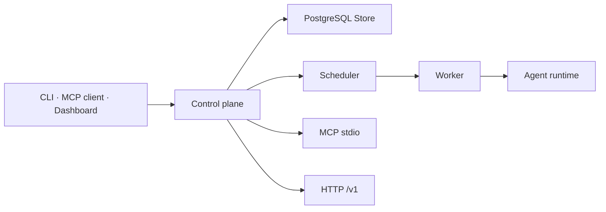

# 시스템 개요

Grok Fleet Orchestrator는 태스크를 지속 저장하고 적합한 Worker에 배정하며, Worker가
관리하는 Agent 실행을 관측하는 제어 평면이다. 이 문서는 빠른 탐색을 위한 Derived
입문 지도다. 현재 규칙은 아래 표의 정본이, 코드 수준의 제약과 근거는
[implementation-reference.md](implementation-reference.md)가 우선한다.

## 현재 구현 상태

- 태스크·Worker 상태는 Store에 저장되며, 스케줄러가 Worker의 모델·라벨·용량을 기준으로
  배정한다. 세부 재시도와 부작용 처리는 실행 의미론 정본을 따른다.
- Worker daemon은 HTTP register/heartbeat와 Agent 프로세스 관리를 담당한다. ACP transport,
  WebSocket 재연결, mTLS 및 SSH host-key 검증의 구현 범위는 구현 참조에 둔다.
- API token 또는 Cloudflare audience를 설정하지 않은 현재 `fleet-api`는 기본 no-auth로
  시작한다. 프로덕션 fail-closed는 목표 보안 계약이며 현재 구현 상태가 아니다.
- Project·Agent·선택적 liveness·고급 routing은 문서상 일부 목표 계약을 포함한다. 각 문서의
  `implementation`과 `verification` 값을 확인해야 한다.

## 정본 탐색

| 질문 | 정본 |
|---|---|
| 누가 control plane을 소유하고 장애 전환하는가? | [Control Plane 권한과 장애 전환](control-plane-authority-and-failover.md) |
| 신원·권한·token·secret 경계는 무엇인가? | [Control-plane security model](../security/control-plane-security-model.md) |
| TaskAttempt·재시도·취소·부작용은 어떻게 일관성을 지키는가? | [Task 실행 정본](tasks/README.md) |
| Project·Task·Agent의 수명주기는 무엇인가? | [Project · Task · Agent lifecycle](project-task-agent-lifecycle.md) |
| Project 정책·격리·배정 제약은 무엇인가? | [Project model](project-feature-design.md) |
| Agent의 생성·회수·명령은 어떻게 동작하는가? | [Agent 실행 플랫폼](agents/README.md) |
| Agent runtime·terminal·isolation의 경계는 무엇인가? | [Architecture](README.md) |
| HTTP·MCP·Worker enrollment의 외부 계약은 무엇인가? | [Contracts](../contracts/README.md) |
| 설치·구성·복구 절차는 무엇인가? | [Deployment](../deployment/README.md) |

## 읽기 순서

1. 현재 설계 결정을 확인할 때는 [Architecture](README.md)의 정본 선택표와 해당 정본을 읽는다.
2. 실제 코드 구조·제약·과거 정정은 [implementation-reference.md](implementation-reference.md)를 읽는다.
3. 호출 가능한 외부 표면은 `architecture/`가 아니라 [contracts/](../contracts/README.md)를 읽는다.
4. 아직 구현되지 않은 운영 자동화 요구는 [Roadmap](../roadmap/README.md)에 ID를 부여하고,
   승인된 Architecture 또는 Security 설계에서 확인한다.

## 범위 밖

이 문서는 API 상세, 운영 절차, UI 화면 정의, 변경 이력, 미구현 제안을 재서술하지 않는다.
그 내용은 각 정본·Runbook·Historical·Proposed 문서로 연결한다.
