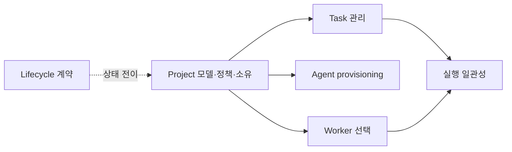

# Project 모델과 거버넌스

Project는 개발 목표, 권한, 정책, 자원 소유를 묶는 경계다. 이 문서는 Project의 데이터 모델, 배정 불변식, 디스패치 자격, 권한 경계를 소유한다. 구현 상태는 **제안됨**이며, 현재 코드에는 `ProjectId`와 nullable `tasks.project_id` 예약 필드만 있다. Project 엔터티, 소유 관계, 관리 API는 아직 구현되지 않았다.

## 범위

| 이 문서가 소유 | 다른 정본이 소유 |
|---|---|
| Project 데이터·정책 revision·자원 소유 | [Task 관리](task-management-design.md)의 제출·결과·감사 |
| host/worker의 Project 배정 불변식 | [Lifecycle 계약](project-task-agent-lifecycle.md)의 교차 상태 전이 |
| Project Task의 Worker 선택 자격 | [실행 일관성](task-execution-consistency.md)의 Attempt·재시도·dead-letter |
| Project 권한의 승인 조건 | [Project 관리 계약](../contracts/project-management.md)의 HTTP·MCP 표면 |

화면 구성은 [UI Dashboard](../ui-dashboard/ui-design.md)가, Agent 생성·중지는 [Agent provisioning](agents/provisioning.md)이 소유한다. 이 문서는 SQL, Store 메서드 시그니처, 화면 명세, 구현 단계별 작업 목록을 반복하지 않는다.

## 목표 데이터 모델

| 대상 | 목표 필드·관계 | 의미 |
|---|---|---|
| `projects` | `id`, 고유 `name`, `description`, `created_by`, 정책 revision, 생성·갱신 시각 | Project의 지속적 정책 경계 |
| `tasks` | nullable `project_id` | 값이 없으면 일반 풀 Task |
| `workers` | nullable `project_id` | 최대 하나의 Project에만 소속 |
| `hosts` | nullable `project_id` | 물리 자원의 배타적 Project 소속 |

Agent provisioning 관련 기본 템플릿, 유휴 시간, 작업 디렉터리 같은 설정은 Project가 정책 값으로 제공할 수 있지만, Agent 템플릿과 실행 수명은 Agent 도메인이 소유한다. 정책이 바뀌면 revision을 올리고 새 Task/Attempt에만 적용한다. 이미 실행 중인 Attempt는 제출 시점 snapshot을 유지한다.

## 배정 불변식

- host와 worker는 동시에 둘 이상의 Project에 속할 수 없다. `project_id`가 없으면 일반 풀에 속한다.
- host에 연결된 worker의 `project_id`는 host의 값과 같아야 한다. host 배정·해제는 연결 worker에도 같은 변경을 적용한다.
- 연결 worker를 host와 다른 Project로 직접 배정하려는 요청은 `409 Conflict`로 거부한다. 먼저 host를 배정해야 한다.
- worker가 재등록될 때 연결 host가 있으면 host의 Project 값을 다시 적용한다. host에 연결되지 않은 독립 worker의 명시적 배정은 보존한다.
- 재배정은 이후 디스패치 자격에만 영향을 준다. 이미 `Dispatched`인 Task를 이동하거나 취소하지 않는다.

## 디스패치 자격

`task.project_id`가 있으면 Worker 후보는 같은 `worker.project_id`를 가진 worker로 한정한다. 후보가 없더라도 일반 풀로 폴백하지 않는다. 이 경우의 재시도, 최종 실패, dead-letter 처리는 [실행 일관성](task-execution-consistency.md)의 `WorkerUnavailable` 경로를 따른다. `project_id`가 없는 Task는 기존 일반 풀 선택 규칙을 그대로 따른다.

Project가 `Draining`이면 새 Task, 새 Agent, 새 자원 배정을 받지 않는다. `Archived` 전이와 보존·정리 순서는 [Lifecycle 계약](project-task-agent-lifecycle.md)을 따른다.

## 권한과 구현 차단 조건

Project 권한 종류는 `project:create`, `project:read`, `project:delete`, `project:assign`이다. `ProjectRead`는 Project 범위 내 읽기만 허용한다. 생성·삭제와 배정의 실제 역할 배정은 아직 승인된 계약이 아니다.

특히 `ProjectAssign`과 Task 생성이 자동 Agent provisioning을 통해 `AgentCreate`를 우회할 가능성이 있다. 따라서 다음이 확정되고 검증되기 전에는 Project 배정 API나 MCP 도구를 구현하거나 활성화하지 않는다.

1. `ProjectAssign` 역할과 `AgentCreate` 역할의 관계를 보안 모델에서 승인한다.
2. 자동 provisioning이 배정·Task 요청자의 권한 상승 경로가 아님을 테스트로 증명한다.
3. host/worker 배정 충돌, 재등록 동기화, Project Worker 부재 경로를 통합 테스트로 검증한다.

미결 정책의 비교와 선택지는 [Project model review](../reviews/project-model-review-2026-08-17.md)에 기록한다. 이 문서는 승인된 불변식과 차단 조건만 보존한다.

## 관련 문서

- [Project 관리 외부 계약](../contracts/project-management.md) — 제안된 Dashboard HTTP와 MCP 표면
- [Project·Task·Agent lifecycle](project-task-agent-lifecycle.md) — 교차 상태 전이
- [Agent provisioning](agents/provisioning.md) — Agent 생성·중지와 Project 정책 소비
- [UI Dashboard](../ui-dashboard/ui-design.md) — Project 화면과 상태 표현
- [Roadmap](../roadmap/roadmap.md) — 구현 우선순위
