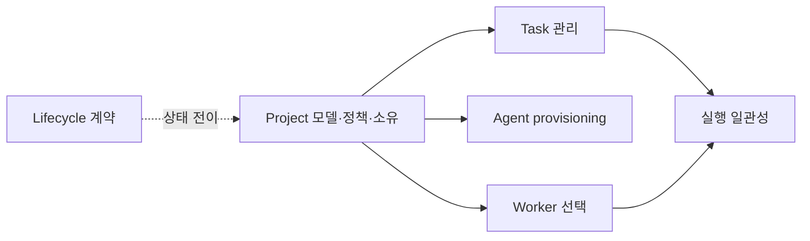

# Project 모델과 거버넌스

Project는 개발 목표, 권한, 정책, Agent 소유를 묶는 경계다. Host와 Worker는 Fleet 공유 실행 풀이고 Project가 물리 자원을 예약하지 않는다. 이 문서는 Project의 데이터 모델, Agent admission 정책, 디스패치 자격, 권한 경계를 소유한다. 구현 상태는 **부분 구현**이다(로드맵 `#48`, 1단계 완료 2026-08-24). `Project` 엔티티(id·name·description·created_by·status·created_at·updated_at)와 그 CRUD(HTTP `/api/projects`, MCP `fleet_create_project`/`fleet_list_projects`/`fleet_delete_project`)는 이제 실제로 존재하고, `Task` 제출 시 `project_id`가 처음으로 검증된다(존재하지 않거나 `active`가 아닌 project를 가리키면 거절). 그러나 Agent admission 정책·`max_active_agents`/`max_warm_agents` 강제·Worker eligibility selector·정책 revision은 여전히 미구현이다 — 이 문서 아래 각 절에 구현 여부를 명시했다. `status`는 목표 5-상태(`Draft`/`Active`/`Draining`/`ArchiveBlocked`/`Archived`)가 아니라 `Active`/`Draining`/`Archived` 3-상태로 축소돼 있다 — 나머지 두 상태는 Agent·AgentTemplate·effect ledger가 있어야 의미가 생긴다(`crates/fleet-core/src/project.rs`의 모듈 문서 참고).

## 범위

| 이 문서가 소유 | 다른 정본이 소유 |
|---|---|
| Project 데이터·정책 revision·Agent 소유 | [Task 관리](tasks/management.md)의 제출·결과·감사 |
| Agent admission과 shared Worker eligibility | [배치·맥락 계약](entity-placement-and-context.md)의 Host·Worker·Agent placement |
| Project Task의 Worker 선택 자격 | [실행 일관성](tasks/execution-consistency.md)의 실행 CAS·dead-letter |
| Project 권한의 승인 조건 | [Project 관리 계약](../contracts/project-management.md)의 HTTP·MCP 표면 |

화면 구성은 [UI Dashboard](../ui-dashboard/ui-design.md)가, Agent 생성·중지는 [Agent provisioning](agents/provisioning.md)이 소유한다. 이 문서는 SQL, Store 메서드 시그니처, 화면 명세, 구현 단계별 작업 목록을 반복하지 않는다.

## 목표 데이터 모델

| 대상 | 목표 필드·관계 | 의미 |
|---|---|---|
| `projects` | `id`, 고유 `name`, `description`, `created_by`, `max_active_agents`, `max_warm_agents`, worker eligibility selector, 정책 revision, `retention_policy_id`, `retain_until`, 생성·갱신 시각 | Project의 지속적 정책 경계. **1단계(#48, 완료)**: `id`/`name`/`description`/`created_by`/`status`(3-상태)/생성·갱신 시각만 실제 테이블(`projects`, migration 022)에 존재한다. `max_active_agents`/`max_warm_agents`/worker eligibility selector/정책 revision/`retention_policy_id`/`retain_until`은 Agent·AgentTemplate·effect ledger가 없어 아직 컬럼조차 없다 — 미리 만들면 항상 `NULL`인 죽은 컬럼이 된다(`#70` 조사에서 죽은 `FailureKind` variant를 제거한 것과 같은 이유) |
| `tasks` | nullable `project_id` | 값이 없으면 일반 풀 Task. **1단계**: 존재만 검증한다(제출 시 project 존재·`active` 상태 확인) — Agent/Worker 후보를 Project로 제한하는 디스패치 자격(아래 절)은 아직 미구현 |
| `agents` | immutable `project_id`, role/context, 상태 | Project가 소유하는 논리 실행 주체. **미구현** — `Agent` 엔티티 자체가 이 저장소에 없다 |
| `worker_execution_leases` | `agent_id`, `worker_id`, generation, 상태, 시각 | 활성 Agent의 일시적 Worker slot 점유. **미구현** — 로드맵 `#67` |
| `project_archive_holds` | `project_id`, kind, reason, opened/resolved 시각, actor, evidence | effect·cleanup·security/legal hold가 archive를 막는 기록. **미구현** — 1단계의 archive 게이트는 "이 project를 참조하는 비종료 Task 없음" 하나뿐이다(`Store::project_has_active_tasks`) |

Agent provisioning 관련 기본 템플릿, 유휴 시간, 작업 디렉터리 같은 설정은 Project가 정책 값으로 제공할 수 있지만, Agent 템플릿과 실행 수명은 Agent 도메인이 소유한다. 정책이 바뀌면 revision을 올리고 새 Task에만 적용한다. 이미 실행 중인 Task는 제출 시점 snapshot을 유지한다.

Agent는 Project를 상속하는 임시 Worker process가 아니라 immutable `project_id`를 가진 논리
엔티티다. Project가 Agent의 warm idle 정책과 agent 수 상한을 허용할 수는 있지만,
Project가 Task 하나를 제출했다고 Agent process를 계속 상주시켜서는 안 된다. 배치·context
보존·archive 뒤 Worker 처리의 정본은 [Entity placement & context](entity-placement-and-context.md)다.

## 공유 실행 풀 불변식

- Host와 Worker에는 `project_id`를 두지 않는다. 하나의 Worker는 시간에 따라 여러 Project의 Agent를 실행할 수 있다.
- Agent는 immutable `project_id`를 가진다. 실행 시에만 Worker lease를 얻고, lease 종료 후 Worker는 다른 Project에 즉시 사용될 수 있다.
- Project의 `max_active_agents`/`max_warm_agents`와 Worker의 `max_agent_processes`를 모두 만족해야 activation할 수 있다. 기본은 1/0이다.
- `max_active_agents`는 `Starting|Running`, `max_warm_agents`는 `WarmIdle`만 세며, WarmIdle도 Worker process slot을 점유한다. Project가 허용하지 않으면 Task 종료 뒤 항상 Hibernated다.
- Worker 선택은 Project가 허용한 capability label·격리 class를 만족해야 한다. GPU처럼 특수한 실행 환경은 raw resource allocation 대신 operator 관리 capability class로 선택한다.
- 여러 Project가 실행되는 Host에서는 `container_required` 또는 동등 이상의 격리가 필수다. `host_trusted`는 운영상 단일 Project만 실행 중인 Host에만 허용한다.

## 디스패치 자격

`task.project_id`가 있으면 해당 Project의 Agent와 정책을 통해서만 실행한다. 후보 Worker는 Project capability·격리·slot 조건으로 선택하며, 후보가 없더라도 일반 풀 context로 폴백하지 않는다. 이 경우의 재시도, 최종 실패, dead-letter 처리는 [실행 일관성](tasks/execution-consistency.md)의 `WorkerUnavailable` 경로를 따른다. `project_id`가 없는 Task는 기존 일반 풀 선택 규칙을 그대로 따른다.

**1·2단계(#48, 완료) 구현**: 이 절의 자격 검증(Project capability·격리·slot 조건으로 Worker 후보를 제한하는 것)은 아직 없다 — Agent가 없어 "Project의 Agent"라는 개념 자체가 성립하지 않는다. 지금 실제로 검증하는 건 제출 시점 하나뿐이다: `project_id`가 존재하지 않거나 해당 Project가 `active`가 아니면(`draining`/`archived`) 제출 자체를 거절한다. **2단계로 이 검증이 두 표면 모두에 적용된다** — Dashboard `POST /api/tasks`와 MCP `fleet_dispatch_task`가 `fleet_store::ensure_project_accepts_new_tasks` 한 구현을 공유한다(계약 문서가 요구하는 "Dashboard와 MCP의 동일한 권한·오류 응답"). 이어가기(`parent_task_id`)는 부모의 Project 경계를 상속하며, 상속된 값도 명시 입력과 똑같이 검증한다 — 부모의 Project가 그 사이 닫혔으면 이어가기도 거절된다. 통과한 Task는 여전히 기존 일반 풀 선택 규칙 그대로 dispatch된다 — Project는 지금은 "이 Task가 어느 개발 목표에 속하는가"를 기록하는 경계일 뿐, 실행 후보를 좁히지 않는다.

Project가 `Draining`이면 새 Task, 새 Agent, 새 자원 배정을 받지 않는다. `Archived` 전이와 보존·정리 순서는 [Lifecycle 계약](project-task-agent-lifecycle.md)을 따른다.

## 권한과 구현 차단 조건

Project 권한 종류는 `project:create`, `project:read`, `project:update`, `project:delete`, `project:policy_manage`다. `ProjectRead`는 Project 범위 내 읽기만 허용한다. 생성·삭제와 정책 관리를 **어느 기본 역할에 배정할지**는 아직 승인된 계약이 아니다 — 정책 관리와 Agent 생성의 *관계*는 2026-08-27에 승인됐지만(아래 조건 1), 그것이 역할 번들을 정하지는 않는다.

**1단계(#48, 완료)**: `project:create`/`project:read`/`project:delete` 세 capability만 실제로 존재한다(`crates/fleet-core/src/auth.rs::PermissionKind`). `project:update`(목표 계약의 `PATCH` 대응)와 `project:policy_manage`는 아직 만들지 않았고, 사유는 2026-08-27 승인 이후 서로 갈라졌다. `project:policy_manage`는 아래 차단 조건에 더해 관리할 정책 컬럼이 `projects`에 하나도 없어서 만들면 죽은 권한이 된다. `project:update`는 승인 결정 3으로 이 차단에서 벗어났으나, [Project 관리 계약](../contracts/project-management.md)이 `PATCH` 구현 전에 확정하라고 정한 동시 편집 의미(revision 또는 `If-Match`, `request_id`)가 아직 정해지지 않았다 — 보안 차단이 아니라 미결 계약이다. `project:delete`는 목표 계약이 말하는 "archive 요청"만 수행한다(영구 삭제 아님, 아래 lifecycle 문서 참고).

특히 Project 정책 변경과 Task 생성이 자동 Agent provisioning을 통해 Agent 생성 권한을 우회할 가능성이 있다. 따라서 다음이 확정되고 검증되기 전에는 정책 변경 API나 MCP 도구를 구현하거나 활성화하지 않는다.

1. ~~`ProjectPolicyManage` 역할과 `AgentCreate` 역할의 관계를 보안 모델에서 승인한다.~~ **승인됨(2026-08-27).**
   규칙의 정본은 [Authorization·Project Scope·감사](../security/authorization-and-audit.md)의
   "Project 정책 변경과 Agent 생성의 관계"다 — Agent 수·provisioning 대상을 바꾸는 정책 필드는
   `project:policy_manage`에 더해 `agent:manage`를 요구하고(필드별 게이팅), 권한 확인 시점은 Task
   제출이 아니라 정책 쓰기다. 승인 요청 문언의 `AgentCreate`는 목표 capability 표에 없는 이름이라
   `agent:manage`로 정정됐다.
2. 자동 provisioning이 배정·Task 요청자의 권한 상승 경로가 아님을 테스트로 증명한다.
3. agent slot 경쟁, lease 회수, Project Worker 부재 경로를 통합 테스트로 검증한다.

**1번이 닫혀도 정책 변경 표면은 열리지 않는다.** 2·3번은 사람 결정이 아니라 테스트 조건이고, 그
대상인 `agents`와 `worker_execution_leases`(로드맵 `#67`)가 아직 없어 지금은 작성할 수조차 없다.
승인이 세 조건을 한꺼번에 해소한 것으로 읽지 않는다.

**이 차단은 정책 변경에만 걸린다.** `name`·`description` 같은 Project 메타데이터 편집은 Agent를
만들지 않으므로 이 조건의 대상이 아니다(승인 결정 3). `#86`의 템플릿 편집을 같은 이유로 이 차단에서
제외한 2026-08-22 판정과 같은 형태다.

미결 정책의 비교와 선택지는 [Project model review](../reviews/project-model-review-2026-08-17.md)에 기록한다. 이 문서는 승인된 불변식과 차단 조건만 보존한다.

## 관련 문서

- [Project 관리 외부 계약](../contracts/project-management.md) — 제안된 Dashboard HTTP와 MCP 표면
- [Project·Task·Agent lifecycle](project-task-agent-lifecycle.md) — 교차 상태 전이
- [Agent provisioning](agents/provisioning.md) — Agent 생성·중지와 Project 정책 소비
- [UI Dashboard](../ui-dashboard/ui-design.md) — Project 화면과 상태 표현
- [Roadmap](../roadmap/roadmap.md) — 구현 우선순위
