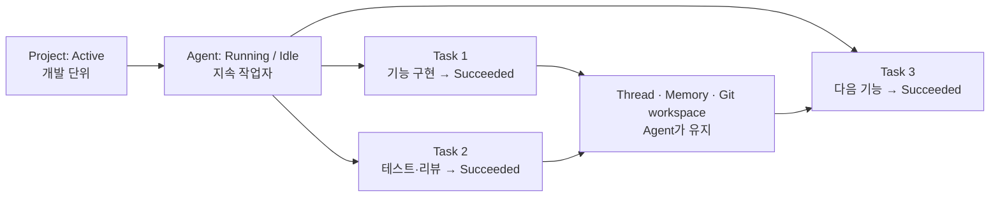
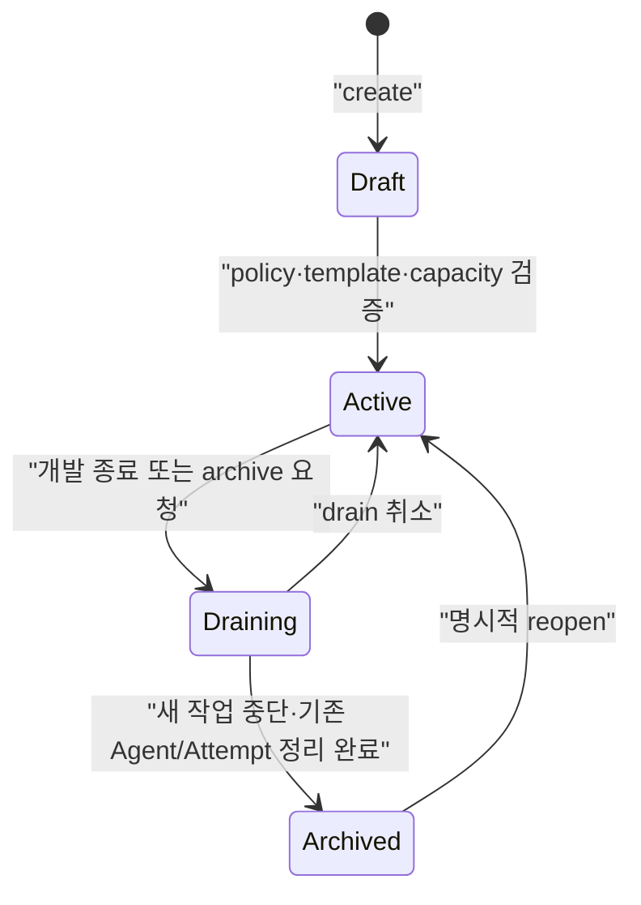

# Project · Task · Attempt · Agent Lifecycle 계약

## 목적과 책임 경계

이 문서는 각 엔티티의 데이터 모델이나 API를 반복하지 않는다. Project, Task,
TaskAttempt, Agent가 함께 전이할 때 지켜야 하는 교차 불변식과 전이 순서만
정본으로 둔다.

| 엔티티 | 세부 정본 | 이 문서의 책임 |
|---|---|---|
| Project | [Project model & governance](project-feature-design.md) | Task/Agent를 허용하는 운영 상태 |
| Task | [Task management](task-management-design.md) | terminal Task와 Project의 관계 |
| TaskAttempt | [Task execution consistency](task-execution-consistency.md) | retry/cancel/부작용의 교차 우선순위 |
| Agent | [Agent provisioning](agents/provisioning.md) | Project 종료 시 생성·정지 제약 |

## 핵심 구분

개발이 지속되는 동안 살아 있어야 하는 주체는 `Task`가 아니라 `Project`와 그에 배정된 `Agent`다. Task는 검증 가능한 완료 조건을 가진 한 번의 작업이며, 코드 작성이 끝나면 반드시 터미널 상태가 된다. Agent는 다음 Task를 받기 위해 실행 상태와 작업 문맥을 유지한다.



| 엔티티 | 책임 | 지속 범위 | 터미널 규칙 |
|---|---|---|---|
| Project | 개발 목표·정책·리소스 소유 | 개발 수명 전체 | archive 전까지 Active 또는 Draining |
| Agent | 지속 작업자·workspace·memory·thread 문맥 | 여러 Task에 걸침 | 명시 stop, 자동 Agent idle 정책, 또는 Project drain 완료 시 종료 |
| Task | 하나의 검증 가능한 작업 의도 | 한 번의 dispatch/attempt | `Succeeded`/`Failed`/`Cancelled`/`DeadLettered` 중 하나로 끝남 |
| TaskAttempt | Task의 실행 시도 | retry 또는 실행 1회 | 결과/취소/불확실 결과로 종료; 다음 attempt가 별도 생성됨 |

### 현재 구현과 목표 모델

현재 구현에는 `Task`의 5상태가 있으며 `ProjectId`와 `tasks.project_id` 예약 컬럼은
존재한다. 그러나 Project 엔티티, `TaskRequest.project_id` 전달, TaskAttempt는 아직
구현되지 않았다. 따라서 현재 Task 상태와 목표 Attempt 상태를 같은 상태 기계로
표현하거나, 목표 계약을 현재 동작처럼 설명하지 않는다.

목표 도입 기간에는 Task가 외부 호환 상태를 유지하고, 최신 Attempt의 terminal 결과를
Task에 투영한다. 과거 Attempt 결과와 audit record를 덮어쓰지 않는다.

## Project lifecycle



- `Draft`: Task dispatch와 Agent 자동 생성을 허용하지 않는다.
- `Active`: 새 Task와 Agent를 허용한다. Task가 끝나도 Project와 장기 Agent는 그대로 Active다.
- `Draining`: 새 Task·새 Agent·자원 재배정을 막는다. 실행 중 Attempt는 제출 시점 policy/isolation/skill revision snapshot으로 마무리한다.
- `Archived`: 비터미널 Attempt가 없고 Project Agent가 정지된 뒤 전이한다. 조회·감사·재개는 가능하지만 새 dispatch는 불가하다.

`Deleted`는 runtime 상태가 아니라 archive 보존 기간 이후 수행하는 관리 작업이다. 실행 중 Task/Agent가 있는 Active Project를 즉시 삭제하지 않는다.

## Task와 Agent의 관계

1. Task 완료는 Agent 종료를 뜻하지 않는다.
2. Task는 terminal 이후 재개하지 않는다. 후속 작업은 새 Task로 만들고 thread/memory/workspace를 이어받는다.
3. Agent가 `Idle`인 것은 별도 Agent lifecycle 판단이며 Task 상태가 아니다. Manual Agent는 명시 stop 전까지 유지할 수 있고, Automatic Agent만 설정된 idle timeout에 따라 회수한다.
4. Draining 중에는 새 Task와 새 Agent를 만들지 않는다. 이미 실행 중인 TaskAttempt에는 deadline 이후 cancel을 요청할 수 있으나, 부작용 rollback을 자동으로 가정하지 않는다.

## 교차 전이와 소유자

| 원인 | Project | Task/Attempt | Agent |
|---|---|---|---|
| Task 완료 | `Active` 유지 | 해당 Task/Attempt만 terminal | Running 또는 Idle 유지 |
| Agent 장애 | `Active` 유지 | 재시도 규칙에 따라 새 Attempt 또는 실패 | `Failed` |
| Drain 시작 | `Draining` | 새 Task/Attempt 차단, 기존 Attempt 관찰·deadline cancel | 새 Agent 생성 차단, 기존 stop 계획 |
| Drain 취소 | `Active` | 새 제출 재개, 이미 요청된 cancel은 자동 철회 안 함 | 자동 생성 재개 가능 |
| Archive 완료 | `Archived` | 모든 Attempt가 terminal | 모두 `Stopped` 또는 `Failed` |
| Reopen | `Active` | 새 Task만 생성 가능 | 새 Agent 생성 가능 |

Project Manager만 Project 상태를 전이한다. Task Manager와 Agent Provisioner는
비동기 이벤트만 믿지 않고 각 write transaction에서 Project 상태를 재확인한다.
archive는 비터미널 Attempt와 실행 중 Agent가 없음을 영속 저장소에서 확인한 뒤에만
완료된다.

```mermaid
sequenceDiagram
    participant Op as "Operator"
    participant PM as "Project Manager"
    participant TM as "Task Manager"
    participant AP as "Agent Provisioner"
    participant EX as "Execution Controller"

    Op->>PM: "drain(project)"
    PM->>PM: "Active → Draining"
    PM->>TM: "block new tasks and attempts"
    PM->>AP: "block new agents; plan stop"
    PM->>EX: "observe; cancel after deadline"
    EX-->>PM: "all attempts terminal"
    AP-->>PM: "all agents terminal"
    PM->>PM: "Draining → Archived"
```

## Snapshot과 보존 규칙

- Task 제출 시 Project policy revision, required capability, harness/Skill revision,
  isolation 요구사항, input hash를 snapshot한다.
- Project 정책을 바꾸거나 reopen해도 이미 실행 중인 Attempt의 snapshot은 바뀌지
  않는다. 새 Task 또는 새 Attempt에만 새 정책을 적용한다.
- `Deleted`는 runtime 상태가 아니다. Archived 보존·감사 조건을 만족한 뒤 수행하는
  관리 작업이며 `ON DELETE SET NULL`로 실행 중 문맥을 지우지 않는다.
- cancel은 요청과 확정을 구분한다. `Cancelled`가 외부 부작용의 rollback 완료를 뜻하지
  않으며, 보상은 Task execution consistency 계약을 따른다.

## 정본 간 책임 분배

- 이 문서: Project·Agent·Task의 수명 범위와 cross-entity 전이
- [Project 기능 설계](project-feature-design.md): Project 데이터·배정·권한·API
- [Task Management](task-management-design.md): Task 제출·의존성·우선순위·결과·감사
- [Agent 프로비저닝](agents/provisioning.md): Agent process/control 상태 전이
- [Task 실행 일관성](task-execution-consistency.md): TaskAttempt CAS·retry·멱등성

구현 시 Project 상태, Agent idle 여부, Task/Attempt snapshot을 서로의 상태 필드로 대체하지 않는다.
