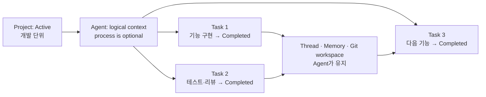
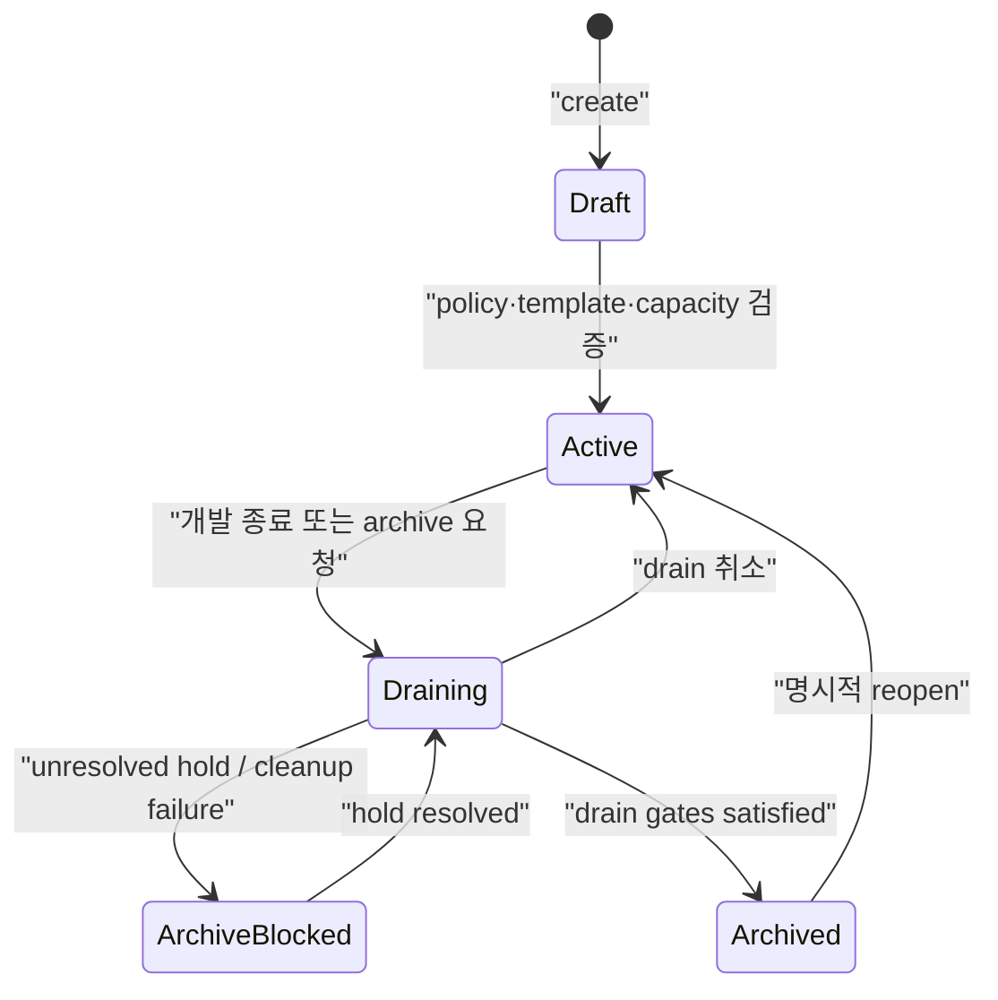

# Project · Task · Agent Lifecycle 계약

## 목적과 책임 경계

이 문서는 각 엔티티의 데이터 모델이나 API를 반복하지 않는다. Project, Task,
Agent가 함께 전이할 때 지켜야 하는 교차 불변식과 전이 순서만 정본으로 둔다.

**`TaskAttempt`는 별도 엔티티가 아니다.** 실행 시도는 `Task`에 흡수돼 있으며, 그 판정과
근거는 아래 [Attempt 흡수 판정](#attempt-흡수-판정)에 정본으로 둔다.

| 엔티티 | 세부 정본 | 이 문서의 책임 |
|---|---|---|
| Project | [Project model & governance](project-feature-design.md) | Task/Agent를 허용하는 운영 상태 |
| Task | [Task management](tasks/management.md) | terminal Task와 Project의 관계 |
| Task 실행 | [Task execution consistency](tasks/execution-consistency.md) | cancel/부작용의 교차 우선순위 |
| Agent | [Agent provisioning](agents/provisioning.md) | Project 종료 시 생성·정지 제약 |
| Placement/context | [Entity placement & context](entity-placement-and-context.md) | Worker daemon, Agent process, durable context의 분리 |

## 핵심 구분

개발이 지속되는 동안 살아 있어야 하는 주체는 `Task`가 아니라 `Project`와 그에 배정된 `Agent`다. Task는 검증 가능한 완료 조건을 가진 한 번의 작업이며, 코드 작성이 끝나면 반드시 터미널 상태가 된다. Agent는 다음 Task를 받기 위해 실행 상태와 작업 문맥을 유지한다.



| 엔티티 | 책임 | 지속 범위 | 터미널 규칙 |
|---|---|---|---|
| Project | 개발 목표·정책·리소스 소유 | 개발 수명 전체 | archive 전까지 Active 또는 Draining |
| Agent | 지속 역할·workspace·memory·thread 문맥 | 여러 Task에 걸침 | logical Agent는 Project archive 때 종료; process는 Task 뒤 기본 hibernate |
| Task | 하나의 검증 가능한 작업 의도이자 그것의 실행 시도 | 생성부터 terminal까지, 실행은 dispatch~terminal 구간 1회 | 현재 `Completed`/`Failed`/`Cancelled` 중 하나로 끝남; 재시도하지 않으므로 다시 하려면 새 Task |

### 현재 구현과 목표 모델

현재 구현에는 `Task`의 5상태가 있으며 `ProjectId`와 `tasks.project_id` 저장·Task 요청 전달은
존재한다. **로드맵 `#48` 1단계(2026-08-24)로 `Project` 엔티티도 존재하지만, 이 문서가 정의하는
5-상태 lifecycle(`Draft`/`Active`/`Draining`/`ArchiveBlocked`/`Archived`)이 아니라
`Active`/`Draining`/`Archived` 3-상태로 축소돼 있다** — `Draft`는 AgentTemplate 검증 대상이 없어
모든 Project가 생성과 동시에 `Active`로 시작하고, `ArchiveBlocked`는 Agent process/lease/credential
grant cleanup 증거가 필요한데 그 하부 구조(Agent, `#67`)가 없어 만들 수 없다. `Draining → Archived`
게이트도 이 문서의 sequence diagram이 그리는 전체 절차(실행 관찰, effect ledger 재평가, cleanup
증거 확인)가 아니라 "이 Project를 참조하는 비종료 Task가 없다" 하나뿐이다. Project 엔티티·정책
enforcement는 여전히 대부분 아직 구현되지 않았다. 따라서 현재 Task 상태와 목표 상태를 같은 상태
기계로 표현하거나, 목표 계약을 현재 동작처럼 설명하지 않는다.

목표 도입 기간에도 Task는 외부 호환 상태를 유지한다. 실행 결과는 Task 자신의 terminal 상태이며
투영 단계가 없다. 확정된 terminal 결과와 audit record는 덮어쓰지 않는다.

## Project lifecycle



- `Draft`: Task dispatch와 Agent 자동 생성을 허용하지 않는다.
- `Active`: 새 Task와 Agent를 허용한다. Task가 끝나도 Project와 장기 Agent는 그대로 Active다.
- `Draining`: 새 Task·새 Agent·자원 재배정을 막는다. 실행 중 Task는 제출 시점 policy/isolation/skill revision snapshot으로 마무리하거나 deadline 뒤 cancel한다.
- `ArchiveBlocked`: process cleanup 미확인, 미해결 `PartiallyApplied` effect, security/legal hold 중 하나가 남은 상태다. 새 실행은 계속 막고 hold 해제 전 archive하지 않는다.
- `Archived`: 비터미널 Task가 없고, Agent process/lease/credential grant cleanup 및 hold 정책을 통과한 뒤 전이한다. 조회·감사·재개는 가능하지만 새 dispatch는 불가하다.

`Deleted`는 runtime 상태가 아니라 archive 보존 기간 이후 수행하는 관리 작업이다. 실행 중 Task/Agent가 있는 Active Project를 즉시 삭제하지 않는다.

## Task와 Agent의 관계

1. Task 완료는 Agent 종료를 뜻하지 않는다.
2. Task는 terminal 이후 재개하지 않는다. 후속 작업은 새 Task로 만들고 thread/memory/workspace를 이어받는다.
3. Agent의 `WarmIdle`과 `Hibernated`는 별도 Agent lifecycle 판단이며 Task 상태가 아니다. WarmIdle은 비용 최적화용 짧은 lease이고, 기본값은 Task 뒤 process 종료·Hibernated다.
4. Draining 중에는 새 Task와 새 Agent를 만들지 않는다. 이미 실행 중인 Task에는 deadline 이후 cancel을 요청할 수 있으나, 부작용 rollback을 자동으로 가정하지 않는다.
5. `PartiallyApplied`/`DeadLettered` Task는 runtime상 terminal이지만, 미해결 effect가 있으면
   Project archive를 막는 hold를 만든다. operator의 보상 완료, 명시적 risk acceptance, 또는
   security/legal hold 전환 없이는 hold를 닫지 않는다.

## 교차 전이와 소유자

| 원인 | Project | Task | Agent |
|---|---|---|---|
| Task 완료 | `Active` 유지 | 해당 Task만 terminal | 기본 Hibernated, 명시 lease가 있으면 WarmIdle |
| Agent 장애 | `Active` 유지 | 실행 중이던 Task는 실패로 terminal — 자동 재실행은 없다 | `Failed` |
| Drain 시작 | `Draining` | 새 Task 차단, 실행 중 Task 관찰·deadline cancel | 새 Agent 생성 차단, 기존 stop 계획 |
| Archive hold | `ArchiveBlocked` | 미해결 effect/cleanup은 실행하지 않고 보존 | process inventory 확인·cleanup 재시도 |
| Drain 취소 | `Active` | 새 제출 재개, 이미 요청된 cancel은 자동 철회 안 함 | 자동 생성 재개 가능 |
| Archive 완료 | `Archived` | 모든 Task가 terminal, effect hold 해소 | 모든 process/lease/grant cleanup 증명 |
| Reopen | `Active` | 새 Task만 생성 가능 | 새 Agent 생성 가능 |

Project Manager만 Project 상태를 전이한다. Task Manager와 Agent Provisioner는
비동기 이벤트만 믿지 않고 각 write transaction에서 Project 상태를 재확인한다.
archive는 비터미널 Task가 없고, execution lease·credential/attach grant가 release됐으며,
Worker inventory가 Project Agent process 부재를 증명하고, open archive hold가 없음을 영속 저장소에서
확인한 뒤에만 완료된다. Agent 상태가 `Failed`여도 process 부재와 cleanup 증거가 없으면 archive하지
않는다.

```mermaid
sequenceDiagram
    participant Op as "Operator"
    participant PM as "Project Manager"
    participant TM as "Task Manager"
    participant AP as "Agent Provisioner"
    participant EX as "Execution Controller"

    Op->>PM: "drain(project)"
    PM->>PM: "Active → Draining"
    PM->>TM: "block new tasks"
    PM->>AP: "block new agents; plan stop"
    PM->>EX: "observe; cancel after deadline"
    EX-->>PM: "tasks terminal + effect ledger"
    AP-->>PM: "process/lease/grant cleanup evidence"
    PM->>PM: "evaluate archive holds"
    alt all gates pass
        PM->>PM: "Draining → Archived"
    else unresolved hold
        PM->>PM: "Draining → ArchiveBlocked"
    end
```

## Snapshot과 보존 규칙

- Task 제출 시 Project policy revision, required capability, harness/Skill revision,
  isolation 요구사항, input hash를 snapshot한다.
- Project 정책을 바꾸거나 reopen해도 이미 실행 중인 Task의 execution snapshot은 바뀌지
  않는다. 새 Task에만 새 정책을 적용한다.
- `Deleted`는 runtime 상태가 아니다. Archived 보존·감사 조건을 만족한 뒤 수행하는
  관리 작업이며 `ON DELETE SET NULL`로 실행 중 문맥을 지우지 않는다.
- archive 요청에는 `request_id`, requested_by, drain deadline, policy revision을 기록한다. 같은
  request_id의 재요청은 현재 archive progress를 반환하는 idempotent 동작이다.
- archive가 되면 Project credential grant를 revoke하고, Agent context는 read-only로 봉인한다.
  Git checkpoint/artifact/context/audit은 retention policy가 정한 `retain_until`까지 보존한다.
- reopen은 `Archived`에서만 가능하며 새 policy revision과 새 Agent/lease/credential grant를 만든다.
  과거 Task·WarmIdle process·delivery grant를 재개하거나 재사용하지 않는다.
- 영구 삭제는 `retain_until` 경과, open security/legal hold 부재, audit 보존 이관 확인 뒤의 별도
  관리 작업이다. Git 원격 삭제와 audit 삭제는 동일 트랜잭션으로 가정하지 않고 각각 증거를 남긴다.
- cancel은 요청과 확정을 구분한다. `Cancelled`가 외부 부작용의 rollback 완료를 뜻하지
  않으며, 보상은 Task execution consistency 계약을 따른다.

## Attempt 흡수 판정

> 2026-08-26 판정 (로드맵 [`#97`](../roadmap/roadmap.md)). 이 절이 존치/흡수 판정의 정본이다.

**판정: 흡수.** `TaskAttempt`는 별도 엔티티로 도입하지 않으며, 그것이 들고 있던 식별자와 상태는
`Task`에 놓인다. 필드 배치와 CAS 술어는 [Task 실행 일관성](tasks/execution-consistency.md)이
소유하고, 이 절은 판정 자체와 교차 도메인 결과만 정본으로 둔다.

### 무엇을 판별했는가

무재시도 정책([`#62`](../roadmap/roadmap.md) 4단계) 아래에서 Task와 실행 시도는 1:0..1이다. 그래도
별도 엔티티가 필요하려면 **한 Task가 정당하게 두 개의 실행 레코드를 갖는 경로**가 있어야 한다.
후보 셋을 정본 문구에 대조했고, 셋 다 그 경로가 아니었다.

| 후보 경로 | 정본 근거 | 실제 의미 |
|---|---|---|
| Agent process 교체 후 재개 | [`entity-placement-and-context.md`](entity-placement-and-context.md) "같은 Agent가 **새** Attempt를 재개" | 같은 Task의 두 번째 실행이 아니라 **새 Task**다 |
| WarmIdle process 재사용 | 같은 문서의 상태 기계 `WarmIdle --> Running: "next compatible task"`, 그리고 "WarmIdle process에는 실행 중 Task가 없고" | 한 process가 **여러 Task**를 거치는 것이다 |
| 부분 적용 뒤 이어 실행 | 이 문서 "Task는 terminal 이후 재개하지 않는다. 후속 작업은 새 Task로 만들고" | 보상·후속은 **새 Task**다 |

셋의 공통 구조는 같다 — 실행 정체성이 여러 실행에 걸쳐 살아남는 주체는 **Agent**이지 Task가
아니다. 그리고 Agent는 [`#67`](../roadmap/roadmap.md)로 이미 별도 엔티티다. 즉 `TaskAttempt`가
맡으려던 역할은 이미 임자가 있다.

이 문서 자신이 판정 전에 이미 모순돼 있었다는 점도 근거다. 엔티티 표의 `Task` 행은 지속 범위를
"한 번의 dispatch/attempt"로 적었는데 바로 다음 `TaskAttempt` 행은 존재 이유를 "retry"로 적었다.
무재시도 아래에서 그 행의 생산자는 아무 데도 없다.

### 용어 대응

| 예전 표현 | 판정 후 |
|---|---|
| `TaskAttempt` 엔티티 | 삭제 — `Task`가 그 역할을 겸한다 |
| 실행 중 Attempt | 실행 중 Task (dispatch~terminal 구간) |
| Attempt snapshot, `attempt_snapshot_id` | execution snapshot — Task와 1:1이므로 `task_id`로 도달한다 |
| `attempt_id` | `task_id` |
| 새 Attempt (retry) / 다음 attempt (WarmIdle) | 새 Task / 다음 Task |
| Attempt generation | 삭제 — `dispatch_control_epoch`가 대신한다 |
| `RetryWaiting` | 삭제 — 생산자가 없다 |
| `Agent.max_concurrent_attempts` | `Agent.max_concurrent_tasks` |

### 개명이 아닌 곳 — credential grant 수명

**"Attempt 단위 grant"를 "Task 단위 grant"로 평평하게 바꾸면 안 된다.** Attempt는 실행 구간에만
존재했지만 Task 행은 `Pending` 생성부터 terminal, 그리고 archive 보존 기간까지 산다. 그대로
개명하면 credential이 유효한 시간 구간이 **조용히 넓어진다**. 판정 후의 정확한 구속은 이것이다.

> grant는 Task 행의 수명이 아니라 **dispatch부터 terminal까지의 실행 구간**에 묶인다.
> `Pending` Task에는 발급하지 않고, terminal 전이 시 회수한다.

[제어면 보안 모델](../security/control-plane-security-model.md)과
[인가·감사](../security/authorization-and-audit.md)가 이 문구를 따른다.

### 다른 정본에 미치는 결과

- **감사 상관 필드**: `attempt_id`는 "엔티티가 생기면 채운다"가 아니라 `task_id`이며 이미 있다.
  [`#95`](../roadmap/roadmap.md)가 이 판정을 전제로 한다.
- **실행 lease**: [`control-plane-authority-and-failover.md`](control-plane-authority-and-failover.md)의
  `worker_execution_lease`는 **만들지 않는다**(2026-09-01 범위 정정). 그 문서가 그린 11필드 중
  오늘 채울 주체가 있는 것은 `control_epoch` 하나뿐이었고, `#67` 게이트 ①-B는 그것을
  `agents.command_control_epoch` 컬럼 하나와 명령 발행 쓰기의 술어로 대신했다. WarmIdle이
  기다리는 것은 따라서 스키마가 아니라 **Agent 프로세스의 실행 상태 관측**이다.
- **Project archive 조건**: "이 Project의 Task가 전부 terminal인가"는 이제 **완전한** 조건이다.
  따로 확인해야 할 비터미널 Attempt가 남아 있지 않다.

## 정본 간 책임 분배

- 이 문서: Project·Agent·Task의 수명 범위와 cross-entity 전이
- [Project 모델과 거버넌스](project-feature-design.md): Project 데이터·배정·권한 차단 조건
- [Project 관리 계약](../contracts/project-management.md): 제안된 Dashboard HTTP·MCP 표면
- [Task Management](tasks/management.md): Task 제출·의존성·우선순위·결과·감사
- [Agent 프로비저닝](agents/provisioning.md): Agent process/control 상태 전이
- [Entity placement & context](entity-placement-and-context.md): Worker daemon·Agent process·durable context와 Tool/Skill binding
- [Task 실행 일관성](tasks/execution-consistency.md): Task CAS·cancel·멱등성

구현 시 Project 상태, Agent idle 여부, Task의 execution snapshot을 서로의 상태 필드로 대체하지 않는다.
