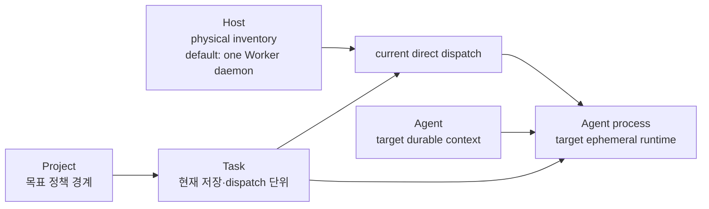

# 시스템 엔티티 관계 참조

이 문서는 현재 엔티티와 목표 엔티티의 관계를 빠르게 찾는 Derived 지도다. 관계의 규칙은
[Architecture](README.md)의 정본 선택표가 가리키는 문서가 소유한다.

| 엔티티 | 현재 상태 | 정본 |
|---|---|---|
| Task | 현재 `fleet-core`와 Store에 존재하며 Worker dispatch 단위다 | [Task management](tasks/management.md) |
| Worker | 현재 등록·heartbeat·model/label/capacity 정보를 가진 실행 대상이다 | [Worker liveness](worker-liveness-policy.md) |
| Host | 현재 등록 표면이 있으며 inventory 경계다 | [HTTP contract](../contracts/http-api.md) |
| Project | 목표 정책·권한·배정 경계다 | [Project model](project-feature-design.md) |
| Agent | 목표 장기 실행 인스턴스다 | [Agent domain](agents/README.md) |
| Skill·Tool·Memory | 목표 catalog·Project grant·Task execution snapshot 입력과 capability 경계다 | [Entity placement & context](entity-placement-and-context.md) |

Project/Agent 및 이들의 hard isolation은 현재 구현된 데이터 모델로 간주하지 않는다. 실행 기록은
별도 `TaskAttempt`가 아니라 `Task` 자신이다([흡수 판정](project-task-agent-lifecycle.md#attempt-흡수-판정)).
상태, 권한, prompt 조립, scheduler 필터를 이 문서에 복제하지 않는다.
