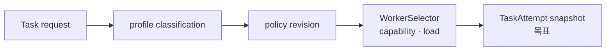

# Task Routing 정책

## 범위

이 문서는 논리적 작업 요구를 Worker 선택으로 연결하는 정책을 정의한다. usage 예산과
telemetry는 [Task 예산 제어](task-budget-control.md)가 소유하고, retry·OutcomeUnknown은
[실행 의미론](task-execution-consistency.md)이 소유한다.

## 현재 사실과 목표

| 주제 | 현재 구현 | 목표 계약 |
|---|---|---|
| Worker 선택 | `WorkerSelector`가 hint, label, model, load를 필터링하고 least-loaded를 선택 | 논리 profile과 policy revision을 snapshot으로 고정 |
| 작업 분류 | 휴리스틱 분류와 관련 저장 필드가 일부 존재 | profile별 허용 model·capability를 정책으로 관리 |
| override | 현재 request의 model/hint 제약을 사용 | scope·권한·정책 revision을 포함한 명시적 override 감사 |

## 결정

1. client가 물리 모델을 강제하지 않을 때 policy가 logical profile을 model/Worker capability로 해석한다.
2. profile, policy revision, 선택 이유는 TaskAttempt snapshot에 고정한다.
3. capability 불일치, policy 거절, override는 이유와 요청 principal을 감사 기록에 남긴다.
4. routing policy는 secret이나 request 원문을 Worker label·telemetry label로 만들지 않는다.

## 구현 게이트

1. profile과 policy revision을 포함한 TaskAttempt snapshot migration
2. 선택 이유·override·불일치 capability의 감사 시험
3. 정책 revision 변경이 기존 attempt를 바꾸지 않는 시험
