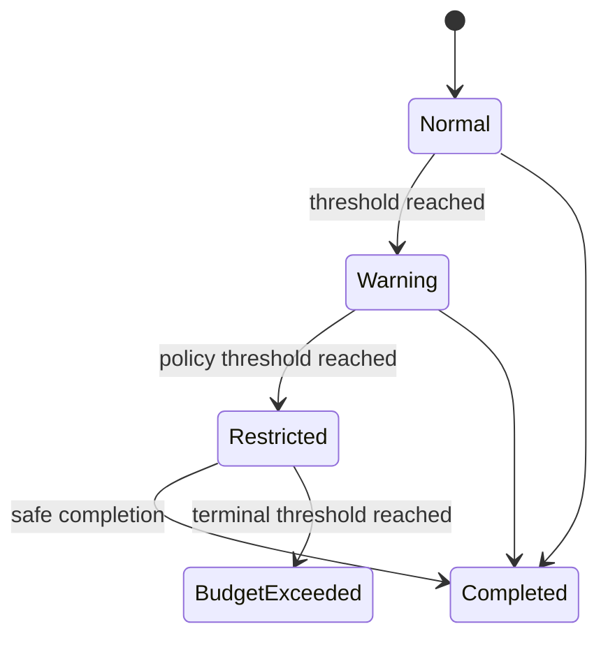

# Task 예산 제어

## 범위

이 문서는 Task 실행 중 usage 기반 예산 제한과 routing telemetry의 목표 계약을 정의한다.
Worker 선택은 [Task routing 정책](routing-policy.md), terminal 결과·retry·부작용은
[실행 의미론](execution-consistency.md)이 소유한다.

## 현재 사실과 목표

| 주제 | 현재 구현 | 목표 계약 |
|---|---|---|
| usage budget | UCB1, soft landing, Compact feedback loop는 구현 검증 전 | usage 기반 warning·tool 제한·종료를 상태 전이로 강제 |
| telemetry | 기본 task/HTTP 관측은 존재 | routing 결과와 비용·품질 feedback을 cardinality 제한과 함께 기록 |
| 종료 | 현재 scheduler는 budget terminal state를 소유하지 않음 | budget 초과가 retry·side-effect fencing을 우회하지 않음 |

## 결정

1. budget, 집계 기준, 정책 revision은 TaskAttempt snapshot에 고정한다.
2. warning, tool 제한, 종료는 명시적 상태 전이이며 실행 중 임의 변경하지 않는다.
3. terminal 결과와 OutcomeUnknown 처리는 실행 의미론 정본을 따른다.
4. telemetry label에는 request 원문, secret, 고카디널리티 식별자를 넣지 않는다.

## 구현 게이트

1. usage 집계와 정책 revision의 재현 시험
2. warning·tool 제한·terminal 처리 상태 전이 시험
3. budget 종료가 non-idempotent 부작용을 재실행하지 않는 시험
4. telemetry cardinality와 민감 정보 비노출 시험
