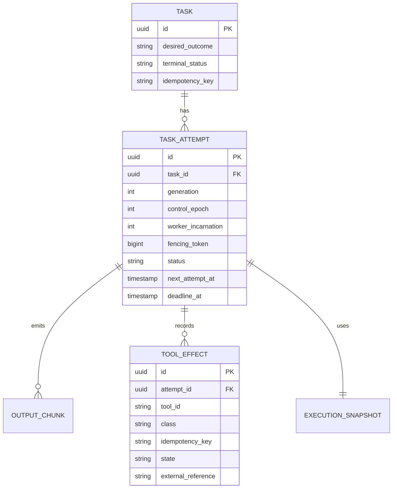
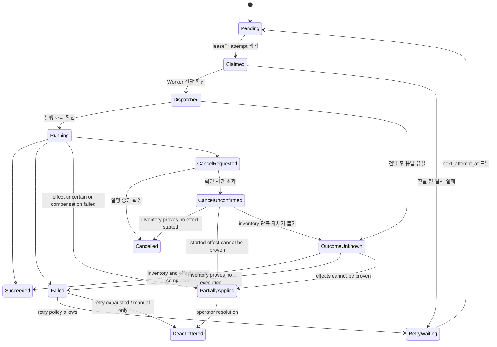

# 태스크 실행 일관성, 재시도 및 멱등성

## 목적

Task의 사용자 의도와 각 실행 시도를 분리하여 늦은 이벤트, 재시도, 취소, Worker
재연결이 터미널 상태를 되돌리거나 외부 부작용을 중복 실행하지 못하게 한다.

## 상태 모델

`CancelUnconfirmed`는 대기 상태이지 터미널 상태가 아니다. Reconciler는 이 상태의 Attempt를
`OutcomeUnknown`과 동일하게 재조정 대상으로 유지하며, Worker inventory와 effect ledger로 다음 중
하나로 해소한다: `Started` effect가 없음이 증명되면 `Cancelled`, `Started` effect가 있으나 provider
조회로 결과를 증명할 수 없으면 `PartiallyApplied`, inventory 관측 자체가 불가능하면 `OutcomeUnknown`.
해소 전까지 Project archive의 터미널 조건을 만족시키지 않으며, 미해소 상태가 임계 시간을 넘으면
alert 대상이다.

`Cancelled`, `Failed`, `Succeeded`, `PartiallyApplied`는 조건 없는 덮어쓰기를 허용하지 않는다. 모든 상태
변경은 현재 상태, `attempt_id`, generation, control epoch, worker incarnation, fencing token을
조건으로 하는 CAS다. Start/stop 전달 결과가 불명확하면 새 Attempt를 만들지 않고
`OutcomeUnknown`에서 Worker inventory를 관측한다.

`PartiallyApplied`는 실행의 일부 effect가 적용됐거나 적용 여부를 증명할 수 없는 상태다. 현재
외부 `TaskStatus`의 호환 계층에서는 `Failed`와 `failure_disposition=partially_applied`로 투영한다.
따라서 현재 API의 5상태를 즉시 깨지 않으며, operator가 effect ledger를 검토·보상·명시 redrive할
때까지 자동 retry하지 않는다.

## Effect ledger와 완료 조건

도구 실행이 파일·Git 밖에 영향을 줄 수 있으면 Worker는 호출 전 `tool_effect`를 durable ledger에
기록해야 한다. process output이나 모델의 "완료" 서술은 effect 증거가 아니다.

| Effect 상태 | 의미 | 다음 동작 |
|---|---|---|
| `Planned` | 실행 전 정책·입력 hash·idempotency key 확보 | 호출 가능 |
| `Started` | 요청을 전송했으나 결과 미확정 | 외부 조회 전 retry 금지 |
| `Applied` | provider receipt/external reference로 적용 증명 | 완료 조건에 반영 |
| `NoEffect` | 호출 전 거절 또는 부작용 없음이 증명됨 | 안전한 retry 가능 |
| `Compensating` | 정의된 보상 절차 수행 중 | 관측·재시도 정책 적용 |
| `Compensated` | 보상 적용 증명 | 새 Attempt는 명시 정책에 따라 가능 |
| `Unknown` | 전달/결과/외부 조회가 불명확 | `PartiallyApplied`, 자동 retry 금지 |
| `CompensationFailed` | 보상도 완료 증명 불가 | `PartiallyApplied`, 운영자 개입 |

Effect ledger에는 `attempt_id`, `tool_id`, side-effect class, 입력/정책 hash, provider idempotency
key, external reference/receipt, 상태 전이 시각, actor를 남긴다. credential 원문·원시 요청 본문은
넣지 않는다. 같은 Task의 새 Attempt라도 외부 idempotency key는 **Project ID + Task ID + 안정된
effect scope + Task 제출 시 snapshot된 정책 revision**에서 HMAC으로 파생한다. 여기서 정책 revision은
[Task 관리](management.md)가 규정한 **제출 시점 snapshot 값**이며 현재 정책 revision이 아니다 — 그렇지
않으면 정책이 바뀐 뒤의 redrive가 다른 키를 만들어 같은 부작용을 두 번 적용한다. Attempt generation만으로
키를 만들면 retry가 중복 부작용을 만들 수 있고, 원문 식별자를 키로 쓰면 외부에 내부 정보를 노출할 수 있다.
HMAC 키는 Security Manager가 소유하며, 회전하더라도 기존 Task의 effect key를 이전 키로 재현할 수 있어야
한다(회전 전 키를 검증 전용으로 보존한다).

Attempt가 `Succeeded`가 되려면 다음을 모두 만족해야 한다.

1. Worker 결과와 fencing token이 현재 Attempt와 일치한다.
2. 필요한 Git checkpoint/artifact/context summary가 durable store에 기록됐다.
3. 모든 required effect가 `Applied`, `NoEffect`, 또는 증명된 `Compensated`다.
4. credential delivery grant와 Agent execution lease의 release/정리 증거가 기록됐다.

이 중 하나라도 `Unknown`이면 성공으로 전이하지 않는다.

## 재시도 계약

- failure class별 retry 가능 여부를 명시한다.
- exponential backoff와 jitter를 사용한다.
- 횟수뿐 아니라 `deadline_at`으로 전체 시간을 제한한다.
- Worker에 요청이 도달했는지 불확실하면 새 실행으로 단정하지 않고
  `OutcomeUnknown`으로 전이한다.
- 부작용 작업은 외부 idempotency key 또는 보상 동작이 없으면 자동 재실행하지 않는다.
- 재시도 소진은 일반 `Failed`와 분리해 `DeadLettered`로 보존하고 수동 redrive 승인을
  요구한다.

| 실패/관측 결과 | 자동 retry | 선행 조건 |
|---|---|---|
| Worker 선택 전 capacity 부족 | 허용 | deadline 내 backoff/jitter |
| Start 전 명시 거절·`NoEffect` | 허용 | 이전 lease가 release됨 |
| ReadOnly 실행 실패 | 허용 | input snapshot 동일 |
| IdempotentWrite 실패 | 조건부 허용 | provider idempotency key와 effect 조회 가능 |
| Compensatable 실패 | 조건부 허용 | 보상 `Compensated` 증명 또는 safe idempotency key |
| `Started`/`Unknown` effect | 금지 | 외부 상태 조회 후 `Applied`/`NoEffect`/`Compensated` 확정 |
| Irreversible effect | 금지 | operator 승인 redrive만 가능 |
| credential revoke·policy 위반 | 금지 | 새 정책/새 credential grant로 새 Task 또는 명시 승인 |

## 도구 부작용 분류

| 등급 | 예시 | 자동 재시도 | 필수 증거 |
|---|---|---|---|
| ReadOnly | 파일 조회, 검색, 상태 확인 | 허용 | ledger 없이 output/audit만 |
| IdempotentWrite | 동일 내용 upsert, idempotency key 지원 API | 조건부 허용 | provider idempotency key·조회 endpoint |
| Compensatable | 배포, 임시 자원 생성 | 보상 동작 확인 후 허용 | compensation contract·receipt |
| Irreversible | 외부 메시지, 삭제, 비가역 마이그레이션 | 자동 재시도 금지 | operator approval·effect receipt |

프로세스 종료와 부작용 rollback은 다른 사건이다. `git diff` 보존만으로 DB migration,
배포, 외부 API 호출이 복구됐다고 간주하지 않는다.

## 클라이언트 멱등성

MCP와 HTTP task submit은 `idempotency_key`와 payload hash를 받는다. 동일 principal,
동일 key, 동일 hash의 재요청은 기존 Task를 반환한다. 같은 key에 다른 payload가 오면
409 Conflict로 거부한다.

## 취소·timeout·redrive

- cancel과 timeout은 process 중단 요청일 뿐 effect rollback 요청이 아니다.
- `Started` effect가 있으면 cancel 확정 전에 provider 상태를 조회한다. 조회 불가면
  `PartiallyApplied`로 끝낸다.
- redrive는 기존 Attempt를 되살리지 않는다. operator가 effect ledger와 checkpoint를 확인한 뒤
  새 generation Attempt를 만들며, 승인자·사유·선택한 idempotency/compensation 경로를 감사한다.
- `DeadLettered`와 `PartiallyApplied` Task는 Project archive의 "terminal" 조건에는 포함되지만,
  archive 전 operator가 미해결 effect를 승인 또는 hold해야 한다.

## 검증 게이트

- Failed 이후 늦은 Completed 이벤트가 거부되는 테스트
- 취소와 완료 경쟁에서 하나의 터미널 상태만 선택되는 테스트
- timeout 후 같은 idempotency key 재호출 시 중복 Task가 생기지 않는 테스트
- 이전 control epoch 이벤트가 거부되는 테스트
- non-idempotent tool effect가 자동 재실행되지 않는 테스트
- 같은 Task의 retry가 동일 external idempotency key를 쓰는 테스트
- 정책 revision이 바뀐 뒤의 redrive도 동일 external idempotency key를 쓰는 테스트
- `CancelUnconfirmed` Attempt가 재조정으로 `Cancelled`/`PartiallyApplied`/`OutcomeUnknown` 중 하나로
  해소되며, 미해소 상태로 Project archive가 진행되지 않는 테스트
- provider 조회 불가 `Started` effect가 `PartiallyApplied`로 끝나며 성공·자동 retry하지 않는 테스트
- cancel/timeout이 effect ledger를 우회해 `Cancelled`로만 확정되지 않는 테스트
