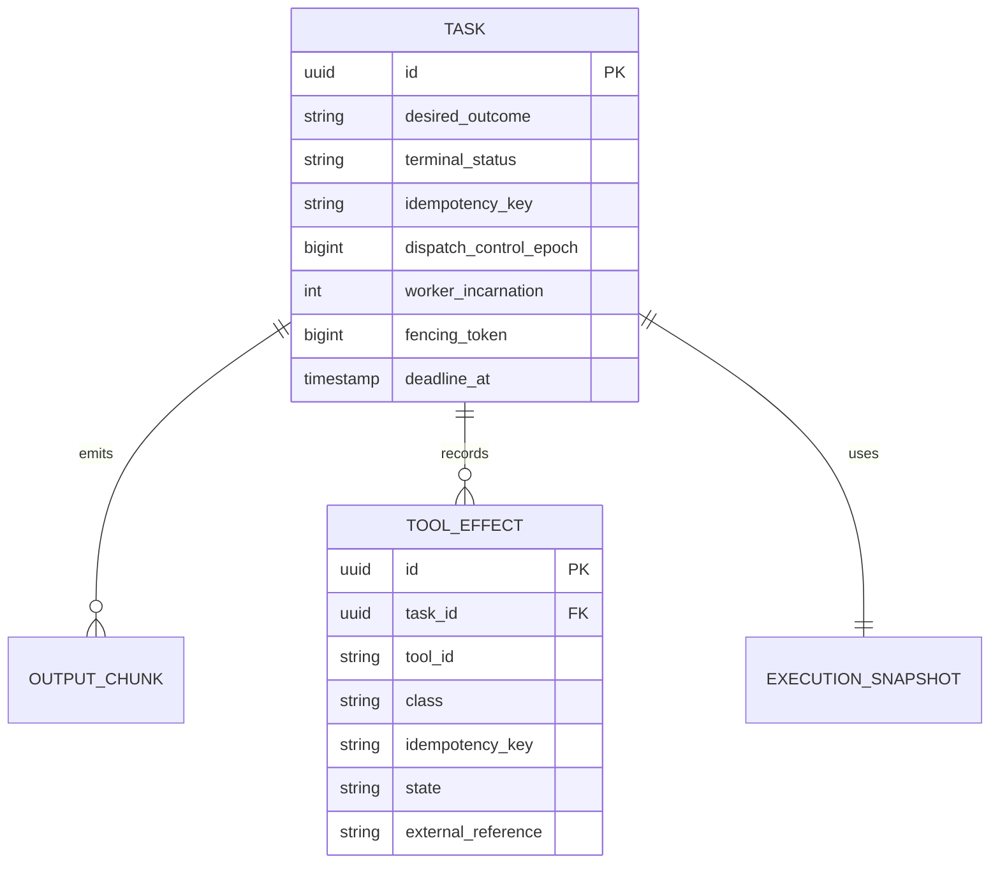
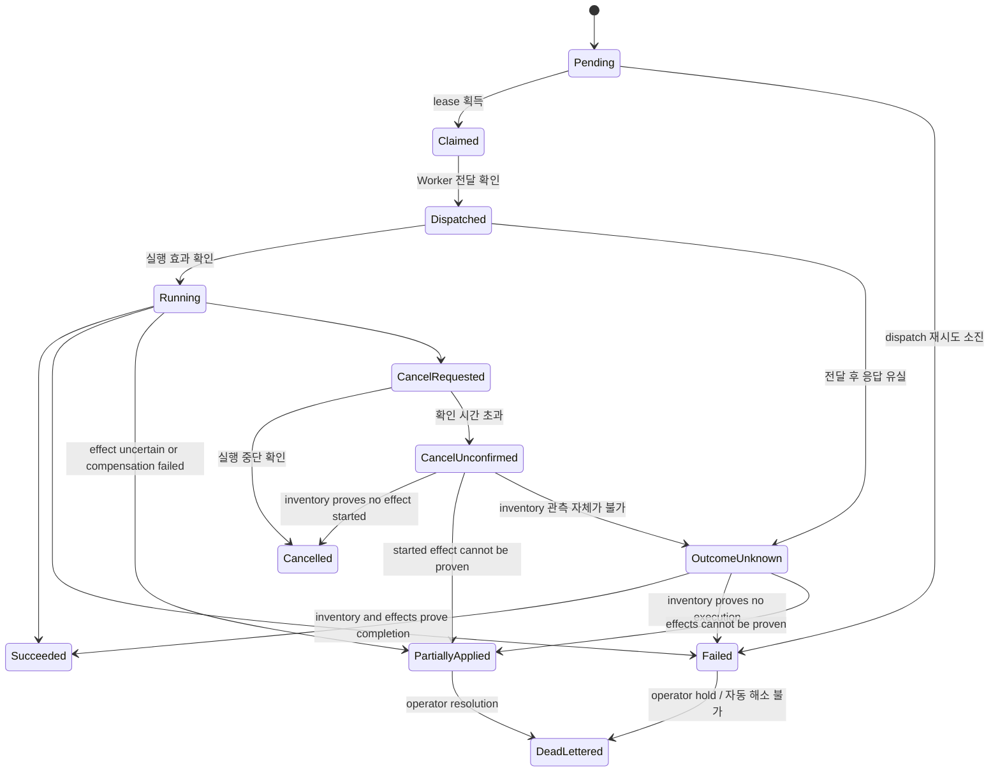

# 태스크 실행 일관성, 재시도 및 멱등성

## 목적

늦은 이벤트, 취소, Worker 재연결이 터미널 상태를 되돌리거나 외부 부작용을 중복 실행하지
못하게 한다.

**Task는 실행 실패를 재시도하지 않는다.** 실패한 Task는 터미널로 남고, 다시 하려면 새 Task를
만든다. 이 정책의 근거와 그것이 무너뜨린 설계는
[재시도 정책 결정 기록](../../reviews/task-retry-policy-decision-2026-08-26.md)에 있다. 그 결과
Task와 실행 시도는 1:0..1이므로 이 문서는 둘을 **분리하지 않는다** — 예전 `TaskAttempt` 엔티티가
들고 있던 식별자는 아래처럼 `TASK`에 놓인다.

`dispatch_control_epoch`만 실재한다(마이그레이션
[`026`](../../../crates/fleet-store/migrations/026_task_dispatch_control_epoch.sql)). 나머지 세 필드는
설계값이며 아래 [구현 상태와 유예](#구현-상태와-유예)가 상태를 소유한다.

## 상태 모델

`CancelUnconfirmed`는 대기 상태이지 터미널 상태가 아니다. Reconciler는 이 상태의 Task를
`OutcomeUnknown`과 동일하게 재조정 대상으로 유지하며, Worker inventory와 effect ledger로 다음 중
하나로 해소한다: `Started` effect가 없음이 증명되면 `Cancelled`, `Started` effect가 있으나 provider
조회로 결과를 증명할 수 없으면 `PartiallyApplied`, inventory 관측 자체가 불가능하면 `OutcomeUnknown`.
해소 전까지 Project archive의 터미널 조건을 만족시키지 않으며, 미해소 상태가 임계 시간을 넘으면
alert 대상이다.

`Cancelled`, `Failed`, `Succeeded`, `PartiallyApplied`는 조건 없는 덮어쓰기를 허용하지 않는다. 모든 상태
변경은 현재 상태(phase), control epoch, worker incarnation, fencing token을 조건으로 하는 CAS다.
예전 설계는 여기에 `attempt_id`와 generation을 더 실었으나, Task당 시도가 최대 하나뿐인 지금
그 두 술어가 가를 경쟁은 존재하지 않는다. Start/stop 전달 결과가 불명확하면 새 실행을 만들지
않고 `OutcomeUnknown`에서 Worker inventory를 관측한다.

`PartiallyApplied`는 실행의 일부 effect가 적용됐거나 적용 여부를 증명할 수 없는 상태다. 현재
외부 `TaskStatus`의 호환 계층에서는 `Failed`와 `failure_disposition=partially_applied`로 투영한다.
따라서 현재 API의 5상태를 즉시 깨지 않으며, operator가 effect ledger를 검토·보상·명시 redrive할
때까지 자동 retry하지 않는다.

## Effect ledger와 완료 조건

도구 실행이 파일·Git 밖에 영향을 줄 수 있으면 Worker는 호출 전 `tool_effect`를 durable ledger에
기록해야 한다. process output이나 모델의 "완료" 서술은 effect 증거가 아니다.

| Effect 상태 | 의미 | 다음 동작 |
|---|---|---|
| `Planned` | 실행 전 정책·입력 hash·idempotency key 확보 | 호출 가능 |
| `Started` | 요청을 전송했으나 결과 미확정 | 외부 조회 전 retry 금지 |
| `Applied` | provider receipt/external reference로 적용 증명 | 완료 조건에 반영 |
| `NoEffect` | 호출 전 거절 또는 부작용 없음이 증명됨 | 안전한 retry 가능 |
| `Compensating` | 정의된 보상 절차 수행 중 | 관측 후 도구 재호출 정책 적용 |
| `Compensated` | 보상 적용 증명 | 새 Task는 명시 정책에 따라 가능 |
| `Unknown` | 전달/결과/외부 조회가 불명확 | `PartiallyApplied`, 자동 retry 금지 |
| `CompensationFailed` | 보상도 완료 증명 불가 | `PartiallyApplied`, 운영자 개입 |

Effect ledger에는 `task_id`, `tool_id`, side-effect class, 입력/정책 hash, provider idempotency
key, external reference/receipt, 상태 전이 시각, actor를 남긴다. credential 원문·원시 요청 본문은
넣지 않는다. 외부 idempotency key는 **Project ID + Task ID + 안정된 effect scope + Task 제출 시
snapshot된 정책 revision**에서 HMAC으로 파생한다. 여기서 정책 revision은
[Task 관리](management.md)가 규정한 **제출 시점 snapshot 값**이며 현재 정책 revision이 아니다 — 그렇지
않으면 정책이 바뀐 뒤의 redrive가 다른 키를 만들어 같은 부작용을 두 번 적용한다. 원문 식별자를 키로
쓰면 외부에 내부 정보를 노출할 수 있다. HMAC 키는 Security Manager가 소유하며, 회전하더라도 기존
Task의 effect key를 이전 키로 재현할 수 있어야 한다(회전 전 키를 검증 전용으로 보존한다).

**이 파생식은 무재시도 정책 아래에서 redrive를 보호하지 못한다 — 미해결이다.** Task ID가 안정된
앵커였던 이유는 재시도가 한 Task 안에 머물렀기 때문이다. 실패를 새 Task로 다시 하면 Task ID가
바뀌므로 키가 달라지고, 외부 provider는 이것을 새 작업으로 본다. 바로 위 문단이 막으려던 이중
적용이 그대로 성립한다. 필요한 것은 새 Task 경계를 넘어 살아남는 앵커(승계된 effect scope 또는
redrive 계보 필드)이고, **그런 필드는 지금 없다.** 없는 것을 미리 만들지 않으므로 여기서는 앵커가
부재하다는 사실과 그 결과만 적는다. 그때까지 비가역·보상불가 부작용을 가진 Task의 redrive는
자동화 대상이 아니라 operator가 effect ledger를 직접 확인하는 절차다.

Task가 `Succeeded`가 되려면 다음을 모두 만족해야 한다.

1. Worker 결과와 fencing token이 현재 실행과 일치한다.
2. 필요한 Git checkpoint/artifact/context summary가 durable store에 기록됐다.
3. 모든 required effect가 `Applied`, `NoEffect`, 또는 증명된 `Compensated`다.
4. credential delivery grant와 Agent execution lease의 release/정리 증거가 기록됐다.

이 중 하나라도 `Unknown`이면 성공으로 전이하지 않는다.

## 실패 처리 계약

**실행 실패는 재시도하지 않는다.** 실패한 Task는 터미널로 남고, 다시 하려면 새 Task를 만든다.

- 유일한 예외는 **전달(dispatch) 재시도**다(`#38`). 이것은 Worker에 아직 전달되지 못한
  `Pending` Task를 다시 **전달**하는 것이고, 실행 결과를 다시 시도하는 것이 아니다. 소진되면
  Task는 `Failed`가 된다. exponential backoff와 jitter는 이 경로에만 적용된다.
- `deadline_at`은 Task 수준의 전체 시간 제한이다. 시도 횟수로 시간을 제한하던 규칙은 대상이
  사라졌다.
- Worker에 요청이 도달했는지 불확실하면 새 실행으로 단정하지 않고 `OutcomeUnknown`으로
  전이한다. 이 규칙은 정책과 무관하게 유지된다.
- 새 Task로 다시 하는 것이 **안전한지**는 이전 Task의 effect ledger가 정한다. 아래 표는 그
  판정 기준이며, 예전의 "자동 retry 허용" 표를 대체한다.

| 실패/관측 결과 | 새 Task로 재실행 | 선행 조건 |
|---|---|---|
| Worker 선택 전 capacity 부족 | 안전 | 실행 자체가 시작되지 않음. `#38` 전달 재시도가 먼저 처리 |
| Start 전 명시 거절·`NoEffect` | 안전 | 이전 lease가 release됨 |
| ReadOnly 실행 실패 | 안전 | input snapshot 동일 |
| IdempotentWrite 실패 | 조건부 | provider idempotency key와 effect 조회 가능. 새 Task ID가 키를 바꾸는 문제(위 참조)가 걸린다 |
| Compensatable 실패 | 조건부 | 보상 `Compensated` 증명 |
| `Started`/`Unknown` effect | 금지 | 외부 상태 조회 후 `Applied`/`NoEffect`/`Compensated` 확정 |
| Irreversible effect | 금지 | operator 승인 redrive만 가능 |
| credential revoke·policy 위반 | 금지 | 새 정책/새 credential grant로 새 Task 또는 명시 승인 |

## 도구 부작용 분류

아래 "재호출"은 **한 실행 안에서 도구를 다시 부르는 것**이며, Task 재시도가 아니다.

| 등급 | 예시 | 자동 재호출 | 필수 증거 |
|---|---|---|---|
| ReadOnly | 파일 조회, 검색, 상태 확인 | 허용 | ledger 없이 output/audit만 |
| IdempotentWrite | 동일 내용 upsert, idempotency key 지원 API | 조건부 허용 | provider idempotency key·조회 endpoint |
| Compensatable | 배포, 임시 자원 생성 | 보상 동작 확인 후 허용 | compensation contract·receipt |
| Irreversible | 외부 메시지, 삭제, 비가역 마이그레이션 | 자동 재호출 금지 | operator approval·effect receipt |

프로세스 종료와 부작용 rollback은 다른 사건이다. `git diff` 보존만으로 DB migration,
배포, 외부 API 호출이 복구됐다고 간주하지 않는다.

## 클라이언트 멱등성

MCP와 HTTP task submit은 `idempotency_key`와 payload hash를 받는다. 동일 principal,
동일 key, 동일 hash의 재요청은 기존 Task를 반환한다. 같은 key에 다른 payload가 오면
409 Conflict로 거부한다.

Task를 삭제하면 그 key는 **해제되어 재사용 가능해진다**. 이 보장의 내용은 "중복 제출은 *기존 Task를
반환한다*"이므로, 반환할 Task가 없어진 뒤에 tombstone을 남겨 두면 클라이언트에게 조회하면 404가 되는
id를 건네게 된다 — 보장을 지키는 것이 아니라 더 나쁘게 깨뜨리는 것이다. 삭제 계약은
[`management.md`](management.md)가 정본이다.

## 취소·timeout·redrive

- cancel과 timeout은 process 중단 요청일 뿐 effect rollback 요청이 아니다.
- `Started` effect가 있으면 cancel 확정 전에 provider 상태를 조회한다. 조회 불가면
  `PartiallyApplied`로 끝낸다.
- redrive는 터미널 Task를 되살리지 않는다. operator가 effect ledger와 checkpoint를 확인한 뒤
  **새 Task**를 만들며, 승인자·사유·선택한 idempotency/compensation 경로를 감사한다. 새 Task는
  새 ID를 가지므로 외부 idempotency key가 승계되지 않는다 — 위 [Effect ledger와 완료 조건](#effect-ledger와-완료-조건)의
  미해결 항목이 그대로 이 절차의 위험이다.
- `DeadLettered`와 `PartiallyApplied` Task는 Project archive의 "terminal" 조건에는 포함되지만,
  archive 전 operator가 미해결 effect를 승인 또는 hold해야 한다.

## 검증 게이트

- Failed 이후 늦은 Completed 이벤트가 거부되는 테스트
- 취소와 완료 경쟁에서 하나의 터미널 상태만 선택되는 테스트
- timeout 후 같은 idempotency key 재호출 시 중복 Task가 생기지 않는 테스트
- 이전 control epoch 이벤트가 거부되는 테스트
- non-idempotent tool effect가 자동 재실행되지 않는 테스트
- redrive로 만든 새 Task가 원래 Task의 external idempotency key를 승계하는 테스트
  (**설계 미결** — 승계할 앵커 필드가 없어 지금은 게이트로 서술만 가능하다)
- 정책 revision이 바뀐 뒤의 redrive도 동일 external idempotency key를 쓰는 테스트
- `CancelUnconfirmed` Task가 재조정으로 `Cancelled`/`PartiallyApplied`/`OutcomeUnknown` 중 하나로
  해소되며, 미해소 상태로 Project archive가 진행되지 않는 테스트
- provider 조회 불가 `Started` effect가 `PartiallyApplied`로 끝나며 성공·자동 재호출하지 않는 테스트
- cancel/timeout이 effect ledger를 우회해 `Cancelled`로만 확정되지 않는 테스트
- Task 삭제 후 같은 idempotency key의 재제출이 새 Task를 만드는 테스트

## 구현 상태와 유예

위 게이트 중 오늘 실제로 구현·검증된 것은 하나뿐이며, 그것도 절반이다. 이 표는 무엇을 왜
미뤘는지를 남긴다 — 미구현을 "곧 할 일"로 뭉뚱그리면 **막힌 이유**가 사라지고, 그러면 같은
설계를 다시 검토하게 된다.

| 게이트 | 상태 | 막고 있는 것 |
| --- | --- | --- |
| Failed 이후 늦은 Completed 거부 | 구현됨 | — (phase CAS로 성립. `crates/fleet-store/tests/task_cas.rs`) |
| 취소·완료 경쟁의 단일 터미널 상태 | 구현됨 | — (같은 CAS) |
| timeout 후 동일 key 재호출의 중복 방지 | 구현됨 | — (로드맵 `#62` 2단계) |
| **이전 control epoch 이벤트 거부** | **쓰기 절반만 구현됨** | 읽기 절반은 (a) 전역 규칙이 평범한 재시작을 깨뜨리고 (b) **어떤 이벤트도 생산자 epoch를 싣지 않는다** — 아래 참고 |
| non-idempotent tool effect 자동 재실행 금지 | 미구현 | effect ledger 부재, 그리고 **ledger를 채울 생산자 부재** |
| redrive Task의 external idempotency key 승계 | **설계 미결** | 새 Task ID가 키를 바꾼다. 새 Task 경계를 넘는 앵커 필드가 없음 |
| policy revision 변경 후 redrive의 동일 key | 미구현 | `policy_revision` 개념이 저장소·코드 어디에도 없음 |
| `CancelUnconfirmed` 해소와 archive 차단 | 미구현 | 해당 상태 자체가 `TaskStatus`에 없음. 해소 판정에 필요한 effect ledger도 없음 |
| 조회 불가 `Started` effect → `PartiallyApplied` | 미구현 | ledger 부재 |
| cancel/timeout이 ledger를 우회하지 않음 | 미구현(결함 존재) | ledger 부재. 현재 `cancel`은 transport 실패를 로그만 남기고 `Cancelled`를 확정한다 |
| Task 삭제 후 동일 key 재제출 | 구현됨 | — (로드맵 `#96`) |

### control epoch 게이트를 절반만 닫은 이유

`epoch`는 [`021_control_plane_lease.sql`](../../../crates/fleet-store/migrations/021_control_plane_lease.sql)의 정의대로
**최초 획득을 포함해** 획득마다 1씩 증가한다. 그래서 "`dispatched_epoch`가 현재 epoch보다 작으면
이벤트를 버린다"는 규칙을 지금 넣으면, **평범한 control plane 재시작마다 진행 중인 모든 Task의 완료
이벤트가 버려진다**. 고치는 것이 아니라 새 결함을 만드는 것이다.

예전 설계는 여기서 "phase CAS도 이것을 대신하지 못한다 — 시도 1의 늦은 `Completed`가 시도 2의
`Dispatched` 위상과 일치하므로, 진짜 식별자는 `attempt_id`/generation이다"라고 적었다. **무재시도
정책 아래에서 이 논증은 성립하지 않는다.** 시도 2가 없으므로 늦은 이벤트가 일치할 다른 실행의
위상도 없고, phase CAS가 그 경쟁을 실제로 가른다. 즉 읽기 절반이 닫으려던 구체적 위협은
`TaskAttempt` 부재 때문이 아니라 **존재하지 않기 때문에** 미구현이다.

읽기 절반이 여전히 열려 있는 이유는 다른 두 가지다. 하나는 위 문단의 재시작 문제이고, 다른
하나는 더 근본적이다 — **오늘 어떤 이벤트도 자신을 만든 control generation을 싣지 않는다.**
싣지 않는 값은 비교할 수 없으므로, 규칙을 정교하게 다듬는 것으로는 닫히지 않는다.

기록된 `dispatch_control_epoch`(마이그레이션
[`026`](../../../crates/fleet-store/migrations/026_task_dispatch_control_epoch.sql))의 현재 용도는
**사후 귀속**뿐이다: lease가 넘어간 뒤에도 "이 Task를 어느 control generation이 디스패치했는가"를
답할 수 있게 한다. `control_plane_lease`는 현재 epoch만 들고 있어 이 사실을 보존하지 못한다.
읽는 코드는 아직 없다.

구현된 쓰기 절반은 이것이다: Task 상태를 쓰는 CAS에 `EXISTS (SELECT 1 FROM control_plane_lease
WHERE cluster_id = $4 AND epoch = $5)` 술어를 **같은 문장 안에** 실어, lease를 잃은 인스턴스의 쓰기가
거절되고 [`TransitionOutcome::Fenced`](../../../crates/fleet-core/src/task.rs)로 돌아오게 한다.

### 다른 문서에 남았던 `Attempt` 표현 (2026-08-26 해소)

무재시도 정책은 이 문서(tasks 도메인)의 정본이지만, `TaskAttempt`는 이 문서만의 개념이 아니었다.
2026-08-26 실측(`grep -rn --include='*.md' 'TaskAttempt\|attempt_id\|RetryWaiting\|AttemptId\|Attempt' docs`,
이 파일·`docs/log.md`·[결정 기록](../../reviews/task-retry-policy-decision-2026-08-26.md) 제외)으로
**30개 파일 161행**이 남아 있었다. 아래는 그 시점의 전수 집계이며, 대표 파일만 예시로 든다.

`docs/roadmap/roadmap.md`도 집계에서 뺀다. 그 파일의 `Attempt` 언급은 남아 있는 드리프트가 아니라
**이 결정과 후속 항목을 서술하는 원장**이며, 세지 않아야 `#97` 같은 행을 추가할 때마다 이 숫자가
저절로 늘어나 썩는 일이 없다 — 처음 이 표를 2개라고 적었던 것과 같은 종류의 결함을 피하려는 것이다.

| 도메인 | 파일 | 행 | 대표 위치 | 성격 |
| --- | ---: | ---: | --- | --- |
| architecture | 20 | 120 | [`project-task-agent-lifecycle.md`](../project-task-agent-lifecycle.md)(23), [`entity-placement-and-context.md`](../entity-placement-and-context.md)(16), [`tasks/management.md`](management.md)(14), [`observability-and-reconciliation.md`](../observability-and-reconciliation.md)(12) | `TaskAttempt`를 **목표 엔티티**로 전제한 계약·ER·상태표 |
| security | 2 | 13 | [`authorization-and-audit.md`](../../security/authorization-and-audit.md), [`control-plane-security-model.md`](../../security/control-plane-security-model.md) | `attempt_id` 상관 필드, Attempt 단위 credential grant 수명 |
| reviews | 5 | 22 | [`entity-lifecycle-consistency-review.md`](../../reviews/entity-lifecycle-consistency-review.md), [`ui-management-and-issue-spec-2026-08-22.md`](../../reviews/ui-management-and-issue-spec-2026-08-22.md) | 결정 당시의 근거 기록 |
| 기타 | 3 | 6 | [`contracts/project-management.md`](../../contracts/project-management.md), [`credentials/README.md`](../../credentials/README.md), [`deployment/operations.md`](../../deployment/operations.md) | 산문 참조 |

**`#62` 4단계 커밋에서는 하나도 고치지 않았고, 그것은 의도였다.** 이유는 세 가지였다.

1. **그 결정의 사정 범위 밖이었다.** `#62` 4단계가 확인한 것은 "**현재 코드에서** Task와 시도가
   1:0..1"이다. 위 문서들의 `TaskAttempt`는 **목표 엔티티**이며 Project·Agent lifecycle과 함께
   `#48` 계열이 소유한다. 재시도가 사라져 그 주된 존재 이유가 없어진 것은 맞지만, "그러므로
   목표 설계에서도 삭제한다"는 판단은 tasks 도메인 혼자 내릴 수 없었다.
2. **개명이 아니라 계약 변경이다.** 예컨대 `control-plane-security-model.md`의 "Attempt 단위 grant
   수명"을 Task 단위로 바꾸면 credential이 살아 있는 시간 구간이 달라진다 — 확인 없이 개명하면
   보안 정본에 검증하지 않은 주장을 넣는 것이다.
3. **reviews는 원칙적으로 고치지 않는다.** 결정 당시의 근거 기록이므로 나중 결정으로 소급해
   덮어쓰면 근거로서의 가치를 잃는다.

**2026-08-26 [`#97`](../../roadmap/roadmap.md)이 그 교차 도메인 판단을 내렸다: 흡수.** 판정과 그
근거, 용어 대응표는 [Attempt 흡수 판정](../project-task-agent-lifecycle.md#attempt-흡수-판정)이
정본이다. 위 표의 `reviews` 행을 제외한 25개 파일을 그 판정에 맞춰 고쳤고, reviews 5개 파일은
이유 3에 따라 그대로 두었다.

이유 2가 지목한 위험은 실제로 개명이 아닌 처리를 받았다. 보안 정본 두 곳의 grant 수명은 "Task
단위"가 아니라 **"dispatch부터 terminal까지의 실행 구간"**으로 명시했다 — Task 행은 `Pending`부터
archive 보존까지 살지만 실행 구간은 그보다 짧으므로, 평평하게 개명했다면 credential 유효 구간이
조용히 넓어졌을 것이다.

위 표는 이제 해소된 드리프트의 **당시 크기와 위치** 기록으로 남긴다 — 2개 파일이 아니라 30개였다.

### 남은 창 두 가지

- **READ COMMITTED 잔여 창**: 위 `UPDATE`는 단일 문장이라 스냅샷을 한 번 잡는다. 문장이 실행되는
  **도중에** 다른 인스턴스가 epoch N+1을 커밋하면 그 커밋은 보이지 않는다. 마이크로초 규모이며,
  술어가 없던 이전의 무제한 창에 비하면 유계다. `SELECT ... FOR SHARE`로 정확히 닫을 수 있으나,
  그러면 모든 Task 상태 쓰기가 5초 주기 lease 갱신 `UPDATE`와 같은 한 행에서 락 경쟁을 하게 되므로
  택하지 않았다.
- **CLI `tasks cancel`은 fence를 걸지 않는다**: `fleet serve`가 죽었거나 fenced된 상황에서도 동작해야
  하는 operator 도구이므로 lease를 획득하지 않으며, 따라서 epoch 술어를 우회한다. 대가는 실재한다 —
  이 경로는 위 보호를 받지 않는다. 이것이 **유일한** 비펜싱 취소 경로다: MCP `fleet_cancel_task`는
  [`handlers.rs`](../../../crates/fleet-mcp/src/handlers.rs)에서 `Dispatcher::cancel`을 호출하므로
  위 네 경로에 포함된다.
