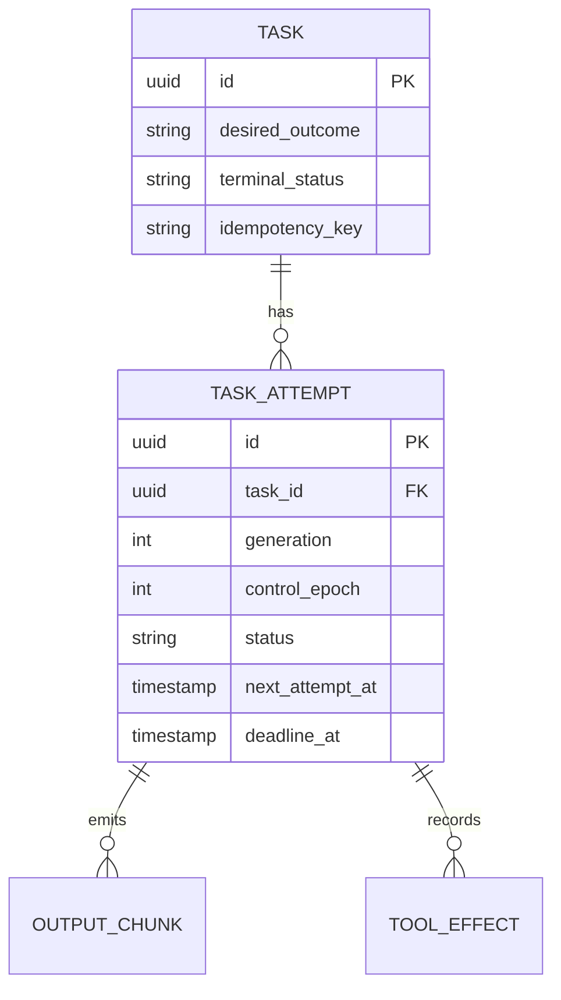
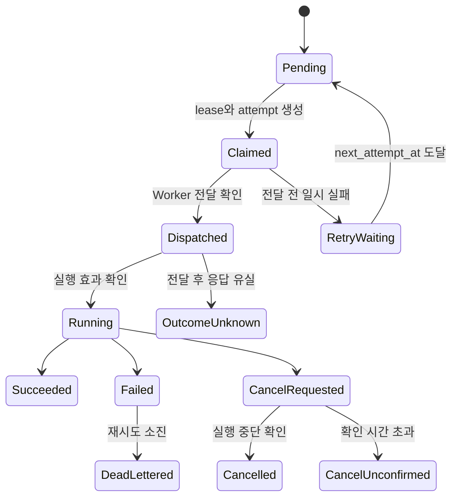

# 태스크 실행 일관성, 재시도 및 멱등성

## 목적

Task의 사용자 의도와 각 실행 시도를 분리하여 늦은 이벤트, 재시도, 취소, Worker
재연결이 터미널 상태를 되돌리거나 외부 부작용을 중복 실행하지 못하게 한다.

## 상태 모델

`Cancelled`, `Failed`, `Succeeded`는 조건 없는 덮어쓰기를 허용하지 않는다. 모든 상태
변경은 현재 상태, `attempt_id`, generation, control epoch를 조건으로 하는 CAS다.

## 재시도 계약

- failure class별 retry 가능 여부를 명시한다.
- exponential backoff와 jitter를 사용한다.
- 횟수뿐 아니라 `deadline_at`으로 전체 시간을 제한한다.
- Worker에 요청이 도달했는지 불확실하면 새 실행으로 단정하지 않고
  `OutcomeUnknown`으로 전이한다.
- 부작용 작업은 외부 idempotency key 또는 보상 동작이 없으면 자동 재실행하지 않는다.
- 재시도 소진은 일반 `Failed`와 분리해 `DeadLettered`로 보존하고 수동 redrive 승인을
  요구한다.

## 도구 부작용 분류

| 등급 | 예시 | 자동 재시도 |
|---|---|---|
| ReadOnly | 파일 조회, 검색, 상태 확인 | 허용 |
| IdempotentWrite | 동일 내용 upsert, idempotency key 지원 API | 조건부 허용 |
| Compensatable | 배포, 임시 자원 생성 | 보상 동작 확인 후 허용 |
| Irreversible | 외부 메시지, 삭제, 비가역 마이그레이션 | 자동 재시도 금지 |

프로세스 종료와 부작용 rollback은 다른 사건이다. `git diff` 보존만으로 DB migration,
배포, 외부 API 호출이 복구됐다고 간주하지 않는다.

## 클라이언트 멱등성

MCP와 HTTP task submit은 `idempotency_key`와 payload hash를 받는다. 동일 principal,
동일 key, 동일 hash의 재요청은 기존 Task를 반환한다. 같은 key에 다른 payload가 오면
409 Conflict로 거부한다.

## 검증 게이트

- Failed 이후 늦은 Completed 이벤트가 거부되는 테스트
- 취소와 완료 경쟁에서 하나의 터미널 상태만 선택되는 테스트
- timeout 후 같은 idempotency key 재호출 시 중복 Task가 생기지 않는 테스트
- 이전 control epoch 이벤트가 거부되는 테스트
- non-idempotent tool effect가 자동 재실행되지 않는 테스트
