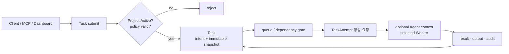
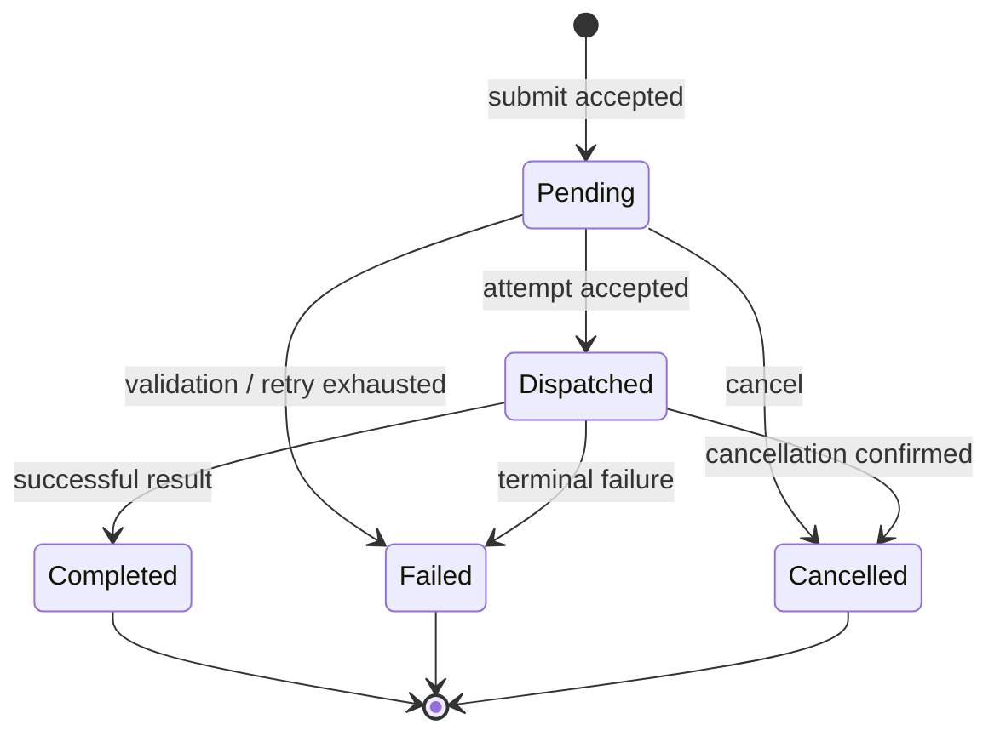

# Task Management 설계

## 책임과 경계

Task Management는 Project 안에서 수행할 **검증 가능한 한 건의 작업**을 만들고, 우선순위·의존성·취소·결과·감사를 관리한다. Agent는 Task의 지속 소유자가 아니라 실행 가능한 후보이며, 실제 실행 한 번은 TaskAttempt로 표현한다.

| 이 문서가 소유 | 이 문서가 소유하지 않음 |
|---|---|
| Task 생성·Project 귀속·입력 snapshot | Project 정책·자원 소유 — `../project-feature-design.md` |
| 우선순위·의존성·취소·결과 조회 | Agent 생성/중지 — `../agents/provisioning.md` |
| Task → Attempt 생성 요청과 감사 | Attempt CAS·retry·부작용 fencing — `execution-consistency.md` |
| 현재 구현과 목표 모델의 차이 | 교차 lifecycle 전이 — `../project-task-agent-lifecycle.md` |

## 현재 구현과 목표 모델

현재 구현의 `Task`는 `Pending`, `Dispatched`, `Completed`, `Failed`, `Cancelled` 상태를 가진다. `tasks.project_id` 저장 컬럼과 `ProjectId` 타입, CLI/MCP의 `TaskRequest.project_id` 전달은 구현되었다. Project 엔터티·FK·정책 enforcement는 아직 구현되지 않았다. 따라서 현재 `project_id`는 추적 가능한 경계 표식이며 Worker 선택·권한 격리를 바꾸지 않는다.

목표 모델에서는 다음을 분리한다.

| 개념 | 의미 | 상태 |
|---|---|---|
| Task | 사용자가 요청한 작업 의도와 완료 조건 | 현재 일부 구현, Project 귀속은 미구현 |
| TaskAttempt | 한 Task의 실행 시도·generation·실행 주체·결과 | 설계만 존재 |
| Execution snapshot | Project policy, isolation, harness revision, input hash | 설계만 존재 |

현재 `Task` 상태를 곧바로 TaskAttempt 상태로 바꾸지 않는다. 마이그레이션 기간에는 기존 Task 상태를 호환 계층으로 유지하고, Attempt가 도입된 뒤에만 상태를 투영한다.

## 제출 계약

1. 제출자는 `project_id` 또는 명시적 일반 풀 범위를 지정한다.
2. Project Task는 Project가 `Active`일 때만 생성한다. `Draft`, `Draining`, `Archived`는 새 제출을 거부한다.
3. 서버는 `client_request_id`와 payload hash를 저장해 재시도 제출이 같은 Task를 반환하도록 한다. 서로 다른 payload로 같은 키를 재사용하면 충돌이다.
4. 제출 시점에 Project 정책 revision, 우선순위, 필요한 capability, harness/skill revision, isolation 요구사항을 snapshot한다. 이후 Project 수정은 기존 Task에 소급하지 않는다.
5. 의존 Task가 있으면 Task는 생성되지만, 모든 선행 Task가 성공하기 전에는 Attempt를 만들지 않는다. 실패·취소된 선행 Task를 자동 성공으로 간주하지 않는다.

## Task 상태와 관리 동작

- `Pending`은 의존성 대기, 용량 대기, 재조정 대기를 포함할 수 있다. 이유와 다음 평가 시각을 기록해야 한다.
- `Dispatched`는 Attempt가 특정 실행 주체에 수락되었음을 뜻하며, 단순 네트워크 송신 성공만으로 전이하지 않는다.
- terminal Task는 재개하지 않는다. 같은 의도 재실행은 새 Task 또는 명시적 retry 요청으로 새 Attempt를 만든다.
- cancel은 요청과 확정을 구분한다. 부작용이 이미 발생했을 수 있으므로 `Cancelled`가 rollback 성공을 의미하지 않는다.
- 목표 Attempt가 `PartiallyApplied`이면 호환 Task 상태는 `Failed`로 투영하되, failure disposition과
  effect ledger를 반드시 함께 반환한다. 일반 실패처럼 자동 retry하거나 단순 output만으로 종결하지 않는다.

정확한 generation CAS, ack 유실, retry 분류와 외부 부작용의 보상 규칙은 [`execution-consistency.md`](execution-consistency.md)가 정본이다.

## Project·Agent와의 관계

- Project는 Task 정책과 감사 범위를 소유한다. Host/Worker/Agent 배정은 Project의 격리 제약을 따라야 하지만, Task마다 자원을 영구 점유하지 않는다.
- Agent는 여러 Task를 순차 처리하며 Task가 terminal이 되어도 살아 있을 수 있다.
- TaskAttempt는 실제 `worker_id`를 기록한다. Agent context를 사용할 때만 `agent_id`를 함께
  기록하며, Agent가 없는 일반 풀 Task는 Project Agent context·workspace를 읽지 않는다.
- Task terminal 뒤에는 Agent process를 기본적으로 종료하고 durable context만 유지한다. WarmIdle은
  명시적 lease가 있을 때만 허용한다.
- 자동 Agent 생성은 Task backlog·Project 정책을 입력으로 삼을 수 있으나, Task 제출 경로가 Agent 생성 성공을 기다리며 막히지 않게 한다.
- Project drain은 새 Task와 새 Attempt 생성을 막고, 실행 중 Attempt에는 cancel deadline을 적용할 수 있다. 자세한 교차 전이는 lifecycle 계약을 따른다.

Host·Worker·Agent process의 placement와 durable context 규칙은
[Entity placement & context](../entity-placement-and-context.md)가 정본이다.

## API와 감사

API/MCP는 Task 생성·조회·목록·취소를 제공한다. 새 Project Task API는 기존 Task API와 별도의 수명 모델을 만들지 않고 `project_id`, `client_request_id`, dependency, snapshot summary를 점진적으로 추가한다. full snapshot과 credential 원문은 응답에 노출하지 않는다.

모든 제출, dedupe 결과, dispatch 결정, 취소 요청/확정, terminal 결과에는 actor, request id, Task id, Project id, policy revision, Attempt generation을 감사 이벤트로 남긴다. 외부 effect는 별도 ledger에 provider receipt·idempotency key·보상 결과를 남기며, secret 원문은 어느 기록에도 남기지 않는다.

## 구현 순서와 검증 게이트

1. Project 테이블·상태·FK와 `project_id` 정책 검증을 구현한다.
2. Project 상태 검사와 client idempotency를 Task 생성 transaction에 넣는다.
3. dependency gate와 snapshot summary를 추가한다.
4. TaskAttempt 테이블·CAS·ack 계약은 실행 일관성 정본의 게이트를 만족한 뒤 도입한다.
5. Project drain, Agent idle, Worker 장애를 포함한 E2E 전이 시험을 추가한다.
