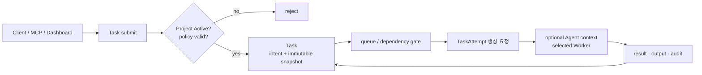
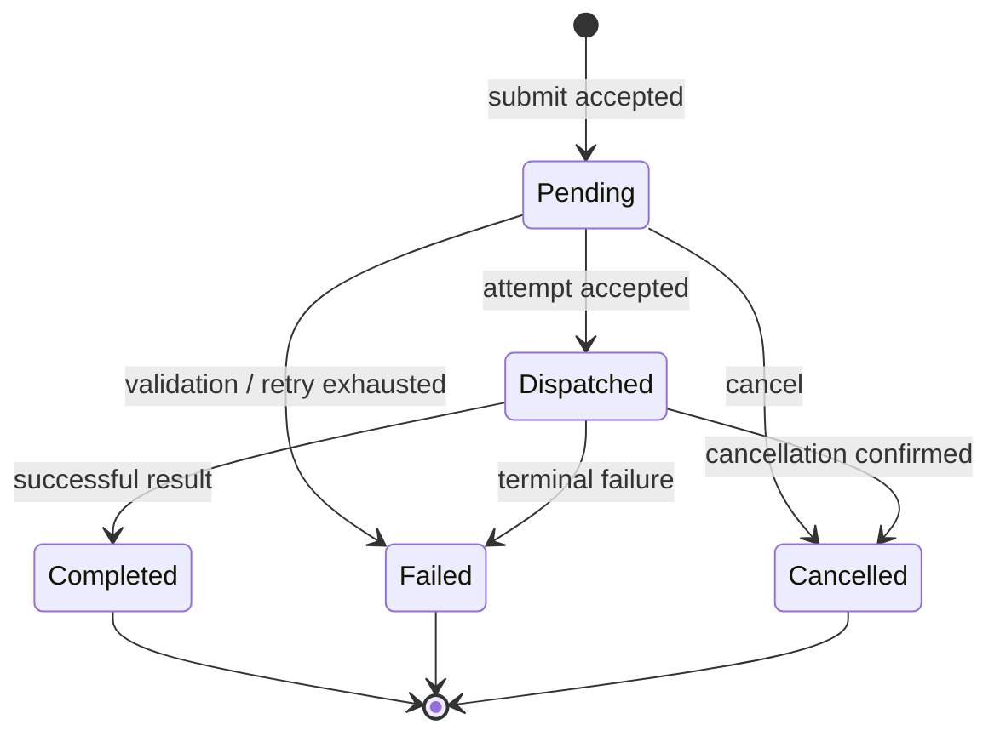

# Task Management 설계

## 책임과 경계

Task Management는 Project 안에서 수행할 **검증 가능한 한 건의 작업**을 만들고, 우선순위·의존성·취소·삭제·결과·감사를 관리한다. Agent는 Task의 지속 소유자가 아니라 실행 가능한 후보이며, 실제 실행 한 번은 TaskAttempt로 표현한다.

| 이 문서가 소유 | 이 문서가 소유하지 않음 |
|---|---|
| Task 생성·Project 귀속·입력 snapshot | Project 정책·자원 소유 — `../project-feature-design.md` |
| 우선순위·의존성·취소·삭제·결과 조회 | Agent 생성/중지 — `../agents/provisioning.md` |
| Task → Attempt 생성 요청과 감사 | Attempt CAS·retry·부작용 fencing — `execution-consistency.md` |
| 현재 구현과 목표 모델의 차이 | 교차 lifecycle 전이 — `../project-task-agent-lifecycle.md` |



## 현재 구현과 목표 모델

현재 구현의 `Task`는 `Pending`, `Dispatched`, `Completed`, `Failed`, `Cancelled` 상태를 가진다. `tasks.project_id` 저장 컬럼과 `ProjectId` 타입, CLI/MCP의 `TaskRequest.project_id` 전달은 구현되었다. Project 엔터티·FK·정책 enforcement는 아직 구현되지 않았다. 따라서 현재 `project_id`는 추적 가능한 경계 표식이며 Worker 선택·권한 격리를 바꾸지 않는다.

목표 모델에서는 다음을 분리한다.

| 개념 | 의미 | 상태 |
|---|---|---|
| Task | 사용자가 요청한 작업 의도와 완료 조건 | 현재 일부 구현, Project 귀속은 미구현 |
| TaskAttempt | 한 Task의 실행 시도·generation·실행 주체·결과 | 설계만 존재 |
| Execution snapshot | Project policy, isolation, harness revision, input hash | 설계만 존재 |

현재 `Task` 상태를 곧바로 TaskAttempt 상태로 바꾸지 않는다. 마이그레이션 기간에는 기존 Task 상태를 호환 계층으로 유지하고, Attempt가 도입된 뒤에만 상태를 투영한다.

## 제출 계약

1. 제출자는 `project_id` 또는 명시적 일반 풀 범위를 지정한다.
2. Project Task는 Project가 `Active`일 때만 생성한다. `Draft`, `Draining`, `Archived`는 새 제출을 거부한다.
3. 서버는 `client_request_id`와 payload hash를 저장해 재시도 제출이 같은 Task를 반환하도록 한다. 서로 다른 payload로 같은 키를 재사용하면 충돌이다.
4. 제출 시점에 Project 정책 revision, 우선순위, 필요한 capability, harness/skill revision, isolation 요구사항을 snapshot한다. 이후 Project 수정은 기존 Task에 소급하지 않는다.
5. 의존 Task가 있으면 Task는 생성되지만, 모든 선행 Task가 성공하기 전에는 Attempt를 만들지 않는다. 실패·취소된 선행 Task를 자동 성공으로 간주하지 않는다.

## Task 상태와 관리 동작



- `Pending`은 의존성 대기, 용량 대기, 재조정 대기를 포함할 수 있다. 이유와 다음 평가 시각을 기록해야 한다.
- `Dispatched`는 Attempt가 특정 실행 주체에 수락되었음을 뜻하며, 단순 네트워크 송신 성공만으로 전이하지 않는다.
- terminal Task는 재개하지 않는다. 같은 의도 재실행은 새 Task 또는 명시적 retry 요청으로 새 Attempt를 만든다.
- cancel은 요청과 확정을 구분한다. 부작용이 이미 발생했을 수 있으므로 `Cancelled`가 rollback 성공을 의미하지 않는다.
- 목표 Attempt가 `PartiallyApplied`이면 호환 Task 상태는 `Failed`로 투영하되, failure disposition과
  effect ledger를 반드시 함께 반환한다. 일반 실패처럼 자동 retry하거나 단순 output만으로 종결하지 않는다.

정확한 generation CAS, ack 유실, retry 분류와 외부 부작용의 보상 규칙은 [`execution-consistency.md`](execution-consistency.md)가 정본이다.

## 삭제 계약

삭제는 상태 전이가 아니라 **레코드 제거**다. 위 상태 다이어그램에 `Deleted`를 추가하지 않는다 —
terminal Task는 이미 `[*]`로 끝났고, 삭제는 그 뒤 기록을 보존할지 말지의 문제이지 실행 생명주기의
한 칸이 아니다. 같은 이유로 soft delete(`deleted_at` 컬럼)를 두지 않는다. 아래 표가 보이듯 스키마는
이미 행이 실제로 사라지는 것을 전제로 다섯 개의 FK 절을 결정해 두었고, soft delete는 그 설계를
전부 죽은 코드로 만든다.

### 무엇을 지울 수 있는가

terminal(`Completed`·`Failed`·`Cancelled`) Task만 지운다. `Pending`·`Dispatched`는 먼저 취소한다.

`Dispatched` Task를 지워도 저장소는 손상되지 않는다. 워커가 나중에 보내는 완료 이벤트는
`compare_and_set_task_status(id, &[Dispatched], Completed)`를 지나므로, 행이 없으면 `UPDATE`가 0행이
되고 **이어지는 재조회가 `None`을 돌려주어** `Err(StoreError::NotFound)`로 귀결된다(0행이면 재조회는
항상 일어난다 — 거절과 부재를 구분하는 것이 그 조회의 존재 이유다). 문제는 그 다음이다: 디스패처의
`Err` 갈래는 `warn!` 한 줄만 남기고 이벤트를 발행하지 않는다. 워커는 머신을 끝까지 태우고, 그 결과는
**어떤 기록도 남기지 않은 채 사라진다**. 취소를 먼저 요구하는 이유는 정합성이 아니라 이 침묵이다.

판정은 읽고-나서-지우지 않고 **SQL 술어로** 한다.

```sql
DELETE FROM tasks WHERE id = $1 AND status_phase = ANY($2)
```

읽기와 삭제 사이에 `Dispatched → Completed`가 끼어들 수 있다(두 writer, 공유 트랜잭션 없음). 선검사 후
삭제는 `#62` 1단계가 없앤 것과 같은 종류의 TOCTOU를 되살린다. 0행은 "terminal이 아니거나 이미 없음"
으로 보고한다.

### 무엇이 함께 사라지는가

캐스케이드는 **이미 스키마가 결정해 두었다**. 삭제 기능을 위해 새로 정할 정책이 없다.

| 참조 컬럼 | 절 | 뜻 |
|---|---|---|
| `task_outputs.task_id` | `ON DELETE CASCADE` | 출력은 Task 없이 의미가 없다 |
| `task_telemetry.task_id` | `ON DELETE CASCADE` | 위와 같다 |
| `events.task_id` | `ON DELETE SET NULL` | 사건은 일어났다. FK 컬럼은 NULL이 되지만 `payload`가 원본 `task_id`를 그대로 담고 있어 신원을 잃지 않는다 |
| `tasks.parent_task_id` | `ON DELETE SET NULL` | 자식은 살아남고 부모 간선만 끊긴다 |
| `issue_task_links.task_id` | `ON DELETE SET NULL` | `task_label`이 남아 링크가 이름을 잃지 않는다 |

`023_issues.sql`이 이 선택의 근거를 이미 남겼다: CASCADE는 "폭발 반경이 정확히 한 스레드이고 mutation
사실 자체는 audit에 독립적으로 남는" 곳에만 쓴다.

`issue_task_links`·`audit_log`와 달리 `events`는 001에서 SET NULL만 두고 라벨 컬럼을 두지 않았다(011·023이
나중에 세운 관례를 소급 적용하지 않았다). **다만 이것이 신원 손실로 이어지지는 않는다.** `events.payload`는
`FleetEvent` enum 전체를 JSONB로 저장하고, `TaskCreated`/`TaskDispatched`/`TaskProgress`/`TaskCompleted`/
`TaskFailed`/`TaskCancelled` 모든 variant가 `task_id: TaskId`를 직렬화 필드로 갖는다(`fleet-core/src/events.rs`).
`list_events`(`fleet-store/src/postgres.rs`)는 `SELECT seq, payload`만 읽어 `FleetEvent`를 복원하며, `task_id`
컬럼을 조회 조건으로 쓰는 경로는 코드베이스 어디에도 없다 — 그 컬럼은 사실상 write-only다. 따라서 `ON DELETE
SET NULL`이 지우는 것은 인덱싱/조인용 컬럼 하나뿐이고, 그 사건이 어느 Task의 것이었는지는 `payload`를 읽으면
그대로 복원된다. 이 절의 이전 버전(2026-08-26 초판)은 이를 "익명으로 남는다"고 적었는데, 이는 `task_id`
컬럼만 보고 `payload`를 확인하지 않은 채 내린 결론이라 틀렸다 — `docs/log.md`의 정정 기록 참고. 이 컬럼에
라벨을 추가하는 것은 여전히 이번 범위 밖이지만, 이유가 다르다: 채울 방법이 없어서가 아니라 `payload`가 이미
그 정보를 담고 있어 채울 필요가 없어서다.

`parent_task_id`가 NULL이 되어도 `thread_id`는 그대로 남는다. 따라서 **루트가 사라진 스레드**가 정상
상태로 존재한다. 목록 UI는 이를 오류가 아니라 표시 대상으로 다룬다 —
[UI 설계](../../ui-dashboard/ui-design.md)의 태스크 큐 절이 정본이다.

### 무엇이 삭제를 막는가

`Pending` Task가 대상 Task를 `dependency_ids`에 갖고 있으면 삭제를 **거부**한다.

`dependency_ids`는 `UUID[]`이고 **FK가 없다**. DB가 막아 주지 않는다. 그리고 dispatch 준비 판정은 선행
Task 조회가 `Ok(None)`이면 `ready = false`로 끝내는데, 없는 행은 영원히 생기지 않으므로 그 의존자는
dead-letter도 timeout도 없이 `Pending`에 **영구히 갇힌다**. 재조정 tick마다 다시 평가되며 매번 같은
결론에 도달한다.

terminal 의존자는 검사하지 않는다. 이미 실행이 끝나 ready 판정을 다시 지나지 않으므로 막을 이유가
없고, 모든 의존자를 대상으로 삼으면 DAG가 조금만 깊어져도 삭제가 사실상 불가능해진다.

이 검사는 포함 질의(`dependency_ids @> ARRAY[$1]`)를 요구하는데 현재 저장소에는 이 컬럼의 인덱스가
없다(전체 GIN은 `workers.labels` 하나뿐). 부분 GIN 인덱스를 추가한다 — 대부분의 Task는 `DEFAULT '{}'`
이므로 인덱스가 작게 유지되고, `WHERE`로 좁히는 형태는 `idx_tasks_parent_task_id`가 이미 쓰는 관례다.

```sql
CREATE INDEX idx_tasks_dependency_ids ON tasks USING GIN (dependency_ids)
    WHERE dependency_ids <> '{}';
```

부분 인덱스는 planner가 질의의 `WHERE` 절에서 인덱스 조건을 **스스로 증명할 수 있을 때만** 쓰인다.
`idx_tasks_parent_task_id`의 전례는 `parent_task_id = $1`이 `IS NOT NULL`을 함의한다는 걸 Postgres가
동등 비교로 증명하기 때문에 성립한다. 배열 포함(`@>`)은 이 추론 규칙에 없다 — `dependency_ids @>
ARRAY[$1]`만 쓰면 planner가 `dependency_ids <> '{}'`을 증명하지 못해 인덱스를 타지 않고, 이 컬럼을
인덱스로 지키려던 목적 자체가 무효화된다. 그래서 의존자 조회는 두 조건을 **함께** 써야 한다:

```sql
SELECT id FROM tasks
 WHERE status_phase = 'pending'
   AND dependency_ids <> '{}'
   AND dependency_ids @> ARRAY[$1]::uuid[]
```

### 권한과 흔적

삭제는 `PermissionKind::TaskDelete`(`"task:delete"`)를 요구하며 **Admin 전용**이다. `Operator`가
`WorkerDelete`를 갖지 않는 기존 관례를 그대로 따른다 — 파괴적 동작은 Operator 경계 밖이다. permission은
코드 정의이고 `seed_permissions`/`seed_builtin_roles`가 매 기동 실행되어 기존 역할까지 역채움하므로
**이 권한에는 마이그레이션이 필요 없다**(위의 GIN 인덱스는 별개로 필요하다).

현재 감사 액션에는 `task.*`가 **하나도 없다**(auth·user·worker·credential만 있다). `task.delete`를
추가한다. hard delete는 행 자체를 없애지만, 위에서 정리했듯 `events` 행은 `payload`에 `task_id`를 보존한
채 남으므로 "그 Task가 존재했다"는 사실 자체는 `events`를 훑으면 재구성할 수 있다 — 다만 `task_id` 컬럼이
NULL이라 인덱스를 탈 수 없으니 `seq` 범위 전체를 스캔해야 하는, 운영 목적으로는 쓰기 어려운 경로다. 그래서
"이 Task가 존재했고 누가 지웠다"를 **조회 가능한 형태로** 증언하는 것은 감사 로그뿐이다 — `events`가 정보를
전혀 담지 않아서가 아니라, 감사 로그만 `actor`·`target`·시각을 인덱스가 있는 자리에 남기기 때문이다. 감사
없는 hard delete는 그 조회 가능한 흔적이 없는 삭제다.

## Project·Agent와의 관계

- Project는 Task 정책과 감사 범위를 소유한다. Host/Worker/Agent 배정은 Project의 격리 제약을 따라야 하지만, Task마다 자원을 영구 점유하지 않는다.
- Agent는 여러 Task를 순차 처리하며 Task가 terminal이 되어도 살아 있을 수 있다.
- TaskAttempt는 실제 `worker_id`를 기록한다. Agent context를 사용할 때만 `agent_id`를 함께
  기록하며, Agent가 없는 일반 풀 Task는 Project Agent context·workspace를 읽지 않는다.
- Task terminal 뒤에는 Agent process를 기본적으로 종료하고 durable context만 유지한다. WarmIdle은
  명시적 lease가 있을 때만 허용한다.
- 자동 Agent 생성은 Task backlog·Project 정책을 입력으로 삼을 수 있으나, Task 제출 경로가 Agent 생성 성공을 기다리며 막히지 않게 한다.
- Project drain은 새 Task와 새 Attempt 생성을 막고, 실행 중 Attempt에는 cancel deadline을 적용할 수 있다. 자세한 교차 전이는 lifecycle 계약을 따른다.

Host·Worker·Agent process의 placement와 durable context 규칙은
[Entity placement & context](../entity-placement-and-context.md)가 정본이다.

## API와 감사

API/MCP는 Task 생성·조회·목록·취소를 제공하고, Dashboard는 여기에 terminal Task 삭제를 더한다(위 [삭제 계약](#삭제-계약)). 새 Project Task API는 기존 Task API와 별도의 수명 모델을 만들지 않고 `project_id`, `client_request_id`, dependency, snapshot summary를 점진적으로 추가한다. full snapshot과 credential 원문은 응답에 노출하지 않는다.

모든 제출, dedupe 결과, dispatch 결정, 취소 요청/확정, terminal 결과, 삭제에는 actor, request id, Task id, Project id, policy revision, Attempt generation을 감사 이벤트로 남긴다. 외부 effect는 별도 ledger에 provider receipt·idempotency key·보상 결과를 남기며, secret 원문은 어느 기록에도 남기지 않는다.

## 구현 순서와 검증 게이트

1. Project 테이블·상태·FK와 `project_id` 정책 검증을 구현한다.
2. Project 상태 검사와 client idempotency를 Task 생성 transaction에 넣는다.
3. dependency gate와 snapshot summary를 추가한다.
4. TaskAttempt 테이블·CAS·ack 계약은 실행 일관성 정본의 게이트를 만족한 뒤 도입한다.
5. Project drain, Agent idle, Worker 장애를 포함한 E2E 전이 시험을 추가한다.

삭제 계약의 완료 게이트는 다음과 같다.

- 비terminal Task 삭제 요청이 거부되며, 거부가 조회가 아니라 `DELETE ... AND status_phase = ANY(...)`의
  0행으로 판정되는 테스트(선검사를 지워도 통과하면 그 테스트는 TOCTOU를 증명하지 못한 것이다)
- `Pending` 의존자가 있는 Task의 삭제가 거부되고, 의존자가 전부 terminal이면 허용되는 테스트
- 루트를 지운 뒤 자식의 `parent_task_id`가 NULL이 되고 `thread_id`는 유지되며, 그 스레드가 목록에서
  사라지지 않는 테스트
- 삭제된 Task의 `events` 행은 유지되되 `task_id` 컬럼만 NULL로 남고(`payload`의 `task_id`는 보존),
  `task_outputs`·`task_telemetry` 행은 사라지는 테스트
- Admin이 아닌 principal의 삭제가 403으로 거부되는 테스트
- 삭제 성공·거부가 `task.delete` 감사 이벤트를 남기는 테스트
