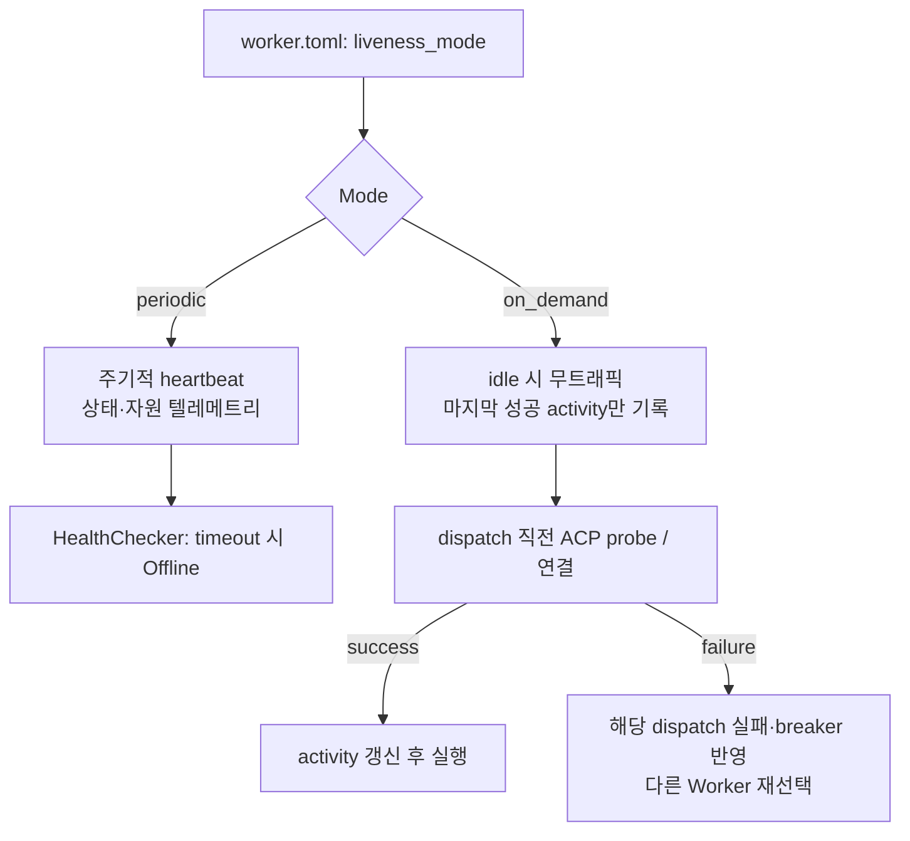

# Worker Liveness와 선택적 Heartbeat 정책

## 결정

Worker는 Host에서 지속 실행되는 Fleet daemon이며, 기본 운영 모델은 Host당 하나다. Task 완료나 Agent process 종료가 Worker daemon
종료를 뜻하지 않는다. Agent process의 ephemeral/WarmIdle lifecycle과 durable context는
[Entity placement & context](entity-placement-and-context.md)가 소유한다.

정기 heartbeat는 필수가 아니다. Worker별 `liveness_mode`를 명시하고, 기본값은
기존 호환성을 위한 `periodic`으로 둔다. 대규모·저활성 Fleet는 `on_demand`를
선택해 상시 heartbeat를 보내지 않는다.



## 모드 계약

| 모드 | 설정값 | idle 네트워크 트래픽 | Offline 판단 | 트레이드오프 |
|---|---|---:|---|---|
| `periodic` | 기본값 | `heartbeat_interval_secs`마다 | missed heartbeat threshold | 빠른 장애 감지와 자원 텔레메트리, 규모에 비례한 요청 수 |
| `on_demand` | 명시 opt-in | 없음 | dispatch 직전 ACP probe 실패 또는 실제 command 실패 | idle 부하 없음, 첫 작업의 probe 지연·일시 실패 가능 |

`on_demand` Worker에 일반 HealthChecker의 heartbeat timeout을 적용하면 idle 상태인
정상 Worker를 오프라인으로 잘못 전이시키므로 금지한다. 단순히
`heartbeat_interval_secs = 0`으로 처리하지 않는다. 0은 모호하며 잘못된 타이머·나눗셈
동작을 만들 수 있다.

**Agent control 제약**(2026-08-30 실측 정정): 이 절은 "현재 Agent start/stop/capture command는
Worker의 heartbeat polling으로 전달된다"고 적고 있었으나 **코드상 사실이 아니다**. control
plane→Worker 표면은 heartbeat 응답의 `desired_state` 하나뿐이고(`crates/fleet-api/src/schema.rs`의
`HeartbeatResponse`, `&'static str`), 값은 `"running"`/`"drain"` 둘이며 CPU/RAM 90% 초과 또는 이미
`Draining`인 워커에서만 `"drain"`이 된다. Agent 명령은 **한 건도 실리지 않는다**. 워커측 소비자도
`info!` 로그 한 줄이 전부다(`crates/fleet-worker/src/registration.rs`). drain이 실제로 성립하는 것은
워커가 거절하기 때문이 아니라 `WorkerSelector::select`가 `status: Some(WorkerStatus::Online)`으로
후보를 거르기 때문이다(`crates/fleet-scheduler/src/selector.rs`) — 즉 집행 지점은 오케스트레이터측이다.

따라서 별도 control stream 또는 bounded command poll을 구현하기 전에는 Agent를 호스팅하는
Worker에 `on_demand`를 적용할 수 없다. 이는 heartbeat를 단순히 끄는 기능이 아니라 control plane
전달 방식을 **처음으로 만드는** 작업이며, 그 소유자는 `#67` 4단계다.

WarmIdle의 execution lease 갱신과 self-fencing은 Worker liveness heartbeat와 다른 control channel
계약이다. `on_demand`를 허용하려면 Worker가 idle이어도 lease 만료·revoke·drain 명령을 받을 수 있는
bounded control stream 또는 poll이 필요하다.

## 설정 및 상태 모델

`[worker]`에 아래 값을 추가한다.

```toml
# 기존 배포와 호환되는 기본값
liveness_mode = "periodic" # "periodic" | "on_demand"
heartbeat_interval_secs = 15 # 현재 기본값; periodic일 때만 사용
```

등록 요청, `Worker` 도메인 모델, DB에는 `liveness_mode`를 저장한다. Worker가 재등록할
때 이를 갱신하며, API/대시보드는 mode와 `last_activity_at`을 표시한다. `last_seen`은
periodic heartbeat의 마지막 시각이라는 기존 의미를 유지하고, 새로운 `last_activity_at`은
register, 성공한 probe, command ack, task result를 기록한다.

## 스케줄링·보안 불변식

- `on_demand`는 살아 있음의 증명이 아니라 **사전 검증이 필요한 후보**다. probe 성공 전에는 task 실행 성공으로 간주하지 않는다.
- probe와 command는 Worker의 scoped operational identity로 인증한다. 공용 bearer나 bootstrap token을 재사용하지 않는다.
- `periodic`에서만 `worker:heartbeat` capability가 필요하다. 등록·probe·command 결과의 capability는 별도로 분리한다.
- monitoring은 on-demand Worker를 `Unknown/Unchecked`로 표시할 수 있지만, 근거 없이 `Online`으로 표시하지 않는다.
- 고가용성 판단은 지금의 Single Active Primary + Cold Standby 모델에 종속된다. probe session을 두 Orchestrator가 동시에 소유하지 않는다.

## 중간 상태의 fail-closed 규칙

구현 순서는 1→5이지만, **2단계까지만 구현된 상태에서 `on_demand`를 실제로 허용하면 안 된다.**
현재 코드는 HealthChecker가 `on_demand` Worker를 skip하지만(2단계) DB `status`는 join 시점의
`Online`으로 남고, selector는 `Online`만 후보로 뽑는다. 3단계 probe가 없으므로 **죽은 Worker에
task가 계속 배정되고 UI는 이를 `Online`으로 표시한다** — 위 불변식 "근거 없이 `Online`으로
표시하지 않는다"를 코드가 정면으로 위반하는 상태다.

따라서 3단계가 완료되기 전까지 API는 `liveness_mode = "on_demand"` 등록 요청을 거절한다
(`422`). worker.toml 주석이나 문서 경고는 게이트가 아니다. 아울러 `WorkerStatus`에는 현재
`Unchecked`/`Unknown` 값이 없어 이 설계가 요구하는 상태를 표현할 타입 자체가 없으므로,
`Unchecked` 도입과 selector 제외가 3단계의 선행 조건이다.

## 구현 순서와 완료 기준

1. `WorkerLivenessMode` enum, migration, register/API/OpenAPI/worker.toml을 추가한다.
   **동시에 3단계 완료 전까지 `on_demand` 등록을 API에서 거절한다.**
2. periodic loop를 mode 조건으로 시작하고 HealthChecker가 on-demand Worker를 skip한다.
3. `WorkerStatus::Unchecked`를 추가해 selector에서 제외하고, transport에 bounded ACP probe를
   추가해 dispatcher가 on-demand dispatch 전에 호출한다. 이 단계 완료 시점에 1단계의 등록 거절을
   해제한다.
4. 상태·이벤트·대시보드에 `last_activity_at`과 probe 결과를 기록한다.
5. 1,000 idle on-demand Worker가 heartbeat 요청 0건을 보내는 테스트와, 죽은 Worker가 probe 실패 뒤 dispatch되지 않는 테스트를 통과한다.
