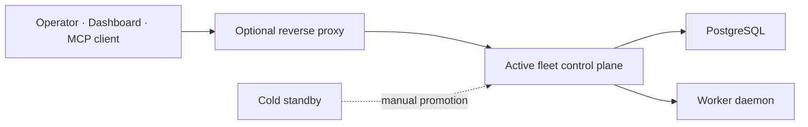

# 운영 토폴로지

현재 운영 모델은 Single Active Primary와 Cold Standby다. availability·lease·fencing의 상세 계약은
[Control Plane 권한과 장애 전환](../architecture/control-plane-authority-and-failover.md)가 정본이다.

이 문서는 현재 경계만 설명한다. Cloudflare Tunnel, reverse SSH, liteLLM gateway, egress proxy,
Active-Active는 별도 구현·운영 검증 없이 이 토폴로지의 기본 구성으로 간주하지 않는다.

## 신뢰 경계

- client→gateway: TLS, edge access policy, rate limit
- gateway→control plane: trusted proxy header와 bind ACL
- control plane→PostgreSQL: service credential과 schema compatibility
- control plane→Worker: 현재 HTTP register/heartbeat 및 선택 mTLS/ACP 경로

Worker enrollment과 credential의 현재 제한은 [Worker enrollment](../contracts/worker-enrollment.md)을
확인한다.
