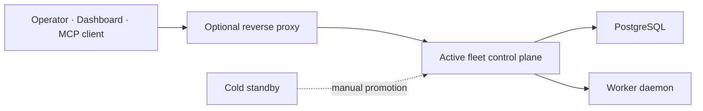

# 운영 토폴로지

현재 운영 모델은 Single Active Primary와 Cold Standby다. availability·lease·fencing의 상세 계약은
[Control Plane 권한과 장애 전환](../architecture/control-plane-authority-and-failover.md)가 정본이다.

이 문서는 현재 경계만 설명한다. liteLLM gateway, egress proxy, Active-Active는 별도 구현·운영
검증 없이 이 토폴로지의 기본 구성으로 간주하지 않는다.

**Agent dispatch transport 결정(2026-08-22)**: control plane → Worker의 ACP 경로는 **mTLS 직접
다이얼**을 정본으로 한다. Worker가 `wss://{advertised_host}:{port}/ws`를 광고하고 control plane이
클라이언트 인증서로 직접 연결한다. Cloudflare Tunnel과 reverse SSH tunnel은 지원 토폴로지가 아니다.

이 결정 이전의 실제 운영은 reverse SSH tunnel + orchestrator측 nginx 워커별 라우팅에 의존했으나,
그 인프라는 이 저장소에 존재하지 않고(`autossh`/`ssh -R`/nginx 설정 0건) `fleet-api`에는 `/ws`
라우트도 없다. mTLS 경로는 런타임이 이미 완성되어 있었고(`crates/fleet-worker/src/runner.rs`의
`MtlsProxy` 배선, 인증서 무중단 회전, `fleet mtls` 발급 CLI), 인증서 배포 스텝은 Roadmap `#85`가
`IssueMtlsAssets`/`ConfigureMtls` 프로비저닝 스텝으로 닫았다 — `fleet provision`이 워커별 서버
인증서를 자동 발급·업로드하고 worker.toml의 `[mtls]` 섹션까지 채운다. 근거와 비교는
[무인 부트스트랩 검토](../reviews/bootstrap-automation-review-2026-08-22.md)에서 확인한다.

**제약**: 이 모델은 Worker 호스트가 control plane에서 인바운드로 도달 가능해야 한다. 사설 IP
뒤에 있어 도달 불가능한 호스트는 이 토폴로지의 Worker가 될 수 없으며, 별도 네트워크 설계
(VPN 또는 공인 endpoint 할당)가 선행되어야 한다.

## 신뢰 경계

- client→gateway: TLS, edge access policy, rate limit
- gateway→control plane: trusted proxy header와 bind ACL
- control plane→PostgreSQL: service credential과 schema compatibility
- control plane→Worker: HTTP register/heartbeat(Worker→control plane)와 mTLS ACP 다이얼(control plane→Worker). ACP 경로의 신뢰 앵커는 사설 CA이며 SAN이 `advertised_host`와 일치해야 한다

Worker enrollment과 credential의 현재 제한은 [Worker enrollment](../contracts/worker-enrollment.md)을
확인한다.
