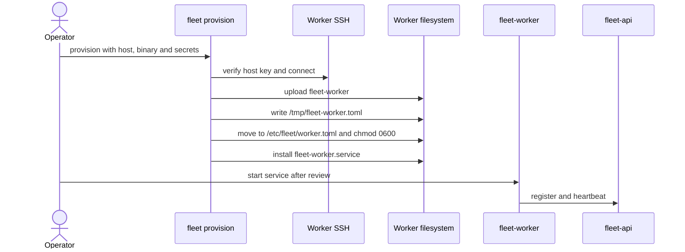

# Worker SSH 프로비저닝 Runbook

이 문서는 현재 `fleet provision`이 SSH로 `fleet-worker` 바이너리, `worker.toml`과 systemd unit을
배포하는 절차를 설명한다. 이 경로는 `/v1/workers/join`을 호출하지 않는다. daemon을 시작하면
Worker가 설정에 따라 `/v1/workers/register`와 heartbeat를 호출한다.

## 현재 동작



**Enrollment 결정(2026-08-22)**: `fleet provision`은 `/v1/workers/join`을 대행한다. 아래 "현재
동작"은 이 결정 이전의 상태이며 Roadmap `#81`이 전환을 소유한다.

목표 절차: CLI가 호스트마다 직전에 `max_uses: 1`과 짧은 TTL의 bootstrap token을 1개씩 발급하고,
원격 채널 stdin으로만 `fleet-worker join --token-file -`에 전달한다. `operational_token`은 대상
호스트가 orchestrator 응답으로 스스로 기록하며 **프로비저너는 그 값을 보지도 저장하지도 않는다**.
관리자 bearer는 `fleet provision`을 실행하는 CLI 프로세스만 보유하고 대상 호스트에 전달하지 않는다.
`existing_worker_id`를 가진 `worker.toml`은 재실행에서도 덮어쓰지 않으며, 실패 보상은 항상
전진(재시도·re-key)이고 워커 삭제로 후퇴하지 않는다.

**현재 동작(전환 전)**: `fleet provision`은 bootstrap token을 자동 발급하지 않고, token-file을
만들거나 `shred`하지 않는다. 전달된 `--bootstrap-token`이 있으면 `worker.toml`에 legacy
`[worker] bootstrap_token`으로 기록하는데, `fleet-worker`는 이 키를 fail-closed로 거부하므로
**이렇게 만들어진 워커는 기동하지 못한다**. 전환 전까지 정상 경로는 대상 호스트에서
`fleet-worker join`을 직접 실행하는 것이다.

## 사전 조건

- 대상 host, SSH user, private key와 검증된 known-hosts 정보를 준비한다.
- 로컬 `fleet-worker` binary 경로와 Worker의 grok secret을 준비한다.
- Orchestrator URL과 host 등록용 API bearer가 필요한지 확인한다.
- Worker 지속 신원(`operational_token`)과 bootstrap token의 분리는 `#60` 1~8단계로 완료됐다.
  현재 남은 제약은 프로비저너가 그 신원을 발급받지 못한다는 것이며
  [Worker enrollment](../contracts/worker-enrollment.md)와 Roadmap `#81`에서 확인한다.
- `orchestrator_api_token`(`ProvisionOptions.api_token`)의 capability 요구사항 (`#79`로 확장됨):
  - `PushCredentials` 스텝은 `worker:llm_credential:read`/`:export`가 필요하다(`#66`).
  - `StartServices` 스텝의 하트비트 확인은 `worker:list`가 필요하다 — 없으면 그 폴링만
    `401`/`403`으로 즉시 실패한다(로컬 systemctl 확인까지는 이미 통과한 상태). 토큰 자체가
    없으면 하트비트 확인을 건너뛰고 로컬 상태만으로 진행한다(경고 로그, 하위 호환).

운영 환경은 `strict` host-key 정책을 사용하고 `fleet scan-host-keys` 출력의 fingerprint를 별도
신뢰 채널에서 확인한다. `tofu`는 최초 연결 공격을 방지하지 못하고 `accept-all`은 운영에 사용하지
않는다.

## 단일 Host 실행

다음 예시는 playbook이 요구하는 비밀이 아닌 입력을 나타낸다. 실행 전 `FLEET_GROK_SECRET`,
`FLEET_ORCHESTRATOR_URL`과 필요한 `FLEET_API_TOKEN`을 권한이 제한된 실행 환경으로 주입한다.

```bash
fleet provision \
  --host worker.example.com \
  --name worker-01 \
  --user ubuntu \
  --ssh-key /secure/path/worker_ed25519 \
  --host-key-policy strict \
  --known-hosts /etc/fleet/known_hosts \
  --fleet-worker-bin ./target/release/fleet-worker
```

`--bootstrap-token`을 추가하면 현재 설정 파일에 원문으로 남는다. 해당 동작을 승인하지 않았다면
사용하지 않고, production Worker 인증 전환이 구현될 때까지 서비스를 시작하지 않는다.

## 검증

1. `/usr/local/bin/fleet-worker`가 기대 version과 checksum을 가지는지 확인한다.
2. `/etc/fleet/worker.toml`과 systemd unit의 소유권·mode를 확인한다.
3. 설정의 Orchestrator URL, Worker name, grok secret과 선택적 mTLS 경로를 검토한다.
4. 서비스를 명시적으로 시작하고 register·heartbeat 결과를 확인한다.
5. host inventory 등록은 best-effort이므로 CLI 성공만으로 API 등록 성공을 단정하지 않는다.

## 실패와 복구

- host-key 불일치는 접속을 중단하고 fingerprint를 재검증한다.
- playbook 실패 뒤 `/tmp/fleet-worker.toml`, `/tmp/fleet-worker.service`와 부분 설치 파일을 확인한다.
- 설정 이동과 일부 systemd 명령의 오류는 현재 구현에서 별도로 전파되지 않을 수 있으므로 원격
  파일·service 상태를 직접 확인한다.
- 이전 정상 binary와 설정을 보존했다면 서비스를 중단한 뒤 명시적으로 복원한다. 자동 rollback은
  구현되지 않았다.

## 관련 정본

- [Worker 수동 가입](../worker-bootstrap/join.md)
- [Worker enrollment](../contracts/worker-enrollment.md)
- [구성과 비밀 관리](configuration.md)
- [설치 Runbook](install.md)
