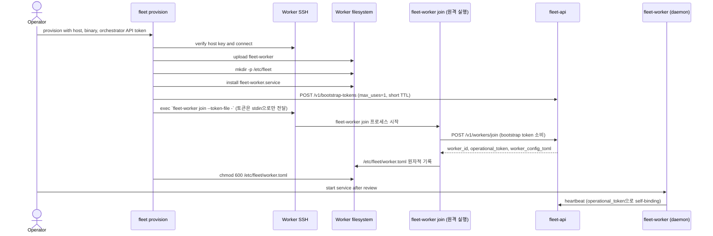

# Worker SSH 프로비저닝 Runbook

`fleet provision`은 SSH로 `fleet-worker` 바이너리와 systemd unit을 배포한 뒤, 원격 호스트
자신에게 `fleet-worker join`을 실행시켜 `/v1/workers/join`으로 등록한다(로드맵 `#82`). worker.toml은
프로비저너가 로컬에서 렌더링하지 않는다 — 오케스트레이터의 join 응답을 대상 호스트가 직접
디스크에 기록한다.

## 현재 동작



`operational_token`은 대상 호스트가 orchestrator 응답으로 스스로 기록하며 **프로비저너(CLI
프로세스)는 그 값을 보지도 저장하지도 않는다**. 관리자 bearer(`orchestrator_api_token`)는 CLI
프로세스만 보유하고 대상 호스트에 전달하지 않는다 — 대신 호스트별 1회용 bootstrap token을 발급해
그 토큰만 전달한다. `/v1/workers/join`은 동일 이름의 워커가 이미 존재하면 `409 Conflict`로
거부한다(재등록은 지원하지 않는다) — `JoinWorker` 스텝은 이 경우를 조용히 성공 처리하거나 기존
워커를 지우지 않고, 항상 명확한 에러로 전파해 운영자가 판단하게 한다(실패 보상은 항상
전진 — 재시도·re-key — 워커 삭제로 후퇴하지 않는다).

## 사전 조건

- 대상 host, SSH user, private key와 검증된 known-hosts 정보를 준비한다.
- 로컬 `fleet-worker` binary 경로를 준비한다(grok secret은 선택 사항 — 미지정 시 원격
  `fleet-worker join`이 무작위로 생성한다, 로드맵 `#82`). 이기종 fleet(예: arm64와 x86_64
  워커가 섞여 있음)에서는 `StepContext.fleet_worker_bin_by_arch`(`PrereqReport.arch`, 즉
  `uname -m` 값을 키로 하는 맵)에 아키텍처별 바이너리 경로를 채우면 `InstallFleetWorker`가
  감지된 아키텍처에 맞는 것을 자동 선택한다(`#81`). 인벤토리 YAML 모드는 `defaults.fleet_worker_bin`
  (단일 폴백)/`defaults.fleet_worker_bin_by_arch`(아키텍처별 맵, 워커별 오버라이드는
  `fleet_worker_bin`만)로 이 맵을 채운다(`#83`). 단일 호스트 CLI 모드(`--fleet-worker-bin`)는
  여전히 단일 경로만 지원한다 — 아키텍처별 배선은 인벤토리 모드에만 있다.
- Orchestrator URL과 `orchestrator_api_token`(`--api-token`/`FLEET_API_TOKEN`)이 필요하다 —
  `JoinWorker` 스텝이 이 토큰으로 호스트별 1회용 bootstrap token을 발급한다(로드맵 `#82`).
  Worker 지속 신원(`operational_token`)과 bootstrap token의 분리는 `#60` 1~8단계로 완료됐다.
  자세한 계약은 [Worker enrollment](../contracts/worker-enrollment.md)에서 확인한다.
  인벤토리 모드는 dry-run이 아닌 실행에서 이 토큰이 없으면 SSH 연결을 하나도 시도하기 전에
  즉시 실패한다(`#83`) — 이전에는 20여 대를 순차 프로비저닝하던 중 마지막 스텝(`JoinWorker`)에
  가서야 토큰 누락이 드러났다.
- `orchestrator_api_token`(`ProvisionOptions.api_token`)의 capability 요구사항:
  - `JoinWorker` 스텝은 `token:issue`가 필요하다(`#82`) — 없으면 이 스텝에서 즉시 실패하고,
    뒤이은 `PushCredentials`/`StartServices`는 실행되지 않는다.
  - `PushCredentials` 스텝은 `worker:llm_credential:read`/`:export`가 필요하다(`#66`).
  - `StartServices` 스텝의 하트비트 확인은 `worker:list`가 필요하다 — 없으면 그 폴링만
    `401`/`403`으로 즉시 실패한다(로컬 systemctl 확인까지는 이미 통과한 상태). 토큰 자체가
    없으면 하트비트 확인을 건너뛰고 로컬 상태만으로 진행한다(경고 로그, 하위 호환).

운영 환경은 `strict` host-key 정책을 사용하고 `fleet scan-host-keys` 출력의 fingerprint를 별도
신뢰 채널에서 확인한다. `tofu`는 최초 연결 공격을 방지하지 못하고 `accept-all`은 운영에 사용하지
않는다.

## 단일 Host 실행

다음 예시는 playbook이 요구하는 비밀이 아닌 입력을 나타낸다. 실행 전 `FLEET_GROK_SECRET`,
`FLEET_ORCHESTRATOR_URL`과 `FLEET_API_TOKEN`(`token:issue` capability 포함)을 권한이 제한된
실행 환경으로 주입한다.

```bash
fleet provision \
  --host worker.example.com \
  --name worker-01 \
  --user ubuntu \
  --ssh-key /secure/path/worker_ed25519 \
  --host-key-policy strict \
  --known-hosts /etc/fleet/known_hosts \
  --fleet-worker-bin ./target/release/fleet-worker
```

`FLEET_API_TOKEN`이 없으면 `JoinWorker` 스텝이 `orchestrator_api_token is required` 에러로
즉시 실패한다 — bootstrap token은 CLI가 이 admin bearer로 호스트마다 자동 발급하므로 운영자가
직접 준비하거나 커맨드라인에 전달할 값은 없다.

## 검증

1. `/usr/local/bin/fleet-worker`가 기대 version과 checksum을 가지는지 확인한다.
2. `/etc/fleet/worker.toml`과 systemd unit의 소유권·mode(`0600`)를 확인한다 — `existing_worker_id`와
   `operational_token`이 채워져 있어야 한다.
3. 설정의 Orchestrator URL, Worker name, grok secret과 선택적 mTLS 경로를 검토한다.
4. 서비스를 명시적으로 시작하고 register·heartbeat 결과를 확인한다.
5. host inventory 등록은 best-effort이므로 CLI 성공만으로 API 등록 성공을 단정하지 않는다.

## 실패와 복구

- host-key 불일치는 접속을 중단하고 fingerprint를 재검증한다.
- `JoinWorker`가 `409 Conflict`로 실패하면(동일 이름 워커가 이미 존재) 이름을 바꾸거나 기존
  워커의 상태를 먼저 확인한다 — 이 스텝은 재등록을 수행하지 않고, 기존 워커를 지우지도 않는다.
- playbook 실패 뒤 `/tmp/fleet-worker.service`와 부분 설치 파일을 확인한다 — worker.toml은
  임시 경로를 거치지 않고 `fleet-worker join`이 `/etc/fleet/worker.toml`에 직접 원자적으로 쓴다.
- 일부 systemd 명령의 오류는 현재 구현에서 별도로 전파되지 않을 수 있으므로 원격 파일·service
  상태를 직접 확인한다.
- 이전 정상 binary와 설정을 보존했다면 서비스를 중단한 뒤 명시적으로 복원한다. 자동 rollback은
  구현되지 않았다.

## 관련 정본

- [Worker 수동 가입](../worker-bootstrap/join.md)
- [Worker enrollment](../contracts/worker-enrollment.md)
- [구성과 비밀 관리](configuration.md)
- [설치 Runbook](install.md)
