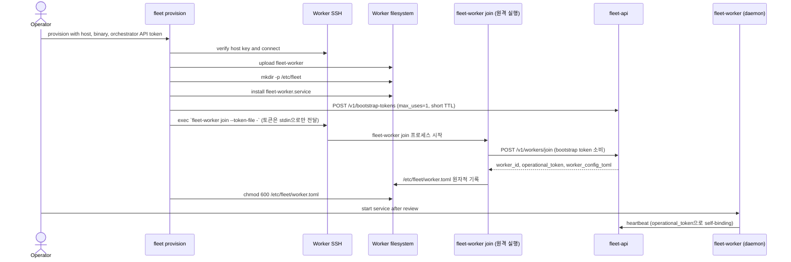

# Worker SSH 프로비저닝 Runbook

`fleet provision`은 SSH로 `fleet-worker` 바이너리와 systemd unit을 배포한 뒤, 원격 호스트
자신에게 `fleet-worker join`을 실행시켜 `/v1/workers/join`으로 등록한다(로드맵 `#82`). worker.toml은
프로비저너가 로컬에서 렌더링하지 않는다 — 오케스트레이터의 join 응답을 대상 호스트가 직접
디스크에 기록한다.

## 현재 동작



`operational_token`은 대상 호스트가 orchestrator 응답으로 스스로 기록하며 **프로비저너(CLI
프로세스)는 그 값을 보지도 저장하지도 않는다**. 관리자 bearer(`orchestrator_api_token`)는 CLI
프로세스만 보유하고 대상 호스트에 전달하지 않는다 — 대신 호스트별 1회용 bootstrap token을 발급해
그 토큰만 전달한다. `/v1/workers/join`은 동일 이름의 워커가 이미 존재하면 `409 Conflict`로
거부한다(재등록은 지원하지 않는다) — `JoinWorker` 스텝은 이 경우를 조용히 성공 처리하거나 기존
워커를 지우지 않고, 항상 명확한 에러로 전파해 운영자가 판단하게 한다(실패 보상은 항상
전진 — 재시도·re-key — 워커 삭제로 후퇴하지 않는다).

## 사전 조건

- 대상 host, SSH user, private key와 검증된 known-hosts 정보를 준비한다.
- 로컬 `fleet-worker` binary 경로를 준비한다(grok secret은 선택 사항 — 미지정 시 원격
  `fleet-worker join`이 무작위로 생성한다, 로드맵 `#82`). 이기종 fleet(예: arm64와 x86_64
  워커가 섞여 있음)에서는 `StepContext.fleet_worker_bin_by_arch`(`PrereqReport.arch`, 즉
  `uname -m` 값을 키로 하는 맵)에 아키텍처별 바이너리 경로를 채우면 `InstallFleetWorker`가
  감지된 아키텍처에 맞는 것을 자동 선택한다(`#81`). 인벤토리 YAML 모드는 `defaults.fleet_worker_bin`
  (단일 폴백)/`defaults.fleet_worker_bin_by_arch`(아키텍처별 맵, 워커별 오버라이드는
  `fleet_worker_bin`만)로 이 맵을 채운다(`#83`). 단일 호스트 CLI 모드(`--fleet-worker-bin`)는
  여전히 단일 경로만 지원한다 — 아키텍처별 배선은 인벤토리 모드에만 있다.
- Orchestrator URL과 `orchestrator_api_token`(`--api-token`/`FLEET_API_TOKEN`)이 필요하다 —
  `JoinWorker` 스텝이 이 토큰으로 호스트별 1회용 bootstrap token을 발급한다(로드맵 `#82`).
  Worker 지속 신원(`operational_token`)과 bootstrap token의 분리는 `#60` 1~8단계로 완료됐다.
  자세한 계약은 [Worker enrollment](../contracts/worker-enrollment.md)에서 확인한다.
  인벤토리 모드는 dry-run이 아닌 실행에서 이 토큰이 없으면 SSH 연결을 하나도 시도하기 전에
  즉시 실패한다(`#83`) — 이전에는 20여 대를 순차 프로비저닝하던 중 마지막 스텝(`JoinWorker`)에
  가서야 토큰 누락이 드러났다.
- `orchestrator_api_token`(`ProvisionOptions.api_token`)의 capability 요구사항:
  - `JoinWorker` 스텝은 `token:issue`가 필요하다(`#82`) — 없으면 이 스텝에서 즉시 실패하고,
    뒤이은 `PushCredentials`/`StartServices`는 실행되지 않는다.
  - `PushCredentials` 스텝은 `worker:llm_credential:read`/`:export`가 필요하다(`#66`).
  - `StartServices` 스텝의 하트비트 확인은 `worker:list`가 필요하다 — 없으면 그 폴링만
    `401`/`403`으로 즉시 실패한다(로컬 systemctl 확인까지는 이미 통과한 상태). 토큰 자체가
    없으면 하트비트 확인을 건너뛰고 로컬 상태만으로 진행한다(경고 로그, 하위 호환).

운영 환경은 `strict` host-key 정책을 사용하고 `fleet scan-host-keys` 출력의 fingerprint를 별도
신뢰 채널에서 확인한다. `tofu`는 최초 연결 공격을 방지하지 못하고 `accept-all`은 운영에 사용하지
않는다.

## mTLS 프로비저닝 (선택, 로드맵 `#85`)

`--mtls-enabled`(단일 호스트)/`mtls_enabled`(인벤토리)를 켠 워커는 표준 playbook에 두 스텝이
추가로 실행된다 — `InstallFleetWorker` 뒤·`JoinWorker` 앞의 `IssueMtlsAssets`, `JoinWorker`
뒤의 `ConfigureMtls`.

- **사전 조건**: `fleet mtls init-ca --out <dir>`로 fleet 전체가 공유할 로컬 CA를 한 번
  발급해 둔다(비밀키 `ca.key`는 이 CA를 관리하는 운영자 머신에만 둔다 — 원격에 절대 업로드되지
  않는다). 그 디렉토리를 `--mtls-ca-dir`(단일 호스트) 또는 `options.mtls_ca_dir`(인벤토리)로
  가리킨다. `fleet mtls issue-server`를 미리 실행해 둘 필요는 없다 — `IssueMtlsAssets`가 매
  실행마다 자동으로 발급한다.
- **`IssueMtlsAssets`**: `fleet-cli`(같은 프로세스, `fleet mtls issue-server`와 동일한
  `mtls::run_issue_server` 함수)가 워커 전용 서버 인증서를 로컬 임시 디렉토리에 발급한다 —
  SAN은 항상 `mtls_advertised_host`(미지정 시 워커 이름)다. 발급된 `server.pem`/`server.key`와
  CA의 `ca.pem`을 `/tmp` 스테이징 후 `sudo mv`로 원격 `/etc/fleet/mtls/{server.pem,server.key,ca.pem}`에
  옮기고 권한을 보정한다(cert/ca `0644`, key `0600`, `root:root`). 로컬 임시 디렉토리는 업로드가
  끝나면(성공이든 실패든 함수 스코프를 벗어나면) 자동으로 삭제된다.
- **`JoinWorker`(mTLS 확장)**: `grok_secret`이 지정돼 있지 않으면 여기서 32바이트 무작위
  hex를 생성해 `--grok-secret`과 `--agent-endpoint wss://{advertised_host}:{advertised_port}/ws?server-key={secret}`
  양쪽에 동일하게 넘긴다 — `fleet-worker join`의 기본 유도 로직(`derive_agent_endpoint`)에
  맡기면 리버스 SSH 터널 시절의 엔드포인트 형태가 나와 지금 토폴로지와 맞지 않는다.
- **`ConfigureMtls`**: `JoinWorker`가 만든 `/etc/fleet/worker.toml`을 읽어(`[worker]` 섹션이
  없으면 — 예: `--tags mtls`로 `JoinWorker` 없이 단독 실행된 경우 — 명확히 실패한다)
  `[mtls]` 섹션을 덧붙인다. `server_cert_path`/`server_key_path`/`client_ca_path`는 항상
  `IssueMtlsAssets`가 쓴 고정 경로이고, `advertised_host`/`advertised_port`는 `IssueMtlsAssets`가
  SAN으로 쓴 값과 같은 출처(`ctx.mtls_advertised_host`)라 구조적으로 어긋날 수 없다.
- **인증서 없이 활성화**: `mtls_enabled`인데 `mtls_ca_dir`이 없으면(단일 호스트는
  `IssueMtlsAssets` 단계에서, 인벤토리 모드는 SSH 연결을 하나도 시도하기 전에) 명확한 에러로
  즉시 실패한다.
- 표준 playbook에서 `InstallCloudflared`가 제거됐다(로드맵 `#85`) — [Topology](topology.md)가
  mTLS 직접 다이얼을 canonical transport로 확정했고, 그 스텝은 설치 실패를 `|| true`로 조용히
  삼키는 결함도 있었다. 스텝 자체는 삭제되지 않았으므로 필요하면 커스텀 playbook 구성으로
  여전히 쓸 수 있다.

## 단일 Host 실행

다음 예시는 playbook이 요구하는 비밀이 아닌 입력을 나타낸다. 실행 전 `FLEET_GROK_SECRET`,
`FLEET_ORCHESTRATOR_URL`과 `FLEET_API_TOKEN`(`token:issue` capability 포함)을 권한이 제한된
실행 환경으로 주입한다.

```bash
fleet provision \
  --host worker.example.com \
  --name worker-01 \
  --user ubuntu \
  --ssh-key /secure/path/worker_ed25519 \
  --host-key-policy strict \
  --known-hosts /etc/fleet/known_hosts \
  --fleet-worker-bin ./target/release/fleet-worker
```

`FLEET_API_TOKEN`이 없으면 `JoinWorker` 스텝이 `orchestrator_api_token is required` 에러로
즉시 실패한다 — bootstrap token은 CLI가 이 admin bearer로 호스트마다 자동 발급하므로 운영자가
직접 준비하거나 커맨드라인에 전달할 값은 없다.

## 검증

1. `/usr/local/bin/fleet-worker`가 기대 version과 checksum을 가지는지 확인한다.
2. `/etc/fleet/worker.toml`과 systemd unit의 소유권·mode(`0600`)를 확인한다 — `existing_worker_id`와
   `operational_token`이 채워져 있어야 한다.
3. 설정의 Orchestrator URL, Worker name, grok secret을 검토한다. mTLS가 켜져 있으면 `[mtls]`
   섹션이 있는지, `server_cert_path`/`server_key_path`/`client_ca_path`가 모두
   `/etc/fleet/mtls/`를 가리키는지, `advertised_host`가 실제로 그 인증서의 SAN과 일치하는지
   확인한다(`openssl x509 -in /etc/fleet/mtls/server.pem -noout -text`로 SAN을 직접 볼 수 있다).
4. 서비스를 명시적으로 시작하고 register·heartbeat 결과를 확인한다.
5. host inventory 등록은 best-effort이므로 CLI 성공만으로 API 등록 성공을 단정하지 않는다.

## 실패와 복구

- host-key 불일치는 접속을 중단하고 fingerprint를 재검증한다.
- `JoinWorker`가 `409 Conflict`로 실패하면(동일 이름 워커가 이미 존재) 이름을 바꾸거나 기존
  워커의 상태를 먼저 확인한다 — 이 스텝은 재등록을 수행하지 않고, 기존 워커를 지우지도 않는다.
- playbook 실패 뒤 `/tmp/fleet-worker.service`와 부분 설치 파일을 확인한다 — worker.toml은
  임시 경로를 거치지 않고 `fleet-worker join`이 `/etc/fleet/worker.toml`에 직접 원자적으로 쓴다.
- 일부 systemd 명령의 오류는 현재 구현에서 별도로 전파되지 않을 수 있으므로 원격 파일·service
  상태를 직접 확인한다.
- 이전 정상 binary와 설정을 보존했다면 서비스를 중단한 뒤 명시적으로 복원한다. 자동 rollback은
  구현되지 않았다.
- `IssueMtlsAssets`/`ConfigureMtls`가 실패해도 재실행은 안전하다 — `IssueMtlsAssets`는 원격
  파일 3개가 모두 있으면, `ConfigureMtls`는 `[mtls]` 섹션이 있으면 각각 건너뛴다. 재실행마다
  인증서를 새로 발급하지는 않는다(로컬 임시 파일이라 재실행 전에는 이미 사라진 상태) — 회전이
  필요하면 원격 `/etc/fleet/mtls/*` 파일을 지우고 재실행하거나, 이미 구현된 무중단 회전
  런타임(`cert_reload_interval_secs`)을 쓴다.

## 관련 정본

- [Worker 수동 가입](../worker-bootstrap/join.md)
- [Worker enrollment](../contracts/worker-enrollment.md)
- [구성과 비밀 관리](configuration.md)
- [설치 Runbook](install.md)
- [운영 토폴로지](topology.md) — mTLS 직접 다이얼 결정과 신뢰 경계
