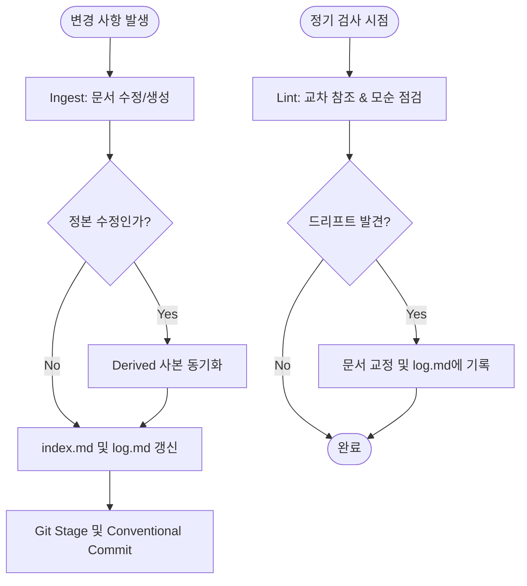

# 문서화 시스템 분석 및 지속 관리를 위한 지침서 (Documentation Policy)

> 작성일: 2026-08-13
>
> 이 문서는 Grok Fleet Orchestrator 프로젝트의 모든 문서가 실제 코드베이스와 완벽히 동기화된 상태(No-Drift)를 유지하고, 에이전트와 인간 개발자 간의 지식 협업을 지속하기 위한 **문서 관리 정책, 구조 분석 및 실무 가이드라인**을 정의합니다.

---

## 1. 문서화 시스템 아키텍처 및 상태 분석

Grok Fleet Orchestrator의 문서 시스템은 단순히 텍스트를 모아둔 저장소가 아니라, **도메인 단위의 격리된 구조**, **정본-사본 간의 명확한 의존성**, 그리고 **실제 작동하는 코드와의 실측 정합성**을 보장하는 체계적인 지식 맵으로 구성되어 있습니다.

### 1.1 디렉토리 구조 및 역할 분담
모든 문서는 flat한 구조를 탈피하고, `docs/` 하위의 8대 도메인 디렉토리 및 특수 목적의 하위 위키/레지스트리로 격리되어 관리됩니다.

```
docs/
├── index.md                 # 전체 문서의 콘텐츠 지향 카탈로그 (정본/사본 상태 기록)
├── log.md                   # 문서 변경 이력을 기록하는 Append-only 로그 파일
├── assets/
│   └── diagrams/            # 모든 다이어그램(.mermaid, .svg) 리소스 통합 관리 디렉토리
│       ├── <domain>/        # 각 도메인 이름과 1:1 매핑
│       └── shared/          # 여러 도메인이 공유하는 다이어그램
├── architecture/            # 시스템 내부 설계, API 사양, MCP 표준 규약
├── deployment/              # 배포 가이드, 토폴로지, Nginx 게이트웨이 표준화 결정
├── worker-bootstrap/        # 워커 조인 인증, 토큰 전달, SSH 프로비저닝 설계
├── server-management/       # 고급 서버 관리 및 자가 치유 제안 (미구현 제안서)
├── roadmap/                 # 개발 단계, 백로그 우선순위, 갈등 분석 마스터 트래커
├── security/                # S1~S6 보안 결함 분석 및 해결 보고서
├── ui-dashboard/            # 대시보드 화면 설계서 및 디자인 토큰 매핑
├── engineering-patterns/    # 코드베이스에서 추출한 재사용 패턴 및 본 지침서
├── llm-wiki/                # LLM 게이트웨이(liteLLM) 관련 독립 서브 위키
└── credentials/             # 시크릿·크리덴셜 메타데이터 레지스트리 (값 자체는 미기록)
```

### 1.2 중앙 부기 체계 (Central Bookkeeping)
*   **[`docs/index.md`](file:///Users/yarang/working/tools/grok-fleet-orchestrator/docs/index.md) (카탈로그)**: 모든 문서의 파일 경로, 한 줄 요약, 상태 지위(🟢, 🔵, 🟡, ⚪, ⚫), 최종 개정일을 관리합니다.
*   **[`docs/log.md`](file:///Users/yarang/working/tools/grok-fleet-orchestrator/docs/log.md) (변경 로그)**: 시간순으로 작성된 **수정 불가능한(Append-only)** 이력입니다. 변경 유형을 `ingest`(신규 반영), `query`(새 지식 파일링), `lint`(정합성 수정)로 명확히 분류합니다.
*   **서브 위키 독립성**: `llm-wiki/`와 `credentials/`는 다루는 지식의 특수성(LLM 기술 변화, 자격증명 메타데이터)을 고려하여 자체적인 `README.md`, `index.md`, `log.md`/`registry.md`를 가집니다.

### 1.3 최근 정합성 감사(Audit) 결과 및 성과
2026-08-11과 2026-08-13에 걸쳐 대대적인 문서 정합성 점검 및 코드 실측 조사가 이루어졌으며, 다음과 같은 중대한 문서 드리프트(Drift)가 해소되었습니다.

*   **실제 API 및 도구 정합**: 문서가 지칭하던 MCP 도구명(허구의 명칭)을 실제 코드(`crates/fleet-mcp/src/schema.rs`)에 정의된 `fleet_dispatch_task` 등의 7종 도구와 일치시켰습니다.
*   **동적 동작 팩트 체크**: 스케줄러 디스패처가 "1초 주기 폴링" 방식으로 작동한다는 노후된 서술을 "이벤트 루프 및 채널 기반 즉각 디스패치"라는 실제 Rust 구현체와 동기화했습니다.
*   **미구현 코드의 문서 이관 및 삭제**: 컴파일이 깨진 채 방치되어 있던 자율 엔진 코드(`autonomic.rs`)를 과감히 삭제하고, 해당 설계 의도를 아키텍처 문서(`overview.md`)의 미구현 설계 섹션으로 온전히 격리 보존했습니다.
*   **Nginx 게이트웨이 표준화**: 과거 Caddy를 리버스 프록시로 사용하던 구버전 배포 가이드와 Docker Compose 설제를 Nginx 리버스 프록시 표준 구성(`nginx-gateway.md`)으로 전면 동기화했습니다.
*   **시크릿 레지스트리 최신화**: 코드에 구현되어 있었으나 시크릿 대장에 누락되어 있던 `FLEET_API_TOKENS`, `FLEET_CF_AUDIENCE`, `FLEET_GMAIL_USER/PASS`, `ssh_keys` 데이터베이스 테이블의 존재를 추가 등재했습니다.

---

## 2. 지속적인 지식 보존을 위한 4대 문서화 지침

에이전트와 개발자가 변경을 수행할 때, 다음 지침을 의무적으로 준수하여 문서가 코드베이스로부터 멀어지는 현상을 원천 차단해야 합니다.

### 2.1 정본-사본 원칙 (Canonical-Derived Principle)
문서 간에 정보가 중복 서술되는 것을 지양하되, 중복 기술이 필요한 경우 단 하나의 **정본(Canonical)**과 이를 인용하는 **사본(Derived)**으로 지위를 선언합니다.
*   **지위 명시**: 각 문서의 서두 및 [`docs/index.md`](file:///Users/yarang/working/tools/grok-fleet-orchestrator/docs/index.md)에 정본 여부와 참조 소스를 밝힙니다.
*   **선(先)정본 수정 후(後)동기화**: 정보를 업데이트해야 할 경우, 반드시 **정본을 먼저 수정**한 뒤 사본들을 순차적으로 고쳐야 합니다. 이 순서를 생략하면 사본이 구세대 정보를 담고 있는 모순이 유발됩니다.

### 2.2 코드 실측 검증 원칙 (Fact-Checking Against Code)
문서에 기술되는 모든 클래스, 구조체, 함수명, 포트 번호, 환경변수명은 플레이스홀더나 임의의 예시를 사용하지 않고 **실제 코드 파일과 정합해야 합니다**.
*   **실제 심볼 링크 제공**: 문서 내에서 코드 심볼을 언급할 때는 반드시 Markdown 파일 링크 기법(`[심볼](file:///경로#라인)`)을 활용하여 사용자가 클릭하여 실제 코드로 이동할 수 있도록 지원합니다.
*   **행동 증명(Fail-to-Prove)**: 구현 여부를 검증할 때는 단순히 텍스트 검색에 의존하지 않고, 해당 코드가 누락되거나 실패했을 때 **테스트 하네스나 빌드가 실제로 깨지는지(Fail-closed)** 확인하여 사실성을 증명합니다.

### 2.3 다이어그램 및 SVG 리소스 관리 규약
텍스트 서술만으로 구조적 관계를 명확히 표현할 수 없으므로, 아키텍처나 흐름을 다루는 장표에는 반드시 다이어그램을 병행 표기합니다.
*   **Mermaid 우선 사용**: 노드와 엣지(흐름, 상태, 시퀀스) 형태는 버전 관리와 Diff 비교가 용이한 Mermaid 소스 파일(`.mermaid`)로 생성합니다.
*   **자유 레이아웃은 SVG**: 박스 배치, 모듈 맵 등 픽셀 단위 정렬이 필요한 디자인은 SVG(`.svg`)로 작성하며, 텍스트 형태의 ASCII-art 박스 그리기(`┌──┐`)는 사용을 전면 금지합니다.
*   **외부 파일 분리 및 임베딩**: 문서가 인라인 코드로 거대해지는 것을 막기 위해 100줄 이상의 Mermaid나 모든 SVG는 반드시 `docs/assets/diagrams/<domain>/` 경로 아래 별도 파일로 분리하고 마크다운 이미지 태그로 호출합니다.
*   **편집 소스 공동 보존**: 완성된 SVG를 수정할 수 있도록, SVG를 렌더링하기 전 원본 소스(`.mermaid` 또는 기타 벡터 파일)를 동일한 경로에 나란히 보존해야 합니다.

### 2.4 로드맵 무결성 보존 (Roadmap Integrity)
*   [`docs/roadmap/roadmap.md`](file:///Users/yarang/working/tools/grok-fleet-orchestrator/docs/roadmap/roadmap.md)의 마일스톤 번호는 영구적인 참조 키입니다. 완료된 항목이라도 삭제하거나 번호를 재활용해서는 안 되며, 체크 표시(✅)와 함께 해결 당시의 커밋 해시를 본문에 명기합니다.
*   로드맵 상태의 갱신 오너는 에이전트(Planner)이며, 작업 완료 직후 코드의 동작을 실측 대조한 뒤 마일스톤 문서를 즉각 동기화해야 합니다.

---

## 3. 문서 운영 워크플로우 (Ingest - Query - Lint)

문서의 영속적인 가치를 보장하기 위해 일상적인 변경 단계마다 다음 워크플로우를 강제합니다.



### 3.1 Ingest (반입 및 갱신)
1.  **YAML 프론트매터 기재**: 신규 생성하거나 크게 개정하는 파일의 최상단에 메타데이터 블록을 작성합니다.
2.  **색인 갱신**: 신규 문서는 즉시 [`docs/index.md`](file:///Users/yarang/working/tools/grok-fleet-orchestrator/docs/index.md)에 등록하고, 변경이 발생하면 해당 행의 `최종 개정` 날짜와 `상태`를 현행화합니다.
3.  **변경 이력 추가**: [`docs/log.md`](file:///Users/yarang/working/tools/grok-fleet-orchestrator/docs/log.md) 맨 아래에 날짜, 유형(`ingest`), 세부 작업 내역 및 관련 커밋 해시를 작성하여 append합니다.

### 3.2 Query (지식 조회 및 추론)
1.  AI 에이전트는 기여를 시작할 때 최우선적으로 [`docs/index.md`](file:///Users/yarang/working/tools/grok-fleet-orchestrator/docs/index.md)와 [`agent.md`](file:///Users/yarang/working/tools/grok-fleet-orchestrator/agent.md)를 탐독하여 최신의 컨텍스트를 파악합니다.
2.  특정 하위 기술 영역(예: LLM Gateway, Credentials)을 작업할 경우 해당 서브 디렉토리 내의 README 및 인덱스를 정독하여 과거 결정 맥락을 누락하지 않도록 주의합니다.

### 3.3 Lint (검사 및 교정)
1.  주기적으로 전체 문서 디렉토리를 대상으로 다음 사항을 모니터링합니다:
    *   어떤 문서에서도 참조되지 않는 **고아 문서(Orphaned Pages)**
    *   실제 소스 코드가 리팩토링되었음에도 예전 네임스페이스나 구조체를 가리키는 **깨진 링크 및 서술**
    *   도메인 디렉토리(`docs/assets/diagrams/`) 규칙을 위반하고 생성된 임시 이미지 폴더
2.  린트 과정에서 수정한 내역은 원인 분석과 함께 [`docs/log.md`](file:///Users/yarang/working/tools/grok-fleet-orchestrator/docs/log.md)에 `lint` 유형으로 영구 기록합니다.

---

## 4. 문서 메타데이터 & 작성 표준 규격

### 4.1 YAML 프론트매터 표준 양식
모든 마크다운 위키 파일 최상단에 기입하는 공통 규격입니다:
```yaml
---
type: wiki
status: canonical | derived | historical | deprecated
source: "docs/<path-to-source-file>.md" # status가 derived인 경우 정본 파일 경로 기재
last_verified: "YYYY-MM-DD"            # 실제 소스 코드와 정합성을 최종 대조한 날짜
---
```

### 4.2 카탈로그 상태 범례 지침
[`docs/index.md`](file:///Users/yarang/working/tools/grok-fleet-orchestrator/docs/index.md)와 서브 위키 인덱스에서 문서 상태를 표현할 때 아래 정의를 따릅니다.

| 범례 | 지위 (Status) | 행동 지침 |
|:---:|---|---|
| 🟢 | **정본 (Canonical)** | 해당 도메인의 단일 진실 원천(Single Source of Truth)으로 관리합니다. |
| 🔵 | **사본 (Derived)** | 정본을 인용하거나 변환한 문서입니다. 내용 충돌 시 정본이 무조건 우선하며, 정본 개정 시 함께 업데이트되어야 합니다. |
| 🟡 | **부분 수정됨 (Drifted/Partial)** | 소스 코드와의 불일치나 모순이 감지되어 일부만 정정된 상태입니다. 전체 검토 및 리팩토링이 요구됩니다. |
| ⚪ | **역사적 기록 (Historical)** | 특정 과거 시점의 설계 스냅샷입니다. 현재 가이드라인으로 채택하지 않으나 이력 추적을 위해 보존합니다. |
| ⚫ | **폐기/고아 (Deprecated)** | 사용하지 않거나 참조가 유실된 문서입니다. 영구 삭제하거나 적절한 정본에 병합하는 절차를 밟아야 합니다. |
