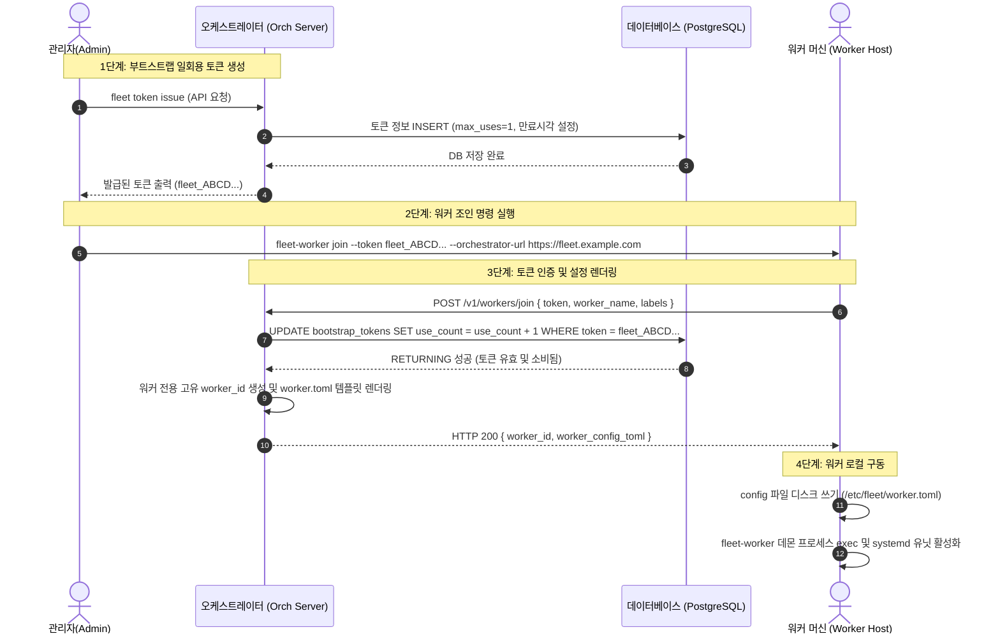
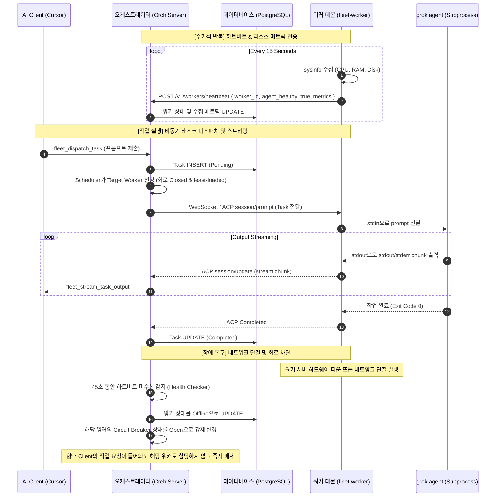

# fleet serve & 대시보드 상세 설계 및 워커 부트스트랩/운영 절차서

이 설계서는 **Grok Fleet Orchestrator**의 핵심 서버 엔진인 `fleet serve`와 **웹 대시보드(Web Dashboard)**의 모듈 및 통신 설계를 다루며, 워커 노드의 **최초 등록(Bootstrap) 및 일상 운영 절차(Operational Lifecycle)**를 Mermaid 시퀀스 다이어그램으로 정의합니다.

---

## 1. `fleet serve` 상세 설계 (Server Engine Design)

`fleet serve`는 단일 Rust 바이너리로 기동하며, 내부적으로 멀티스레드 비동기 런타임(Tokio) 상에서 다중 프로토콜 엔드포인트를 병렬 실행합니다.

```
                         ┌──────────────────────────────┐
                         │         fleet serve          │
                         └──────────────┬───────────────┘
                                        │ (Spawns Loops)
         ┌──────────────────────────────┼──────────────────────────────┐
         ▼                              ▼                              ▼
┌──────────────────┐           ┌──────────────────┐           ┌──────────────────┐
│   HTTP API Server│           │  MCP stdio Server│           │Background Workers│
│   (Axum Router)  │           │   (JSON-RPC)     │           │ (Async Loop)     │
└────────┬─────────┘           └────────┬─────────┘           └────────┬─────────┘
         │                              │                              │
         │ - /v1/workers/register       │ - fleet_dispatch_task        │ - Task Dispatcher
         │ - /v1/workers/heartbeat      │ - fleet_get_task_status      │ - Worker Health
         │ - /dashboard (Static Assets) │ - fleet_list_workers         │   Checker (15s)
         └──────────────────────────────┴──────────────────────────────┘
```

### 1.1 주요 모듈 구성
1. **Axum HTTP Router**:
   * **API 엔드포인트**: 워커의 등록/해제 및 하트비트 통신 처리, 마스터 키 기반의 credentials 암호화 보관/조회 API 제공.
   * **정적 자산 서빙**: `rust-embed`를 통해 컴파일 시점 바이너리에 포함된 대시보드 리소스(HTML/JS/CSS)를 `/dashboard` 경로로 클라이언트에 전송.
2. **MCP stdio JSON-RPC 엔진**:
   * AI 코딩 클라이언트(Cursor, Claude Code 등)가 실행한 서브프로세스 표준 입출력(stdin/stdout) 채널을 통해 JSON-RPC 2.0 규격으로 7개의 MCP 도구를 노출.
3. **태스크 디스패처 (Dispatcher Loop)**:
   * 1초 주기로 PostgreSQL DB의 `fleet_tasks` 테이블을 폴링하며 `Pending` 상태의 작업을 조회.
   * `WorkerSelector` 모듈을 통해 `Closed` 상태의 회로차단기를 가졌고 CPU/Memory 여유 용량이 남은 워커를 찾아 ACP(Agent Client Protocol) over WebSocket 채널로 작업을 위임.
4. **헬스체커 루프 (Health Checker Loop)**:
   * 15초 간격으로 가동되며, 최근 45초(3회 이상 미수신) 동안 하트비트가 수집되지 않은 온라인 워커 노드들의 상태를 `Offline`으로 변경하고, 해당 워커의 회로차단기를 즉시 강제 개방(Open)하여 태스크 할당을 차단.

---

## 2. 웹 대시보드 상세 설계 (Web Dashboard Design)

대시보드는 관리자와 일반 사용자가 인프라의 상태를 실시간 파악하고 제어할 수 있는 모니터링 콘솔입니다.

### 2.1 보안 및 인증 모델 (Security & Session)
* **비밀번호 해싱**: Argon2id 알고리즘을 사용해 비밀번호를 단방향 암호화하여 DB에 안전히 보관.
* **쿠키 기반 세션**: 로그인 성공 시 암호화 서명된 Stateful 세션 쿠키를 발급하며, 세션 만료 시간 및 무효화 처리는 오케스트레이터 메모리/DB 세션 테이블을 통해 중앙 통제.
* **역할 기반 권한 제어 (RBAC)**:
  * `Admin`: 부트스트랩 토큰 발급/삭제, 유저 계정 비활성화, 워커 제거 및 CA 인증서 제어.
  * `User`: 작업 목록 보기, 작업 강제 취소, 워커 메트릭 조회만 허용.

### 2.2 실시간 데이터 스트리밍 (Server-Sent Events)
* 웹 브라우저 대시보드의 실시간성(로그 실시간 출력, 시스템 이벤트 타임라인 업데이트)을 확보하기 위해, 폴링(Polling) 대신 **SSE(Server-Sent Events)** 엔드포인트(`/api/events/stream`)를 활용합니다.
* PostgreSQL의 `LISTEN / NOTIFY` 트리거를 리스닝하고 있는 오케스트레이터 커넥션이 알림을 수신하는 즉시 SSE 채널을 통해 모든 접속 중인 관리자 브라우저로 1ms 이내로 전송합니다.

---

## 3. 워커 부트스트랩(Bootstrap) 절차 다이어그램

워커가 최초로 오케스트레이터에 인프라 노드로 조인하고 자동 구성 설정(worker.toml)을 받아 가동되는 절차입니다.



---

## 4. 워커 운영 수명 주기 절차 다이어그램 (Operational Lifecycle)

워커가 구동된 후 일상적인 하트비트 송신, 작업 수신/실행, 로그 청크 스트리밍 및 장애 감지 시의 회로차단기 동작을 보여주는 종합 운영 시퀀스입니다.


