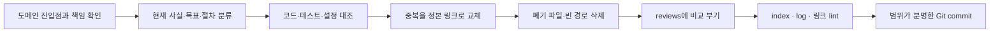

# 문서 재작성 및 정본 관리 지침

## 목적

문서는 코드 구현자가 현재 규칙과 검증 근거를 빠르게 찾아 **잘못된 구현 경로를 택하지 않게**
하는 도구다. 중복, 폐기된 설명, 확정 전 논의가 정본 문서에 남아 현재 계약처럼 읽히지 않게
관리한다.

## 1. 도메인과 진입점

각 문서 도메인은 반드시 `README.md` 또는 `index.md` 하나를 진입점으로 둔다. 진입점은
해당 도메인의 파일을 관리하며, 다음만 제공한다.

- 도메인이 답하는 질문과 범위 밖 내용
- 읽기 순서
- 파일별 책임, 정본 지위, 구현·검증 상태
- 인접 도메인의 정본 링크

진입점은 세부 계약·운영 절차·논의 내용을 다시 쓰지 않는다. 루트 `docs/index.md`는 도메인
진입점만 색인하며, 새 문서를 무분별하게 평면 나열하지 않는다. `docs/assets/`와 그 하위는
문서 도메인이 아닌 자산 컨테이너이므로 `assets/diagrams/README.md` 하나로 관리한다. 문서가
없는 빈 도메인 디렉터리는 새 책임이 확정되지 않은 한 삭제한다.

루트 색인이나 도메인 진입점에는 ⚫ 폐기·⚪ 과거 문서를 정상 탐색 경로로 넣지 않는다. 현재
독자가 따라야 할 문서만 연결하고, 검토 근거는 `reviews/` 진입점으로 분리한다.

## 2. 문서의 기능상 책임

문서 하나는 **독자 질문 하나와 기능상 계약 하나**를 담당한다. 파일 크기는 분리 기준이 아니다.

| 문서 종류 | 담당하는 내용 | 두지 않는 내용 |
|---|---|---|
| Canonical | 현재 결정, 불변식, 인터페이스·상태·권한 계약, 실패·복구, 완료 조건 | 대안 비교, 회의 기록, 긴 코드 인용 |
| Derived | 코드 구조, 테스트·관측 근거, 구현 제약 | 새 정책 또는 계약 재정의 |
| Runbook | 준비, 실행, 검증, 롤백, 장애 대응 | 설계 배경의 재서술 |
| Proposed | 아직 승인·구현되지 않은 선택지와 승인 조건 | 현재 지원되는 기능처럼 보이는 절차 |

정상·오류·복구는 같은 작업을 완료하는 하나의 절차이므로 한 Runbook에 둔다. 반면 API 계약,
운영 절차, UI 화면 설계, 보안 정책처럼 독자·승인자·변경 주기가 다른 내용은 분리한다.

### 2.1 현재 사실과 목표 계약

보안, enrollment, 인증, lifecycle처럼 구현 전환 위험이 큰 정본은 목적 다음에 **현재 사실과
목표 계약** 표를 둔다. 표의 현재 사실은 코드 경로·테스트·설정 자산으로 검증하고, 목표는
`proposed` 또는 `partial` 상태와 완료 게이트를 함께 적는다. 한 표의 셀 안에서도 현재 동작과
목표 동작을 섞지 않는다.

- endpoint, 권한, token/secret 전달 경로, 기본값, 실패 순서는 코드와 테스트로 대조한다.
- 인증 조합, 권한 범위, 재시도·소모 순서처럼 조합에 따라 달라지는 동작은 행렬 또는 상태표로 쓴다.
- 원문 secret, 예제 token, query parameter의 credential은 문서·로그·스크린샷에 쓰지 않는다.
- historical/Derived 문서가 실행 명령이나 상태표를 담아 현재 계약과 충돌하면, 현재 정본으로
  필요한 사실을 흡수한 뒤 review로 이관하거나 삭제한다.

## 3. 논의와 비교 부기

설계 정본에는 논의 과정, 찬반, 회의 대화, 이전 정정 기록을 두지 않는다. 논의로 확정된 결과만
정본의 “결정” 절에 짧고 단정적으로 기록한다.

비교·감사·대안·논의 기록은 `docs/reviews/`에만 둔다. 각 review 문서는 다음을 포함한다.

- 대상 정본과 검토 시점
- 비교한 대안과 코드·테스트 근거
- 결정된 결과와 정본 반영 링크
- 남은 미결정 항목과 담당자

`docs/reviews/README.md`가 이 부기 문서의 진입점이다. review는 Derived이며, 정본과 충돌하면
항상 정본이 우선한다.

## 4. 폐기와 삭제

폐기된 문서는 도메인에 `deprecated` 포인터로 남기지 않고 삭제한다. 삭제 전에는 다음을 완료한다.

1. 대체 정본 또는 “대체 없음”을 확정한다.
2. 모든 inbound link와 도메인 진입점·`docs/index.md`를 갱신한다.
3. 필요한 비교·이관 근거만 `docs/reviews/`에 남긴다.
4. 문서 파일을 삭제하고 `docs/log.md`에 삭제 이유와 대체 경로를 기록한다.

삭제 대상에 대한 검색은 Markdown 링크뿐 아니라 파일명·표시명·색인 행·예제 명령도 포함한다.
삭제 뒤에는 빈 디렉터리와 자산 참조를 확인한다. Git 이력은 삭제된 본문을 복구할 수 있는 기록이다.
현재 구현에 영향을 주지 않는 오래된 문서를
정본 도메인에 보존하지 않는다.

## 5. 작성 규칙

정본 설계 문서는 가능한 한 다음 순서를 따른다.

1. 목적과 범위
2. 현재 상태와 코드 대조 차이
3. 결정과 불변식
4. 인터페이스·데이터·권한·상태 계약
5. 실패와 복구
6. 검증과 완료 게이트
7. 관련 정본과 증거

- 현재 사실, 목표, 미결정을 같은 문단이나 표에 섞지 않는다.
- 첫 문장에서 결론과 적용 범위를 말한다. 한 문단에는 하나의 주장만 둔다.
- 근거 없는 단정은 쓰지 않는다. 구현되지 않은 항목은 `proposed` 또는 `partial`로 표시한다.
- “향후 검토한다” 대신 담당자, 조건, 결정 기한, 완료 기준을 기록한다.
- API·환경변수·심볼·포트·권한은 실제 코드와 대조한다.
- 보안상 중요한 현재 제약(평문 저장 가능성, 인증 누락·조합, token 소모 순서, secret 전달)은
  목표 설계와 별도 문장 또는 표로 눈에 띄게 기록한다.
- 모든 Markdown 링크는 저장소 상대 경로를 사용한다. `file:///` 절대 링크와 삭제된 경로는 허용하지 않는다.
- 구조·상태·흐름은 Mermaid 또는 SVG로 표현한다. ASCII-art와 `file:///` 절대 링크는 사용하지 않는다.

## 6. 재작성 절차

임시 조사와 초안은 `.tmp/`에만 둔다. 최종 문서에 반입하지 않으며 Git에 추가하지 않는다.

## 7. 완료 게이트와 Git 기록

재작성 작업은 다음을 모두 만족할 때 완료다.

- [ ] 도메인 진입점이 파일 책임과 읽기 순서를 설명한다.
- [ ] 루트 `docs/index.md`는 도메인 진입점만 색인하고, 폐기·역사 문서는 정상 탐색 경로에 없다.
- [ ] 문서가 있는 각 도메인에 진입점이 있고, 빈 도메인 디렉터리는 삭제 또는 자산 컨테이너로 분류됐다.
- [ ] 각 정본에 현재 계약만 남고 중복 내용은 링크로 교체됐다.
- [ ] 현재 사실·목표 계약·미구현 상태가 분리됐고, 보안·인증·secret 경로는 코드 근거와 대조됐다.
- [ ] 폐기 문서는 링크를 정리한 뒤 삭제됐다.
- [ ] 비교·논의 기록은 `docs/reviews/`에만 있다.
- [ ] frontmatter의 authority, implementation, verification, 소유자, 검증 시점이 코드 근거와 일치한다.
- [ ] `docs/index.md`와 `docs/log.md`를 갱신하고 상대 링크·삭제 경로·형식 검사를 통과했다.
- [ ] 변경 범위를 확인한 뒤 `docs:` Conventional Commit으로 Git 기록을 남겼다.

문서 재작성 커밋은 코드 변경과 분리한다. 예: `docs: split worker enrollment contract`.
