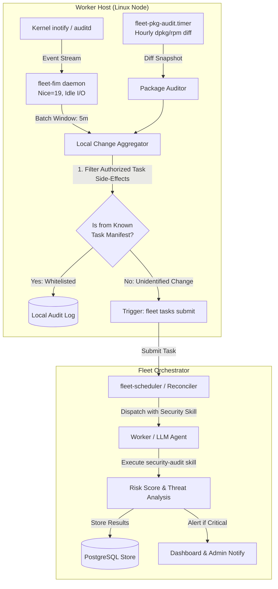

# 호스트 무결성 감시 제안·위험 분석 보존 (Derived)

> **지위: Derived proposal.** 구현 전 제안과 위험 분석을 보존한다. 현재 운영 보안
> 규칙은 [Control Plane 보안 모델](../../security/control-plane-security-model.md)이 우선한다.
**작성일**: 2026-08-16  
**대상**: Fleet Orchestrator 아키텍처팀 및 에이전트 협업 그룹

---

## 1. 개요 및 배경

Grok Fleet Orchestrator에서 각 워커 노드는 에이전트 태스크(빌드, 스크립트 실행, 환경 설정 등)를 수행하며 호스트 파일시스템과 패키지 관리자에 변경을 유발할 수 있습니다.  
그러나 워커의 정규 작업 이외의 비인가 패키지 설치나 임의 생성/변조된 바이너리/설정 파일은 보안 침해(Supply Chain Attack, 백도어, 크립토마이너 등)나 호스트 오염(Drift)을 유발합니다.

본 보고서는 **"워커 비관리 변경 감시 + LLM 기반 위험성 분석"**을 기존 아키텍처에 도입할 때 발생하는 변화와 시스템적 설계 고민을 정리합니다.

---

## 2. 설계 추가 시 발생하는 아키텍처 변화

### 2.1 데이터 모델 및 프로토콜 변경 (`fleet-core`, `fleet-transport`)
1. **Task Manifest & Side-effect 추적**:
   - `TaskResult`에 `side_effects: Option<TaskSideEffects>` 필드 추가 (작업 중 설치된 패키지 리스트, 생성/수정된 파일 경로 해시 메타데이터 포함).
   - 이를 통해 호스트 감사 엔진이 "정규 작업으로 발생한 변경"과 "비인가/외부 변경"을 화이트리스트 기반으로 분기 판별 가능.
2. **Security Event Entity 도입**:
   - 무결성 위반 알림 및 조치 상태를 관리하는 `HostIntegrityEvent` 구조체 정의.

### 2.2 워커 데몬 및 프로비저너 변경 (`fleet-worker`, `fleet-provisioner`)
1. **프로비저닝 시 감시 데몬 배포**:
   - `fleet provision` 시 `fleet-fim.service` (inotifywait 기반) 및 `fleet-pkg-audit.timer`를 systemd 단위로 함께 배포.
   - 워커의 기본 패키지 베이스라인 스냅샷(`/var/lib/fleet/pkg-baseline.txt`) 생성.
2. **Resource Throttling 정책 강제**:
   - 감시 서비스에 `Nice=19`, `IOSchedulingClass=idle`, `CPUQuota=5%`, `MemoryMax=64M` 적용.

### 2.3 스케줄러 및 에이전트 스킬 연계 (`fleet-scheduler`, `fleet-cli`)
1. **자가 분석 루프 (Self-Adaptive Audit Loop)**:
   - 감시 에이전트가 의심스러운 변경을 포착하면 기존에 구현된 `fleet tasks submit --skill security-audit`을 통해 백그라운드 태스크로 자동 생성.
   - 분석 결과는 위험도(Low/Medium/High/Critical) 및 격리/롤백 제안 명령어로 구성.

---

## 3. 핵심 설계 고민 (Trade-offs & Challenges)

### 고민 1: 감시 오버헤드 vs 실시간 탐지 (Polling vs Kernel Event)
* **문제**: 실시간 감시를 무턱대고 돌리면 워커의 빌드(예: `cargo build`, `npm install`) 중 수만 개의 파일 I/O가 발생해 inotify 큐 오버플로우나 CPU 스파이크가 발생함.
* **해결책**:
  - 시스템 핵심 경로(`/usr`, `/etc`, `/bin`, `/sbin`, `/lib`, `/root`)만 inotify 감시 대상으로 한정.
  - 워커 작업 영역(`/tmp/fleet/workspace/*`)은 실시간 inotify에서 제외하고 작업 종료 시점에만 스냅샷 검사.
  - 이벤트는 즉시 LLM으로 보내지 않고 **5분~15분 윈도우 배칭(Batching)** 및 중복 제거(Debounce) 수행.

### 고민 2: LLM API 토큰 비용 폭증 방지
* **문제**: 단순 로그 로테이션, cron 작업, 패키지 캐시 갱신 등 일상적 변동마다 LLM을 호출하면 비용과 쿼터가 낭비됨.
* **해결책 (3계층 필터링 파이프라인)**:
  1. **Layer 1 (L1 Regex/Whitelist Filter)**: 알려진 안전 경로(예: `/var/log/*`, `/tmp/*`, `.cache`) 즉시 드롭.
  2. **Layer 2 (L2 DB Task Reconciliation)**: 직전 완료된 태스크의 `side_effects`와 매칭되는 내역 제거.
  3. **Layer 3 (L3 LLM Threat Analysis)**: L1, L2를 통과한 '미확인 변경점(Unidentified Diff)'만 `security-audit` 스킬로 분석.

### 고민 3: 에이전트의 오탐(False Positive) 및 자율 조치 권한 격리
* **문제**: LLM이 위험하다고 판단하여 임의로 파일을 삭제하거나 패키지를 삭제할 경우 시스템 파손 위험.
* **해결책**:
  - 초기 단계에서는 **Read-Only / Recommendation Mode**로 운용.
  - 분석 결과는 대시보드 알림 및 관리자 승인(Human-in-the-loop) 큐로 전달.
  - 신뢰도가 검증된 격리 규칙(예: `/tmp` 하위 미인가 실행 파일 `chmod -x`)만 제한적으로 자동화.

---

## 4. 제안 로드맵 및 단계별 구현 방안

| 단계 | 목표 | 구현 대상 |
|---|---|---|
| **Phase 1** | 베이스라인 패키지 & 핵심 경로 변경 감지 | `fleet-provisioner`에 systemd timer/inotify 템플릿 추가, 로컬 로그 수집 |
| **Phase 2** | `fleet-core` 태스크 사이드이펙트 기록 | `TaskResult`에 실행 파일/패키지 변경 메타데이터 저장 기능 추가 |
| **Phase 3** | 이벤트 배치 취합 및 LLM 자동 분석 | 미인가 변경 감지 시 `fleet tasks submit --skill security-audit` 트리거링 스크립트 연동 |
| **Phase 4** | 대시보드 보안 뷰 및 알림 통합 | `fleet-dashboard`에 호스트 무결성 이벤트 탭 및 경보 UI 추가 |

---

## 5. 결론

호스트 무결성 감시 및 위험성 분석을 상시 에이전트(Always-running Agent)로 돌리는 대신, **"커널 레벨의 초경량 감시(inotify + systemd) + 3계층 필터링 + 이벤트 기반 온디맨드 에이전트(fleet tasks submit)"** 구조로 통합하면 서버 성능 부하와 토큰 비용을 최소화하면서도 높은 보안 무결성을 안정적으로 확보할 수 있습니다.
