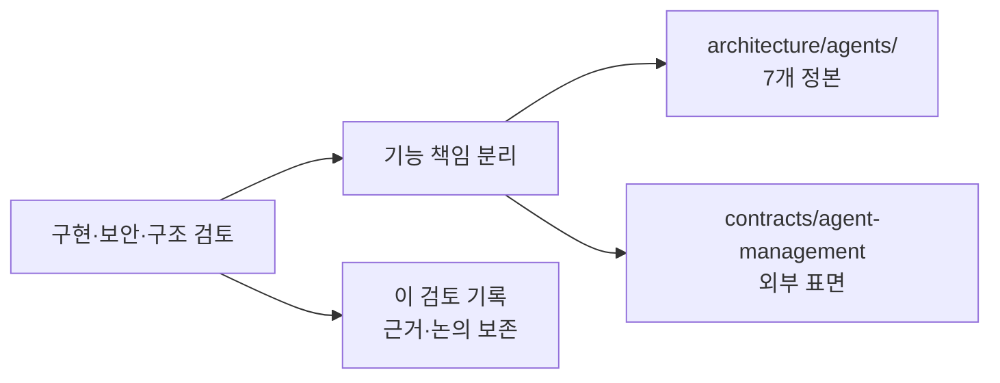

# Agent 문서 재작성 검토 기록

## 결론

기존 다섯 설계문서가 provisioning, runtime, terminal, harness, memory, API/UI, 운영 논의를 한데 섞고 있었다. 이를 `architecture/agents/` 진입점 아래 일곱 기능 책임 문서와 `contracts/agent-management.md`로 분리했다. 원본 파일은 활성 링크를 교체한 뒤 삭제했다.

## 확인된 근거

| 검토 관점 | 확인 내용 | 반영 |
|---|---|---|
| 구현 정합성 | Agent entity·명령 ACK·runtime catalog·Agent API는 현재 없다 | 모든 새 Agent 계약을 `proposed`로 표기 |
| 격리 | 약한 격리 fallback과 container의 host tmux attach는 허용할 수 없다 | isolation 문서의 강제 규칙으로 고정 |
| terminal | 출력에는 secret/개인정보가 있을 수 있고 attach는 host-shell급 영향이 있다 | capture·attach를 별도 보안 게이트로 차단 |
| 구조 | Provisioning 문서가 memory/tool/runtime를 소유하면 중복이 생긴다 | 기능별 단일 책임과 도메인 README 도입 |

## 논의 요약

검토에서는 짧은 문서가 문제인지보다 각 정본이 입력·상태·오류·보안·검증 게이트를 독립적으로 답하는지가 중요하다고 합의했다. 그 결과 새 문서는 필요한 계약만 남기고, 코드 대조와 대안은 정본에서 제외했다.

## 후속 구현 게이트

1. Agent DB 모델과 command/ACK CAS를 구현하고 provisioning 통합 시험을 추가한다.
2. capture·attach는 redaction, TTL, Project 범위 권한, lease/revoke 감사가 구현될 때까지 노출하지 않는다.
3. runtime catalog와 MCP attach는 capability·digest·격리 검증 뒤 별도 변경으로 활성화한다.
