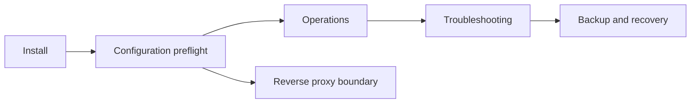

# Deployment 재작성 비교·검토 부기

## 분석 요약

| 관점 | 발견 | 결정 |
|---|---|---|
| 코드 정합성 | 기존 배포 문서는 설치·개발·운영·복구·이전 이력을 혼합 | 책임별 Runbook으로 분리 |
| 보안 | API는 기본 no-auth이며 join은 현재 일반 운영 경로로 안전하지 않음 | production preflight와 blocked 조건을 새 Runbook에 명시 |
| 정보 구조 | Caddy 비교·Docker 사본·과거 배포 로그가 현재 절차와 섞임 | 대체 정본 링크를 갱신한 뒤 폐기 파일 삭제 |

## 토론 결과

> **코드 정합성 감사자:** 현재 구현만으로 확인 가능한 설치·백업·진단 절차를 남기고,
> Cold Standby·mTLS provisioning·self-service join을 완료된 운영 기능처럼 쓰면 안 됩니다.
>
> **보안 감사자:** no-auth 외부 bind와 token 재사용은 Runbook의 “다음 단계”가 아니라
> 시작 전 차단 조건이어야 합니다.
>
> **정책 감사자:** 이전 문서를 포인터로 남기면 혼합된 설명이 계속 검색됩니다. 현재 링크를
> 새 문서로 바꾼 뒤 삭제하는 것이 재작성 규칙과 일치합니다.
>
> **결정:** deployment 도메인은 진입점, 설치, 구성, 운영, 백업·복구, 진단, reverse proxy,
> topology로 분리한다. 이전 혼합 문서는 삭제한다.

## 조치

| 우선순위 | 조치 | 상태 |
|---|---|---|
| P0 | no-auth 외부 bind와 self-service join을 preflight/blocked로 표시 | 완료 |
| P1 | 설치·구성·운영·복구·진단 Runbook 분리 | 완료 |
| P1 | Caddy 비교·Docker 사본·혼합 deployment 문서 삭제 | 완료 |
| P2 | mTLS certificate 배포와 Worker scoped credential 구현 | 코드 작업 대기 |

