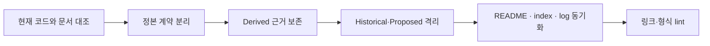

# 문서 재작성 1차 합동 검토 보고서

## 분석 요약

| 검토 관점 | 확인한 사실 | 경고 | 반영 |
|---|---|---|---|
| 코드 정합성 | 기존 overview는 ACP·Worker·mTLS·SSH·Self-Healing의 코드 대조와 정정 이력을 혼합 | P1 | `implementation-reference.md`로 보존하고 overview를 얇은 탐색 지도로 재작성 |
| 보안·복구 | join 뒤 원문 bootstrap token을 Worker 설정에 다시 기록하며 API-token 보호 모드와 join 경계가 충돌 | P0 | `contracts/worker-enrollment.md`에 현재/목표/검증 게이트를 분리 |
| 정책·정보 구조 | HTTP/MCP/Dashboard/Worker enrollment가 architecture와 bootstrap에 중복 | P1 | `contracts/`를 정본 진입점으로 전환하고 기존 API/MCP 문서는 호환 참조로 하향 |

## 가상 토론과 합의

> **코드 정합성 감사자:** overview를 단순히 줄이면 ACP, mTLS, SSH host-key 검증의 실제 제약과
> 과거 정정 근거가 사라집니다.
>
> **보안 감사자:** 보존은 필요하지만 그 근거가 현재 정책처럼 읽히면 안 됩니다. 특히 Worker
> enrollment는 목표 credential 발급을 현재 동작처럼 말할 수 없습니다.
>
> **정책 감사자:** 기존 경로를 없애기보다 `overview.md`는 탐색 지도로 유지하고, 상세 근거와
> 외부 계약은 각각 Derived·Contracts로 분리해야 링크 안정성도 지킵니다.
>
> **Lead:** 합의합니다. 현재 결정은 정본, 코드 근거는 Derived, 과거 혼합 문서는 Deprecated,
> 미구현 전달 방식은 Proposed로 분류합니다. P0 enrollment 차이를 운영 절차와 분리한 뒤에만
> bootstrap·deployment 문서를 계속 재작성합니다.

## 최종 조치 계획

| 우선순위 | 조치 | 상태 |
|---|---|---|
| P0 | Worker enrollment의 raw token·인증 경계·scoped credential 차이를 정본 계약으로 분리 | 완료 |
| P1 | overview를 탐색 지도로 축소하고 구현 근거를 보존 문서로 이동 | 완료 |
| P1 | HTTP/MCP/Dashboard/Worker enrollment 계약을 `contracts/`로 분리 | 완료 |
| P1 | bootstrap 문서의 구형 token-file 절차를 Proposed/Deprecated로 명시 | 완료 |
| P1 | deployment·UI·agent provisioning의 책임 혼합 분리 | 대기 |
| P1 | frontmatter 스키마 통일 및 lint 자동화 | 대기 |

## 다음 배치

1. deployment 도메인을 install, operations, backup-recovery, troubleshooting Runbook으로 분리한다.
2. `agent-provisioning-design.md`에서 provisioning과 memory/context, API/UI 설명을 분리한다.
3. `ui-dashboard/ui-design.md`를 foundations, page specifications, interaction/state, implementation evidence로 분리한다.
4. 전 문서의 frontmatter와 상대 링크를 일괄 정리하고 lint를 추가한다.
