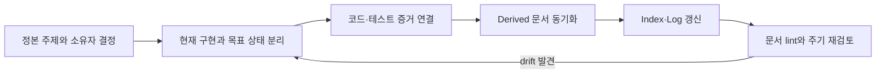

# 설계문서 품질·정본성 합동 검토 보고서

> 후속 결정(2026-08-17): 미구현 Self-Healing 및 Server Management 제안은 승인된
> Roadmap 작업이 아니므로 현재 문서 트리에서 제거했다. 원문과 당시 판단은 Git 이력으로 보존한다.

## 1. 결론

현재 문서군의 핵심 문제는 단순한 분량 부족이 아니다. 다음 세 문제가 함께 존재한다.

1. **표시된 상태와 실제 상태의 불일치**: 구현되지 않은 목표가 `implemented` 또는 현재형 운영 절차로 기술된 문서가 있다.
2. **정본 경계의 불완전성**: HTTP·MCP·Dashboard 계약과 Agent 하위 설계의 소유 문서가 중복되거나 정본 지도에서 누락됐다.
3. **분량의 불균형**: 일부 짧은 정본은 구현 가능한 오류·보안·복구 계약이 부족하고, 일부 대형 문서는 여러 책임과 검토 이력을 한 파일에 섞었다.

따라서 일괄적인 문서 확대·축약보다 **메타데이터 신뢰 회복 → P0 계약 모순 해소 → 정본 지도 정렬 → 책임 단위 분리** 순서로 처리해야 한다.

## 2. 범위와 방법

- 범위: `docs/**/*.md` 64개와 관련 Rust·SQL·OpenAPI 구현
- 관점: 코드 정합성, 보안·실패 경로, 문서 정책·정보 구조
- 작업 원칙: 기존 작업 트리 변경은 사용자 소유로 간주하고 감사 중 덮어쓰지 않았다.
- 임시 작업 위치: `.tmp/design-doc-review-2026-08-17/`
- 결과물 위치: 이 보고서와 중앙 색인·변경 로그

## 3. 정량 요약

| 항목 | 결과 | 판정 |
|---|---:|---|
| Markdown 문서 | 64개 | 감사 모집단 |
| frontmatter 없음 | 20개 | 정책 마이그레이션 필요 |
| 구형 `status` 스키마 사용 | 7개 | `authority` 스키마와 통합 필요 |
| 정책의 모든 필수 frontmatter 필드 충족 | 0개 | 정책이 현재 현실보다 앞서 있음 |
| `owners`·`last_verified_commit` 충족 | 0개 | 검증 책임·근거 추적 불가 |
| Derived 문서 | 9개 | 이 중 8개가 `source`에 자기 자신을 기록 |
| 800줄 초과 문서 | 5개 | 4개는 책임 분리 우선 후보 |
| 확정된 깨진 상대 파일 링크 | 0개 | 양호 |
| 이식 불가능한 `file:///Users/...` 링크 | 11개 | 상대 링크로 교정 필요 |
| 링크상 고아 문서 | 1개 | `docs/assets/diagrams/README.md` |

`0/64` 준수는 문서 전체의 품질이 0이라는 뜻이 아니다. 정책 스키마가 최근 확장됐으나 기존 문서 마이그레이션과 자동 검사가 뒤따르지 않았다는 뜻이다.

## 4. 핵심 발견

### P0 — 상태·계약 모순

| 발견 | 근거 | 필요한 결정 |
|---|---|---|
| 설정 정본이 미구현 Worker liveness와 wipe helper를 `implemented/code-checked`로 표시 | `deployment/configuration-files.md`; 실제 코드는 `heartbeat_interval_secs`만 보유 | 문서를 `partial`로 낮추고 현재/목표 설정을 분리 |
| 보안 정본은 bootstrap token digest 저장을 현재 계약처럼 기술하지만 DB는 원문 저장 | `security/control-plane-security-model.md`, `003_bootstrap_tokens.sql`, store 구현 | 정본에 현재/목표 경고를 추가하고 S9 완료 전 검증 등급 하향 |
| no-auth 운영 금지 서술과 API의 기본 `allow_no_auth=true`가 충돌 | `deployment/configuration-files.md`, `fleet-api/src/app.rs`, CLI 도움말 | 운영 fail-fast 구현 또는 문서상 현재 위험 명시 |
| Operator가 ProjectAssign+TaskCreate로 Admin 전용 AgentCreate를 우회할 수 있음 | `architecture/project-feature-design.md` §6·§9 | ProjectAssign을 Admin으로 제한하거나 자동 프로비저닝 capability를 별도 검사 |
| Bootstrap API 정본이 `token_id`와 원문 `token` 목록·회수 계약을 동시에 제시 | `architecture/api-reference.md` bootstrap 절 | 발급 시 1회 원문, 이후 `token_id`만 사용하도록 현재 계약 통일 |

### P1 — 정본 위치와 실행 가능한 계약

| 발견 | 영향 | 조치 |
|---|---|---|
| `api-reference.md`가 HTTP, MCP, 일부 Dashboard API를 함께 소유 | 정본 중복과 내부 범위 모순 | HTTP `/v1` 정본만 남기고 MCP는 `mcp-specification.md`로 연결; Dashboard 계약 별도화 |
| Architecture 탐색표에 Terminal Access와 Runtime Vendor 정본이 누락 | 탐색 경로와 책임 소유 불명확 | `architecture/README.md`의 Agent 도메인 진입점에 두 책임을 포함 |
| 중앙 색인에 diagrams·proposals README 누락 | 진입점이 고아 또는 비가시 상태 | `docs/index.md`에 등록 |
| 보안 정본이 endpoint/tool × capability × project scope를 정의하지 않음 | 구현자별 권한 해석 분기 | 권한 매트릭스와 감사 fail-open/closed 계약 추가 |
| terminal capture/attach에 scope·redaction·size·TTL·single-writer lease가 없음 | 정보 노출·저장소 DoS·세션 탈취 위험 | 별도 보안 계약으로 확정 |
| command ACK, lease loss, archive, unknown outcome의 fencing/복구 규칙 부족 | 재생·중복 실행·무기한 정체 가능 | generation/CAS/TTL/수동 복구 권한과 증거 조건 명시 |
| Worker bootstrap 문서 5개에 지위가 없고 일부는 현재 코드와 다른 절차를 권장 | 낡은 운영 절차 실행 위험 | canonical/derived/historical 분류 후 현재 정본으로 유도 |

### P2 — 분량과 내용 분리

| 문서 | 현재 문제 | 권장 분리 |
|---|---|---|
| `architecture/overview.md` (1,260줄) | 입문 지도, 코드 대조 근거, 현재 결정, 과거 정정, Self-Healing 제안이 혼합 | 100~150줄 개요 + Derived 구현 참조 + 도메인별 정본/보존 문서 |
| `architecture/agent-provisioning-design.md` (880줄) | provisioning, memory, prompt/tool, artifact, RBAC/API, 운영, UI 혼합 | provisioning 정본 + memory/context + interface + UI derived 문서 |
| `deployment/deployment.md` (841줄) | 설치, 개발, 운영, 백업, 업그레이드, 장애 해결 혼합 | install guide + operations runbook + backup/recovery + troubleshooting |
| `ui-dashboard/ui-design.md` (1,512줄) | foundations, page specs, flow, state, responsive, a11y, implementation 혼합 | foundations + page specs + interaction/state + implementation notes |
| `roadmap/roadmap.md` (1,374줄) | 길지만 영구 번호와 이력이 핵심 | 원문은 유지하고 active backlog/index를 생성 |

짧은 문서는 길이만으로 결함 판정하지 않는다. README와 index는 짧아도 된다. 다만 100줄 미만의 정본 설계는 최소한 상태, 입력, 출력, 오류, 보안, 관측, 마이그레이션, 검증 게이트를 갖추었는지 확인한다. 이 기준에서 `agent-execution-isolation.md`, `worker-liveness-policy.md`, `control-plane-security-model.md`는 보강이 필요하다.

### `overview.md` 재작성 결정

`overview.md`는 삭제하지 않는다. UI 설계와 외부 문서가 참조할 안정적 입문점이며,
시스템 경계와 현재 구현 상태를 빠르게 파악하는 역할은 계속 필요하다. 다만 이 문서는
정본 설계 결정을 반복하거나 코드 대조 자료와 변경 이력을 함께 보관하지 않는다.

| 대상 | 지위와 목표 분량 | 책임 | 현재 본문에서 옮길 내용 |
|---|---|---|---|
| `architecture/overview.md` | Derived 탐색 지도, 100~150줄 | 시스템 경계, 소형 Mermaid 컴포넌트 지도, 현재 구현 상태 요약, 정본 탐색표, 안정 링크 | 세부 코드 대조, 절차, 과거 정정, 제안 |
| `architecture/implementation-reference.md` | Derived 구현 참조, 분량 제한 없음 | 코드 구조, 실제 제약, 검증 근거, 구현 단계 | ACP, Worker daemon, WebSocket 재연결, 세션 동시성, CircuitBreaker, WorkerSelector, task monitoring, mTLS, SSH host-key 검증의 코드 대조 |
| `worker-bootstrap/` 하위 정본/사본 | 도메인별 지위 선언 | join·bootstrap의 현재 계약과 절차 | Worker join·bootstrap 관련 설명 |
| Git 이력 | Historical | 폐기된 Self-Healing 제안의 복원 원천 | Self-Healing 설계와 과거 구현 제거 기록 |

`implementation-reference.md`는 설계 결정·운영 규칙·API 계약을 새로 만들지 않는다.
그 내용의 정본은 각각 architecture, security, contracts, deployment 문서에 둔다.
`overview.md`와 구현 참조가 충돌하면 해당 주제의 정본 및 코드 증거가 우선한다.

## 5. 검토자 토론과 합의

> **코드 정합성 감사자**: 먼저 frontmatter의 구현·검증 상태를 믿을 수 있게 해야 한다. 현재 `implemented` 표기 자체가 잘못되면 독자는 본문을 읽기 전부터 오판한다.
>
> **보안 감사자**: 메타데이터만 낮추는 것으로는 충분하지 않다. Operator 우회와 token 원문 계약은 구현 전에 반드시 단일 결정을 내려야 한다.
>
> **문서 정책 감사자**: 전 문서 frontmatter 일괄 보정부터 시작하면 잘못된 `source` 의미를 64개 문서에 다시 복제할 수 있다. 스키마 의미를 먼저 확정해야 한다.
>
> **Lead**: 합의한다. 1단계는 스키마 의미와 P0 계약의 정본 결정을 함께 확정한다. 그 다음 자동 검사를 만들고 일괄 마이그레이션한다. 대형 문서 분할은 안정 링크와 책임 지도를 먼저 만든 뒤 수행한다.

## 6. 해결 체크리스트

### Gate A — 즉시 차단·정정

- [ ] `configuration-files.md`의 `implementation/verification`을 실제 코드 수준으로 하향하고 현재/목표 예시를 분리한다. (P0)
- [ ] bootstrap token의 DB 원문 저장과 오류 문자열 노출을 정본에 명시하고 digest 마이그레이션 완료 조건을 연결한다. (P0)
- [ ] Operator 자동 Agent 생성 우회에 대한 단일 capability 결정을 기록한다. (P0)
- [ ] Bootstrap HTTP 목록·회수 계약을 `token_id` 기준으로 통일한다. (P0)
- [ ] production no-auth의 현재 동작과 목표 fail-fast를 분리한다. (P0)

### Gate B — 정책과 정본 지도

- [ ] `status`와 `authority`의 관계를 하나로 정하고 스키마 버전을 선언한다. (P1)
- [ ] `source`를 `document_path`와 `canonical_sources`/`evidence`로 분리한다. (P1)
- [ ] Terminal Access와 Runtime Vendor를 정본 지도에 추가한다. (P1)
- [ ] diagrams/proposals README를 중앙 색인에 등록한다. (P1)
- [ ] 절대 `file:///Users/...` 링크 11개를 저장소 상대 링크로 바꾼다. (P1)
- [ ] engineering-patterns, roadmap, security, ui-dashboard에 도메인 README를 추가한다. (P1)

### Gate C — 계약 완결성

- [ ] 보안 권한 매트릭스와 cross-project object 접근 규칙을 작성한다. (P1)
- [ ] Terminal capture/attach의 scope, redaction, quota, TTL, writer lease를 확정한다. (P1)
- [ ] Agent command의 identity, sequence, generation, TTL, ACK 재전송 규칙을 확정한다. (P1)
- [ ] lease loss, project archive, `OutcomeUnknown`/`CancelUnconfirmed` 복구 전이를 확정한다. (P1)
- [ ] 열린 질문마다 severity, owner, decision deadline, blocks phase, canonical owner를 기록한다. (P2)

### Gate D — 마이그레이션과 분리

- [ ] 64개 문서에 합의된 frontmatter 스키마를 적용한다. (P1)
- [ ] frontmatter, 정본 중복, 상대 링크, 색인 누락을 검사하는 문서 lint를 CI에 추가한다. (P1)
- [ ] API 계약의 HTTP/MCP/Dashboard 책임을 분리한다. (P1)
- [ ] `overview.md`를 100~150줄의 Derived 탐색 지도로 재작성하고, 코드 대조 고유 내용은 `implementation-reference.md`로 이동한다. (P1)
- [x] `overview.md`에서 Worker join·bootstrap은 `worker-bootstrap/`으로 이동하고, 미승인 Self-Healing 제안은 삭제해 Git 이력으로 보존한다. (P1)
- [ ] agent provisioning, deployment, UI 문서를 안정 링크를 보존하며 단계적으로 분리한다. (P2)
- [ ] roadmap은 원문을 유지하고 active backlog/index를 생성한다. (P2)

## 7. 권장 정책 스키마

기존 문서 전체에 즉시 적용하기 전에 다음 의미를 먼저 승인한다.

```yaml
schema_version: 2
type: architecture-decision
authority: canonical
implementation: partial
verification: code-checked
document_path: docs/example.md
canonical_sources:
  - docs/architecture/another-canonical.md
evidence:
  - crates/example/src/lib.rs
last_verified: 2026-08-17
last_verified_commit: working-tree
owners: [domain-owner]
reviewers: [review-role]
next_review_due: 2026-09-17
```

`source` 하나에 문서 자체 경로와 정본 의존성이라는 두 의미를 함께 넣지 않는다. `verification`은 검증 강도이며, 검증자·증거·시점은 별도 필드로 추적한다.

## 8. 지속 관리 흐름



## 9. 이번 검토에서 완료한 것

- [x] 64개 문서의 구조·분량·frontmatter·정본 관계 표본/전수 감사
- [x] 관련 코드·SQL·API와 핵심 정본의 불일치 교차 검증
- [x] 깨진 상대 파일 링크, 절대 링크, 고아 문서 조사
- [x] 세 감사 관점의 반박·합의 및 P0~P2 체크리스트 작성
- [x] 임시 작업 자료와 최종 보고서 위치 분리

기존 문서의 대규모 재작성은 이 보고서의 Gate A/B 결정을 승인한 뒤 진행한다. 이는 현재 작업 트리의 광범위한 사용자 변경을 보호하고, 아직 합의되지 않은 스키마를 일괄 복제하지 않기 위함이다.
