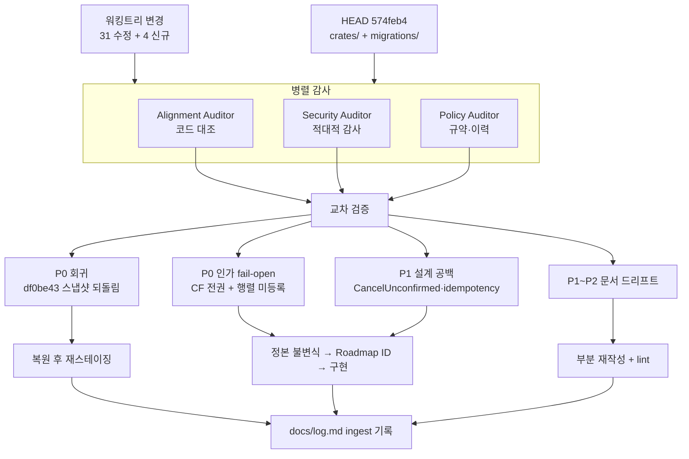

# 멀티 에이전트 설계·정합성 검토 보고서 (2026-08-22)

> 검토 대상: 커밋되지 않은 워킹트리 변경 31건 + 신규 설계 문서 4건, 그리고 이들이
> 참조하는 HEAD(`574feb4`) 시점의 코드베이스.
> 검토 체계: Lead Coordinator 1 + Codebase Alignment / Security & Edge-Case /
> Log & Policy Auditor 3인 병렬 감사 후 교차 검증.

## 1. 분석 요약

| 감사관 | 핵심 팩트 | 경고 수준 |
|---|---|---|
| Alignment | 워킹트리 roadmap.md가 `#53`·`#57`·`#58`·`#59`·`#61`·`#66`·`#71` 상태를 후퇴시키고 `#72` 행을 소실시킨다. 해당 코드(`selector.rs:58`, `task.rs:298`, `migrations/020_admin_api_tokens.sql`, `config.rs:267`)는 전부 실재한다 | 🔴 P0 |
| Policy | 워킹트리 `docs/log.md`·`docs/roadmap/roadmap.md`가 커밋 `df0be43`과 **바이트 단위로 동일**하다. 즉 이후 3개 커밋(`1053160`·`cae6492`·`f31eaee`)의 되돌림이며, append-only log 항목 4건이 삭제된다 | 🔴 P0 |
| Security | CF Access 전용 배포에서 `cf_principal_capabilities`가 `None`이면 인증만 통과한 모든 사용자가 `PermissionKind::all()`을 받는다. 그런데 이 매핑을 설정하는 경로가 `fleet-cli`에 존재하지 않는다 | 🔴 P0 |
| Security | `GET /v1/workers/{id}`와 `POST /v1/hosts/register`가 capability 행렬에 없다. 행렬 미등록 route는 검사 없이 통과한다(`app.rs:796-805`) | 🔴 P0 |
| Security | worker `endpoint` 필드가 `?server-key=<ACP 시크릿>`을 담은 채 API·Dashboard·이벤트·MCP 응답으로 전파된다 | 🟠 P1 |
| Security | `on_demand` Worker는 HealthChecker에서 제외되지만 DB status는 `Online`으로 남아 죽은 워커에 dispatch된다 — 설계 문서가 금지한 상태 | 🟠 P1 |
| Security | `CancelUnconfirmed`에 나가는 전이가 없어 Attempt가 영구 비terminal → Project archive 영구 정지 | 🟠 P1 |
| Alignment | `worker-enrollment.md` "현재 구현" 절 4개 문장이 이미 폐기된 동작을 현재형으로 서술. 단 `[grok].secret` 평문 기록 서술은 여전히 참 | 🟠 P1 |
| Alignment | `/v1/workers/{id}/credential/*`·`/v1/admin/tokens*` 6개 route가 `http-api.md`와 `openapi.yaml` 양쪽에 없다 | 🟠 P1 |
| Policy | 신규 정본 4건 중 `security/authorization-and-audit.md`만 `docs/index.md` 미등재. 반대로 재작성 가이드는 루트 색인에 세부 문서를 넣지 말라고 규정 — 정책과 운영이 서로 어긋난다 | 🟡 P2 |
| Alignment | 신규 4개 문서는 `implementation: proposed`로 정확히 표기됐고, 미구현을 사실로 서술한 곳이 없다 | 🟢 통과 |

## 2. 가상 토론 (Simulated Dialogue)

**Lead**: 세 보고가 같은 지점을 가리킨다. Policy, 먼저 확정해 달라 — 이번 워킹트리는 의도된 편집인가?

**Policy**: 아니다. `git show df0be43:docs/log.md | diff - docs/log.md`가 무차이다. `roadmap.md`도 같다. 사람이 편집했다면 우연히 바이트 동일이 될 수 없다. 이건 08-21 시점 스냅샷을 그대로 덮어쓴 사고다. 더 나쁜 건, 지워지는 log 항목 4건 중 2건이 **바로 이 사고를 정정한 기록**이라는 점이다. 3차 재발이면서 재발 이력까지 지운다.

**Alignment**: 코드 쪽에서도 같은 결론이다. `#53`은 워킹트리가 "구현 대기"라 하지만 `crates/fleet-worker/src/config.rs:267-307`에 검증이 있고 테스트가 5건이다. `#71`은 `SelectionError::NoWorkerForCredential`, `FailureKind::CredentialMissing`이 실재한다. `#72`는 마이그레이션 020과 route 4개, 테스트 파일 2개가 다 있는데 **행 자체가 사라진다**. 영구 ID 원장에서 구현 완료된 ID가 소실되면 ID 재사용 사고가 난다.

**Security**: 여기에 하나 덧붙인다. 나는 처음에 "CF Access fail-open이 설계 문서 어디에도 기록되지 않았다"고 썼는데, 그건 워킹트리만 보고 내린 판단이었다.

**Lead**: 그 부분은 내가 직접 확인했다. HEAD의 `#58` 행에는 "매핑 없는 CF principal은 호환성을 위해 잠정적으로 전체 capability를 받는다 — least privilege 아님"이 명시돼 있다. 워킹트리의 `#58` 행에는 그 문장이 없다. 즉 문서 공백은 원래 있던 게 아니라 **이번 회귀가 만들어낸다**.

**Security**: 그렇다면 내 발견 1은 취소가 아니라 격상이다. 알려진 fail-open의 유일한 기록이 지워지는 것이므로. 그리고 실제 위험은 내가 쓴 것보다 크다 — `with_cf_principal_capabilities`를 호출하는 코드는 `crates/fleet-api/tests/` 안에만 있다. `fleet-cli/src/runtime.rs`는 `with_cf_audience`만 호출한다. **운영 배포에는 이 fail-open을 끌 방법이 아예 없다.** 테스트에서만 fail-closed를 증명하는 구조다.

**Alignment**: 그러면 `#58`의 "구현 중" 표기가 코드보다 뒤처졌다는 내 지적과 충돌하지 않나? 나는 CF principal 연결이 `app.rs:591-594`에 이미 있으니 문서가 뒤처졌다고 봤다.

**Security**: 충돌하지 않는다. 배선은 됐고 **정책이 비어 있다**. "연결됨"과 "최소 권한"은 다른 완료 조건이다. `#58`을 완료로 올리려면 매핑 설정 경로와 fail-closed 기동 게이트가 있어야 한다.

**Lead**: 합의. `#58`은 HEAD의 "부분 구현" 표기가 정확하며, 완료 게이트에 "매핑 미설정 시 write/export capability 미부여"를 추가한다. — 다음. Security의 횡적 이동 시나리오는 단독 발견인가?

**Security**: 조합 발견이다. ①`GET /v1/workers/{id}`가 capability 행렬에 없어 인증만 통과하면 조회된다 ②응답 `endpoint`에 `?server-key=<ACP 시크릿>`이 들어 있다 ③worker operational credential은 `WorkerRegister`/`WorkerDelete`만 갖지만 ①에는 걸리지 않는다. 결과적으로 워커 A의 토큰으로 워커 B의 ACP 시크릿을 얻어 오케스트레이터를 우회한다. `authorization-and-audit.md:35`가 Worker principal에 대해 "금지: 다른 Worker/Project 제어"라 명시한 경계가 그대로 무너진다.

**Alignment**: ①은 내 쪽 발견과 맞물린다. `http-api.md`에 `/v1/workers/{id}/credential/*`과 `/v1/admin/tokens*` 6개 route가 없다. 문서화되지 않은 route가 행렬에도 빠지는 패턴이 반복된다 — `app.rs:738-742`의 코드 주석 자신이 "행렬에서 빠진 route는 인증만 통과하면 누구나 호출할 수 있다(#58, #66에서 두 번 발생)"고 적어 놨다. 세 번째다.

**Lead**: 그러면 개별 route 추가는 증상 치료다. 구조적 조치는 `authorize_http_endpoint`의 기본값을 deny로 뒤집고, capability 불필요 route를 명시 allow-list로 두는 것이다. 반대 의견은?

**Policy**: 반대는 없지만 절차 조건을 건다. 그건 코드 변경이고 배포 호환성 영향이 있다. `documentation-policy` §3에 따라 정본(`authorization-and-audit.md`)에 "행렬 미등록 = deny" 불변식을 먼저 명문화하고, Roadmap ID를 붙인 뒤 구현해야 한다. 지금 문서에는 그 불변식이 없다.

**Lead**: 수용. — `worker-enrollment.md`는 Alignment와 Security의 판단이 갈렸다.

**Alignment**: "현재 구현" 절의 네 문장이 거짓이다. 원문 token 재기록, Bearer 재사용, 저장소 오류에 원문 포함, token 선소비 후 name 검사 — 전부 `enroll_worker` 트랜잭션과 `fwo_` operational credential 도입으로 대체됐다.

**Security**: 세 문장은 동의하지만 하나는 건드리면 안 된다. `[grok].secret` 평문 기록은 `handlers.rs:950,999`에 **여전히 살아 있다**. 그 문장까지 "해소됨"으로 지우면 지금 유일하게 남은 유출 경로의 기록이 사라진다. 이번 회귀 사고와 정확히 같은 패턴이 된다.

**Alignment**: 동의한다. 부분 재작성으로 좁힌다. 해소된 3문장은 "해소됨(근거 커밋)"으로 표시하고, `server-key` 평문 문장은 유지·강조한다.

**Lead**: 확정. — 마지막으로 index 정책 충돌.

**Policy**: 재작성 가이드 §1이 "새로운 세부 문서를 루트 색인에 관성적으로 추가하지 않는다"고 명시한다. 그런데 이번 변경은 신규 3건을 루트에 추가했고, 4번째만 빠뜨렸다. 규칙을 어기면서 일관성도 없다.

**Alignment**: 나는 반대로 "4번째가 빠졌으니 추가하라"고 썼다. 철회한다 — 가이드가 정본이면 3건을 빼는 쪽이 맞다.

**Lead**: 다만 이건 판단이 갈릴 수 있는 지점이다. 루트 색인을 전체 카탈로그로 유지하려는 의도가 있었다면 가이드 §1을 먼저 개정해야 한다. 사용자 결정 사항으로 올린다. 결론은 하나 — **어느 쪽이든 4건을 동일하게 처리한다**.

## 3. 최종 액션 플랜

| 우선순위 | 조치 | 대상 | 상태 |
|---|---|---|---|
| P0-1 | `docs/log.md`·`docs/roadmap/roadmap.md`·`docs/deployment/README.md`를 HEAD로 복원 | git 워킹트리 | **완료** |
| P0-2 | `config/inventory-from-ssh.yaml`의 arm1/arm2 실제 인스턴스 상태 확인 | `config/inventory-from-ssh.yaml` | **완료** — 워킹트리 변경이 옳았다(arm2 6대 영구 삭제, `oci-ajou-arm1` 운영 중). 이 파일은 스냅샷 되돌림이 아닌 별개 편집이었다 |
| P0-3 | CF Access 매핑 미설정 시 fail-closed 불변식을 정본에 명문화 | `authorization-and-audit.md`, `control-plane-security-model.md` | **문서 완료** · 코드는 `#74` |
| P0-4 | 행렬 미등록 = deny 불변식을 정본에 명문화 | `authorization-and-audit.md`, `http-api.md` | **문서 완료** · 코드는 `#73` |
| P1-1 | `endpoint`의 `server-key` 노출 경계를 정본에 기록 | `worker-enrollment.md` | **문서 완료** · 코드는 `#75` |
| P1-2 | 중간 상태 fail-closed 규칙(3단계 전 `on_demand` 등록 거절, `WorkerStatus::Unchecked` 선행) 명문화 | `worker-liveness-policy.md` | **문서 완료** · 코드는 `#61` 3단계 |
| P1-3 | `CancelUnconfirmed`의 출구 전이와 재조정 규칙 정의 | `tasks/execution-consistency.md`, `observability-and-reconciliation.md` | **완료** |
| P1-4 | external idempotency key 파생식을 제출 시 snapshot 정책 revision으로 고정, HMAC 키 회전 규칙 추가 | `tasks/execution-consistency.md` | **완료** |
| P1-5 | `worker-enrollment.md` "현재 구현" 절 부분 재작성 | `contracts/worker-enrollment.md` | **완료** |
| P1-6 | 누락 route 6건을 `http-api.md`에 추가 (단수/복수 credential 구분 명시) | `contracts/http-api.md` | **문서 완료** · `openapi.yaml` 반영 대기 |
| P1-7 | 현재 감사 범위 표를 정본에 추가 | `security/authorization-and-audit.md` | **완료** · 코드는 `#76` |
| P2-1 | 도메인 1은 "진입점" 표이므로 세부 문서 2행 제거. 4건 모두 각 도메인 README가 소유함을 확인 | `docs/index.md` | **완료** |
| P2-2 | `roadmap/README.md` 중복 행 제거, `#72` 중복 행 병합, 섹션 헤더 범위 동기화 | roadmap 문서군 | **완료** |
| P2-3 | 프론트매터 enum 위반 4건 정정 | docs 전역 | **완료** · 프론트매터 전무 4건과 `last_verified` 일괄 갱신은 별도 lint |
| P2-4 | 표 열 수 불일치, 경어체 혼입 3곳, lifecycle 다이어그램 `Succeeded`→`Completed` | 개별 문서 | **완료** |
| P2-5 | `docs/log.md` `lint`+`ingest` 항목 추가, `reviews/README.md` 등재 | `docs/log.md`, `docs/reviews/README.md` | **완료** |

### 코드 작업으로 넘긴 항목 (신규 영구 ID)

| ID | 내용 | 우선순위 |
|---|---|---|
| `#73` | HTTP capability 행렬 기본 deny 전환 + 누락 route 등록 | P0 |
| `#74` | Cloudflare principal capability 매핑 fail-closed + `fleet-cli` 설정 경로 | P0 |
| `#75` | worker `endpoint`의 `server-key` 분리·마스킹 | P1 |
| `#76` | 감사 범위 확장과 `AuditEvent` 상관관계 필드 | P1 |

## 4. 검토·동기화 흐름

## 5. 검증 한계

- `cargo test`/`cargo check`를 실행하지 않았다. 테스트 파일의 존재와 함수명만 확인했고 통과 여부는 확인하지 못했다.
- `DATABASE_URL` 의존 통합 테스트(`enroll_worker.rs`, `bootstrap_token_dump.rs`, `admin_token_rotation.rs`)가 CI에서 실제로 실행되는지 확인하지 못했다.
- `config/inventory-from-ssh.yaml`의 arm1/arm2 인스턴스 실제 상태는 저장소 밖 사실이라 판정하지 않았다.
- 회귀 사고의 근본 원인(백업 파일명 충돌 추정)은 이번에도 재현하지 못했다.
