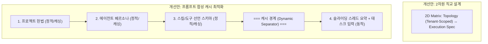

# 시스템 엔티티 설계 비판·대안 보존 (Derived)

> **지위: Derived review.** 이 문서는 위험과 대안을 보존한다. 현재 결정은
> [Architecture](../architecture/README.md)의 해당 정본만 변경할 수 있다.

> 작성일: 2026-08-15  
> **보고 주체**: 비판적 시스템 설계자 에이전트 (`critical_auditor`)  
> **분석 대상**: [`system-entities-mapping.md`](../architecture/system-entities-mapping.md) 및 관련 아키텍처 명세서

---

## 1. 개요

본 보고서는 [`system-entities-mapping.md`](../architecture/system-entities-mapping.md)에 정립된 3축 아키텍처와 엔티티 간의 매핑 불변식이 직면한 구조적 한계, 잠재적 성능 병목(병렬 락 경쟁 및 TOCTOU), 다중 테넌트(Multi-tenant) 보안 공백, 그리고 프롬프트 비대화(Token Inflation) 문제를 비판적으로 해부하고 이에 대한 최적의 대안을 제안합니다.

---

## 2. 현 설계의 4대 핵심 결함 분석 (Critical Flaws)

### 2.1 물리/개념적 레이어의 계층 혼선 (3축 아키텍처 결함)
*   **원인**: 축 1(WHERE)의 `Project ➔ Host ➔ Agent ➔ Worker` 사슬은 물리적 컴퓨팅 노드(`Host`), 동적 런타임 명세(`Agent`), 그리고 백엔드 실행 데몬(`Worker`)이라는 상이한 계층의 개념을 억지로 일렬로 세웠습니다.
*   **문제점**: stdio MCP 도구가 요구하는 물리 가용 레이블 제약이 인프라 계층(`Host`)에서 행동 계층(`Tool`)으로 침투하여 축 간의 직교성(Orthogonality)이 깨지고 설계 결합도가 지나치게 높아졌습니다.

### 2.2 동시성 제어 및 동기화 병목 (성능 및 경쟁 상태)
*   **직렬화 락 병목**: 에이전트 동적 생성 시 호스트 테이블의 행 잠금(`SELECT FOR UPDATE`)과 `COUNT(agents)` 스캔이 동시에 일어나므로, 동일 호스트 상의 에이전트 프로비저닝이 물리적으로 직렬화되어 대규모 스케일아웃 기동 시 심각한 병목을 유발합니다.
*   **디스패처 TOCTOU 레이스**: `WorkerSelector`가 읽기 전용으로 `active_tasks < max_concurrent`를 평가한 후 실제 디스패치가 완료되기 전에 다른 스레드가 동일 워커를 선점할 수 있어, 동시 디스패처 가동 시 특정 워커의 과부하(Oversubscription)가 발생합니다.
*   **`pg_notify` 유실 위험**: Postgres LISTEN/NOTIFY 시스템은 8KB 페이로드 제한이 있으며, 네트워크 순단 시 브로커 이벤트를 버퍼링하지 않고 즉시 유실하므로 다중 admin 상태가 영구적으로 어긋날 수 있습니다.

### 2.3 테넌트 격리 및 데이터 오염 가능성 (보안 루프홀)
*   **교차 오염**: 호스트가 A 프로젝트에서 B 프로젝트로 재배정될 때, 실행 중인 태스크를 그대로 완수하도록 방치(`in-flight task policy`)하면, 동일 호스트의 로컬 작업 디렉토리와 메모리 내에서 A 프로젝트와 B 프로젝트의 연산이 물리적으로 공존하는 격리 공백이 발생합니다.
*   **격리 필터 역순 배치**: 스케줄러가 가장 비용이 비싼 용량 및 서킷 브레이커 검사를 모두 거친 뒤 마지막 단계(6단계)에서야 프로젝트 ID 하드 필터를 적용하여, 불필요한 연산 낭비와 라우팅 누수 필터링 실패 가능성을 높였습니다.

### 2.3 프롬프트 토큰 비대화 및 캐시 무효화 (비용 및 성능)
*   **KV-Cache invalidation**: 프롬프트 합성 단계에서 매번 유동적으로 변화하는 `Agent Memory`와 `Thread Context`를 에이전트 페르소나 및 지침 뒤에 배치함으로써, LLM 공급자의 프롬프트 캐시(Prompt Caching)가 작동하지 못하고 매 호출마다 전체 컨텍스트를 새로 파싱하여 지연 시간과 API 비용이 폭증합니다.
*   **스킬 텍스트 주입 인플레이션**: 수만 단어에 이르는 모든 스킬 가이드의 원문을 프롬프트 본문에 인라인 결합하여 불필요한 토큰 소모를 발생시킵니다.

---

## 3. 구조 개선 대안 (Proposed Alternatives)



### 3.1 2차원 직교 설계로의 단순화 (Simplification)
*   일렬 형태의 3축을 **물리 위상 구조(Topology: `Project ⊃ Host ⊃ Worker`)**와 **실행 사양(Execution Spec: `Policy ➔ Persona ➔ Dynamic Context`)**의 2차원 매트릭스로 재편하여 직교성을 확보합니다.

### 3.2 원자적 슬롯 예약 및 이벤트 커서 도입 (Concurrency & Reliability)
*   `SELECT FOR UPDATE` 락 대신 원자적 갱신 쿼리로 슬롯 예약을 일원화합니다:
    ```sql
    UPDATE workers 
    SET active_tasks = active_tasks + 1 
    WHERE id = $1 AND active_tasks < max_concurrent 
    RETURNING id;
    ```
*   `pg_notify` 유실을 방어하기 위해 수신 시 시퀀스 워터마크 커서(Sequence Watermark Cursor) 기반의 백필 조회를 보조 루프로 병행 운영합니다.

### 3.3 강제 드레인(Drain) 및 워크스페이스 소거 규격화 (Strict Isolation)
*   호스트/워커의 프로젝트 재배정 시, 즉시 신규 수주를 막는 `Draining` 상태로 전환하고, 기존 태스크가 완료되는 즉시 작업 디렉토리를 완전 삭제(`purge`)하는 소거 파이프라인을 필수 구현합니다.
*   스케줄러의 첫 필터 단계를 `worker.project_id == task.project_id` 데이터베이스 쿼리 레벨의 하드 파티션으로 승격시킵니다.

### 3.4 KV-Cache 친화적 프롬프트 합성 (Cache-friendly Prompting)
*   프롬프트를 **정적 캐시 영역(Static Cached Prefix)**과 **동적 영역(Dynamic Suffix)**으로 엄격히 분리하여 경계를 둡니다.
*   스킬의 전체 마크다운 텍스트를 프롬프트에 직접 주입하지 않고, 스키마 형태의 경량 선언으로 노출한 뒤 모델이 필요로 할 때만 도구 호출(Tool Call)을 통해 스킬 데이터베이스 내용을 실시간 Fetch해오도록 변환합니다.
