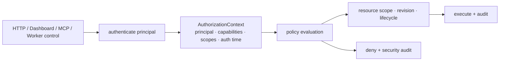

# Authorization·Project Scope·감사 계약

## 결정

HTTP, Dashboard, MCP, Worker control은 같은 `AuthorizationContext`와 policy evaluator를 사용한다.
transport가 다르다고 권한 모델이 달라지지 않는다. 현재 Dashboard RBAC와 `/v1` bearer allow-list는
부분 구현일 뿐, 이 문서의 목표 계약을 보장하지 않는다.

## Principal과 인증 수단

| Principal | 인증 수단 | 허용 경계 | 금지 |
|---|---|---|---|
| HumanUser | Dashboard session/OIDC, 민감 작업은 step-up MFA | 자신의 Project scope와 부여 capability | Worker·Security Manager 위장 |
| AutomationService | 짧은-lived workload credential 또는 mTLS | 명시 capability·Project scope·만료 | wildcard admin/무기한 bearer |
| Worker | `worker_id`에 결합된 mTLS certificate 또는 scoped credential | 자기 inventory, command ACK/result, 자기 grant 수령 | 다른 Worker/Project 제어, policy 변경 |
| AgentProcess | 일반 control-plane principal 없음 | Attempt-bound Security/privileged-helper grant | `/v1`, MCP, Dashboard의 일반 호출 |
| SecurityManager | 별도 service identity | credential metadata·grant·revoke·rotation workflow | Task/Project 정책 임의 변경 |
| BootstrapInstaller | one-time bootstrap token | join/enrollment 한 번 | 운영 API·credential 사용 |

Agent process는 control plane의 사용자로 취급하지 않는다. Agent가 필요한 privileged operation과
credential은 각각 Attempt-bound grant를 통해 helper/Security Manager에 요청하며, 그 grant가 Project
policy·fencing token·만료를 다시 확인한다.

## AuthorizationContext와 평가 순서

모든 요청은 최소 `principal_id`, `principal_type`, `authentication_method`, `authenticated_at`,
`capabilities`, `project_scopes`, `request_id`, `policy_revision`을 가진다. mutation에는 canonical payload
hash와 idempotency key/request ID, resource revision 또는 expected generation을 추가한다.

평가 순서는 고정이다.

1. principal 인증·만료·revocation을 확인한다.
2. endpoint/tool의 capability와 인증 강도(step-up 필요 여부)를 확인한다.
3. URL/body가 아니라 저장된 resource 관계에서 Project scope를 해석한다.
4. lifecycle, policy revision, expected generation/fencing token precondition을 확인한다.
5. capability가 있어도 상위 Project deny·security hold·isolation policy가 있으면 거절한다.
6. 허용·거절·break-glass decision을 audit에 기록한다.

Project 밖 resource는 존재 여부를 숨기는 `404`를, scope 안이지만 capability가 없는 요청은 `403`을
반환한다. 인증 실패/만료는 `401`이다. 정책·revision·lifecycle precondition 불일치는 `409`이며,
입력 검증 오류는 `422`다.

## Capability와 scope

Capability는 역할명이 아니라 최소 동작 단위이며, Project scope는 capability에 더해지는 제약이다.
현재 `PermissionKind`는 Dashboard 중심의 부분 카탈로그다. 아래 목표 capability를 추가하되,
`*` wildcard와 Project scope 없는 write capability를 만들지 않는다.

| 영역 | capability | scope/추가 조건 |
|---|---|---|
| Project | `project:read`, `project:create`, `project:update`, `project:archive`, `project:policy_manage` | read/update/archive는 해당 Project; policy는 revision CAS |
| Task | `task:read`, `task:create`, `task:cancel`, `task:output`, `task:redrive` | Task의 저장된 Project scope; redrive는 effect disposition 확인 |
| Agent | `agent:read`, `agent:manage`, `agent:attach` | Agent immutable Project; attach는 step-up·짧은 grant |
| Worker/Fleet | `worker:read`, `worker:provision`, `worker:operate`, `worker:self` | `worker:self`은 mTLS subject와 동일 worker_id만 |
| Credential | `credential:read_metadata`, `credential:grant`, `credential:rotate`, `credential:revoke`, `credential:break_glass_export` | grant는 Project/Agent/Tool subset; export는 dual approval |
| Effect/archive | `effect:resolve`, `project:hold_manage` | `PartiallyApplied` evidence, reason, approval 필요 |
| Security | `audit:read`, `policy:manage`, `incident:manage` | global SecurityAdmin 또는 명시 delegate |

### 현재 랜딩된 `PermissionKind`와의 대응

위 표는 **목표 명명**이다. 실제 `crates/fleet-core/src/auth.rs`에 존재하는 값은 다음과 같으며,
새 capability를 추가할 때 기존 이름을 재사용하지 않는다(`#66`에서 `worker:delete`가
LLM credential 삭제를 흡수한 사고의 재발 방지).

| 목표 capability | 현재 `PermissionKind` | 비고 |
|---|---|---|
| `worker:read` | `worker:list` | 개별 조회(`GET /v1/workers/{id}`)는 행렬 미등록 |
| `worker:provision` | `host:provision` | `POST /v1/hosts/register`는 행렬 미등록 |
| `worker:operate` | **없음** | MCP `fleet_reset_worker_breaker`가 `worker:delete`를 요구해 최소 권한이 성립하지 않는다 |
| `worker:self` | `AuthorizationContext.worker_id` binding | capability가 아니라 binding 검사로 구현됨 |
| `credential:rotate`/`revoke` (operational) | `worker:credential:manage` | Worker operational identity 전용 |
| `credential:read_metadata` / (원문 열람) | `worker:llm_credential:read` / `:export` / `:manage` | export는 read·manage와 분리, 감사 실패 시 거절 |
| (admin bearer 관리) | `admin_token:manage`, `admin_token:list` | 목표 표에 대응 항목 없음 — 추가 필요 |
| (bootstrap token) | `token:issue`, `token:list`, `token:revoke` | 목표 표에 대응 항목 없음 — 추가 필요 |
| `audit:read` | `audit:read` | 일치 |
| `project:*`, `task:redrive`, `agent:*`, `effect:resolve` | **없음** | `#48` Project 기능 이후 대상 발생 |

기본 역할은 `ProjectViewer`, `ProjectContributor`, `ProjectOperator`, `ProjectManager`, `FleetOperator`,
`SecurityAdmin`으로 구성할 수 있으나 역할은 convenience bundle일 뿐 evaluator는 capability와 scope만
검사한다. Task 생성 권한이 Agent 생성·Project 정책 변경·credential grant 권한을 암묵적으로 주지 않는다.

## Transport 적용

| Transport | identity 전달 | 추가 규칙 |
|---|---|---|
| Dashboard `/api/*` | session/OIDC → AuthorizationContext | CSRF, session rotation, mutation idempotency |
| HTTP `/v1/*` | Worker mTLS 또는 AutomationService workload credential | public health/metrics도 deployment ACL; Worker self binding |
| MCP stdio | authenticated launcher가 발급한 짧은 session assertion 또는 local peer identity | stdio/environment 자체를 신뢰하지 않음; ToolContext에 context 주입 |
| Worker control stream | mTLS Worker identity + control epoch/fencing token | Worker는 자기 command/result만 ACK |
| Security Manager | service mTLS + Attempt-bound delivery grant | 원문 export 대신 grant; break-glass만 예외 |

### 등록되지 않은 route·tool의 판정 (fail-closed 불변식)

**어떤 transport에서든 required capability가 등록되지 않은 route/tool은 deny한다.** 등록 누락은
"권한 검사 불필요"가 아니라 "아직 판정되지 않음"이며, 판정되지 않은 요청을 통과시키면 인증만
통과한 임의 principal이 그 경로를 호출한다.

**`#73`(2026-08-23)로 해소됐다.** `authorize_http_endpoint`는 이제 `required_capability`가
`None`을 반환하면 `403`을 반환한다. `/health`와 `POST /workers/join`(body의 bootstrap token이
자체 인증 수단)만 함수 안에서 명시적으로 허용한다. 과거 누락이었던 `GET /v1/workers/{id}`
(`worker:list`)와 `POST /v1/hosts/register`(`host:provision`)는 이 전환과 함께 행렬에 등록됐다.

`crates/fleet-api/src/app.rs`의 `capability_matrix_covers_router_routes`(router에 실제 등록된
모든 (method, path) 조합이 capability를 가짐을 확인)와
`authorize_http_endpoint_denies_by_default_for_any_unmatched_route`(임의의 미등록 조합이 항상
403임을 함수 수준에서 고정)가 같은 결함의 세 번째 재발을 막는다. 다만 두 테스트 모두 `build_app`의
route 목록을 손으로 병행 유지한다 — 새 route를 추가하면서 이 목록에 반영하지 않으면 커버리지
테스트는 통과하지만 실제로는 놓친다. axum Router의 런타임 route 열거로 이 목록 자체를 도출하는
것은 이 항목의 범위 밖으로 남긴다.

Dashboard `/api`와 MCP 표면에는 같은 불변식이 아직 없다 — `crates/fleet-dashboard`에는 중앙
capability 행렬이 없고 핸들러에 `PermissionKind` 검사가 산재해 있다. `#86`~`#93`의 관리 화면이
그 표면에 놓이므로 `#92`가 이를 다룬다.

### 매핑되지 않은 principal의 capability

**principal→capability 매핑이 없는 인증 주체에게 기본 capability를 부여하지 않는다.** 특히
write·export 계열(`credential:break_glass_export`, `admin_token:manage`, `token:issue`,
`worker:delete`)은 명시 매핑 없이는 어떤 경로로도 부여되지 않는다.

현재 Cloudflare Access 전용 배포는 이 불변식을 만족하지 않는다. `app.rs`의
`cf_access_capabilities`는 `cf_principal_capabilities`가 `None`이면 `PermissionKind::all()`을
반환하며, 매핑을 설정하는 `with_cf_principal_capabilities`를 호출하는 코드가
`crates/fleet-api/tests/` 안에만 있고 `crates/fleet-cli/src/runtime.rs`에는 없다. 즉 **운영 배포에는
이 fail-open을 끄는 설정 경로가 존재하지 않으며**, CF Access 정책을 통과한 모든 사용자가 모든 워커의
LLM 프로바이더 API 키 원문 export와 admin token 발급 권한을 갖는다. 매핑이 설정된 경우에만
fail-closed가 성립한다(열거되지 않은 이메일은 빈 capability).

조치는 두 가지를 함께 요구한다: `fleet-cli`에 매핑 설정 경로를 추가하고, `FLEET_CF_AUDIENCE`가
설정됐는데 매핑이 없으면 non-loopback bind 거부와 동일한 정신으로 기동을 거부하거나 최소한
write·export capability를 하드 제외한다.

MCP의 tool 이름이나 사용자의 자연어 지시는 capability가 아니다. tool마다 required capability,
resource scope resolver, mutation precondition, audit event type을 등록해야 하며 등록되지 않은 tool은
fail-closed한다.

현재 초기 구현은 `FLEET_MCP_CAPABILITIES`를 launcher의 명시적 allow-list로 읽어, 허용된 도구만
`tools/list`와 `tools/call`에 노출한다. 값이 없거나 비어 있거나 알 수 없으면 stdio 서버는 기동하지
않는다. 이는 prompt/tool argument가 권한을 얻지 못하게 하는 첫 경계이며, 환경변수 자체를 신뢰할 수
있는 identity로 승격하지 않는다. 후속 구현은 local peer identity 또는 짧은-lived signed assertion을
`ToolContext`의 principal·Project scope·audit context로 전달해야 한다.

## Break-glass와 승인 분리

credential 원문 export, irreversible effect resolution, security hold 해제, emergency Worker isolate는
일반 admin capability만으로 즉시 실행하지 않는다.

- caller는 step-up 인증과 `reason`을 제공한다.
- policy가 요구하면 서로 다른 두 principal의 approval을 받아 short-lived approval grant를 만든다.
- grant는 대상 resource·operation·payload hash·expiry에 묶이며 재사용할 수 없다.
- 실행 뒤 outcome과 조회/보상 증거를 audit에 append한다.

긴급 상황에서 dual approval을 생략하는 policy는 `incident:manage`와 별도 reason code를 요구하며,
자동으로 security review hold를 생성한다.

## 감사 규칙

모든 mutation, capability/scope 거절, grant 발급·사용·회수, break-glass, privileged-helper effect,
archive hold 변경은 append-only audit event를 남긴다. event는 actor, impersonation 여부, request ID,
resource/project/attempt/lease 상관관계, policy revision, allow/deny outcome, reason code, 전후 metadata
hash를 가진다. prompt·secret·raw provider payload·session/bearer 값은 기록하지 않는다.

audit read도 권한이며 Project 범위 읽기는 자신의 Project event만, SecurityAdmin은 global event를
읽을 수 있다. audit event 수정·삭제 API는 제공하지 않는다. Project 범위 읽기는 audit record에
`project_id`가 있어야 성립하므로, 상관관계 필드 추가가 이 규칙의 선행 조건이다.

### 현재 감사 범위

위 규칙은 목표 계약이다. 실제로 `AuditEvent`를 남기는 경로는 다음 세 곳뿐이며, 나머지 mutation과
모든 capability 거절은 `tracing` 출력으로만 남아 사후 조회가 불가능하다.

| 경로 | 현재 감사 | 비고 |
|---|---|---|
| `GET /v1/workers/{name}/credentials/{model}/export` | 기록함 | 감사 기록 실패 시 평문을 반환하지 않는다 — 다른 mutation이 따라야 할 fail-closed 패턴 |
| `PUT /v1/workers/{name}/credentials/{model}` | 기록함 | |
| `DELETE /v1/workers/{name}/credentials/{model}` | 기록함 | |
| bootstrap token 발급·회수 | **없음** | `token:issue`/`token:revoke` |
| admin token 생성·회전·회수 | **없음** | `admin_token:manage` |
| Worker 삭제·등록, Host 등록 | **없음** | |
| capability/scope 거절 | **없음** | `tracing::warn!`만 |

또한 현재 `AuditEvent`에는 `request_id`, `project_id`, `attempt_id`, `policy_revision` 상관관계
필드가 없어 구현 게이트 6을 만족할 수 없다. 스키마 확장이 선행되어야 한다.

## 구현 게이트

1. HTTP·Dashboard·MCP에서 동일 principal/capability/scope 조합이 같은 allow/deny를 내는 시험
2. Worker identity가 다른 worker/project resource에 접근하지 못하는 시험 — **조회 route 포함**
   (`GET /v1/workers/{id}`처럼 mutation이 아닌 경로도 대상이다)
3. Task ID만으로 Project scope를 우회하거나 존재를 열거하지 못하는 시험
4. MCP prompt injection/환경변수 위조가 principal·capability를 획득하지 못하는 시험
5. break-glass의 step-up·dual approval·expiry·감사 누락 거절 시험
6. 모든 mutation과 sensitive deny가 상관관계 필드·secret-free audit record를 남기는 시험
7. capability 행렬에 등록되지 않은 route/tool이 **deny**되는 시험(행렬 커버리지 테스트)
8. principal→capability 매핑이 없는 인증 주체가 write·export capability를 얻지 못하는 시험
