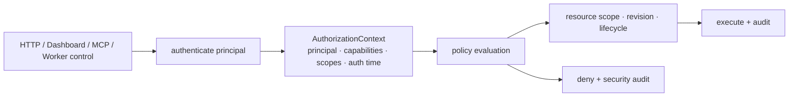

# Authorization·Project Scope·감사 계약

## 결정

HTTP, Dashboard, MCP, Worker control은 같은 `AuthorizationContext`와 policy evaluator를 사용한다.
transport가 다르다고 권한 모델이 달라지지 않는다. 현재 Dashboard RBAC와 `/v1` bearer allow-list는
부분 구현일 뿐, 이 문서의 목표 계약을 보장하지 않는다.

## Principal과 인증 수단

| Principal | 인증 수단 | 허용 경계 | 금지 |
|---|---|---|---|
| HumanUser | Dashboard session/OIDC, 민감 작업은 step-up MFA | 자신의 Project scope와 부여 capability | Worker·Security Manager 위장 |
| AutomationService | 짧은-lived workload credential 또는 mTLS | 명시 capability·Project scope·만료 | wildcard admin/무기한 bearer |
| Worker | `worker_id`에 결합된 mTLS certificate 또는 scoped credential | 자기 inventory, command ACK/result, 자기 grant 수령 | 다른 Worker/Project 제어, policy 변경 |
| AgentProcess | 일반 control-plane principal 없음 | Task의 실행 구간에 묶인 Security/privileged-helper grant | `/v1`, MCP, Dashboard의 일반 호출 |
| SecurityManager | 별도 service identity | credential metadata·grant·revoke·rotation workflow | Task/Project 정책 임의 변경 |
| BootstrapInstaller | one-time bootstrap token | join/enrollment 한 번 | 운영 API·credential 사용 |

Agent process는 control plane의 사용자로 취급하지 않는다. Agent가 필요한 privileged operation과
credential은 각각 실행 구간에 묶인 grant를 통해 helper/Security Manager에 요청하며, 그 grant가 Project
policy·fencing token·만료를 다시 확인한다. 여기서 실행 구간은 Task 행의 수명이 아니라 **dispatch부터
terminal까지**다 — 상세는 [제어면 보안 모델](control-plane-security-model.md)이 정본이다.

## AuthorizationContext와 평가 순서

모든 요청은 최소 `principal_id`, `principal_type`, `authentication_method`, `authenticated_at`,
`capabilities`, `project_scopes`, `request_id`, `policy_revision`을 가진다. mutation에는 canonical payload
hash와 idempotency key/request ID, resource revision 또는 expected generation을 추가한다.

평가 순서는 고정이다.

1. principal 인증·만료·revocation을 확인한다.
2. endpoint/tool의 capability와 인증 강도(step-up 필요 여부)를 확인한다.
3. URL/body가 아니라 저장된 resource 관계에서 Project scope를 해석한다.
4. lifecycle, policy revision, expected generation/fencing token precondition을 확인한다.
5. capability가 있어도 상위 Project deny·security hold·isolation policy가 있으면 거절한다.
6. 허용·거절·break-glass decision을 audit에 기록한다.

Project 밖 resource는 존재 여부를 숨기는 `404`를, scope 안이지만 capability가 없는 요청은 `403`을
반환한다. 인증 실패/만료는 `401`이다. 정책·revision·lifecycle precondition 불일치는 `409`이며,
입력 검증 오류는 `422`다.

## Capability와 scope

Capability는 역할명이 아니라 최소 동작 단위이며, Project scope는 capability에 더해지는 제약이다.
현재 `PermissionKind`는 Dashboard 중심의 부분 카탈로그다. 아래 목표 capability를 추가하되,
`*` wildcard와 Project scope 없는 write capability를 만들지 않는다.

| 영역 | capability | scope/추가 조건 |
|---|---|---|
| Project | `project:read`, `project:create`, `project:update`, `project:archive`, `project:policy_manage` | read/update/archive는 해당 Project; policy는 revision CAS |
| Task | `task:read`, `task:create`, `task:cancel`, `task:output`, `task:redrive` | Task의 저장된 Project scope; redrive는 effect disposition 확인 |
| Agent | `agent:read`, `agent:manage`, `agent:attach` | Agent immutable Project; attach는 step-up·짧은 grant |
| AgentTemplate | `agent_template:read`, `agent_template:create`, `agent_template:update`, `agent_template:lifecycle`, `agent_template:revision_revoke`, `agent_template:manage_global` | 편집은 **필드별 게이팅** — 도구/스킬 변경은 `agent:manage`를 추가 요구. `manage_global`은 `project_id IS NULL` 템플릿 |
| Worker/Fleet | `worker:read`, `worker:provision`, `worker:operate`, `worker:self` | `worker:self`은 mTLS subject와 동일 worker_id만 |
| Credential | `credential:read_metadata`, `credential:grant`, `credential:rotate`, `credential:revoke`, `credential:break_glass_export` | grant는 Project/Agent/Tool subset; export는 dual approval |
| Effect/archive | `effect:resolve`, `project:hold_manage` | `PartiallyApplied` evidence, reason, approval 필요 |
| Security | `audit:read`, `policy:manage`, `incident:manage` | global SecurityAdmin 또는 명시 delegate |

### 현재 랜딩된 `PermissionKind`와의 대응

위 표는 **목표 명명**이다. 실제 `crates/fleet-core/src/auth.rs`에 존재하는 값은 다음과 같으며,
새 capability를 추가할 때 기존 이름을 재사용하지 않는다(`#66`에서 `worker:delete`가
LLM credential 삭제를 흡수한 사고의 재발 방지).

| 목표 capability | 현재 `PermissionKind` | 비고 |
|---|---|---|
| `worker:read` | `worker:list` | 개별 조회(`GET /v1/workers/{id}`)는 행렬 미등록 |
| `worker:provision` | `host:provision` | `POST /v1/hosts/register`는 행렬 미등록 |
| `worker:operate` | **없음** | MCP `fleet_reset_worker_breaker`가 `worker:delete`를 요구해 최소 권한이 성립하지 않는다 |
| `worker:self` | `AuthorizationContext.worker_id` binding | capability가 아니라 binding 검사로 구현됨 |
| `credential:rotate`/`revoke` (operational) | `worker:credential:manage` | Worker operational identity 전용 |
| `credential:read_metadata` / (원문 열람) | `worker:llm_credential:read` / `:export` / `:manage` | export는 read·manage와 분리, 감사 실패 시 거절 |
| (admin bearer 관리) | `admin_token:manage`, `admin_token:list` | 목표 표에 대응 항목 없음 — 추가 필요 |
| (bootstrap token) | `token:issue`, `token:list`, `token:revoke` | 목표 표에 대응 항목 없음 — 추가 필요 |
| `audit:read` | `audit:read` | 일치 |
| `project:update`, `project:policy_manage`, `task:redrive`, `agent:*`, `effect:resolve` | **없음** | `project:read`/`create`/`delete`(archive 요청)는 `#48` 1단계로 랜딩했다. 나머지는 대상 엔티티·컬럼이 아직 없다 — 아래 승인 절 참고 |

기본 역할은 `ProjectViewer`, `ProjectContributor`, `ProjectOperator`, `ProjectManager`, `FleetOperator`,
`SecurityAdmin`으로 구성할 수 있으나 역할은 convenience bundle일 뿐 evaluator는 capability와 scope만
검사한다. Task 생성 권한이 Agent 생성·Project 정책 변경·credential grant 권한을 암묵적으로 주지 않는다.

### Project 정책 변경과 Agent 생성의 관계 (승인 2026-08-27)

[Project 기능 설계](../architecture/project-feature-design.md)가 "권한과 구현 차단 조건" 1번으로
남겨 둔 사람 결정이다. 승인 시점까지 제안 문언 자체가 없었다 — [Project
model review](../reviews/project-model-review-2026-08-17.md)는 "보안 모델과 구현 계획에서 결정한 뒤
정본 계약에 반영한다"고 미뤘을 뿐이다. 따라서 이 절이 승인된 규칙 자체를 소유하고, 설계·계약
문서는 여기를 참조한다.

**승인 범위.** 두 단계로 승인됐다. 1차에서 사용자가 승인한 것은 차단 조건 1이 **제기된 형태**
(`ProjectPolicyManage`와 `AgentCreate`의 관계를 보안 모델에서 확정한다)였고, 결정 1이 그 관계에
대한 직접적 답이다. 결정 2·3은 그것을 집행 가능한 규칙으로 구체화하며 이 문서가 작성한 것이므로
승인 범위 밖임을 명시하고 별도 확인을 요청했으며, 같은 날 문언 그대로 승인됐다. 따라서 세 결정
모두 승인된 규칙이고 이 절이 그 정본이다. 이후 변경은 새 승인을 받는다 — 무엇이 승인됐고 무엇이
파생인지 남겨 두는 이유가 그것이다.

**막는 것.** `project:policy_manage` 보유자가 Agent provisioning 관련 정책 필드
(`max_active_agents`, `max_warm_agents`, 기본 AgentTemplate, worker eligibility selector)를 바꾸면,
그 뒤 `task:create`만 가진 임의 principal의 Task 제출이 자동 provisioning을 통해 Agent를 만든다.
둘 중 누구도 Agent 생성 권한을 갖지 않은 채 Agent가 생긴다.

**결정 1 — 필드별 게이팅.** Agent의 **수 또는 provisioning 대상**을 바꾸는 정책 필드의 변경은
`project:policy_manage`에 더해 `agent:manage`를 요구한다. 나머지 정책 필드(`retention_policy_id`,
`retain_until` 등)는 `project:policy_manage`만으로 충분하다.
[AgentTemplate 계약](../architecture/agents/agent-template.md)의 H1 결정(2026-08-22)과 같은
형태다 — 위험한 것은 표면이 아니라 **어느 필드가 무엇을 만들 수 있는가**이므로, 표면 전체를 막는
대신 필드에 건다.

**결정 2 — 권한 확인 시점은 정책 쓰기다.** admission은 정책 한도를 **집행**하고 권한을
**판정하지 않는다**. Task 제출자에게 Agent 생성 권한을 요구하지 않는다 — 그는 이미 승인된 한도
안에서 Task를 낼 뿐이고, Agent를 만들 권한은 그 한도를 쓴 사람이 정책 쓰기 시점에 증명했다.
반대로 하면 Project 정책이 의미를 잃는다(모든 contributor가 `agent:manage`를 가져야 하고, 그러면
정책이 아니라 개별 권한이 상한을 정한다). "누가 이 Agent 생성을 승인했는가"는 Task가 아니라
정책 revision의 audit event가 답한다.

이것은 위 "Task 생성 권한이 Agent 생성 권한을 암묵적으로 주지 않는다"와 모순되지 않는다.
제출자는 `agent:manage`를 **얻지 않는다** — 상한을 올릴 수도, 템플릿·격리 class를 고를 수도, 다른
Project로 provisioning할 수도 없고, 한도 밖 제출은 admission이 거절한다. 일어나는 일은 암묵적 부여가
아니라 **한도로 감쇠된 사전 위임**이며, credential delivery grant를 발급자의 권한으로 미리 만들고
실행 구간에 묶는 것과 같은 형태다. 이 감쇠가 성립하지 않는 정책 필드가 나오면 그 필드는 결정 1의
`agent:manage` 추가 요구 대상이다.

**결정 3 — Project 메타데이터 편집은 이 관계와 무관하다.** `name`·`description` 변경은 Agent를
만들지 않으므로 `project:update`만 요구하며, 이 관계를 이유로 막지 않는다. H1이 "템플릿 편집은
Agent를 만들지 않는다"로 `#86`의 과잉 차단을 푼 것과 같은 판정이다.

**이름 정정.** 승인 요청 문언의 `AgentCreate`(UI 표기)와 `agent:create`([Project 관리
계약](../contracts/project-management.md) 표기)는 위 목표 capability 표에 없다. Agent 영역의 대응
capability는 `agent:manage`이며 이 절의 규칙은 그 이름에 묶인다. 존재하지 않는 이름에 규칙을 걸어
두면 구현 시점에 아무 이름에나 갖다 붙일 수 있고, 그것이 `#66`에서 `worker:delete`가 LLM
credential 삭제를 흡수한 경로다. [UI 설계](../ui-dashboard/ui-design.md)의
`AgentCreate`/`AgentDelete` 구분, 그리고 아직 열려 있는 차단 조건 2를 서술하며 같은 이름을 쓰는
[AgentTemplate 계약](../architecture/agents/agent-template.md)·[Issue 추적](../architecture/issues.md)의
표기는 Agent 엔티티가 랜딩할 때 이 표와 대조해 함께 정리한다 — 지금은 두 표기가 공존하므로
그때 한 번에 끊지 않으면 재발견될 드리프트다. **`#49` 1단계(2026-08-28)가 그 시점이며, 위
문서들의 `AgentCreate`/`agent:create` 표기를 `agent:manage`로 정리했다.** 코드가 만든 이름은
`agent:read`와 `agent:manage` 둘뿐이므로 이제 두 표기의 공존은 끝났다. 마찬가지로
`project:assign`도 이 표에 없으며, 그 대상이었던 host·worker의 Project 배정은 [공유 실행 풀
불변식](../architecture/project-feature-design.md)이 "Host와 Worker에는 `project_id`를 두지
않는다"로 이미 배제했다 — 승인 대기가 아니라 설계상 존재하지 않는다.

**구현 상태 (2026-08-28 갱신).** 승인 당시에는 두 capability 모두 만들지 않았다 —
`project:policy_manage`가 관리할 정책 필드가 `projects` 테이블에 하나도 없고(migration 022는
`id`/`name`/`description`/`created_by`/`status`/시각뿐), `agent:manage`의 대상인 Agent 엔티티도
없었기 때문이다. 검사할 대상이 없는 권한은 항상 통과하거나 아무도 쓰지 않는 죽은 권한이 된다 —
`issue:archive_hold_manage`를 만들지 않은 것과 같은 판정이다.

`#49` 1단계에서 **`agent:manage`(와 `agent:read`)는 만들어졌다.** Agent 엔티티가 생겨 검사할
대상이 존재하기 때문이다. 현재 `agent:manage`는 Agent 생성과 회수를 가리고, `agent:read`는
목록·조회를 가린다. `agent:manage`는 Admin 전용이고 `agent:read`는 Operator·Viewer 기본이다.

`project:policy_manage`는 **여전히 만들지 않았다.** `projects`에 정책 컬럼이 하나도 없다는 사실은
1단계에서 바뀌지 않았다. 따라서 게이트 9도 아직 시험할 수 없다 — 결정 1이 거는 "Agent 수·
provisioning 대상 정책 필드"가 존재하지 않으므로 "그 필드를 바꾸지 못한다"를 증명할 대상이 없다.
게이트 9가 발동하는 시점은 정책 컬럼이 랜딩할 때다.

1단계가 실제로 확정한 것은 결정 2의 **반대 방향** 하나다. Task 제출은 Agent를 만들지 않으므로
제출자에게 `agent:manage`를 요구하지 않는다는 규칙이 자명하게 성립한다 — 자동 provisioning 경로
자체가 없기 때문이다. 이는 규칙의 증명이 아니라 규칙이 아직 시험되지 않았다는 뜻으로 읽어야 한다.

## Transport 적용

| Transport | identity 전달 | 추가 규칙 |
|---|---|---|
| Dashboard `/api/*` | session/OIDC → AuthorizationContext | CSRF, session rotation, mutation idempotency |
| HTTP `/v1/*` | Worker mTLS 또는 AutomationService workload credential | public health/metrics도 deployment ACL; Worker self binding |
| MCP stdio | authenticated launcher가 발급한 짧은 session assertion 또는 local peer identity | stdio/environment 자체를 신뢰하지 않음; ToolContext에 context 주입 |
| Worker control stream | mTLS Worker identity + control epoch/fencing token | Worker는 자기 command/result만 ACK |
| Security Manager | service mTLS + 실행 구간에 묶인 delivery grant | 원문 export 대신 grant; break-glass만 예외 |

### 등록되지 않은 route·tool의 판정 (fail-closed 불변식)

**어떤 transport에서든 required capability가 등록되지 않은 route/tool은 deny한다.** 등록 누락은
"권한 검사 불필요"가 아니라 "아직 판정되지 않음"이며, 판정되지 않은 요청을 통과시키면 인증만
통과한 임의 principal이 그 경로를 호출한다.

**`#73`(2026-08-23)로 해소됐다.** `authorize_http_endpoint`는 이제 `required_capability`가
`None`을 반환하면 `403`을 반환한다. `/health`와 `POST /workers/join`(body의 bootstrap token이
자체 인증 수단)만 함수 안에서 명시적으로 허용한다. 과거 누락이었던 `GET /v1/workers/{id}`
(`worker:list`)와 `POST /v1/hosts/register`(`host:provision`)는 이 전환과 함께 행렬에 등록됐다.

`crates/fleet-api/src/app.rs`의 `capability_matrix_covers_router_routes`(router에 실제 등록된
모든 (method, path) 조합이 capability를 가짐을 확인)와
`authorize_http_endpoint_denies_by_default_for_any_unmatched_route`(임의의 미등록 조합이 항상
403임을 함수 수준에서 고정)가 같은 결함의 세 번째 재발을 막는다. 다만 두 테스트 모두 `build_app`의
route 목록을 손으로 병행 유지한다 — 새 route를 추가하면서 이 목록에 반영하지 않으면 커버리지
테스트는 통과하지만 실제로는 놓친다. axum Router의 런타임 route 열거로 이 목록 자체를 도출하는
것은 이 항목의 범위 밖으로 남긴다.

Dashboard `/api`와 MCP 표면에는 같은 불변식이 아직 없다 — `crates/fleet-dashboard`에는 중앙
capability 행렬이 없고 핸들러에 `PermissionKind` 검사가 산재해 있다. `#86`~`#93`의 관리 화면이
그 표면에 놓이므로 `#92`가 이를 다룬다.

### 매핑되지 않은 principal의 capability

**principal→capability 매핑이 없는 인증 주체에게 기본 capability를 부여하지 않는다.** 특히
write·export 계열(`worker:llm_credential:export`, `admin_token:manage`, `token:issue`,
`worker:delete`)은 명시 매핑 없이는 어떤 경로로도 부여되지 않는다.

**로드맵 `#74`(완료)** — 이 불변식은 이제 Cloudflare Access 전용 배포에도 적용된다.
`app.rs::cf_access_capabilities`는 `cf_principal_capabilities`가 `None`이어도 빈 `Vec`을
반환한다(과거에는 `PermissionKind::all()`을 반환했다 — CF Access 정책을 통과한 모든 사용자가
모든 워커의 LLM 프로바이더 API 키 원문 export와 admin token 발급 권한을 가졌던 실제 결함).
매핑 설정 경로도 `fleet-cli`에 생겼다 — `Command::Serve`의 `--cf-principal-capabilities`/
`FLEET_CF_PRINCIPAL_CAPABILITIES`(JSON 배열, `[{"email":...,"capabilities":[...]}]`)가
`AppState::with_cf_principal_capabilities`를 호출한다. `FLEET_CF_AUDIENCE`가 설정됐는데 이
매핑이 비어 있으면 `run_serve`가 non-loopback bind 거부와 같은 원칙으로 기동 자체를 거부한다
— fail-closed 상태로 조용히 기동해 모든 요청이 이유 없이 403을 받는 배포를 방치하지 않는다.

MCP의 tool 이름이나 사용자의 자연어 지시는 capability가 아니다. tool마다 required capability,
resource scope resolver, mutation precondition, audit event type을 등록해야 하며 등록되지 않은 tool은
fail-closed한다.

현재 초기 구현은 `FLEET_MCP_CAPABILITIES`를 launcher의 명시적 allow-list로 읽어, 허용된 도구만
`tools/list`와 `tools/call`에 노출한다. 값이 없거나 비어 있거나 알 수 없으면 stdio 서버는 기동하지
않는다. 이는 prompt/tool argument가 권한을 얻지 못하게 하는 첫 경계이며, 환경변수 자체를 신뢰할 수
있는 identity로 승격하지 않는다. 후속 구현은 local peer identity 또는 짧은-lived signed assertion을
`ToolContext`의 principal·Project scope·audit context로 전달해야 한다.

## Break-glass와 승인 분리

credential 원문 export, irreversible effect resolution, security hold 해제, emergency Worker isolate는
일반 admin capability만으로 즉시 실행하지 않는다.

- caller는 step-up 인증과 `reason`을 제공한다.
- policy가 요구하면 서로 다른 두 principal의 approval을 받아 short-lived approval grant를 만든다.
- grant는 대상 resource·operation·payload hash·expiry에 묶이며 재사용할 수 없다.
- 실행 뒤 outcome과 조회/보상 증거를 audit에 append한다.

긴급 상황에서 dual approval을 생략하는 policy는 `incident:manage`와 별도 reason code를 요구하며,
자동으로 security review hold를 생성한다.

## 감사 규칙

모든 mutation, capability/scope 거절, grant 발급·사용·회수, break-glass, privileged-helper effect,
archive hold 변경은 append-only audit event를 남긴다. event는 actor, impersonation 여부, request ID,
resource/project/task/lease 상관관계, policy revision, allow/deny outcome, reason code, 전후 metadata
hash를 가진다. prompt·secret·raw provider payload·session/bearer 값은 기록하지 않는다.

audit read도 권한이며 Project 범위 읽기는 자신의 Project event만, SecurityAdmin은 global event를
읽을 수 있다. audit event 수정·삭제 API는 제공하지 않는다. Project 범위 읽기는 audit record에
`project_id`가 있어야 성립하므로, 상관관계 필드 추가가 이 규칙의 선행 조건이다.

### 현재 감사 범위

위 규칙은 목표 계약이다. **`#76`(2026-08-23, 1단계)로 HTTP `/v1` 표면의 mutation과 capability 거절은
대부분 감사된다.** `#95` 1단계(2026-09-02)가 `project_id` 상관 필드를, 2단계(2026-09-03)가 Dashboard
`/api`의 **권한 거절**을, 3단계(2026-09-04)가 Dashboard의 **non-GET route 31개 전부와 상태를 바꾸는 GET 1개**를 각각 닫았다. MCP
표면은 아직이다.

| 경로 | 현재 감사 | 비고 |
|---|---|---|
| `GET /v1/workers/{name}/credentials/{model}/export` | 기록함 | 감사 기록 실패 시 평문을 반환하지 않는다(fail-closed) — `#76`이 발급(mint) 계열에도 같은 원칙을 적용했다 |
| `PUT /v1/workers/{name}/credentials/{model}` | 기록함 | |
| `DELETE /v1/workers/{name}/credentials/{model}` | 기록함 | |
| bootstrap token 발급·회수 | **기록함 (`#76`)** | `token.bootstrap.issue`/`.revoke`. 발급은 fail-closed(감사 실패 시 방금 만든 토큰 즉시 회수), 회수는 log-only |
| admin token 생성·회전·회수 | **기록함 (`#76`)** | `admin_token.create`/`.rotate`/`.revoke`. 생성·회전은 fail-closed, 회수는 log-only |
| Worker 등록·등록해제, Host 등록 | **기록함 (`#76`)** | `worker.register`/`.deregister`/`host.register`, 전부 log-only. heartbeat(고빈도)는 제외 |
| HTTP capability 거절 | **기록함 (`#76`)** | `http.capability_denied`, log-only — `auth_middleware`의 모든 인증 분기(개발 무인증 포함)에서 `authorize_http_endpoint`가 거절할 때 기록 |
| Dashboard `/api` 권한 거절 | **기록함 (`#95` 2단계)** | `dashboard.permission_denied`, log-only. `require_permission`이 유일한 판단 지점이므로 그 안에서 기록한다 — 아래 참조 |
| Dashboard `/api`·폼 mutation | **기록함 (`#95` 3단계)** | non-GET route 31개 전부, 여기에 상태를 바꾸는 GET(`/verify-email`) 1개. 라우터 원문을 읽는 계약 테스트가 분류 누락을 테스트 시점에 깨뜨린다 — 아래 참조 |
| MCP mutation/거절 | **없음** | MCP tool별 감사는 `ToolContext`에 호출 principal이 없어 착수 전. Dashboard의 중앙 capability 행렬도 여전히 없다(`#92`가 다룸) |

#### Dashboard 권한 거절 감사 (`#95` 2단계, 2026-09-03)

`crates/fleet-dashboard/src/auth.rs`의 `require_permission`이 거절을 기록한다. **거절을 기록할 수
있는 자리가 그곳뿐이다** — 이 함수는 `StatusCode::FORBIDDEN`만 돌려주고, `error.rs`의
`impl From<StatusCode> for ApiError`가 그것을 `ApiError`로 바꾸는 시점에는 *어떤* `PermissionKind`가
없었는지가 이미 사라져 있다. 따라서 하류의 어떤 오류 변환 계층도 이 사실을 복원할 수 없다.

| 항목 | 값 | 이유 |
|---|---|---|
| action | `dashboard.permission_denied` | `http.capability_denied`와 **일부러 다른 어휘**다. 저쪽은 capability 토큰이 route 행렬에 걸린 것이고 이쪽은 세션 principal이 `PermissionKind` 하나를 갖지 못한 것이라, 한 액션으로 합치면 `GET /api/audit`에서 두 표면을 분리해 세는 질의가 불가능해진다 |
| 방향 | **log-only** | 거절은 권한을 *주지 않는* 쪽이라 기록 실패가 응답을 바꿔야 할 위험이 없다. `worker.llm_credential.export` 같은 발급 계열의 fail-closed와 방향이 반대다 |
| `detail.required_permission` | 없던 권한 이름 | 이 값이 없으면 기록이 “무언가 막혔다” 이상을 말하지 못한다 |
| `ip_address` | 요청 출처 IP | `AuthPrincipal.client_ip`에서 온다 — `require_session`이 세션 IP 대조에 쓰던 계산을 principal 구성 **위로** 끌어올려 모든 호출부가 조건 없이 갖게 했다. 호출부 53곳에 `ConnectInfo`·`HeaderMap` 추출자를 붙이는 대안은 값을 싣는 일을 다시 “저자가 기억했는가”로 만든다 |
| `project_id` | **항상 `None`** | 거절은 대상 엔티티를 적재하기 *전에* 일어난다. 누락이 아니라 단정이다 |

**시그니처를 53곳에서 바꾼 이유**는 계약과 관례의 차이다. `require_permission_audited` 같은 병렬
헬퍼를 두면 “감사되는 거절”이 규칙이 아니라 관례가 되고, 그것은 `#95` 1단계가 `project_id`에서
진단한 바로 그 실패 모양이다(감사 지점 11곳 중 5곳만 값을 싣고 있었다). 시그니처를 바꾸면 **감사
없이 거절하는 코드가 컴파일되지 않는다.**

**알려진 노출**: 억제(suppression)를 넣지 않아 거절 1건이 감사 행 1건이 되고, `/api`에는 로그인과
달리 rate limit이 없다 — 인증된 저권한 사용자가 쓰기 볼륨을 정할 수 있다. 그럼에도 전건 기록을
고른 이유는 (1) 이 기록의 목적이 권한 열거 탐지인데 반복을 접으면 열거와 오조작을 가르는 *빈도*가
사라지고, (2) `fleet-api`의 `record_capability_denial`도 전건 기록이라 여기만 접으면 두 표면의
카운트를 같은 기준으로 비교할 수 없어서다. 실제 남용이 관측되기 전에는 억제를 만들지 않는다.

#### Dashboard mutation 감사 (`#95` 3단계, 2026-09-04)

2단계 직후의 상태는 **31개 mutation route 중 20개만 감사**였다. 빠진 11개는 무작위가 아니라
나중에 추가된 표면들이다 — Issue의 수정·코멘트·링크, Task 제출, SSH 키, 호스트 프로비저닝,
비밀번호 재설정 요청과 인증 메일 재발송. 원인이 여기 있다: **거절은 `require_permission`이라는
한 지점을 지나므로 계약이지만, mutation 감사는 핸들러마다 `audit::record`를 부르는 관례였다.**
관례는 표면이 늘어날 때마다 저자의 기억에 의존하고, 기억은 골고루 실패하지 않는다.

관례를 계약으로 바꾸는 자리가 타입 시스템이 아니라는 점이 이 단계의 핵심이다. 2단계는 시그니처를
바꿔 “감사 없이 거절하는 코드가 컴파일되지 않게” 만들 수 있었지만, mutation은 저장소 호출의
성공 분기 안에서 일어나므로 강제할 시그니처가 없다. 그래서 `crates/fleet-dashboard/tests/audit_contract.rs`가
**`app.rs`의 라우터 원문을 읽어** 모든 non-GET route가 표에 분류돼 있는지 확인한다. 새 mutation route를
추가하고 표를 갱신하지 않으면 그 테스트가 깨진다.

| route | action |
|---|---|
| `POST /login`, `POST /logout`, `POST /bootstrap` | `auth.login`, `auth.logout`, `auth.bootstrap` |
| `POST /forgot-password`, `POST /reset-password` | `auth.password_reset_requested`, `auth.password_reset` |
| `POST /resend-verification`, `POST /api/users/resend-verification` | `auth.verification_resent` |
| `POST /api/users`, `POST /api/users/:id/toggle`, `POST /api/users/:id/delete` | `user.create`, `user.toggle`, `user.delete` |
| `POST /api/projects`, `DELETE /api/projects/:id` | `project.create`, `project.archive_requested`·`project.archived` |
| `POST /api/agents`, `POST /api/agents/:id/place`, `POST /api/agents/:id/start`, `DELETE /api/agents/:id` | `agent.create`, `agent.assign`, `agent.start`, `agent.stop` |
| `POST /api/agent-templates` 계열 4개 | `agent_template.create`·`.revision_create`·`.revision_revoke`·`.status_change` |
| `POST /api/issues`, `PATCH /api/issues/:id`, `POST …/comments`, `POST …/transition` | `issue.create`, `issue.update`, `issue.comment`, `issue.transition` |
| `POST /api/issues/:id/links`, `DELETE /api/issues/:id/links/:task_id` | `issue.link`, `issue.unlink` |
| `POST /api/tasks`, `DELETE /api/tasks/:id` | `task.submit`, `task.delete` |
| `POST /api/ssh-keys`, `DELETE /api/ssh-keys/:name` | `ssh_key.create`, `ssh_key.delete` |
| `POST /api/hosts/provision` | `host.provision` |

**route 하나가 행 하나가 아니다.** `DELETE /api/projects/:id`는 `advance_project_archive`가 돌려준
상태 전이를 순회하며 기록하므로 한 요청이 `project.archive_requested`와 `project.archived`를 연달아
낼 수 있다. 그래서 계약 표는 route를 action **집합**에 대응시킨다.

##### `detail`에 무엇을 넣지 않는가

| 경로 | 넣는 것 | 넣지 않는 것 | 이유 |
|---|---|---|---|
| `issue.update` | 바뀐 **필드 이름** 목록 | 필드 값 | title/body는 임의 텍스트라 자격증명이 섞일 수 있고, 바뀐 값은 Issue 행이 이미 보존한다 |
| `issue.comment` | `comment_id` | 코멘트 본문 | 같은 이유. 본문은 `issue_comments`에서 찾는다 |
| `host.provision` | 호스트 이름, `succeeded`, 단계 요약 | `ProvisionRequest` 전체 | 이 구조체는 `grok_secret`과 `api_token`을 들고 있다 — 통째로 직렬화하면 비밀이 감사 표에 영구 보존된다 |
| `auth.password_reset_requested` | `unauthenticated: true` | 재설정 토큰 | `audit.rs` 모듈 문서의 금지 규칙 |

##### 기록하지 *않는* 경우가 계약의 절반이다

- 멱등 재연결(`POST …/links`를 두 번)은 행을 1건만 남긴다. 요청 수가 아니라 **실제로 만들어진
  링크 수**를 세지 않으면 감사 행 수가 사실을 말하지 않는다.
- 걸려 있지 않은 링크의 해제는 HTTP 200 `removed: false`로 조용히 성공하며, 행을 남기지 않는다.
- `POST /forgot-password`는 **토큰이 실제로 발급된 경우에만** 기록한다. 계정 열거 방지 때문에
  응답이 항상 같으므로, 미존재 계정까지 기록하면 `actor_label`에 공격자가 넣은 임의 문자열이
  실린다(`actor_user_id`는 FK라 채울 수 없다). 감사 표는 보관 기간이 길고 회수 수단이 없다.
  기록 지점을 `if let Ok(Some(user))` 안에 둔 결과로 FK 안전성이 **따라 나온다** — 별도 검증을
  붙인 것이 아니다.

##### IP는 관례가 아니라 전건이다

2단계가 `AuthPrincipal.client_ip`를 만들었지만 실제로 쓰던 곳은 거절 감사 하나였다. 3단계에서
principal이 잡히는 mutation 감사 전부(16곳)에 `.ip_opt(principal.client_ip.clone())`를 붙였다.
예외는 principal이 없는 두 곳(`verify_email_page`, `resend_verification_api`)이며, 이들은
`.actor(user.id)`를 쓰므로 자연히 제외된다.

##### 메서드는 상태 변경의 근사값이다

계약 테스트의 스캐너는 **non-GET을 mutation으로** 센다. 값싸고 대부분 맞지만 하나를 빗나간다 —
메일 링크로 도달하는 `GET /verify-email`은 토큰을 소비하고 `users.email_verified`를 세운다.
링크는 GET일 수밖에 없다. 메일 클라이언트는 POST를 만들지 못한다.

이 자리를 그냥 두면 `#95` 3단계가 닫으려던 결함이 정확히 한 곳에 살아남는다. `AUTH_EMAIL_VERIFIED`를
남기는 `audit::record` 호출을 지워도 두 계약 테스트가 **모두 초록**이기 때문이다 — 스캐너는 GET을
걸러내고, action 검증은 표를 순회하는데 그 route가 표에 없다.

정의를 "본문이 상태를 바꾸는 route"로 넓히는 것은 답이 아니다. 소스 스캔으로는 그것을 판정할 수
없고, 판정하려 들면 아래 *검증 한계*가 말하는 본문 해석의 함정으로 들어간다. 그래서 정의는 값싸게
두고 **예외를 눈에 보이는 표로** 옮겼다 — `audit_contract.rs`의 `STATE_CHANGING_GET_ROUTES`가 항목
하나(`GET /verify-email` → `auth.email_verified`)를 담고, 그 경로가 사라지거나 action이 지워지면
깨진다. 다만 이 표는 사람이 적는 것이라 **새로 생긴 상태 변경 GET은 잡지 못한다**.

##### 검증 한계

- `host.provision`과 SSH 키 두 handler는 **런타임 테스트가 없다.** 전자는 실제 SSH 연결을,
  후자는 키 픽스처를 요구하는데 둘 다 이 단계의 범위에 비해 과하다. 계약 테스트가 “분류돼
  있는가”까지는 잠그지만 “실제로 행이 남는가”는 코드 읽기로만 확인했다.
- 계약 테스트는 route 분류만 본다. 어느 핸들러가 어느 action을 내는지는 **본문을 파싱하지
  않는다** — `provision_host_api`는 헬퍼 안에서 기록하고 `delete_project_api`는 action을 변수로
  계산하므로, 본문 스캔은 첫날부터 예외 두 개를 안고 시작한다. 예외는 쌓이고, 쌓이면 테스트가
  점점 더 틀린 말을 한다.
- `STATE_CHANGING_GET_ROUTES`는 자동으로 채워지지 않는다. 지금 항목이 하나뿐인 것은 감사 호출
  38곳의 감싸는 함수를 전부 뽑아 GET 핸들러가 `verify_email_page` 하나임을 확인한 결과이지,
  테스트가 그것을 보장하기 때문이 아니다. 새 상태 변경 GET이 생기면 이 표는 침묵한다.
- 계약 테스트가 `.route()` 인자에서 메서드를 하나도 인식하지 못하면 **실패하도록** 했다.
  0개는 route가 없다는 뜻이 아니라 파서가 새 표기를 못 읽는다는 뜻인데, 그것을 통과로
  처리하면 route가 계약에서 조용히 사라진다. 실제로 개발 중 `axum::routing::delete(...)`
  표기를 놓쳐 31개 중 29개만 인식한 적이 있고, 그때 테스트는 **초록이었다**.

### 상관관계 필드 (`#95` 1단계, 2026-09-02)

**실행 상관 필드는 `attempt_id`가 아니라 `task_id`이며 그것은 이미 있다** — `TaskAttempt`를 만들지
않기로 한 [흡수 판정](../architecture/project-task-agent-lifecycle.md#attempt-흡수-판정)에 따라,
"Attempt 엔티티가 생기면 상관시킨다"는 대기 사유는 성립하지 않는다.

나머지 세 필드는 착수 가능 여부가 서로 다르므로 한 덩어리로 다루지 않는다.

| 필드 | 판정 | 근거 |
|---|---|---|
| `project_id` | **1단계에서 추가한다** | 대기 사유(“Project 엔티티가 아직 없다”)가 낡았다 — `#48` 1·2·3단계(2026-08-24)가 `022_projects.sql`로 `projects` 테이블을 만들었다 |
| `request_id` | **보류 — 묶을 것이 없다** | 용도가 “한 HTTP 요청의 여러 감사 이벤트를 묶는 것”인데 **한 요청이 감사 이벤트를 2건 이상 내는 경로가 코드베이스에 없다**(아래) |
| `policy_revision` | **보류 — 생산자가 없다** | policy revision 개념 자체가 아직 없다 |

`request_id`를 보류하는 근거는 실측이다. Dashboard의 `login`만 `audit::record`를 4회 부르지만 전부
`return Err(...)`로 끝나는 **상호 배타 분기**다. `/v1`의 fail-closed 발급 경로(`#76`)에서 감사 실패 뒤
따라오는 revoke는 **보상 동작**이지 두 번째 감사 이벤트가 아니다. `fleet-mcp`·`fleet-worker`·
`fleet-scheduler`에는 감사 기록이 0건이다. 묶을 대상이 없는 그룹핑 키는 매 행이 유일한 컬럼이며,
“채울 방법이 없는 것은 미리 만들지 않는다”에 걸린다. `request_id`는 **생산자(HTTP ingress
미들웨어)와 소비자(한 요청의 복수 감사 이벤트)가 함께 생길 때** 착수한다. W3C traceparent 전파는
이미 있으므로(`fleet-api/src/handlers.rs`의 `continue_trace_from_headers`) 그때 `trace_id`에서
파생시킬지 새 UUID로 할지를 함께 정한다.

#### `project_id`가 컬럼이어야 하는 이유

`detail` JSONB에 이미 값이 있는데 컬럼을 따로 두는 이유는 두 가지다.

첫째, **JSON 안의 값은 저장돼 있지만 색인되지 않는다.** Project 범위 감사 읽기(위 “감사 규칙”)는
`project_id`로 거르는 질의를 전제하는데, 자유 형식 JSON에 대한 필터는 `AuditFilter`에 술어를 만들
자리가 없다.

둘째, **현재 `project_id`는 규약이 아니라 관행이다.** Project 범위 감사 지점 11곳 중 값을 싣는 곳은
5곳뿐이고, 자유 형식이라 키 오타가 나도 컴파일이 통과한 뒤 질의만 조용히 빈 결과를 낸다. 특히
`agent_template.*` 세 지점은 `authorize_template_scope(&principal, template.project_id)`로 **인가
판단에 이미 `project_id`를 쓰면서** 그 판단의 감사 기록에서는 그 값을 버린다.

| 액션 | Project 범위 | 값의 출처 | 1단계 이전 |
|---|---|---|---|
| `project.create`, `project.archive_requested`, `project.archived` | 예 | `target_id`가 곧 Project id | 컬럼 없음(`detail`에도 없음) |
| `agent.create` | 예 | `agent.project_id` | `detail`에 있음 |
| `agent.assign` | 예 | `placed.project_id` | **없음** |
| `agent.start`, `agent.stop` | 예 | `agent.project_id` | `detail`에 있음 |
| `agent_template.create` | 예(글로벌 템플릿은 `NULL`) | `template.project_id` | `detail`에 있음 |
| `agent_template.revision_create`, `.revision_revoke`, `.status_change` | 예(글로벌은 `NULL`) | `template.project_id` | **없음** |
| `issue.create` | 예 | `issue.project_id` | `detail`에 있음 |
| `issue.transition` | 예 | `issue.project_id` | **없음** |
| `user.*`, `auth.*` | 아니오 | — | 해당 없음 |
| `token.*`, `admin_token.*`, `worker.*`, `host.*`, `http.capability_denied` | 아니오 | — | 해당 없음 |
| `dashboard.permission_denied` | **알 수 없음** | — | 거절은 대상 엔티티를 적재하기 *전에* 일어난다 — `None`은 누락이 아니라 단정이다 |

빠져 있던 6곳은 모두 해당 엔티티를 **이미 손에 쥔 상태**라 추가 조회 없이 채울 수 있다. 채울 방법이
없어 유예하는 항목은 없다.

`AgentTemplate::project_id`가 `Option<ProjectId>`(글로벌 템플릿은 `NULL`)이므로 컬럼도 nullable이며,
Project 범위가 아닌 액션에서도 `NULL`이다. 즉 `NULL`은 “값을 빠뜨렸다”가 아니라 **“이 이벤트는 어떤
Project에도 속하지 않는다”**는 단정이다.

#### FK를 걸지 않는다

`project_id`에 `REFERENCES projects(id)`를 걸지 않는다. `projects`에 hard-delete 경로가 없다는 것은
근거가 아니다(실제로 없지만 그건 우연히 성립하는 사실이다). 근거는 **감사가 “시도”의 사실을 기록하기
때문**이다 — 존재하지 않는 Project를 지목한 거절된 요청의 실패 감사는 FK를 위반한다. FK를 걸면
**감사가 가장 필요한 순간에 감사 쓰기가 실패한다.** 이는 `011_audit_log.sql`이 `actor_user_id`에
`ON DELETE SET NULL`을 고른 것과 같은 계열의 판단이되 근거가 다르다: 거기서는 대상이 사라져도 기록이
남아야 해서, 여기서는 대상이 애초에 없었어도 기록이 남아야 해서다.

#### 1단계가 닫지 **못하는** 것

위 “감사 규칙”은 Project 범위 읽기를 “자신의 Project event만”으로 규정하고, 상관관계 필드가 그
**선행 조건**이라고 적는다. 1단계는 그 선행 조건만 만든다 — `GET /api/audit`는 여전히
`PermissionKind::AuditRead` 하나로만 게이트되므로, 그 권한을 가진 principal은 **아무 Project의
이벤트나 조회할 수 있다.** 범위 강제는 미착수이고 **구현 게이트 6은 여전히 미충족이다**(`request_id`·
`policy_revision`도 마찬가지). Dashboard·MCP 표면의 감사 확대 역시 `#95`의 남은 범위다.

이 문서가 되풀이하지 말아야 할 실패 양식이 이미 하나 있다: `AuditFilter::actor_user_id`는 필드가
있는데 `ListAuditQuery`가 노출하지 않아 **아무도 그 축으로 조회할 수 없다.** 필드 추가와 질의
가능성은 다른 작업이며, `project_id`는 컬럼·`AuditFilter` 술어·`ListAuditQuery` 파라미터를 한
변경으로 함께 넣어 그 전철을 밟지 않는다.

## 구현 게이트

1. HTTP·Dashboard·MCP에서 동일 principal/capability/scope 조합이 같은 allow/deny를 내는 시험
2. Worker identity가 다른 worker/project resource에 접근하지 못하는 시험 — **조회 route 포함**
   (`GET /v1/workers/{id}`처럼 mutation이 아닌 경로도 대상이다)
3. Task ID만으로 Project scope를 우회하거나 존재를 열거하지 못하는 시험
4. MCP prompt injection/환경변수 위조가 principal·capability를 획득하지 못하는 시험
5. break-glass의 step-up·dual approval·expiry·감사 누락 거절 시험
6. 모든 mutation과 sensitive deny가 상관관계 필드·secret-free audit record를 남기는 시험
7. capability 행렬에 등록되지 않은 route/tool이 **deny**되는 시험(행렬 커버리지 테스트)
8. principal→capability 매핑이 없는 인증 주체가 write·export capability를 얻지 못하는 시험
9. `project:policy_manage`만 가진 principal이 Agent 수·provisioning 대상 정책 필드를 바꾸지 못하고
   (`agent:manage`를 추가로 요구), 그 필드가 바뀐 뒤의 Task 제출이 제출자의 권한으로 Agent를 만들지
   않는 시험 — 위 "Project 정책 변경과 Agent 생성의 관계"의 집행 증명.
   `#49` 1단계 기준 **아직 시험 불가**: `projects`에 정책 컬럼이 없어 바꿀 필드가 없다.
